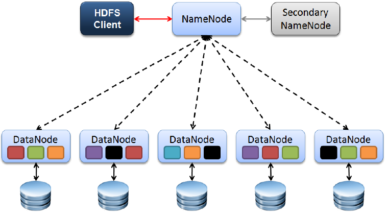
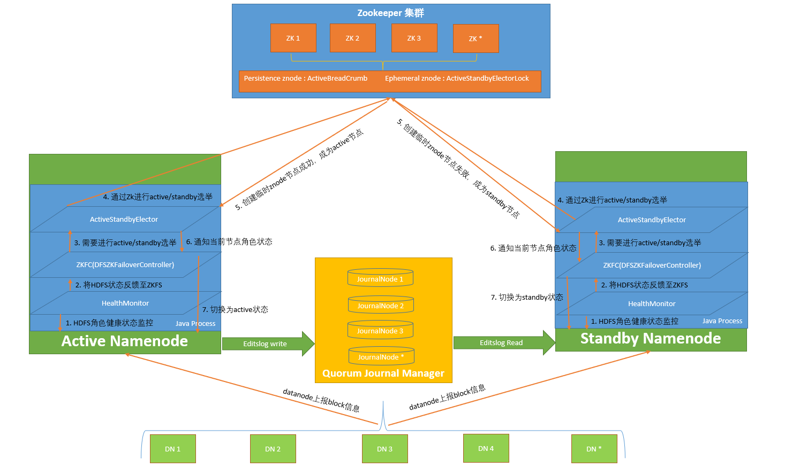

# HDFS 部署


### 概述

Hadoop是一个开源的分布式计算平台，由Apache软件基金会开发和维护。它是大数据处理的基石，能够高效地存储和处理大规模数据。

目前业界基本上用的都是**Hadoop及其生态下的产品**。

Hadoop的主要特点是高可靠性和高扩展性，它可以在成百上千个节点上运行，每个节点都可以存储和处理数据。

狭义的Hadoop，通常就指HDFS + MapReduce + YARN ，但是随着其生态的发展，今天我们再提及Hadoop，通常指的是它的整个生态，包括Hive、Hbase、Spark、Pig、Flume、Sqoop等等。

> 这里，我们主要介绍“狭义的Hadoop”，指HDFS、MapReduce、YARN这三个组件。


在早期，Hadoop的生态还不齐全，因此MapReduce既负责计算，也负责对多节点的资源进行管理，以完成作业的合理分配。

升级到2.x后，把1.x中MapReduce的功能剥离开，新增了YARN组件做统一的资源管理和调度。


Hadoop主要由以下三个组件构成：


1、Hadoop分布式文件系统（HDFS）：HDFS是Hadoop的存储系统，用于存储大量的数据。它通过将数据分散存储在多个节点上来实现数据的可靠存储和高吞吐量访问。

​		数据被分割成块（通常是128MB或256MB大小），并在多个节点上复制，以提高数据的可靠性和系统的容错能力。  


2、MapReduce：MapReduce是Hadoop的处理框架，用于大规模数据处理。它将数据处理任务分解成两个函数：Map和Reduce。Map函数处理输入数据，并生成中间键值对。Reduce函数则对这些中间键值对进行聚合处理，生成最终的结果。  


3、YARN（Yet Another Resource Negotiator）：YARN是Hadoop的资源管理器，负责管理集群中的计算资源。它允许各种数据处理应用在Hadoop集群上运行，不仅仅限于MapReduce。


HDFS


**Hadoop Distributed File System (HDFS)** 是Hadoop的最核心组件，用来存储大量数据。HDFS是一种分布式文件系统，它将数据存储在由大量廉价硬件组成的集群上，并提供高吞吐量的数据访问，适合用于大规模数据处理场景。

由于要具有高容错性、高吞吐量的特点，HDFS在存储数据时会进行切块，然后对每个块进行多副本存储，每个副本存储在不同的从节点上，以避免因单节点故障造成数据丢失。

> 正因为HDFS是多副本存储的（默认副本数为3），如果你看到你在你们公司自研的管理平台上看到的表总大小是3GB，那么其实它有可能实际上只有1GB。要注意分清文件大小统计的计算方法。

HDFS主要有三个核心概念：

- Client：用于与HDFS交互的接口，比如命令`hadoop fs`或者Java接口。通过RPC与节点通信。  
- NameNode：HDFS集群中的主节点，负责维护整个文件系统的命名空间和元数据。  
- DataNode：存储实际的数据块，负责处理文件系统客户端的读写请求，发送心跳。


**客户端**

**HDFS Shell 命令的基本格式如下：hdfs dfs 命令 参数。**

**它和 Linux 上的 Shell 命令是比较相似的，比如查看某个目录下的文件，在 Linux 中是 ls，那么在 HDFS 中就是 hdfs dfs -ls。再比如查看 HDFS 上的文件内容，命令为 hdfs dfs -cat filename。**

**可以看到是非常相似的，只不过对于 HDFS 来说，命令的前面需要加上一个横杠。**


只要你在集群里面的任何一个节点执行诸如 `hdfs dfs -ls /` 之类的命令操作，那么你就使用的是主节点或者从节点，否则你使用的就是客户端。注意，客户端没有包括在Hadoop集群之中。


### 集群规划

https://www.cnblogs.com/live41/p/15483192.html


| ip地址 | 节点角色                             |      |
| ------ | ------------------------------------ | ---- |
|        | `ActiveNameNode `、`ResourceManager` |      |
|        | `StadbyNameNode`                     |      |
|        | JournalNode                          |      |


**环境变量**

|                 |      |      |
| --------------- | ---- | ---- |
| **JAVA_HOME**   |      |      |
| **HADOOP_HOME** |      |      |
|                 |      |      |
|                 |      |      |


```shell
mkdir -p  /data/ &&  cd /data/
wget https://dlcdn.apache.org/hadoop/common/hadoop-3.4.1/hadoop-3.4.1.tar.gz

# 解压
tar -zxvf hadoop-3.4.1.tar.gz

# HDFS的配置文件：大多数默认是XML和TXT格式存在。配置文件默认存放在/etc/hadoop目录下。

# HDFS中6个重要的配置文件：

# core-site.xml:Hadoop全局的配置文件，也包含一些HDFS的宏观配置。
# dfs-site.xml:HDFS配置文件。
# yarn-site.xml:YARN配置文件。
# mapred-sie.xml:MapReduce配置文件。
# slaves:从节点列表。
# hadoop-env.sh:与运行脚本的环境变量相关的配置文件。

# 设置JavaHome，修改JAVA_HOME变量，大约在54行
vim /data/hadoop-3.4.1/etc/hadoop/hadoop-env.sh
export JAVA_HOME=/usr/java/jdk1.8.0_201

# 保存后测试启动
cd /data/hadoop-3.4.1/
bin/hadoop


# 在core配置文件文件的configuration节点添加下面配置文件（第19行）。 如果没指定hadoop.tmp.dir。那么 namenode 格式化在 /tmp/hadoop-root/dfs/name 下
vim  /data/hadoop-3.4.1/etc/hadoop/core-site.xml
<configuration>
    <property>
        <name>fs.defaultFS</name> <!--指定namenode的地址-->
        <value>hdfs://localhost:9000</value>
    </property>
    <property>
        <name>hadoop.tmp.dir</name><!--用来指定使用hadoop时产生文件的存放目录-->
        <value>/var/sxt/hadoop/local</value>
    </property>
</configuration>

# 在dfs文件的configuration节点添加下面配置文件（第19行）
vim  /data/hadoop-3.4.1/etc/hadoop/hdfs-site.xml
<configuration>
    <property>
        <name>dfs.replication</name>
        <value>1</value>
    </property>
</configuration>

# 文件顶部添加以下参数
vim  /data/hadoop-3.4.1/sbin/start-dfs.sh
vim  /data/hadoop-3.4.1/sbin/stop-dfs.sh
#!/usr/bin/env bash
HDFS_DATANODE_USER=root
HADOOP_SECURE_DN_USER=hdfs
HDFS_NAMENODE_USER=root
HDFS_SECONDARYNAMENODE_USER=root


# 文件顶部添加以下参数
vim  /data/hadoop-3.4.1/sbin/start-yarn.sh
vim  /data/hadoop-3.4.1/sbin/stop-yarn.sh
#!/usr/bin/env bash
YARN_RESOURCEMANAGER_USER=root
HADOOP_SECURE_DN_USER=yarn
YARN_NODEMANAGER_USER=root


# 文件系统格式化
/data/hadoop-3.4.1/bin/hdfs namenode -format

# 启动NameNode和DataNode
cd /data/hadoop-3.4.1/ &&  sbin/start-dfs.sh

# 浏览器打开终端进行查看运行状态，注意防火墙端口是否打开，NameNode网址如下：
http://192.168.40.134:9870/
# 现状状态 Active 即为运行成功

# 停止NameNode和DataNode
sbin/stop-dfs.sh

# 启动，注意顺序
sbin/start-dfs.sh
sbin/start-yarn.sh

# 停止，注意顺序
sbin/stop-yarn.sh
sbin/stop-dfs.sh

```

# Hive

在 Hive 环境中，`HADOOP_HOME` 指的是 Hadoop 的安装目录。

Hive 是基于 Hadoop 的一个数据仓库，它需要 Hadoop 来提供底层的数据存储（HDFS）和计算框架（MapReduce）。

`HADOOP_HOME` 告诉 Hive 在哪里找到 Hadoop 的配置文件、可执行文件等，以便 Hive 能够正确地与 Hadoop 交互。

更详细解释：

- **Hadoop 安装目录:**

  `HADOOP_HOME` 指的不是你自己的家目录（~），而是 Hadoop 软件的安装目录，例如 `/usr/local/hadoop`。

- **Hive 依赖 Hadoop:**

  Hive 依赖 Hadoop 来存储和处理数据。

  `HADOOP_HOME` 告诉 Hive 在哪里找到 Hadoop 的相关组件，例如 HDFS 的名称节点和数据节点，MapReduce 的执行引擎等。

- 设置 `HADOOP_HOME` 的必要性:

  如果你没有正确设置 `HADOOP_HOME`，Hive 将无法访问 HDFS 存储的数据，也无法利用 Hadoop 的计算能力来执行查询和分析。

- 如何设置 `HADOOP_HOME`:

  你通常需要在 Hive 的配置文件中设置 `HADOOP_HOME`，例如 `hive-site.xml`。设置的方式取决于你的 Hive 环境。

- **Hive 读取 Hadoop 配置:**

  Hive 会读取 Hadoop 的配置（通常在`hadoop/conf/core-site.xml` 和 `hadoop/conf/hdfs-site.xml` 中），并且 Hive 的配置会覆盖 Hadoop 的配置。

  这意味着如果 Hadoop 的配置和 Hive 的配置冲突，Hive 的配置会优先被使用。

总结： `HADOOP_HOME` 是一个环境变量，它指向 Hadoop 的安装目录，Hive 需要它来与 Hadoop 交互，否则 Hive 无法正确地存储、查询和分析数据。

Hive 其实是要部署在 NameNode 中即可（需要再有的 namenode 上安装)，可以不在 datanode 节点的机器上安装。


# HDFS IPC 通讯 

Hadoop作为一个分布式系统，各个模块进程之间存在各种IPC，即RPC通信。


# HDFS用户和权限

HDFS文件权限用作每次访问HDFS文件或目录时尝试的授权检查。HDFS文件权限与通常在Linux或Unix文件系统中使用的权限非常相似。**但HDFS与Linux和其他采用POSIX模型的操作系统之间也存在显著差异。**

在Linux中，每个文件和目录都有一个用户和组。HDFS本身没有任何用户或组的概念，HDFS只是从底层的操作系统实体(例如在Linux文件系统中创建的用户和组)导出用户和组。


在Kerberos集群中，用户的Kerberos凭证决定客户端进程的身份，在默认的简单安全模式下，用户的身份由主机操作系统确定。

与Linux文件系统一样，可以为文件或目录的所有者，组的成员以及其他人分配单独的文件权限。可以像Linux中一样使用我们熟悉的r(读取文件并列出目录的内容)，w(创建或删除文件或目录)和x(访问目录的子目录)权限。


可以使用八进制(例如"755","644"等)来设置文件的模式。**需要注意的是，在Linux文件系统中，x表示执行文件的权限。但在HDFS中没有这样的概念（显然在HDFS中存可执行文件并进行执行有点可怕）。**

```bash
hdfs dfs -help 某个命令

# 查看某个目录有哪些文件，加上 -R 表示递归显示。
hdfs dfs -ls /

# 在 hdfs 上面创建目录，加上 -p 表示递归创建，和 Linux 是一样的。
hdfs dfs -mkdir -p  /
hdfs dfs -mkdir -p  /girls

# 将本地文件或目录移动到 hdfs 上面，注意是移动，移完之后本地就没了。需要注意的是，如果在移动的时候不手动指定文件名，比如将 /code2.py 换成 /，那么移动后的文件名和原来一样。
hdfs dfs -moveFromLocal 本地路径 hdfs路径

# 将一个文件的内容追加到另一个文件里面去。
hdfs dfs -appendToFile 追加的文件 追加到哪个文件

# 更改组、更改权限、更改所有者，这个和 Linux 中用法一样。
hdfs dfs [-chgrp、-chmod、-chown]

hdfs dfs -chmod 700 /girls/test

# 设置文件的副本数量，比如 hdfs dfs -setrep 5 /file.txt，表示将 file.txt 的副本设置成 5。
hdfs dfs -setrep 数值 文件


# 查看某个目录有哪些文件，加上 -R 表示递归显示。
root@qhdata-dev:/data/hadoop-3.4.1/bin# ./hdfs dfs -ls  /user
Found 1 items
drwx------   - root supergroup          0 2025-05-29 16:12 /user/root
root@qhdata-dev:/data/hadoop-3.4.1/bin#
root@qhdata-dev:/data/hadoop-3.4.1/bin#
root@qhdata-dev:/data/hadoop-3.4.1/bin# ./hdfs dfs -ls  /user/root/
root@qhdata-dev:/data/hadoop-3.4.1/bin#

```

**只是将文件切分成块，然后散落在不同节点的本地存储中。查找的时候，会去 NameNode 获取元信息，找到相应的块再组合起来，就这么简单。**

**因此 HDFS 还是需要依赖本地文件系统的，只不过内部的 NameNode 会帮助我们对块进行管理，但本质上就是文件的拆分与合并的过程。**


当然，您也可以为文件或目录指定umask值。默认的umask值为"022"，但是可以通过以下方式为 `${HADOOP_HOME}/etc/hadoop/core-site.xml`文件进行修改。

```xml
　<property>
　　　　　　<name>fs.permissions.umask-mode</name>
　　　　　　<value>037</value>
　　　　　　<description>指定HDFS集群的umask值,默认值为022(创建的文件(目录)权限即为"755"),在Linux中，x表示执行文件权限，而在HDFS中没有这样的概念,尽管你可以为该文件添加x权限。</description>
</property>
```


可以通过在`hdfs-site.xml`配置文件中将参数`dfs.permissions.enabled`的值设置为ture来配置HDFS权限。

如下所示，此参数的默认值为true，因此权限检查功能已经打开，故HDFS不需要再执行其他任何操作来进行权限检查。

```xml
<property>
    <name>dfs.permissions.enabled</name>
　　 <value>true</value>
　　 <description>如果为"true"，则在HDFS中启用权限检查;如果为"false"，则关闭权限检查;默认值为"true"。</description>
</property>
```

　　　


```
　
```


与Linux文件系统不同，主机用户root不是HDFS的超级用户。**超级用户是启动NameNode的用户**，通常是操作系统用户(如"root","hdfs","hadoop"等)，因此用户(如"root","hdfs","hadoop"等)通常是HDFS的超级用户。

可以通过在 `${HADOOP_HOME}/etc/hadoop/hdfs-site.xml` 配置文件中设置 `dfs.permissions.superusergroup` 参数来配置超级用户组(改参数仅能被设置一次)。


在HDFS的 `Web UI`访页面进行文件写操作时，遇到用户权限问题，但是此时用户为：`dr.who`。通过修改 `core-site.xml`  配置文件，更改 `Web UI`访问时的默认用户，从而确定具体用户；

这是因为WEB浏览器中是以匿名用户（dr.who）登陆的，其只有只读权限，多数操作是做不了的。

如果需要以特权用户在浏览器中进行操作，需要通过修改 `core-site.xml`  配置文件，更改 `Web UI`访问时的默认用户，从而确定具体用户；

```xml
<!-- 配置 HDFS 网页登录使用的静态用户为 hdfs -->
<property>
	<name>hadoop.http.staticuser.user</name>
	<value>hdfs</value>
</property>
```

注意：不推荐这样做，**`Web UI`**只读权限比较安全的，简单浏览即可，如果给与高权限，会有很大的安全问题，造成数据泄露或丢失。


HDFS本身在最开始进行设计时，并没有考虑鉴权相关设计，而是以满足大数据的业务场景作为优先要务，因此最开始时只有简单认证模式。等后续经过一定程度的发展，发现鉴权越来越成为业务的需要，因此才将鉴权作为一个功能进行设计。

在设计上也是充分利用现有的框架或者外部的认证系统，HDFS对接相关的认证系统接口，从而完成高效（偷懒）的实现鉴权功能。

目前HDFS有支持两种用户身份认证：**简单认证**和**kerberos认证**。


- 简单认证: 基于客户端进程所在的Linux/Unix系统的当前用户名来进行认证。只要用户能正常登录操作系统就认证成功。这样客户端与NameNode交互时，会将用户的登录账号（与whoami命令输出一致）作为合法用户名传给Namenode。 

  这样的认证机制存在恶意用户可以伪造其他人的用户名的风险，对数据安全造成极大的隐患，线上生产环境一般不会使用。

  简单认证模式下，采集的鉴权模式跟linux系统一致，使用UGO（user、group、other）模式，相关的acl跟linux系统类似，本文不在追述。

- kerberos认证: kerberos是一个网络认证协议，其使用密钥加密技术为客户端和服务端应用提供强认证功能。它有一个管理端（AdminServer）用于管理所有需要认证的账号信息，另外还有若干的密钥分发服务器（KDC）用于提供认证和分发密钥服务。 

  用户从 Kerberos 管理员处获取对应的 Kerberos 账号名或者密钥文件，然后通过 kinit 等方式认证Kerberos，拿到TGT（ticket-granting-ticket）票据。

  客户端会将TGT信息传输到NN端，NN在获取到认证信息后，将principle首部截取出来作为客户端的用户名。例如使用 todd/foobar@CORP.COMPANY.COM认证成功后， da作为principle的首部会作为该客户端的用户名使用。 

  使用Kerberos可以极大增强HDFS的安全性，特别是在多租户的生产环境下。


可以通过core-site.xml配置文件进行配置和调整，如果不配置，默认使用**简单认证**方式

```

```

https://blog.csdn.net/weixin_43845924/article/details/135566680

https://www.cnblogs.com/auguse/articles/11751418.html


Hadoop中用户代理（Proxy User）指的是一个用户（A）以另一个用户（B）的名义来访问Hadoop集群，它允许超级用户模拟一个普通用户来执行任务。

Hadoop 2.0版本开始支持ProxyUser机制，这意味着用户A可以利用自己的认证信息，以用户B的身份访问Hadoop集群。


Hadoop用户代理功能的作用是让超级用户superuser模拟一个普通用户来执行任务。比如用户joe通过oozie提交一个任务到集群上，如果不设置用户代理，那么就会以启动oozie(oozie)进程的用户来提交任务,这样任务就显示为oozie，无法判断是哪个用户提交了任务。当开始proxy功能后，会以superuser模拟joe来提交任务，任务的提交者是supersuer，但显示为joe.


# HDFS数据读写

HDFS客户端对HDFS数据的访问方式

- `HDFS WEB UI` 通过http://master:50070/去访问HDFS WEB UI的时候，我们会经常使用**Utilities**下的`Browse the file system`去查看HDFS中的文件。

- HDFS提供了和Linux类似的命令来访问文件系统，比如在Linux中想看下文件目录/home/hadoop-twq/test中有哪些文件。

  HDFS Shell CLI支持操作多种文件系统，包括本地文件系统（file:///）、分布式文件系统（hdfs://nn:8020）等

  操作的是什么文件系统取决于URL中的前缀协议。如果没有指定前缀，则将会读取环境变量中的fs.defaultFS属性，以该属性值作为默认文件系统。

  比如，在HDFS集群外部弄个HDFS包，执行 `HDFS Shell CLI`命令访问HDFS集群的问题。此时就相当于 `mysql -h`这样做为客户端来访问。

- 

- 


WebHDFS是HortonWorks开发的，然后捐给了Apache，可见博客：WebHDFS – HTTP REST Access to HDFS。

HttpFS是Clouera开发的，也捐给了Apache，可见博客：HttpFS for CDH3 – The Apache Hadoop FileSystem over HTTP。


它们的终极目标完全一致：就是让身处HDFS集群之外的应用程序，不但不用安装Hadoop和Java库，并且可以通过流行的REST风格的接口去访问HDFS集群，还有HttpFS与WebHDFS的HTTP REST API完全兼容。这样一来，不管是使用C++、Python或其它语言的外部程序，都可以以一种统一的方式访问HDFS。


- WebHDFS是HDFS内置的组件，已经运行于NameNode和DataNode中。

  **客户端通过NameNode的HTTP API发起文件读写请求，URL将会被重定向到文件被分配到所在的DataNode 的HTTP API，并且会完全利用HDFS的带宽。**

- HttpFS是在Apache Tomcat上运行的Java应用程序，其允许通过WebHDFS REST API远程访问HDFS文件系统。　

**WebHDFS和HttpFS都是Hadoop的HTTP/HTTPS REST接口。这两个接口使我们能够读取HDFS数据并写入，以及执行与HDFS相关的几个管理命令。**


从集群外部访问HDFS，外部系统使用一般推荐HttpFS，不过取决于实际的应用环境情况。

```
WebHDFS vs HttpFs Major difference between WebHDFS and HttpFs: WebHDFS needs access to all nodes of the cluster and when some data is read it is transmitted from that node directly, whereas in HttpFs, a singe node will act similar to a “gateway” and will be a single point of data transfer to the client node. So, HttpFs could be choked during a large file transfer but the good thing is that we are minimizing the footprint required to access HDFS.
```


### WebHDFS

使用WebHDFS很简单，需要做的就是将HDFS文件系统URI替换为`NameNode WEBUI HTTP URL`

使用内置的`WebHDFS REST API`操作访问。一句话，其实就是`NameNode`暴露 `HTTP WEBUI API`端口，来对客户端提供读写API

- HDFS内置、默认开启
- 基于REST的HDFS API
- 重定向到资源所在的datanode
- 客户端会和nn、dn交互
- 使用内置的`WebHDFS REST API`操作访问http://:master:9870/webhdfs/v1/?op=LISTSTATUS 。端口由dfs.namenode.http-address指定。默认值9870

```bash
# 使用HDFS Shell CLI将文件移动到HDFS根目录中
root@qhdata-dev:/data/hadoop-3.4.1/bin#./hdfs dfs -moveFromLocal ~/demo.txt /demo.txt

# WebHDFS使用基本的HTTP操作，如GET,PUT,POST和DELETE来远程操作HDFS文件系统。

# 使用WebHDFS API来访问文件，URL其实就是NameNode的WEBUI，可以发现其实是请求会被重定向到Datanode主机名映射的HTTP端口。
root@qhdata-dev:/data/hadoop-3.4.1/bin#
root@qhdata-dev:/data/hadoop-3.4.1/bin# curl -i -L http://10.10.20.243:9870/webhdfs/v1/demo.txt?op=OPEN
HTTP/1.1 307 Temporary Redirect
Date: Fri, 30 May 2025 07:32:54 GMT
Cache-Control: no-cache
Expires: Fri, 30 May 2025 07:32:54 GMT
Date: Fri, 30 May 2025 07:32:54 GMT
Pragma: no-cache
X-Content-Type-Options: nosniff
X-FRAME-OPTIONS: SAMEORIGIN
X-XSS-Protection: 1; mode=block
Location: http://qhdata-dev:9864/webhdfs/v1/demo.txt?op=OPEN&namenoderpcaddress=localhost:9000&offset=0
Content-Type: application/octet-stream
Content-Length: 0

HTTP/1.1 200 OK
access-control-allow-methods: GET
access-control-allow-origin: *
content-type: application/octet-stream
connection: close
content-length: 5

demo
root@qhdata-dev:/data/hadoop-3.4.1/bin#
root@qhdata-dev:/data/hadoop-3.4.1/bin#

# 对于集群外部的机器，无法感知哪个是Datanode，显然这样无法彻底做到透明。
```


### **HttpFS**

HttpFS ,它本质上是一个代理，是 java jetty web 程序，直接运行在可以在 Hadoop 集群上，可以感知 NameNode HA 的配置.

- **本质上是对 WebHDFS 进行了一次封装，但使用它的时候不用担心客户端本地是否配置好所有的 DataNode IP 主机名映射。**

- **因为是可以独立部署的，所以可以对HttpHDFS设置防火墙，而避免NameNode暴露在墙外，对一些安全性要求比较高的系统，HttpHDFS会更好些。**

- HttpFS可用于在运行不同版本Hadoop(克服RPC版本控制问题)的集群之间传输数据，例如使用HadoopDiscreCP。

- HttpFS可用于在防火墙后面的集群上访问HDFS中的数据(HttpFS服务器充当网关，是允许跨越防火墙进入集群的唯一系统)


- HttpFS 是一个提供RESTful 接口的网关的服务器，该网关支持所有HDFS文件系统操作
- 对于文件CURD的操作全部提交给HttpFS服务进行中转，然后由HttpFS去跟HDFS集群交互
- HttpFS是一个独立于HDFS的服务，若使用需要手动安装。本质上是一个代理服务
- HttpFS本身是Java Web应用程序。使用内置的Jetty服务器对外提供服务
- HttpFS默认端口号为14000


```

curl -i -L  http://10.10.20.243:14000/webhdfs/v1/demo.txt?user.name=root&op=OPEN
```


## HDFS shell


- hadoop：
- hdfs
- yarn


hdfs有三类子命令：

- 管理命令
- 客户端命令
- 后台命令


```
Admin Commands:

cacheadmin           configure the HDFS cache
crypto               configure HDFS encryption zones
debug                run a Debug Admin to execute HDFS debug commands
dfsadmin             run a DFS admin client
dfsrouteradmin       manage Router-based federation
ec                   run a HDFS ErasureCoding CLI
fsck                 run a DFS filesystem checking utility
fsImageValidation    run FsImageValidation to check an fsimage
haadmin              run a DFS HA admin client
jmxget               get JMX exported values from NameNode or DataNode.
oev                  apply the offline edits viewer to an edits file
oiv                  apply the offline fsimage viewer to an fsimage
oiv_legacy           apply the offline fsimage viewer to a legacy fsimage
storagepolicies      list/get/set/satisfyStoragePolicy block storage policies

    Client Commands:

classpath            prints the class path needed to get the hadoop jar and the required libraries
dfs                  run a filesystem command on the file system
envvars              display computed Hadoop environment variables
fetchdt              fetch a delegation token from the NameNode
getconf              get config values from configuration
groups               get the groups which users belong to
lsSnapshot           list all snapshots for a snapshottable directory
lsSnapshottableDir   list all snapshottable dirs owned by the current user
snapshotDiff         diff two snapshots of a directory or diff the current directory contents with a snapshot
version              print the version

    Daemon Commands:

balancer             run a cluster balancing utility
datanode             run a DFS datanode
dfsrouter            run the DFS router
diskbalancer         Distributes data evenly among disks on a given node
journalnode          run the DFS journalnode
mover                run a utility to move block replicas across storage types
namenode             run the DFS namenode
nfs3                 run an NFS version 3 gateway
portmap              run a portmap service
secondarynamenode    run the DFS secondary namenode
sps                  run external storagepolicysatisfier
zkfc                 run the ZK Failover Controller daemon

SUBCOMMAND may print help when invoked w/o parameters or with -h.
root@qhdata-dev:/data/hadoop-3.4.1/bin#
```


# HDFS的数据副本存放磁盘选择策略

在 HDFS 中，DataNode 将数据块存储到本地文件系统目录中，具体的目录可以通过配置 `hdfs-site.xml` 里面的 **dfs.datanode.data.dir** 参数。

在典型的安装配置中，一般都会配置多个目录，并且把这些目录分别配置到不同的设备上，比如分别配置到不同的HDD（HDD的全称是Hard Disk Drive）和SSD（全称Solid State Drives）上。

```xml

<property>
    <!-- 设置数据存储策略，默认为轮询，现在的情况显然应该用“选择空间多的磁盘存”模式 -->
     <name>dfs.datanode.data.dir</name>
     <value>file:///dfs/data1,file:///dfs/data2,[SSD]file:///dfs/data3,[SSD]file:///dfs/data4</value>
</property>


<property>
    <!-- 默认值0.75。它的含义是数据块存储到可用空间多的卷上的概率，由此可见，这个值如果取0.5以下，对该策略而言是毫无意义的，一般就采用默认值。-->
    <name>dfs.datanode.available-space-volume-choosing-policy.balanced-space-preference-fraction</name>
    <value>0.75f</value>
</property>
```


当我们往 HDFS 上写入新的数据块，DataNode 将会使用 volume 选择策略来为这个块选择存储的地方。通过参数 `fs.datanode.fsdataset.volume.choosing.policy` 来设置，这个参数目前支持两种磁盘选择策略

- org.apache.hadoop.hdfs.server.datanode.fsdataset.RoundRobinVolumeChoosingPolicy
- org.apache.hadoop.hdfs.server.datanode.fsdataset.AvailableSpaceVolumeChoosingPolicy


这两种方式的优缺点：**采用RoundRobin轮询卷存储方式虽然能保证每块盘都能得到使用，但是在长期运行的集群中由于数据删除和磁盘热插拔等原因，可能造成磁盘空间的不均。**

所以最好将磁盘选择策略配置成第二种AvailableSpace，根据磁盘空间剩余量来选择磁盘存储数据块，这样能保证节点磁盘数据量平衡IO压力被分散。

```xml
<property>
    <name>dfs.datanode.fsdataset.volume.choosing.policy</name>         
    <value>org.apache.hadoop.hdfs.server.datanode.fsdataset.AvailableSpaceVolumeChoosingPolicy</value>
</property>

<property>
    <!--配置各个磁盘的均衡阈值的，默认为10G，在此节点的所有数据存储的目录中，找一个占用最大的，找一个占用最小的，如果在两者之差在10G的范围内，那么块分配的方式是轮询。-->
    <name>dfs.datanode.available-space-volume-choosing-policy.balanced-space-threshold </name>         
    <value>10737418240</value>
</property>
```


https://www.cnblogs.com/liugp/p/16609303.html


# HDFS HA


在 HDFS 1.X 时，NameNode 是 HDFS 集群中可能发生单点故障的节点，集群中只有一个 NameNode，一旦 NameNode 宕机，整个集群将处于不可用的状态。

虽然hadoop1.0有secondarynamenode，checkpointnode，buckcupnode这些，但是单点问题依然存在。




在 HDFS 2.X 时，HDFS 提出了高可用(High Availability)的方案，解决了 HDFS 1.X 时的单点问题。

在一个典型的 HA 集群中，会配置两个 NameNode：

- 一个是 Active NameNode(主)：处于Active状态（负责集群中的所有客户端操作）

- 一个是 Standby NameNode(备)。处于Standby状态（维护足够的状态以在必要时提供快速故障转移）

  一旦``Active NameNode`出现故障，可以迅速切换至 `Standby NameNode`，从而不间断对外提供服务。





主节点负责执行所有修改命名空间的操作，备节点则执行同步操作，以保证与主节点命名空间的一致性。

说到同步自然要考虑到数据一致性，从挂了怎么办。这里就需要引入了一个中间协调节点：

为了保持`Standby NameNode`时时的与`Active NameNode`的数据保持一致，他们之间数据交互通过一系列守护的轻量级进程JournalNode。

`HDFS HA using QJM`方案在2012年随Hadoop 2.0正式发布，此后一直是Hadoop社区默认HDFS HA方案。


## JournalNode

JN节点就好似一个高可用的消息中间件一样，主要作用是把修改log同步到JN节点，然后JN节点再同步到其他JN节点

任何写操作在 `Active NN`上执行时，JN节点进程同时也会记录修改log到至少半数以上的JN中（JN节点个数为奇数，至少为3）

这时 `Standby NN` 监测到 `JN` 里面的同步log发生变化了会读取 `JN` 里面的修改log，然后同步到自己的的目录镜像树里面。

由于`JournalNode`是**一个轻量级的守护进程，可以与Hadoop其他服务共用机器。**

建议将JournalNode部署在控制节点上，以避免数据节点在进行大数据量传输时引起JournalNode写入失败。

为保证故障转移快速进行，`Standby NN`需要时刻保持最新的块信息，为此`DataNodes`同时向两个`NameNodes`汇报块信息和心跳。


看到这里，JN显然就是一个基于Paxos算法实现的消息中间件，通过这种方式来实现HDFS HA方案。保证元数据的一致性。


JN 节点本身也是一个多节点的集群，从而保证它自身的可靠性。而且 `JournalNode` 节点会在集群自动的选择一个"主"节点出来，Active 节点会和 `JournalNode `的主节点通信，然后 `JournalNode` 集群的主节点会将数据发送给其他的节点，只要有过半的节点完成了数据的存储，`JournalNode` 集群的主节点，就会将成功信息返回给 Active 节点。当 JournalNode 集群的主节点挂掉，其他的 JournalNode 节点会快速选举出新的"主"节点来。


**HDFS-3077(Quorum-based protocol for reading and writing edit logs) 对上述过程进行了实现。QJM全称Qurom Journal Manager，它的一个核心原理是基于Quorum((最低)法定人数)的原理。**


- Quorum是一种基于数量的一致性协议，它要求多数节点达成一致才能完成操作。
- Paxos是一种基于投票的一致性协议，它要求每个节点都进行投票，以确保整个系统的一致性。

通过 `JournalNode` 通过自身具备存储能力，和保证自身的可靠性，为 `Active NameNode`和 `Standby NameNode` 节点之间的数据最终一致性提供了服务。


在 2.0 中不再有 SecondaryNameNode 这个角色了：

NameNode 在启动后，会先加载 FSImage 文件和共享目录上的 EditLog Segment 文件，之后 NameNode 会启动 EditLogTailer 线程和 StandbyCheckpointer 线程，正式进入 Standby 模式


**JN可用性容错**

当一个JN节点工作状态异常时，其数据就会与其他JN节点的数据不同步。如果超过一半的JN节点的数据不同步时，NameNode将无法工作，导致HDFS服务不可用。对于一个由2N+1台JournalNode组成的集群，可以容忍最多N台JournalNode节点挂掉。


## ZKFC

引入JN节点，保证了主从NameNode的数据同步一致性问题。但是主从切换问题仍然存在。

借助ZK的ZKFC(Zookeeper FailoverController Active&standby)，ZKFC来实现自动切换Active NameNode。

FailoverController和NameNode放到一台物理机上，也就是仅仅是跨进程调用而非跨网络调用，如果放到不同的物理机，那么它们沟通就需要通过网络传输来进行，就会产生很多的不可靠性，加大了监控的风险。


ZKFC功能

- 监控NameNode:监控NameNode的存活状态、操作系统和硬件信息。

- 连接Zookeeper并创建`Active NameNode`：Zookeeper中有目录树，当所有 NameNode 和 ZKFC 启动时，ZKFC首先向Zookeeper申请一个创建锁，谁拿到了创建锁，谁就能创建一个临时子节点，这意味着2个ZKFC只有一个能创建子节点，这个被ZKFC创建成功的子节点中包含的就是`Active NameNode`。

- 降级`Active NameNode`，升级`Standby NameNode`：假设`Active NameNode`存活但是ZKFC进程异常退出，这时候就会触发此机制，Zookeeper的临时子节点会被删除，然后触发callback机制，第二个ZKFC就会抢到创建锁，并自己将`Active NameNode`降级成`Standby NameNode`，升级`Standby NameNode`为`Active NameNode`。

# 联邦机制**Federation**


单 NameNode 的架构存在的问题：当集群中数据增长到一定规模后，NameNode 进程占用的内存可能会达到成百上千 GB（调大 NameNode 的 JVM 堆内存已无可能），此时，NameNode 成了集群的性能瓶颈。

**隶属于同一个NameNode所管理的数据都是在同一个命名空间下的，而一个namespace对应一个block pool。Block Pool是同一个namespace下的block的集合**


HDFS Federation更应该是 NameNode Federation，多个NameNode的情况意味着有多个namespace(命名空间)。**这些NameNode是共享集群中所有的DataNode的，它们还是在同一个集群内的**

> HDFS Federation是解决NameNode单点问题的水平横向扩展方案。


# 端口


#### Namenode 端口

| 2.x端口 | 3.x端口 | name                       | desc                                                         |
| ------- | ------- | -------------------------- | ------------------------------------------------------------ |
| 50470   | 9871    | dfs.namenode.https-address | The namenode secure http server address and port.            |
| 50070   | 9870    | dfs.namenode.http-address  | The address and the base port where the dfs namenode web ui will listen on. |
| 8020    | 9820    | fs.defaultFS               | 指定HDFS运行时nameNode地址                                   |


#### Secondary NameNode 端口

| 2.x端口 | 3.x端口 | name                                 | desc                                                 |
| ------- | ------- | ------------------------------------ | ---------------------------------------------------- |
| 50091   | 9869    | dfs.namenode.secondary.https-address | The secondary namenode HTTPS server address and port |
| 50090   | 9868    | dfs.namenode.secondary.http-address  | The secondary namenode HTTPS server address and port |


| 2.x端口 | 3.x端口 | name                       | desc                                                    |
| ------- | ------- | -------------------------- | ------------------------------------------------------- |
| 50020   | 9867    | dfs.datanode.ipc.address   | The datanode ipc server address and port.               |
| 50010   | 9866    | dfs.datanode.address       | The datanode server address and port for data transfer. |
| 50475   | 9865    | dfs.datanode.https.address | The datanode secure http server address and port        |
| 50075   | 9864    | dfs.datanode.http.address  | The datanode http server address and por                |
