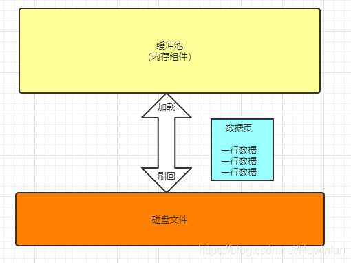
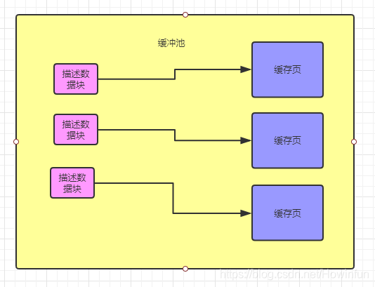

# 缓冲池

传统的 DBMS 架构都属于 disk-oriented architecture，即假设数据主要存储在非易失的磁盘（non-volatile disk）上。

于是 DBMS 中一般都有磁盘管理模块（disk manager），它主要负责数据在非易失与易失（volatile）的存储器之间的移动。

这里需要理解两点：

- 为什么需要将数据在不同的存储器之间移动？
- 为什么要自己来做数据移动的管理，而非利用 OS 自带的磁盘管理模块？

从 InnoDB 逻辑存储结构来看，所有的数据都被逻辑的存放在一个空间中，这个空间就叫做表空间（tablespace）。

> **\*\*表空间由 段（segment）、区（extent）、页（page）\*\***组成。

当我们创建一个表之后，在磁盘上会有对应的表名称`.ibd`的磁盘文件。

表空间的磁盘文件里面有很多的数据页，一个数据页最多 16kb，因为不可能一个数据页一个磁盘文件，所以数据区的概念引入了。

## 内存

### 内存缓冲池（buffer pool）

**InnoDB 存储引擎是基于磁盘存储的，并将其中的记录按照页的方式进管理，因此可以将其视为基于磁盘的数据库系统。**

在数据库系统中，由于 CPU 和磁盘交换速度的差距，基于磁盘的数据库系统通常使用缓冲池技术来提高数据库的整体性能。

内存缓冲池简单说就是 MySQL 进程向操作系统申请一块内存区域，通过内存的速度来弥补磁盘的速度，在数据库中读取页时，首先将磁盘读到的页放到缓冲池中，这个过程称为将页 fix 到缓冲池。

`buffer pool` 一般称为`内存缓冲池`，在 MySQL 也有人简称`bp`。

下次再读取相关的页时，下次再读取相同的页时，先判断是否在缓冲池中，若在，则称为该页在缓冲池被命中。

对于修改数据（增删改），同样首先修改缓冲池中的页，然后在以一定的频率刷新到磁盘。**通过一种被称作 checkpoint 的机制刷回磁盘。**

### 关键概念——数据页

在 MySQL 中，innodb 表以 tablename.ibd 格式的文件存放在磁盘中。

数据页是 MySQL 抽象出来的数据单位，磁盘文件中就是存放了很多数据页，每个数据页里存放了很多行数据。**默认情况下，数据页的大小是 16KB。**

数据库采用数据页的形式组织数据。MySQL 默认的非压缩数据页为 16KB。在 ibd 中间中，0-16KB 偏移量即为 0 号数据页，16KB-32KB 的为 1 号数据页，依次类推。

数据页的头尾除了一些元信息外，还有 Checksum 校验值，这些校验值在写入磁盘前计算得到，当从磁盘中读取时，重新计算校验值并与数据页中存储的对比，如果发现不同，则会导致 MySQL crash。遇到这种情况，往往需要从备份集中恢复数据，如果备份不可用，只能使用 innodb_force_recovery 强行启动，然后尽可能多的导出数据。

严格来讲，InnoDB 的数据页有很多种，比如，索引页，Undo 页，Inode 页，系统页，BloB 页等，一共有 10 多种。

对应的，在 `Buffer Pool` 中，也是以数据页为数据单位，存放着很多数据。

但是通常被叫做缓存页，因为 `Buffer Pool` 是一个缓冲池，并且里面的数据都是从磁盘文件中缓存到内存中。

所以，默认情况下缓存页的大小也是 16KB，因为它和磁盘文件中数据页是一一对应的。

缓冲池和磁盘之间的数据交换的单位是数据页，包括从磁盘中读取数据到缓冲池和缓冲池中数据刷回磁盘中。

**缓冲池中基本概念**

缓冲池是 MySQL 向操作系统申请的一块内存区域，操作系统是以页为单位对内存进行管理。

缓冲池是 InnoDB 存储引擎中最重要的组件。为了提高 MySQL 的并发性能，使用到的数据都会缓存在缓冲池中，然后所有的增删改查操作都将在缓冲池中执行。

对于每个更新请求，尽量就是 **只更新内存，然后往磁盘顺序写日志文件**。

更新内存的性能是极高的，然后顺序写磁盘上的日志文件的性能也是比较高的，因为顺序写磁盘文件，他的性能要远高于随机读写磁盘文件。

具体来看，缓冲池中的页类型有：

- **数据页**
- **索引页**
- **undo 页**
- **插入缓冲**
- **自适应哈希索引**
- **InnoDB 存储的锁信息**
- **数据字典信息等。**

**不能简单的认为，缓冲池只是缓冲索引和数据页。它们只是占内存缓冲池很大的一部分而已**

> 在 Linux 中，操作系统以页为单位管理内存，无论是将磁盘中的数据加载到内存中，还是将内存中的数据写回磁盘，操作系统都会以页面为单位进行操作。
> 哪怕我们只向磁盘中写入一个字节的数据，我们也需要将整个页面中的全部数据刷入磁盘中。
> 在操作系统层面，每个进程都有自己独立的地址空间，看到的都是操作系统虚拟出来的地址空间，虚拟地址最终还是要落在实际内存的物理地址上进行操作的。
> 操作系统就会通过页表的机制来实现进程的虚拟地址到物理地址。其中每一页的大小都是固定的。
>
> ```shell
> ####X86：
> [root@ens8 ~]# getconf PAGESIZE
> 4096
> ####ARM：
> root@ens8ARM:~# getconf PAGESIZE
> 65536
> ```
>
> Linux 同时支持正常大小的内存页和大内存页（Huge Page）
>
> **绝大多数处理器上的内存页（page）的默认大小都是 4KB**，虽然部分处理器会使用 8KB、16KB 或者 64KB 作为默认的页面大小，但是 4KB 的页面仍然是操作系统默认内存页配置的主流；
>
> [为什么 Linux 默认页大小是 4KB](https://draveness.me/whys-the-design-linux-default-page/)

总结一下：

- innodb_page_size 作为 innodb 和 OS 交互单位。文件系统对文件的 buffer IO，也是 page 为单位进行处理的。

- InnoDB 缓冲池中的数据访问是以 Page 为单位的，每个 Page 的大小默认为 16KB，Buffer Pool 是用来管理和缓存这些 Page 的。

### 内存缓冲池相关参数配置

```shell


# 内存缓冲池总大小，默认是128M，应当适当设置调大buffer_pool_size,一般设置为服务器内存60%。通常实际占用的内存会比配置的还要大10%
# MySQL5.7.5之后可以动态在线调整。在调整innodb_buffer_pool_size 期间，用户的请求将会阻塞，直到调整完毕，所以请勿在白天调整，尽量在凌晨3-4点业务低峰期调整。
innodb_buffer_pool_size=8G

# 内存缓冲池实例数，默认是1，通过将buffer pool分成多个区，每个区用独立的锁保护，这样就减少了访问buffer_pool时需要上锁的粒度，以提高并发能力和性能。
innodb_buffer_pool_instances=16

# innodb页大小，默认是16KB，一般设置为16KB或64KB
innodb_page_size=16KB

# 在调整内存缓冲池总大小时，内部把数据页移动到一个新的位置，单位是块。如果想增加移动的速度，需要调整innodb_buffer_pool_chunk_size参数的大小，默认是128M。缓冲池配置时的基本单位，以块的形式配置，innodb_buffer_pool_chunk_size参数指明块大小。
# innodb_buffer_pool_size=innodb_buffer_pool_chunk_size * innodb_buffer_pool_instances * n
innodb_buffer_pool_chunk_size=128MB
```

### 什么是 LRU 算法

LRU 就是一种很常见的缓存淘汰策略。按照英文的直接原义就是 Least Recently Used，最近最久未使用。

**利用好 LRU 算法，我们能够提高对热点数据的缓存效率，进而提升缓存服务的内存使用率。**

一般计算机内存容量有限，操作系统分配给 MySQL 的内存缓存池容量自然也有限，如果缓存池满了就要删除一些内容，给新内容腾位置。

但问题是，删除哪些内容呢？我们肯定希望删掉哪些没什么用的缓存，而把有用的数据继续留在缓存里，方便之后继续使用。

那么，什么样的数据，我们判定为「有用的」的数据呢？**LRU 缓存淘汰算法就是一种常用策略。**

LRU 的全称是 Least Recently Used，这个算法认为最近使用过的数据应该是是「有用的」，很久都没用过的数据应该是无用的，内存满了就优先删那些很久没用过的数据。

它是按照一个非常著名的计算机操作系统基础理论得来的：

> **最近使用的页面数据会在未来一段时期内仍然被使用,已经很久没有使用的页面很有可能在未来较长的一段时间内仍然不会被使用**。

基于这个思想，会存在一种缓存淘汰机制，每次从内存中找到 **最久未使用的数据然后置换出来** ，从而存入新的数据！

LRU 的主要衡量指标是 **使用的时间** 。附加指标是 **使用的次数**。

在计算机中大量使用了这个机制，它的合理性在于 **优先筛选热点数据** ，所谓热点数据，就是 **最近最多使用的数据** ！

#### LRU 的实现

- **实现 LRU 缓存的常用方法是使用固定长度的队列。实现 LRU 的关键是将所有最近使用的数据放在队列的开头。**
- **每次有新数据插入之前，我们检查队列是否已满。如果队列已满，我们将删除其最后一个元素，并将新节点插入队列的开头。**
- **如果队列未满，我们只需将数据添加到队列的开头。**

在一些大厂面试中，经常会要求手写 LRU 算法。

### LRU List

通常，数据库中的缓冲池是通过 LRU (Latest Recent Used) 算法来管理的，即最频繁使用的页在 LRU 最前端。

但是 MySQL InnoDB 对传统的 LRU 算法做了一些优化。在 buffer pool 中的的数据页可以认为是一个 LIST 列表，分为两个子列表 （New Sublist） （ Old Sublist）

```shell
# 这个参数控制着 New Sublist 和 Old Sublist 的比例 ，New Sublist占5/8，Old Sublist占3/8
innodb_old_blocks_pct=37
```

可以简单理解为 New Sublist 中的页都是最活跃的热点数据页。

当有数据页要加载到内存中，就插入到 Old Sublist 的头部，并且从 Old Sublist 尾部移除不再使用的页。

可以看到，这是一个先进先出的队列。

很明显不用一个队列来管理这些，可以避免一次大表的全表扫描，就把缓冲池中的所有数据都刷出。

MySQL 默认在 InnoDB 缓冲池（而不是整个缓冲池）中仅保留最频繁访问页的 25% 。

在多数使用场景下，合理的选择是：保留最有用的数据页，比加载所有的页(很多页可能在后续的工作中并没有访问到)在缓冲池中要更快。

```shell
# INFORMATION_SCHEMA中有几个缓冲池表提供有关InnoDB缓冲池中页面的缓冲池状态信息和元数据。

############ 查询INNODB_BUFFER_PAGE表可能会影响性能。 除非您了解性能影响并确定其可接受，否则请勿在生产系统上查询此表。 为避免影响生产系统的性能，请重现要调查的问题并在测试实例上查询缓冲池统计信息。

mysql> SHOW TABLES FROM INFORMATION_SCHEMA LIKE 'INNODB_BUFFER%';
+-----------------------------------------------+
| Tables_in_INFORMATION_SCHEMA (INNODB_BUFFER%) |
+-----------------------------------------------+
| INNODB_BUFFER_PAGE_LRU                        |
| INNODB_BUFFER_PAGE                            |
| INNODB_BUFFER_POOL_STATS                      |
+-----------------------------------------------+

# INNODB_BUFFER_PAGE：保存InnoDB缓冲池中每个页面的信息。

# INNODB_BUFFER_PAGE_LRU：保存有关InnoDB缓冲池中页面的信息，特别是它们在LRU列表中的排序方式，确定哪些页面在缓冲池变满时从缓冲池中逐出。 INNODB_BUFFER_PAGE_LRU表与INNODB_BUFFER_PAGE表具有相同的列。
# 但INNODB_BUFFER_PAGE_LRU表具有LRU_POSITION列而不是BLOCK_ID列。
# INNODB_BUFFER_POOL_STATS：提供缓冲池状态信息。许多相同的信息由SHOW ENGINE INNODB STATUS输出提供，或者可以使用InnoDB缓冲池服务器状态变量获得。
```

### 使用 InnoDB 标准监视器监视缓冲池

`InnoDB`可以使用访问的标准监视器输出， [`SHOW ENGINE INNODB STATUS`](https://dev.mysql.com/doc/refman/5.7/en/innodb-standard-monitor.html)提供有关缓冲池操作的度量。

缓冲池度量标准位于`BUFFER POOL AND MEMORY`“ `InnoDB`标准监视器”输出中的部分，其输出类似于以下内容：

```
----------------------
BUFFER POOL AND MEMORY
----------------------
Total large memory allocated 2198863872
Dictionary memory allocated 776332
Buffer pool size   131072
Free buffers       124908
Database pages     5720
Old database pages 2071
Modified db pages  910
Pending reads 0
Pending writes: LRU 0, flush list 0, single page 0
Pages made young 4, not young 0
0.10 youngs/s, 0.00 non-youngs/s
Pages read 197, created 5523, written 5060
0.00 reads/s, 190.89 creates/s, 244.94 writes/s
Buffer pool hit rate 1000 / 1000, young-making rate 0 / 1000 not
0 / 1000
Pages read ahead 0.00/s, evicted without access 0.00/s, Random read
ahead 0.00/s
LRU len: 5720, unzip_LRU len: 0
I/O sum[0]:cur[0], unzip sum[0]:cur[0]
```

下表描述了`InnoDB`标准监视器报告的缓冲池度量标准

| 名称                          | 描述                                                                         |
| ----------------------------- | ---------------------------------------------------------------------------- |
| **_Total memory allocated_**  | **_为缓冲池分配的总内存（以字节为单位）_**                                   |
| Dictionary memory allocated   | 为`InnoDB`数据字典分配的总内存，以字节为单位                                 |
| **_Buffer pool size_**        | **_分配给缓冲池的页面总大小_**                                               |
| **_Free buffers_**            | **_缓冲池空闲列表的页面总大小_**                                             |
| **_Database pages_**          | **_缓冲池 LRU 列表的页面总大小_**                                            |
| **_Old database pages_**      | **_缓冲池旧 LRU 子列表的页面总大小_**                                        |
| **_Modified db pages_**       | **_缓冲池中当前修改的页面数_**                                               |
| Pending reads                 | 等待读入缓冲池的缓冲池页面数                                                 |
| Pending writes LRU            | 从 LRU 列表的底部开始写入的缓冲池中的旧脏页数                                |
| Pending writes flush list     | 检查点期间要刷新的缓冲池页面数                                               |
| Pending writes single page    | 缓冲池中暂挂的独立页面写入数                                                 |
| Pages made young              | 缓冲池 LRU 列表中变年轻的页面总数（已移至“ new ”页面的子列表的开头）         |
| Pages made not young          | 缓冲池 LRU 列表中没有年轻的页面总数（保留在“ old ”子列表中但没有年轻的页面） |
| **_youngs/s_**                | **_每秒平均访问缓冲池 LRU 列表中的旧页面所导致的页面年轻_**                  |
| **_non-youngs/s_**            | **_每秒平均访问缓冲池 LRU 列表中的旧页面导致的页面不年轻_**                  |
| Pages read                    | 从缓冲池读取的页面总数                                                       |
| Pages created                 | 在缓冲池中创建的页面总数                                                     |
| Pages written                 | 从缓冲池写入的页面总数                                                       |
| reads/s                       | 每秒平均每秒读取的缓冲池页面数                                               |
| creates/s                     | 每秒平均创建的缓冲池页面的每秒数量                                           |
| writes/s                      | 每秒平均缓冲池页面写入数                                                     |
| **_Buffer pool hit rate_**    | **_从缓冲池内存与磁盘存储读取的页面的缓冲池页面命中率_**                     |
| **_young-making rate_**       | **_页面访问的平均命中率使页面更年轻_**                                       |
| **_not (young-making rate)_** | **_页面访问未使页面变年轻的平均命中率_**                                     |
| Pages read ahead              | 预读操作的每秒平均数                                                         |
| Pages evicted without access  | 每秒从缓冲池访问而未访问的页面的平均值                                       |
| Random read ahead             | 随机预读操作的每秒平均数                                                     |
| LRU len                       | 缓冲池 LRU 列表的页面总大小                                                  |
| unzip_LRU len                 | 缓冲池 unzip_LRU 列表的页面总大小                                            |
| I/O sum                       | 最近 50 秒内访问的缓冲池 LRU 列表页面的总数                                  |
| I/O cur                       | 已访问的缓冲池 LRU 列表页面的总数                                            |
| I/O unzip sum                 | 已访问的缓冲池 unzip_LRU 列表页面的总数                                      |
| I/O unzip cur                 | 已访问的缓冲池 unzip_LRU 列表页面的总数                                      |

### 缓冲池预热

https://dev.mysql.com/doc/refman/8.0/en/innodb-preload-buffer-pool.html

在生产中，重启 MySQL 后，会发现一段时间内 SQL 性能变差，然后最终恢复到原有性能。

MySQL 进程重启后，它在内存中的数据自然就释放了。通过业务的访问才会逐步将热点数据从磁盘缓存到 InnoDB Buffer Pool 中，从磁盘读取数据自然没有从内存读取数据快。随着业务的访问，MySQL 会逐步经常操作的热点数据都已经缓存到 InnoDB Buffer Pool 缓冲池中。最后趋于原有情况。

**MySQL 重启后，将热点数据从磁盘逐渐缓存到 `InnoDB Buffer Pool` 的过程称为预热（官方文档称之为 warmup）。**

让应用系统自身慢慢通过 SQL 给`InnoDB Buffer Pool`预热成本很高，如果遇到高峰期极有可能带来一场性能灾难，导致业务卡顿不能顺利运营。

为了避免这种情况发生，MySQL 5.6 引入了数据预热机制，在停止数据库的时候，把内存中的热点数据 dump 到磁盘文件中，启动时，直接把热点数据从磁盘加载回内存中。

**需要注意的是，对于较大内存的数据库来说，配置这种预热机制，会让关闭数据库的时间非常长。同样启动过程也会延长。**

```toml
# 关闭数据库时是否保留当前的缓冲池的状态到磁盘中，MySQL5.7之后默认开启
innodb_buffer_pool_dump_at_shutdown=on

# 保留内存缓冲池中数据的比例，默认是25%
innodb_buffer_pool_dump_pct=25

# 缓冲池数据dump到磁盘中的文件名称，默认是ib_buffer_pool，一般放在磁盘的datadir/ib_buffer_pool中
innodb_buffer_pool_filename=ib_buffer_pool

# 预热开关：启动时自动从磁盘文件读取热点数据到内存的innodb_buffer_pool中
innodb_buffer_pool_load_at_startup=on
```

## MySQL 线程

## 刷脏

**脏页**

当修改数据的事务提交后，数据刷到磁盘之前，此时内存中的数据页和磁盘中的数据是不一致的，我们把此时内存中的这些数据页成为脏页。

**刷脏**

刷脏，即把 buffer pool 中的内存脏页数据刷回磁盘落地。

InnoDB 会在后台执行某些任务，包括从缓冲池刷新脏页（那些已更改但尚未写入数据库文件的页）。

InnoDB 当缓冲池中脏页的百分比达到定义的低水位设置时，其实就是当缓冲池中的脏页占用比达到`innodb_max_dirty_pages_pct_lwm`的设定值的时候，就会自动将脏页清出 buffer pool，这是为了保证`buffer pool`当中脏页的占有率，也是为了防止脏页占有率超过`innodb_max_dirty_pages_pct`的设定值，当脏页的占有率达到了 innodb_max_dirty_pages_pct 的设定值的时候，InnoDB 就会强制刷新 buffer pool pages。

InnoDB 采用一种基于 redo log 的最近生成量和最近刷新频率的算法来决定冲洗速度，这样的算法可以保证数据库的冲洗不会影响到数据库的性能，也能保证数据库 buffer pool 中的数据的脏数据的占用比。这种自动调整刷新速率有助于避免过多的缓冲池刷新限制了普通读写请求可用的 I/O 容量，从而避免吞吐量突然下降，但还是对正常 IO 有影响。

### 多线程刷脏

- 5.6 版本以前，脏页的清理工作交由 master thread 的;

- Page cleaner thread 是 5.6.2 引入的一个新线程（单线程），从 master 线程中卸下 buffer pool 刷脏页的工作独立出来的线程(默认是启一个线程)；

- 5.7 开始支持多线程刷脏页，线程数量通过`innodb_page_cleaners`参数控制，默认是`4`个，如果数量超过 buffer pool instance，那么会降级成跟它一致。

刷脏主要分以下几种场景：

1、数据库关闭，

## 两阶段提交

内部 XA 事务主要指单节点实例内部，一个事务跨多个存储引擎进行读写，那么就会产生内部 XA 事务；这里需要指出的是，MySQL 内部每个事务都需要写 binlog，并且需要保证 binlog 与引擎修改的一致性，因此 binlog 是一个特殊的参与者，所以在打开 binlog 的情况下，即使事务修改只涉及一个引擎，内部也会启动 XA 事务。

外部 XA 事务与内部 XA 事务核心逻辑类似，提供给用户一套 XA 事务的操作命令，包括 XA start， XA end，XA prepre 和 XA commit 等，可以支持跨多个节点的 XA 事务。外部 XA 的协调者是用户的应用，参与者是 MySQL 节点，因此需要应用持久化协调信息，解决事务一致性问题。无论外部 XA 事务还是内部 XA 事务，存储引擎实现的 prepare 和 commit 接口都是同一条路径。

对于用户事务，是否使用二阶段提交，取决于是否开启了 binlog。

因为 MySQL 把 binlog 也看作一个存储引擎，开启 binlog，SQL 语句改变（插入、更新、删除）InnoDB 表的数据，这个 SQL 语句执行过程中，就涉及到两个存储引擎。

在 MySQL 中，两阶段提交有几个最重要的文件：

### 重做日志 redo log

重做日志，又叫事务日志，是 InnoDB 存储引擎层的日志。一般也叫**物理日志**

在 MySQL 里，如果每一次的更新操作都需要写进磁盘持久化，然后磁盘也要找到对应的那条记录，然后再更新，整个过程 IO 成本、查找成本都很高。

当缓冲池中的某页数据被修改后，该页就被标记为 ”脏页“，脏页的数据会被定期刷新到磁盘上。

倘若每次一个页发生变化，就将新页的版本刷新到磁盘，那么这个开销是非常大的。并且，如果热点数据都集中在某几个页中，那么数据库的性能将变得非常差。另外，如果在从缓冲池将页的新版本刷新到磁盘时发生了宕机，那么这个数据就不能恢复了。

所以，为了避免发生数据丢失的问题，当前事务数据库系统（并非 MySQL 所独有）普遍都采用了 WAL（Write Ahead Log，预写日志）策略：即当事务提交时，先写重做日志（redo log），再修改页（先修改缓冲池，再刷新到磁盘）；当由于发生宕机而导致数据丢失时，通过 redo log 来完成数据的恢复。这也是事务 ACID 中 D（Durability 持久性）的要求。

有了 redo log，InnoDB 就可以保证即使数据库发生异常重启，之前提交的记录都不会丢失，这个能力称为 crash-safe。

举个简单的例子，假设你非常热心且 rich 的，借出去了很多钱，但是你非常 old school，不会使用电子设备并且记性不太好，所以你用一个小本本记下了所有欠你钱的人的名字和具体金额。这样，别人还你钱的时候，你就翻出你的小本本，一页页地找到他的名字然后把这次还的钱扣除掉。

但是呢，其实你平常是非常忙碌的，没办法随时随地翻小本本做记录，因此你就想出了一个主意：每当有人还你钱的时候，你就在一张白纸上记下来，然后挑个时间对照小本本把白纸上的账目都给清了。

这就是 WAL。白纸就是 redo log，小本本就是磁盘。

**所以有一种技术叫 WAL ，全称是 Write-Ahead Logging，它的关键点就是先写日志，再写磁盘。（日志先行）**

> PostgreSQL 文档中有这么一句话 Write-Ahead Logging (WAL) is a standard method for ensuring data integrity

通过日志实现事务的原子性和持久性是当今的主流方案。

在磁盘中写入数据就不能像程序修改内存中变量值那样，直接改变某表某行某列的某个值，而是必须将修改数据这个操作所需的全部信息，包括修改什么数据、数据物理上位于哪个内存页和磁盘块中、从什么值改成什么值，等等，以日志的形式——即仅进行顺序追加的文件写入的形式（这是最高效的写入方式）先记录到磁盘中。只有在日志记录全部都安全落盘，数据库在日志中看到代表事务成功提交的“提交记录”（Commit Record）后，才会根据日志上的信息对真正的数据进行修改，修改完成后，再在日志中加入一条“结束记录”（End Record）表示事务已完成持久化，这种事务实现方法被称为“Commit Logging”（提交日志）。

WAL 的核心概念是数据文件（表和索引所在的位置）的更改必须仅在记录这些更改之后写入，即在描述更改的日志记录已刷新到永久存储之后。

如果我们遵循这个过程，我们不需要在每次事务提交时将数据页真正刷新到磁盘，因为我们知道在发生崩溃时我们将能够使用日志恢复数据库;

任何尚未应用的更改可以从日志记录中重做数据页。（这是前滚恢复，也称为 redo）

具体来说，当有一条记录需要更新的时候，InnoDB 引擎就会先把记录写到 redo log （磁盘中的物理文件）里面，并更新内存，这个时候更新就几乎算完成了。

（后面会讲，这时严格说还不算事务 commit 成功，客户端还看不到返回成功）

**由于 redo-log 是顺序写的，所以速度比较快。redo-log 是物理日志，记录的是 “在某个数据页上做了什么修改”。**

**redo-log 是循环写的，当 redo-log 写完后，就要刷盘。把数据刷到磁盘中。（更严格地说，何时刷盘应该还是有参数控制的。）**

由于内存缓冲的存在，对数据的增删改都先修改内存中的数据页，再定期 flush 落盘持久化。

在每次事务提交的时候，将该事务涉及修改的数据页全部刷回到磁盘中。但是这么做会有严重的性能问题，主要体现在两个方面：

- 因为 Innodb 是以页为单位进行磁盘交互的，而一个事务很可能只修改一个数据页里面的几个字节，这个时候将完整的数据页刷到磁盘的话，太浪费资源了。
- 一个事务可能涉及修改多个数据页，并且这些数据页在物理上并不连续，使用随机 IO 写入性能太差。

因此 MySQL 设计了 `redo log` 。具体来说就是只记录事务对数据页做了哪些修改，这样就能完美地解决性能问题了(相对而言文件更小，并且是顺序 IO)。

redo log 包括两部分：

- 一个是内存中的日志缓冲（redo log buffer，内存地址空间）。（innodb_log_buffer_size）
- 另一个是磁盘上的日志文件（redo log file，物理磁盘文件）。（innodb_log_file_size）

MySQL 每执行一条 DML 语句，先将记录写入 redo log buffer ，后续某个时间点再一次性将多个操作记录写到 redo log file 。

默认情况下，redo log 在磁盘上由名为 `ib_logfile0` 和 `ib_logfile1` 的两个物理文件。

#### redolog 相关配置参数

```shell
### redolog 关键参数

# redo-log 默认是在 datadir 目录下，名为 `ib_logfile1` 和 `ib_logfile2` 这样的两个文件。
# 指定redolog的存放目录，默认是"./"，即在datadir目录下，条件允许的话，一般不建议放在跟datadir同一块磁盘下，防止IO争用
# 注意这个目录要提前创建好，并设置好正确的权限
innodb_log_group_home_dir=/data/mysql_redo_log/

# 单个redolog文件的大小，默认是48MB，最大值为512G，注意最大值指的所有redo-log文件之和
# 如果数据库单个事务较大的话，redolog应该尽量设置的稍微大点
innodb_log_file_size=48MB

# regolog是以一组文件的形式出现。这个参数了指定了一组里面有多少个redo log文件
innodb_log_files_in_group=2  # 默认值是2
# regolog文件的总大小就是等于 innodb_log_file_size*innodb_log_files_in_group

# redo_log_buffer 大小，默认为16M。延迟事务日志写入磁盘，把 redo log 放到该缓冲区
# 然后根据 innodb_flush_log_at_trx_commit 参数的设置，再把日志从buffer中flush到磁盘
# innodb_log_buffer_size是会话级的，所有整个redolog buffer占用的空间应该是innodb_log_buffer_size * connections
# 一般默认值16MB是够用的，但如果事务之中含有blog/text等大字段，这个缓冲区会被很快填满会引起额外的IO负载。对于大事务操作。可以考虑设的大一些。
innodb_log_buffer_size=16M

## 修改redo_log文件大小必须要先关闭实例后再修改。
## MySQL 8.0.30 版本中提供动态调整redo log 文件大小的功能。自此，可以在线调整无需重启。

innodb_flush_log_at_trx_commit=1
# innodb_flush_log_at_trx_commit 控制 redolog 从 redolog buffer刷新到磁盘的策略，具体含义如下:

# 默认为1。值为1，每次 commit 都会把 redo log 从 redo log buffer 写入到 system ，并fsync刷新到磁盘文件中。

# 值为2时，表示每次事务提交时 MySQL 会把日志从 redo log buffer 写入到 system ，但只写入到 file system buffer，由系统内部来 fsync 到磁盘文件。如果数据库实例 crash ，不会丢失 redo log，但是如果服务器 crash，由于 file system buffer 还来不及 fsync 到磁盘文件，所以会丢失这一部分的数据。

# 值为0，表示事务提交时不进行写入redo log操作，这个操作仅在 master thread 中完成，而在 master thread 中每1秒进行一次重做日志的 fsync 操作，因此实例 crash 最多丢失1秒钟内的事务。


# 这个参数是innodb的数据页大小单位，一般设置为
innodb_page_size=16KB


# https://blog.csdn.net/u010647035/article/details/104733939


## MySQL8.0.30 版本中提供在线动态调整redo log文件大小的功能。自此，可以直接在线调整且无需重启
## 自8.0.30后，redo文件总大小参数也变成了由 innodb_redo_log_capacity 参数直接控制，默认是100MB。
## 一旦设置了这个参数，前面的组数量和大小都被忽略。
## redo文件也存放在datadir的#innodb_redo目录中。分为两类：ordinary(已用过的，不带_tmp 后缀的) 和 spare(空闲的，带tmp后缀的) 。
## 一般会将redo文件平均分成32份文件。以 #ib_redoN 文件命名，N为序号

# 在线调整redo为8GB
SET GLOBAL innodb_redo_log_capacity = 8589934592;

# 在线直接调整redo为2GB
set persist innodb_redo_log_capacity=2*1024*1024*1024;


# 新增对应的状态变量innodb_redo_log_capacity_resized，方便在 MySQL 侧监控当前 REDO 日志文件大小
show status like 'innodb_redo_log_capacity_resized';

# 同时 performance_schema 库里新增表innodb_redo_log_files：获取当前使用的 REDO 日志文件 LSN 区间、实际写入大小、是否已满等统计数据。例如当前15个 REDO 日志文件的统计数据如下：一目了然！


```

#### redolog 动态开关

在 MySQL 8.0.21 新版本发布中，支持了一个新特性 **Redo Logging 动态开关**。

借助这个功能，在新实例导数据的场景下，事务处理可以跳过记录 redolog 和 doublewrite buffer，从而加快数据的导入速度。

**同时，付出的代价是短时间牺牲了数据库的 ACID 保障。所以主要使用场景就是向一个新实例导入数据。**

**注意事项**

- 该特性仅用于新实例导数据场景，不可用于线上的生产环境；
- Redo logging 关闭状态下，支持正常流程的关闭和重启实例；但在异常宕机情况下，可能会导致丢数据和页面损坏；Redo logging 关闭后异常宕机的实例需要废弃重建，直接重启会有如下报错：[ERROR] [MY-013578] [InnoDB] Server was killed when Innodb Redo logging was disabled. Data files could be corrupt. You can try to restart the database with innodb_force_recovery=6.
- Redo logging 关闭状态下，不支持 cloning operations 和 redo log archiving 这两个功能；
- 执行过程中不支持其他并发的 ALTER INSTANCE 操作；

**新增内容**

- SQL 语法`ALTER INSTANCE {ENABLE | DISABLE} INNODB REDO_LOG`。
- INNODB_REDO_LOG_ENABLE 权限，允许执行 Redo Logging 动态开关的操作。
- Innodb_redo_log_enabled 的 status，用于显示当前 Redo Logging 开关状态。

**用法**

```sql
--先赋权
GRANT INNODB_REDO_LOG_ENABLE ON *.* to 'data_load_admin';
--然后关闭redo_log
ALTER INSTANCE DISABLE INNODB REDO_LOG;
--确认是否关闭成功
SHOW GLOBAL STATUS LIKE 'Innodb_redo_log_enabled';

--开始往新实例导入数据

--重新开启redo_log
ALTER INSTANCE ENABLE INNODB REDO_LOG;
--确认是否开启成功
SHOW GLOBAL STATUS LIKE 'Innodb_redo_log_enabled';
```

#### redolog 归档

热备的原理都是要备份 redolog，由于 redolog 是循环写的。

**如果备份期间还是有大量的事务写入，备份速度跟不上 redo log 生成的速度，结果导致 redo log 被覆盖了，然后备份就无法保证一致性。导致备份失败。**

MySQL8.0.17 中引入了 redo log 的归档功能，如果我们开启归档功能，redo log 会持续不断的生成，而不会覆盖掉之前的 redo log。

试想这样一种情况，在对一个高并发的数据库进行热备份的时候，备份速度很慢而 redo log 生成的速度很快，备份的速度跟不上 redo log 的生成速度，导致 redo log 被覆盖了，此时备份的一致性就无法得到保证了。

有了 redo log 的归档功能，就可以在备份启动的时候同步启动 redo log 归档，而在备份结束的时候同步停止 redo log 归档，这样就可以避免这个备份的问题了。

备份结束之后，依旧可以利用这个期间产生的 redo log 进行数据恢复。

想要启用 redo log 归档功能，只需设置 **innodb_redo_log_archive_dirs** 选项即可，该选项可支持在线动态修改，例如：

https://blog.csdn.net/qq_35246620/article/details/79345359

### 二进制日志 binlog

binlog 是 MySQL 的 server 层很重要的一个文件，它的主要作用如下：

- 用于复制，在主从复制中，从库利用主库上的 binlog 进行重播，实现主从同步。
- 用于数据库的基于时间点的还原。

binlog 是逻辑上的日志，

### binlog 相关配置

```shell
# 相关参数

# binlog_cache是session级别的，也就是说实际binlog cache占用内存数= connections * binlog_cache。
binlog_cache_size  # 默认值是32k，写binlog之前，会先写binlog_cache

# 一般设置为row
binlog_format

# binlog是否加密，默认不加密
binlog_encryption=off

# binlog过期时间，默认是30天
binlog_expire_logs_seconds=2592000


```

redo-log 和 binlog 是 两阶段提交的重点，

- 当未开启 binlog 时，InnoDB 通过 redo 和 undo 日志来恢复数据库 (safe crash recovery)：

  当**数据恢复（指事务已经提交成功，但是数据还没有刷回磁盘时重启的这种情况）**时：

  - 所有已经在存储引擎内部提交的事务应用 redo log 恢复。
  - 所有已经 prepared 但是没有 commit 的事务则会通过 undo log 做回滚

- 开启 binlog 时，两阶段的流程：

  - InnoDB 的事务 Prepare 阶段，即 SQL 已经成功执行并生成 redo 和 undo 的内存日志；（写 redo_log_buffer）
  - binlog 提交，通过 write() 将 binlog 内存日志数据写入文件系统缓存；
  - sync() 将 binlog 文件系统缓存日志数据永久写入磁盘；（这一步就可以给客户端返回事务提交成功）
  - InnoDB 内部提交，commit 阶段在存储引擎内提交，通过 innodb_flush_log_at_trx_commit 参数控制，使 undo 和 redo 永久写入磁盘。

**Prepare 阶段：写 redo-log , 此时 redo log 处于 prepare 状态。注意这里可能只是写 innodb_log_buffer （这是内存中的重做日志缓冲区）**

**Commit 阶段：innodb 释放锁(释放锁住的资源)，释放回滚段，设置提交状态，binlog 持久化到磁盘，然后存储引擎层提交**

当关闭 binlog 时，业务你根本不需要 binlog 带给你的特性（比如数据备份恢复、搭建 MySQL 主从集群），那你根本就用不着让 MySQL 写 binlog，也用不着什么两阶段提交。

只用一个 redolog 就够了。无论你的数据库如何 crash，redolog 中记录的内容总能让你 MySQL 内存中的数据恢复成 crash 之前的状态。

所以说，两阶段提交的主要用意是：为了保证 redolog 和 binlog 数据的安全一致性。只有在这两个日志文件逻辑上高度一致了。

你才能放心地使用 redolog 帮你将数据库中的状态恢复成 crash 之前的状态，使用 binlog 实现数据备份、恢复、以及主从复制。

**而两阶段提交的机制可以保证这两个日志文件的逻辑是高度一致的。没有错误、没有冲突。**

### 回滚日志 undolog

undolog 是 mysql 中比较重要的事务日志之一，顾名思义，undolog 是一种用于撤销回退的日志，在事务没提交之前，MySQL 会先记录更新前的数据到 undolog 日志文件里面，当事务回滚时或者数据库崩溃时，可以利用 undolog 来进行回退。

为了方便事务回滚，数据库在修改数据时也必须记录数据的旧值，这就是 Undo Log。正因为有了 Redo Log，对于已经提交的事务的数据一定存在于磁盘，所以保证了数据库系统的持久性；而有了 Undo Log，数据库可以保证在故障恢复时对没有完成的事务进行回滚，也就保证的事务的原子性。

默认情况下初始化后，会创建两个 undo 表空间`innodb_undo_001`和`innodb_undo_002`。对应到磁盘就是`innodb_undo_directory`下的两个文件`undo_001`和`undo_002`，如果没有设置该参数，默认就是在`datadir`目录下。

MySQL 实例最多支持 127 个 undo 表空间，其中包括 MySQL 实例初始化时创建的两个默认 undo 表空间。undo 表空间的数量由 innodb_undo_tablespaces 控制。默认值 0，最大值 95

```SQL

ALTER UNDO TABLESPACE tablespace_name SET INACTIVE;

DROP UNDO TABLESPACE tablespace_name;

SELECT NAME, STATE FROM INFORMATION_SCHEMA.INNODB_TABLESPACES
  WHERE NAME LIKE 'tablespace_name';


SELECT TABLESPACE_NAME, FILE_NAME FROM INFORMATION_SCHEMA.FILES WHERE FILE_TYPE LIKE 'UNDO LOG';

SHOW STATUS LIKE 'Innodb_undo_tablespaces%';


```

undo 表空间文件的初始大小取决于`innodb_page_size`值。对于默认的 16k InnoDB 页面大小，初始 undo 表空间文件大小为 10MiB。对于 4k，8k，32k 和 64k 页面大小，初始 undo 表空间文件大小分别为 7MiB，8MiB，20MiB 和 40MiB。

- 事务回滚

在设计数据库时，我们假设数据库可能在任何时刻，由于如硬件故障，软件 Bug，运维操作等原因突然崩溃。这个时候尚未完成提交的事务可能已经有部分数据写入了磁盘，如果不加处理，会违反数据库对 Atomic 的保证，也就是任何事务的修改要么全部提交，要么全部取消。针对这个问题，直观的想法是等到事务真正提交时，才能允许这个事务的任何修改落盘，也就是 No-Steal 策略。显而易见，这种做法一方面造成很大的内存空间压力，另一方面提交时的大量随机 IO 会极大的影响性能。因此，数据库实现中通常会在正常事务进行中，就不断的连续写入 Undo Log，来记录本次修改之前的历史值。当 Crash 真正发生时，可以在 Recovery 过程中通过回放 Undo Log 将未提交事务的修改抹掉。InnoDB 采用的就是这种方式。

```SQL
-- 如果业务上有跑批量或者大表的DML操作时，引起大事物，或针对多张大表关联更新时间较长，可能短时间内会将undo"撑大"，oracle 我们可以通过创建一个新的 undo，通过在线的替换的方式，将膨胀的 undo 使用 drop 删除以释放空间。
-- MySQL8.0同样可以使用这种方式来处理，因大事物或长事物引起的undo过大占用空间较多的情况。

-- 添加新的undo文件undo003。mysql8.0中默认innodb_undo_tablespace为2个，不足2个时，不允许设置为inactive，且默认创建的undo受保护，不允许删除。
-- 将膨胀的 undo 临时设置为inactive，以及 innodb_undo_log_truncate=on，自动 truncate 释放膨胀的undo空间。
-- 重新将释放空间之后的undo设置为active，可重新上线使用。

-- 在undo遇到大事务并持续增长的情况下，通过新增临时undo，手动释放系统默认的2个undo表空间大小。当然，截断 UNDO 表空间文件对数据库性能有一定影响，尽量在相对空闲时间进行。
-- 当UNDO表空间被截断时，UNDO表空间中的回滚段将被停用。其他UNDO表空间中的活动回滚段负责整个系统负载，这可能会导致性能略有下降。性能受影响的程度取决于诸多因素

-- 因此，避免潜在性能影响的最简单方法:
-- 1、就是通过create undo tablespace undo_XXX add datafile ‘/path/undo_xxx.ibu’;多添加几个UNDO表空间；
-- 2、如果条件允许，磁盘上采用高性能的SSD来存储数据，存储REDO、UNDO等。
-- 引起UNDO过度膨胀的原因大多是因为基础数据量大，业务并发高，表关联操作较频繁，出现大且长的事物操作，导致UNDO一直处于active状态，不能及时释放回滚段等。
-- 大事务引起的问题由来已久，即使我们能规避99%的大事物，但实际业务遇到那1%的大事物刚性需求发过来时，还要MySQL各种场景、各种架构和业务层好好磨合。
```

undo 两大作用：

- 实现事务回滚，保障事务的原子性。事务处理过程中，如果出现了错误或者用户执 行了 ROLLBACK 语句，MySQL 可以利用 undo log 中的历史数据将数据恢复到事务开始之前的状态。

- 实现 MVCC（多版本并发控制）关键因素之一。MVCC 是通过 ReadView + undo log 实现的。undo log 为每条记录保存多份历史数据，MySQL 在执行快照读（普通 select 语句）的时候，会根据事务的 Read View 里的信息，顺着 undo log 的版本链找到满足其可见性的记录。

## 组提交

### 背景

- 操作系统使用 **缓存** 来填补内存和磁盘访问的差距，对磁盘文件的写入会先写入到页面缓存中。

- 在一些 GNU/Linux 和 UNIX 中，使用 **Unix fsync() 系统调用**来把数据刷到磁盘（InnoDB 默认使用 *fsyn*c 这个）

  - > 引自 [MySQL refman 8.5.8](https://dev.mysql.com/doc/refman/8.0/en/optimizing-innodb-diskio.html)

- 数据库在事务提交过程中调用 fsync 将数据持久化到磁盘，才满足**ACID**中的**D（持久化）**

- fsync 是昂贵的操作，对于普通磁盘，每秒能完成几百次 fsync

- MySQL 中使用了两阶段提交协议，为了满足 D(持久化) ，一次事务提交最多会导致 **3 次 fsync**

  - 提交的事务在存储引擎内部（redo log）中准备好，**一次 fsync**；（写 redo-log 到磁盘：/datadit/ib_logfile0）

  - 事务写入到 binlog 中并刷盘持久化，**一次 fsync**；（写 binlog 到磁盘）

  - 事务在存储引擎内部提交，**一次 fsync**（写数据文件到磁盘，可以省略，存储引擎准备好的事务可以通过 binlog 来恢复）

虽然上面说的这些 redo log 的刷盘可以通过 innodb_flush_log_at_trx_commit ，binlog 刷盘通过 sync_binlog 参数来控制。

但是 binlog 和 redo log 的刷盘还是会成为最大的开销。通过组提交，将多个事务的 binlog，最大化每次刷盘的收益，弱化磁盘瓶颈，提高性能。

### 组提交原理

**组提交（group commit）：**

如果多个事务，能在同一时间内并发提交成功，那么就说明这几个事务是不冲突的，逻辑上可以认为是一组事务，在从库上可以并发 replay。

**基于 Commit_Order 的并行复制是在主数据库实例事务提交时，写入一些额外信息，从而在从机回放时，可以根据这些信息判断是否可以进行并行的回放。**

**同一组提交的事务之间是不冲突的，因此可以并行回放。**

组提交，就好像我们平时渡船时，一般要等到人坐满后，一次性开船。

组提交将事务分为三个阶段(Flush 阶段、Sync 阶段、Commit 阶段)

每个阶段都会维护一个队列。

- Flush 阶段：

  - 将 binlog 数据写入文件，当然此时只是写入文件系统的内存缓冲，并不能保证数据库崩溃时 binlog 不丢失。

  - **Flush 阶段队列的作用是提供了 Redo log 的组提交**。

  - 如果在这一步完成后数据库崩溃，由于协调者 binlog 中不保证有该组事务的记录，所以 MySQL 可能会在重启后回滚该组事务

- ## Sync 阶段：

> 参考
>
> https://www.cnblogs.com/JiangLe/p/9650728.html

## InnoDB 磁盘结构

#### 表

创建 InnoDB 表，使用如下语句：

```sql
CREATE TABLE t1 (a INT, b CHAR (20), PRIMARY KEY (a)) ENGINE=InnoDB;
```

InnoDB 一般都是默认存储引擎，也可以不用指定 ENGINE。使用如下语句查询 InnoDB 是否默认存储引擎。

```sql
SELECT @@default_storage_engine;
```

一个 InnoDB 表和索引，可以在 system tablespace, file-per-table tablespace, ogeneral tablespace 中创建。

默认地，InnoDB 的表都是**独立表空间**。

当 innodb_file_per_table 是 enabled 状态，它是默认的，一个 InnoDB 表被显式创建在单独的表空间中。

如果是 disabled 状态，会创建在系统表空间，如果要用通用表空间，那么使用 CREATE TABLE ... TABLESPACE 语法来创建表。

#### 主键

强烈建议为每个 innodb 表设立主键。

#### 创建外部表

有时候，可能需要创建外部表（即在 datadir 外部创建表），可能是由于空间管理，IO 优化等原因。

InnoDB 支持外部表的语法：

```sql
-- 第一种情况，使用 DATA DIRECTORY 子句
CREATE TABLE t1 (c1 INT PRIMARY KEY) DATA DIRECTORY = '/external/directory';


```

#### 导入 InnoDB 表

**表空间传输特性**

- 复制数据到新实例。
- 从备份表空间中恢复数据
- 比 dump 表更快的方式（dump 需要重新插入数据和重建索引）

前提：

- ` innodb_file_per_table` 变量必须开启，默认就是开启的。
- innodb_page_size 必须相等。
- 如果一个表有外键关系，在执行 `DISCARD TABLESPACE` 语句之前必须先关掉

https://blog.k4nz.com/7bbf69045e0da119a1a892e054c6d145/

## InnoDB 引擎之-异步 IO（Async IO）和预读

在 MySQL 中，InnoDB 的异步 IO 主要是用来处理预读以及对数据文件的写请求的。而对于正常的页面数据读取则是通过同步 IO 进行的。

这个是由 `innodb_use_native_aio` 参数控制的。它适用于 Linux 操作系统，并且默认启用。操作系统需要 `libaio` 库。

InnoDB 在 I/O 的优化上有个比较重要的特性为预读，预读请求是一个 i/o 请求，它会异步地将多个页面预读入缓冲池，预计很快就会需要这些页面，这些请求在一个范围内引入所有页面。

程序是有空间局部性的，靠近当前被访问数据的数据，在未来很大概率会被访问到。

所以，MySQL 在加载数据页时，会提前把它相邻的数据页一并加载进来，目的是为了减少磁盘 IO。

但是可能这些被提前加载进来的数据页，并没有被访问，相当于这个预读是白做了，这个就是预读失效。

如果使用简单的 LRU 算法，就会把预读页放到 LRU 链表头部，而当 Buffer Pool 空间不够的时候，还需要把末尾的页淘汰掉。

如果这些预读页如果一直不会被访问到，就会出现一个很奇怪的问题，不会被访问的预读页却占用了 LRU 链表前排的位置，而末尾淘汰的页，可能是频繁访问的页，这样就大大降低了缓存命中率。

数据库请求数据的时候，会将读请求交给文件系统，放入请求队列中；相关进程从请求队列中将读请求取出，根据需求到相关数据区(内存、磁盘)读取数据；取出的数据，放入响应队列中，最后数据库就会从响应队列中将数据取走，完成一次数据读操作过程。

接着进程继续处理请求队列，(如果数据库是全表扫描的话，数据读请求将会占满请求队列)，判断后面几个数据读请求的数据是否相邻，再根据自身系统 IO 带宽处理量，进行预读，进行读请求的合并处理，一次性读取多块数据放入响应队列中，再被数据库取走。(如此，一次物理读操作，实现多页数据读取，rrqm>0（# iostat -x），假设是 4 个读请求合并，则 rrqm 参数显示的就是 4)

InnoDB 使用两种预读算法来提高 I/O 性能：线性预读（linear read-ahead）和随机预读（randomread-ahead）

为了区分这两种预读的方式，我们可以把线性预读放到以 extent 为单位，而随机预读放到以 extent 中的 page 为单位。线性预读着眼于将下一个 extent 提前读取到 buffer pool 中，而随机预读着眼于将当前 extent 中的剩余的 page 提前读取到 buffer pool 中。

线性预读（linear read-ahead）：它可以根据顺序访问缓冲池中的页面，预测哪些页面可能需要很快。通过使用配置参数 innodb_read_ahead_threshold，通过调整触发异步读取请求所需的顺序页访问数，可以控制 Innodb 执行提前读操作的时间。在添加此参数之前，InnoDB 只会计算当在当前范围的最后一页中读取整个下一个区段时是否发出异步预取请求。

线性预读方式有一个很重要的变量控制是否将下一个 extent 预读到 buffer pool 中，通过使用配置参数 innodb_read_ahead_threshold，可以控制 Innodb 执行预读操作的时间。如果一个 extent 中的被顺序读取的 page 超过或者等于该参数变量时，Innodb 将会异步的将下一个 extent 读取到 buffer pool 中，innodb_read_ahead_threshold 可以设置为 0-64 的任何值，默认值为 56，值越高，访问模式检查越严格。

## 表空间

InnoDB 表空间（Tablespace）可以看做一个逻辑概念，InnoDB 把数据保存在表空间，本质上是一个或多个磁盘文件组成的虚拟文件系统。

### 系统表空间

系统表空间是 change buffer 的存放区域。如果没有启用独立表空间，也会在其中存放业务表数据和索引数据。

在老版本 MySQL，InnoDB 数据字典也存放在系统表空间中。doublewrite buufer 也存放在系统表空间中，在 8.0.20 之后，doublewrite buufer 也存在单独的文件中了。

系统表空间可以由多个文件组成，默认是一个，名为 ibdata1，默认放在 datadir 目录下面。

由如下参数控制

```shell
# 文件路径，默认是 datadir 下，也可以自定义路径
innodb_data_home_dir=/myibdata/

# 参数语法:文件名:文件初始大小（初始大小不低于12M）:自增长属性：最大属性
innodb_data_file_path=file_name:file_size[:autoextend[:max:max_file_size]]

# 每次自动扩展的增量大小，由innodb_autoextend_increment控制，单位为M，默认是64M
innodb_autoextend_increment=64

# 默认值如下:ibdata1:12M:自增长
innodb_data_file_path=ibdata1:12M:autoextend

# 也可以一次定义两个系统表空间文件
innodb_data_file_path=ibdata1:50M;ibdata2:50M:autoextend
```

也可以手动调整增长 ibdata 文件

```shell
# 先关停数据库

# 如果ibdata设置了自增长属性，删掉它
```

### 单独表空间

MySQL 5.6.6 之前的版本，InnoDB 默认会将所有的数据库 InnoDB 引擎的表数据存储在一个共享空间中：ibdata1，这样就会让管理感觉很难受，增删数据库的时候，ibdata1 文件不会自动收缩。

单个数据库的备份也将成为问题。通常只能将数据使用 mysqldump 导出，然后再导入解决这个问题。

在之后的版本，为了优化上述问题，独立表空间 innodb_file_per_table 参数默认开启

```shell
mysql> show variables like 'innodb_file_per_table';
+-----------------------+-------+
| Variable_name         | Value |
+-----------------------+-------+
| innodb_file_per_table | ON    |
+-----------------------+-------+
1 row in set, 1 warning (0.05 sec)
```

独立表空间就是每个表单独创建一个 _.ibd_ 文件，该文件存储着该表的索引和数据。由 _innodb_file_per_table_ 变量控制。禁用 _innodb_file_per_table_ 会导致 InnoDB 在系统表空间中创建表。

InnoDB 表空间文件 .ibd 初始大小为 96K，而 InnoDB 默认页大小为 16K，页大小也可以通过 innodb_page_size 配置。

在 ibd 文件中，0-16KB 偏移量即为 0 号数据页，16KB-32KB 的为 1 号数据页，以此类推。

页的头尾除了一些元信息外，还有 Checksum 校验值，这些校验值在写入磁盘前计算得到，当从磁盘中读取时，重新计算校验值并与数据页中存储的对比，如果发现不同，则会导致 MySQL 崩溃。

## 为什么会出现

InnoDB 是基于**磁盘**存储的，并将其中的数据按**页的方式**进行管理。因此 InnoDB 可视为基于磁盘的数据库系统。由于 CPU 的速度和磁盘 IO 速度的巨大鸿沟，需要缓冲池来提高数据库的整体性能

## 是什么

缓冲池是主内存中的一个区域，在`InnoDB`访问表和索引数据时会在其中进行 高速缓存。缓冲池允许直接从内存中处理经常使用的数据，从而加快了处理速度。在专用服务器上，通常将多达 80％的物理内存分配给缓冲池。

为了提高大容量读取操作的效率，缓冲池被分为多个[页面](https://dev.mysql.com/doc/refman/5.7/en/glossary.html#glos_page)，这些[页面](https://dev.mysql.com/doc/refman/5.7/en/glossary.html#glos_page)可能包含多个行。为了提高缓存管理的效率，缓冲池被实现为页面的链接列表。使用[LRU](https://dev.mysql.com/doc/refman/5.7/en/glossary.html#glos_lru)算法的变体将很少使用的数据从缓存中老化掉 。

知道如何利用缓冲池将经常访问的数据保留在内存中是 MySQL 优化的重要方面。

## 架构

简要架构图


## 关键概念 —— 数据页

它是 MySQL 抽象出来的数据单位，磁盘文件中就是存放了很多数据页，每个数据页里存放了很多行数据。

默认情况下，数据页的大小是 16kb。大概结果如下图所示


所以对应的，在 `Buffer Pool` 中，也是以数据页为数据单位，存放着很多数据。但是我们通常叫做缓存页，因为 `Buffer Pool` 毕竟是一个缓冲池，并且里面的数据都是从磁盘文件中缓存到内存中。

所以，默认情况下缓存页的大小也是 16kb，因为它和磁盘文件中数据页是一一对应的。

所以，缓冲池和磁盘之间的数据交换的单位是数据页，包括从磁盘中读取数据到缓冲池和缓冲池中数据刷回磁盘中，如图所示：



## 怎么做的

- 第一次读取数据时，首先从磁盘中读取数据页，并放到(FIX)缓冲池中。
- 再次读取同样的数据时，先看缓冲池中是否有相同的数据页。有则命中，从缓冲池中读取。否则从磁盘读取

缓冲池是 InnoDB 存储引擎中最重要的组件。因为为了提高 MySQL 的并发性能，使用到的数据都会缓存在缓冲池中，然后所有的增删改查操作都将在缓冲池中执行。

通过这种方式，保证每个更新请求，尽量就是**只更新内存，然后往磁盘顺序写日志文件**。

更新内存的性能是极高的，然后顺序写磁盘上的日志文件的性能也是比较高的，因为顺序写磁盘文件，他的性能要远高于随机读写磁盘文件。

## 服务器的内存大小很重要

```
mysql> show variables like 'innodb_buffer_pool_size';
+-------------------------+---------+
| Variable_name           | Value   |
+-------------------------+---------+
| innodb_buffer_pool_size | 8388608 |
+-------------------------+---------+
1 row in set (0.02 sec)
```

## 缓冲池中缓存的数据页类型

- 索引页
- 数据页
- undo 页
- 插入缓冲(Insert buffer)
- 自适应哈希索引
- 锁信息
- 数据字典信息(data dictionary)

## 怎么识别数据在哪个缓存页中？

到此，我们都知道 `Buffer Pool` 中是用缓存页来缓存数据的，但是我们怎么知道缓存页对应着哪个表，对应着哪个数据页呢？

所以每个缓存页都会对应着一个描述数据块，里面包含数据页所属的表空间、数据页的编号，缓存页在 `Buffer Pool` 中的地址等等。

描述数据块本身也是一块数据，它的大小大概是缓存页大小的 5%左右，大概 800 个字节左右的大小。

描述如图所示：



## 缓冲池实例

### 概念

即缓冲池的个数。每页根据哈希值分配到不同缓冲池实例

### 好处

减少资源竞争、支持更大的并发处理，加快查询速度

### 查看缓冲池实例个数

查看缓冲池实例个数(默认为 1)

```
mysql> show variables like 'innodb_buffer_pool_instances';
+------------------------------+-------+
| Variable_name                | Value |
+------------------------------+-------+
| innodb_buffer_pool_instances | 1     |
+------------------------------+-------+
1 row in set (0.03 sec)
```

​ 可通过配置文件修改实例个数

## Buffer Pool 如何应对高并发场景

### 1、单个 Buffer Pool 的问题

直到现在，估计大家都以为缓冲池只是一个大的内存区域，在 InnoDB 存储引擎中只有一个，这是对的吗？

我们可以想象，如果 InnoDB 存储引擎只有一个 `Buffer Pool`，当高并发时，多个请求进来，那么为了保证数据的一致性（缓存页、free 链表、flush 链表、lru 链表等多种操作），必须得给缓冲池加锁了，每一时刻只能有一个请求获得锁去操作 `Buffer Pool`，其他请求只能排队等待锁释放。那么此时 MySQL 的性能是多么的低！

### 2、多个 Buffer Pool

既然一个 `Buffer Pool` 不够用，那么整多几个呗。

在生产环境中，其实我们是可以给 MySQL 设置多个 `Buffer Pool` 来提升 MySQL 的并发能力的~

**如何设置？**

我们先看看 MySQL 的默认规则：如果你给 `Buffer Pool` 分配的内存小于 1GB，那么最多就只会给你一个 `Buffer Pool`。

但是呢，如果你给 MySQL 设置的内存很大，此时你可以利用下面两个参数来设置 `Buffer Pool` 的总大小和总实例数，这样，MySQL 就能有多个 `Buffer Pool` 来支撑高并发了。

```shell
[server]
innodb_buffer_pool_size = 8589934592
innodb_buffer_pool_instances = 4
```

解释一下：上面利用参数 `innodb_buffer_pool_size` 来设置 `Buffer Pool` 的总大小为 8G，利用参数 `innodb_buffer_pool_instances` 来设置一共有 4 个 `Buffer Pool` 实例。那么就是说，MySQL 一共有 4 个 `Buffer Pool` ，每个的大小为 2G。

当然了，每个 `Buffer Pool` 负责管理着自己的描述数据块和缓存页，有自己独立一套 free 链表、flush 链表和 lru 链表。

到这，我们就晓得，只要你能分配足够大的内存给 `Buffer Pool` ，你就能创建尽量多的 `Buffer Pool` 来应对高并发场景~

正所谓，并发性能不高，机器配置来凑，这还是有道理的。

但是正经点来说，最基本最主要的还是咱们写的 SQL。当然了，能写出一手好 SQL，前提我们还是得理解 MySQL 各个组件的原理，熟悉索引的原理、事务原理和锁原理等。当然了，之后我也会分别对这些做出一个学习总结分享出来。

### 3、生产环境中，如何动态调整 Buffer Pool 的大小

相信基本每个公司，项目上线后，用户和流量会不断地增长，这对于 MySQL 来说，会有什么变化？

首先，访问增多，不断地从磁盘文件中的数据页读取数据到 `Buffer Pool`，也不断地将 `Buffer Pool` 的脏缓存页刷回磁盘文件中。很明显的，`Buffer Pool` 越小，这两个操作就会越频繁，但是磁盘 IO 操作又是比较耗时的，本来 SQL 执行只要 20 ms，如果碰巧碰到遇到缓存页用完，就要经历一系列的操作，SQL 最后执行完可能就要 200 ms，甚至更多了。

所以我们此时需要及时调整 `Buffer Pool` 的大小。

#### Ⅰ、如何动态调整 Buffer Pool 的大小？

但是生产环境，肯定不能让我们直接修改 MySQL 配置然后再重启吧，这估计要骂死。

在 MySQL 5.7 后，MySQL 允许我们动态调整参数 `innodb_buffer_pool_size` 的值来调整 `Buffer Pool` 的大小了。

**假如就这样直接调大会存在啥问题？**

假设调整前的配置：Buffer Pool 的总大小为 8G，一共 4 个 Buffer Pool，每个大小为 2G。

```shell
[server]
innodb_buffer_pool_size = 8589934592
innodb_buffer_pool_instances = 4
```

假设给 `Buffer Pool` 调整到 16 G，就是说参数 `innodb_buffer_pool_size` 改为 17179869184。

此时，MySQL 会为 `Buffer Pool` 申请一块大小为 16G 的连续内存，然后分成 4 块，接着将每一个 `Buffer Pool` 的数据都复制到对应的内存块里，最后再清空之前的内存区域。

我们可以发现，**全部数据要从一块地方复制到另外一块地方**，那这是相当耗费时间的操作，整整 8 个 G 的数据要进行复制粘贴呢！而且，如果本来 `Buffer Pool` 是更大的话，那就更恐怖了。

#### Ⅱ、Buffer Pool 的 chunk 机制

为了解决上面的问题，`Buffer Pool` 引入一个机制：chunk 机制。

1. 每个 `Buffer Pool` 其实是由多个 chunk 组成的。每个 chunk 的大小由参数 `innodb_buffer_pool_chunk_size` 控制，默认值是 128M。
2. 每个 chunk 就是一系列的描述数据块和对应的缓存页。
3. 每个 `Buffer Pool` 里的所有 chunk 共享一套 free、flush、lru 链表。

得益于 chunk 机制，就能避免了上面说到的问题。当扩大 `Buffer Pool` 内存时，不再需要全部数据进行复制和粘贴，而是在原本的基础上进行增减内存。

下面继续用上面的例子，介绍一下 chunk 机制下，`Buffer Pool` 是如何动态调整大小的。

调整前 `Buffer Pool` 的总大小为 8G，调整后的 `Buffer Pool` 大小为 16 G。

由于 `Buffer Pool` 的实例数是不可以变的，所以是每个 `Buffer Pool` 增加 2G 的大小，此时只要给每个 `Buffer Pool` 申请 （2000M/128M）个 chunk 就行了，但是要注意的是，新增的每个 chunk 都是连续的 128M 内存。

### 4、生产环境中，应该给 Buffer Pool 设置多大的内存

#### Ⅰ、如何设置 Buffer Pool 的总内存大小

我们都知道，给 Buffer Pool 分配越大的内存，MySQL 的并发性能就越好。那是不是都应该将百分之九十九的机器的内存都分配给 Buffe Pool 呢？

那当然不是了！

先不说操作系统内核也需要几个 G 内存，MySQL 除了 Buffer Pool 还有很多别的内存数据结构呢，这些都是需要内存的，所以说，上面的想法是绝对不行的！

比较合理的比例，应该是 Buffer Pool 的内存大小占机器总内存的 **50% ~ 60%**，例如机器的总内存有 32G，那么你给 Buffer Pool 分配个 20G 左右就挺合理的了。

#### Ⅱ、如何设置 Buffer Pool 的实例数

Buffer Pool 的总大小搞定了，那应该设置多少个实例数呢？

这里有一个公式：**Buffer Pool 总大小 = （chunk 大小 \* Buffer Pool 数量）\* n 倍**。

上个例子解释一下。

假设此时 Buffer Pool 的总大小为 8G，即 8192M，那么 Buffer Pool 的数量应该是多少个呢？

> 8192 = （ 128 _ Buffer Pool 数量）_ n

64 个：也是可以的，但是每个 Buffer Pool 就只要一个 chunk。

16 个：也是可以的，每个 Buffer Pool 拥有四个 chunk。

8 个：也是可以的，每个 Buffer Pool 拥有八个 chunk。

所以说，只要你的 Buffer Pool 数量符合上面的公式，其实都是可以的，看你们根据业务后怎么选择了。

## Buffer Pool 的初始化

到此，我们都知道了，`Buffer Pool` 是缓存数据的数据单位为缓存页，利用描述数据块来标识缓存页。

那么，MySQL 启动时，是如何初始化 `Buffer Pool` 的呢？

1. MySQL 启动时，会根据参数 `innodb_buffer_pool_size` 的值来为 `Buffer Pool` 分配内存区域。

2. 然后会按照缓存页的默认大小 16k 以及对应的描述数据块的 800 个字节 左右大小，在 `Buffer Pool` 中划分中一个个的缓存页和一个个的描述数据库块。

3. 注意，此时的缓存页和描述数据块都是空的，毕竟才刚启动 MySQL 呢。

## doublewrite 特性

介绍 double write 之前我们有必要了解`partial page write`（部分页失效）问题。

InnoDB 的 `Page Size` 一般是 16KB，其数据校验也是针对这 16KB 来计算的。将数据写入到磁盘是以 Page 为单位进行操作的。我们知道，由于文件系统对一次大数据页（例如 InnoDB 的 16KB）大多数情况下不是原子操作，这意味着如果服务器宕机了，可能只做了部分写入。假如 16K 的数据，写入 4K 时，发生了系统断电/os crash ，只有一部分写是成功的，这种情况下就是 partial page write 问题。

有经验的 DBA 可能会想到，如果发生写失效，MySQL 可以根据 `redo log` 进行恢复。这是一个办法，但是必须清楚地认识到，`redo log` 中记录的是对页的物理修改（redo 的最小原子单位是数据库中的页这个概念）。如偏移量 800，写"aaaa"记录。如果这个页本身已经发生了损坏，再对其进行重做是没有意义的。MySQL 在恢复的过程中检查 page 的 checksum，checksum 就是检查 page 的最后事务号，发生 `partial page write` 问题时，page 已经损坏，找不到该 page 中的事务号。在 InnoDB 看来，这样的数据页是无法通过 checksum 验证的，就无法恢复。即时我们强制让其通过验证，也无法从崩溃中恢复，因为当前 InnoDB 存在的一些日志类型，有些是逻辑操作，并不能做到幂等。

为了解决这个问题，InnoDB 实现了 `double write buffer`，简单来说，就是在写数据页之前，先把这个数据页写到一块独立的物理文件位置（ibdata 文件，在 8.0.20 之后，doublewrite buufer 也存在单独的文件中了）。然后再写到数据页。这样在宕机重启时，如果出现数据页损坏，那么在应用 `redo log` 之前，需要通过该页的副本来还原该页，然后再进行 `redo log` 重做，这就是 double write。double write 技术带给 innodb 存储引擎的是数据页的可靠性。

[参考](./3.InnoDB——关键特性.md#double-write---两次写)

## LRU list

### 传统的 LRU

按照英文的直接原义就是 Least Recently Used,最近最久未使用。

#### 由来

它是按照一个非常著名的计算机操作系统基础理论得来的：**最近使用的页面数据会在未来一段时期内仍然被使用,已经很久没有使用的页面很有可能在未来较长的一段时间内仍然不会被使用**。基于这个思想,会存在一种缓存淘汰机制，每次从内存中找到**最久未使用的数据然后置换出来**，从而存入新的数据！

#### 作用

它的主要衡量指标是**使用的时间**，

(附加指标是**使用的次数**)

在计算机中大量使用了这个机制，它的合理性在于**优先筛选热点数据**，所谓热点数据，就是**最近最多使用的数据**！

#### 特征

- **最新的数据会插入对列前面**
- **访问列表中旧的数据，会使它重新置于列表顶部**

### InnoDB 中的 LRU

缓冲池中，页的大小也是 16KB

#### 与传统 LRU 特殊的地方

新增了 midPoint 位置。新读取到的页并没有直接放在 LRU 列的首部，而是放在距离尾部 37%的位置。这个算法称之为**midpoint insertion stategy**。

- 即 midPoint 在整体列表的 5/8 处

- midpoint 之前的是 new 区域（热数据）

- midpoint 之后的数据是不活跃数据，old 区域。
- midpoint 处，是新子列表的尾部与旧子列表的头相交的边界
- 当 InnoDB 将页面读入缓冲池时，它首先将其插入中点(旧子列表的头部)。因为它是用户发起的操作(如 SQL 查询)所需的，或者是 InnoDB 自动执行的预读操作的一部分，所以这些页面可以被读取。
- 访问旧子列表中的页面会使其变得“年轻”，并将其移动到新子列表的头部。如果由于用户启动的操作需要该页而读取该页，则会立即进行第一次访问，并使该页变得年轻。如果该页是由于预读操作而被读取的，则第一次访问不会立即发生，并且在该页被逐出之前可能根本不会发生。
- 当数据库运行时，缓冲池中未被访问的页通过向列表的尾部移动来“老化”。新子列表和旧子列表中的页面都会随着其他页面变为新页面而老化。旧子列表中的页面也会随着页面插入到中点处而老化。最终，未使用的页面到达旧子列表的尾部并被逐出。


#### 查看 midpoint

```
mysql> show variables like 'innodb_old_blocks_pct';
+-----------------------+-------+
| Variable_name         | Value |
+-----------------------+-------+
| innodb_old_blocks_pct | 37    |
+-----------------------+-------+
1 row in set (0.04 sec)
```

- 37：末尾处的 37%的位置，即末尾 3/8 的位置

#### 为什么不把最新查到的数据放到首部

例如**索引扫描**或**数据扫描** / **全表扫描**，会使大量的缓冲池中大量的页被刷新出去。然而被扫描到的数据页只是本次操作所需要的，并非热点数据。而真正的热点数据还是从磁盘读取，影响了缓冲池效率。

MySQL 为了提高性能，提供了一个机制：**预读机制**。

当你从磁盘上加载一个数据页的时候，他可能会连带着把这个数据页相邻的其他数据页，也加载到缓存里去。这个机制会带来这么一个问题：连带的数据页可能在后面的查询或者修改中，并不会用到，但是它们却在 lru 链表的头部。

> 若还未理解，可参阅官方文档：[防止缓冲池扫描](https://dev.mysql.com/doc/refman/5.7/en/innodb-performance-midpoint_insertion.html)

#### 缓冲池可调整的配置

- 理想情况下，您可以将缓冲池的大小设置为尽可能大的值，从而为服务器上的其他进程留出足够的内存来运行，而不需要过多的分页。缓冲池越大，InnoDB 就越像内存中的数据库，从磁盘读取数据一次，然后在后续读取期间访问内存中的数据。但并不是越大越好

- 在具有足够内存的 64 位系统上，您可以将缓冲池拆分为多个部分，以最大限度地减少并发操作之间对内存结构的争用。即增加缓冲池实例

- 您可以将频繁访问的数据保留在内存中，而不考虑会将大量不经常访问的数据引入缓冲池的操作的突然活动高峰。可以调整 midpoint 的位置。

- 您可以控制如何以及何时执行预读请求，以便在预期很快需要页面的情况下将页面异步预取到缓冲池中。

- 您可以控制何时发生后台刷新，以及是否根据工作负载动态调整刷新速率

- 您可以配置 InnoDB 如何保留当前的缓冲池状态，以避免服务器重启后过长的预热期

- 控制最新数据页放到热点区域的时间，达到这个时间后，就可以把数据放到热点区域。

  ```
  mysql> show variables like 'innodb_old_blocks_time';
  +------------------------+-------+
  | Variable_name          | Value |
  +------------------------+-------+
  | innodb_old_blocks_time | 1000  |
  +------------------------+-------+
  1 row in set (0.04 sec)
  ```

  - 数据从 old 转到 new，此操作称为 page made young
  - 数据未从 old 转到 new，此操作称为 page not made young

#### 使用 InnoDB 标准监视器监视缓冲池

`InnoDB`可以使用访问的标准监视器输出， [`SHOW ENGINE INNODB STATUS`](https://dev.mysql.com/doc/refman/5.7/en/innodb-standard-monitor.html)提供有关缓冲池操作的度量。缓冲池度量标准位于`BUFFER POOL AND MEMORY`“ `InnoDB`标准监视器”输出中的部分，其输出类似于以下内容：

```shell
----------------------
BUFFER POOL AND MEMORY
----------------------
Total large memory allocated 2198863872
Dictionary memory allocated 776332
Buffer pool size   131072
Free buffers       124908
Database pages     5720
Old database pages 2071
Modified db pages  910
Pending reads 0
Pending writes: LRU 0, flush list 0, single page 0
Pages made young 4, not young 0
0.10 youngs/s, 0.00 non-youngs/s
Pages read 197, created 5523, written 5060
0.00 reads/s, 190.89 creates/s, 244.94 writes/s
Buffer pool hit rate 1000 / 1000, young-making rate 0 / 1000 not
0 / 1000
Pages read ahead 0.00/s, evicted without access 0.00/s, Random read
ahead 0.00/s
LRU len: 5720, unzip_LRU len: 0
I/O sum[0]:cur[0], unzip sum[0]:cur[0]
```

下表描述了`InnoDB`标准监视器报告的缓冲池度量 标准

|             名称              | 描述                                                                         |
| :---------------------------: | :--------------------------------------------------------------------------- |
| **_Total memory allocated_**  | **_为缓冲池分配的总内存（以字节为单位）_**                                   |
|  Dictionary memory allocated  | 为`InnoDB`数据字典分配的总内存，以字节为单位                                 |
|    **_Buffer pool size_**     | **_分配给缓冲池的页面总大小_**                                               |
|      **_Free buffers_**       | **_缓冲池空闲列表的页面总大小_**                                             |
|     **_Database pages_**      | **_缓冲池 LRU 列表的页面总大小_**                                            |
|   **_Old database pages_**    | **_缓冲池旧 LRU 子列表的页面总大小_**                                        |
|    **_Modified db pages_**    | **_缓冲池中当前修改的页面数_**                                               |
|         Pending reads         | 等待读入缓冲池的缓冲池页面数                                                 |
|      Pending writes LRU       | 从 LRU 列表的底部开始写入的缓冲池中的旧脏页数                                |
|   Pending writes flush list   | 检查点期间要刷新的缓冲池页面数                                               |
|  Pending writes single page   | 缓冲池中暂挂的独立页面写入数                                                 |
|       Pages made young        | 缓冲池 LRU 列表中变年轻的页面总数（已移至“ new ”页面的子列表的开头）         |
|     Pages made not young      | 缓冲池 LRU 列表中没有年轻的页面总数（保留在“ old ”子列表中但没有年轻的页面） |
|        **_youngs/s_**         | **_每秒平均访问缓冲池 LRU 列表中的旧页面所导致的页面年轻_**                  |
|      **_non-youngs/s_**       | **_每秒平均访问缓冲池 LRU 列表中的旧页面导致的页面不年轻_**                  |
|          Pages read           | 从缓冲池读取的页面总数                                                       |
|         Pages created         | 在缓冲池中创建的页面总数                                                     |
|         Pages written         | 从缓冲池写入的页面总数                                                       |
|            reads/s            | 每秒平均每秒读取的缓冲池页面数                                               |
|           creates/s           | 每秒平均创建的缓冲池页面的每秒数量                                           |
|           writes/s            | 每秒平均缓冲池页面写入数                                                     |
|  **_Buffer pool hit rate_**   | **_从缓冲池内存与磁盘存储读取的页面的缓冲池页面命中率_**                     |
|    **_young-making rate_**    | **_页面访问的平均命中率使页面更年轻_**                                       |
| **_not (young-making rate)_** | **_页面访问未使页面变年轻的平均命中率_**                                     |
|       Pages read ahead        | 预读操作的每秒平均数                                                         |
| Pages evicted without access  | 每秒从缓冲池访问而未访问的页面的平均值                                       |
|       Random read ahead       | 随机预读操作的每秒平均数                                                     |
|            LRU len            | 缓冲池 LRU 列表的页面总大小                                                  |
|         unzip_LRU len         | 缓冲池 unzip_LRU 列表的页面总大小                                            |
|            I/O sum            | 最近 50 秒内访问的缓冲池 LRU 列表页面的总数                                  |
|            I/O cur            | 已访问的缓冲池 LRU 列表页面的总数                                            |
|         I/O unzip sum         | 已访问的缓冲池 unzip_LRU 列表页面的总数                                      |
|         I/O unzip cur         | 已访问的缓冲池 unzip_LRU 列表页面的总数                                      |

- **_youngs/s_**
  仅适用于 old 页。它基于对页面的**访问次数**，而不是页面数量。可以对给定页面进行多次访问，所有这些访问都会被计算在内。如果在没有进行大型扫描的情况下看到非常低的 Young/s 值，则可能需要减少延迟时间或增加用于旧子列表的缓冲池的百分比。增加百分比会使旧子列表变大，因此该子列表中的页面需要更长时间才能移动到尾部，这会增加再次访问这些页面并使其年轻化的可能性。
- **_non-youngs/s_**
  仅适用于旧页。它基于对页面的访问次数，而不是页面数量。可以对给定页面进行多次访问，所有这些访问都会被计算在内。如果在执行大型表格扫描时未看到更高的**_non-youngs/s_**值(以及更高的**_youngs/s_**值)，请增加延迟值。
- **_young-making rate_**
  该值考虑了对所有缓冲池页面的访问，而不仅仅是对旧子列表中的页面的访问。young-making rate 和 not-young-making rate 通常不等于总缓冲池命中率。旧子列表中的页面命中会导致页面移动到新子列表，而新子列表中的页面命中会导致页面仅在与头部有一定距离时才移动到列表的头部。
- **_not (young-making rate)_**
  Not(Young-Making Rate)是由于未满足 Innodb_old_block_time 定义的延迟，或由于新子列表中的页面命中未导致页面移动到页头而导致页面访问未导致页面年轻的平均命中率。此速率考虑了对所有缓冲池页面的访问，而不仅仅是对旧子列表中的页面的访问。

> 缓冲池[服务器状态变量](https://dev.mysql.com/doc/refman/5.7/en/server-status-variables.html)和 [`INNODB_BUFFER_POOL_STATS`](https://dev.mysql.com/doc/refman/5.7/en/information-schema-innodb-buffer-pool-stats-table.html)表提供了许多与`InnoDB`标准监视器输出中相同的缓冲池度量 标准

#### unzip_LRU

InnoDB 从 1.0.X 开始支持页压缩技术。原本 16k 的页，可以压缩到 2k、4k、8k。因此需要 unzip_LRU 列来管理，但是注意：LRU list 中包含了 unzip_LRU

如何给 unzip_LRU 分配内存：（假设需要从缓冲池中申请 4KB 大小的内存）

- 检查 4KB 的 unzip_LRU 列表，检查是否有可用的空闲页
- 若有，则直接使用
- 否则申请 8KB 的 unzip_LRU 页
- 若能申请到页，则拆分成两个 4KB 页，并存放到 unzip_LRU 列表
- 如果申请不到，则从 LRU 列表申请一个 16K 的页面，拆分成一个 8K，两个 4k，分别放到对应的 unzip_LRU 列表中

## Free list

### 结构

它是一个双向链表，链表的每个节点就是一个个空闲的缓存页对应的描述数据块。

他本身其实就是由 `Buffer Pool` 里的描述数据块组成的，你可以认为是每个描述数据块里都有两个指针，一个是 free_pre 指针，一个是 free_next 指针，分别指向自己的上一个 free 链表的节点，以及下一个 free 链表的节点。

通过 `Buffer Pool` 中的描述数据块的 free_pre 和 free_next 两个指针，就可以把所有的描述数据块串成一个 free 链表。

下面我们可以用伪代码来描述一下 free 链表中描述数据块节点的数据结构：

```c
DescriptionDataBlock{
    block_id = block1;
    free_pre = null;
    free_next = block2;
}
```

free 链表有一个基础节点，他会引用链表的头节点和尾节点，里面还存储了链表中有多少个描述数据块的节点，也就是有多少个空闲的缓存页。

下面我们也用伪代码来描述一下基础节点的数据结构：

```java
FreeListBaseNode{
    start = block01;
    end = block03;
    count = 2;
}
```

到此，free 链表就介绍完了。上面我们也介绍了 MySQL 启动时 `Buffer Pool` 的初始流程，接下来，我会将结合刚介绍完的 free 链表，讲解一下 SQL 进来时，磁盘数据页读取到 `Buffer Pool` 的缓存页的过程。但是，我们先要了解一下一个新概念：数据页缓存哈希表，它的 key 是表空间+数据页号，而 value 是对应缓存页的地址。

描述如图所示：


### 磁盘数据页读取到 `Buffer Pool` 的缓存页的过程

1. 首先，SQL 进来时，判断数据对应的数据页能否在 数据页缓存哈希表里 找到对应的缓存页。

2. 如果找到，将直接在 `Buffer Pool` 中进行增删改查。

3. 如果找不到，则从 free 链表中找到一个空闲的缓存页，然后从磁盘文件中读取对应的数据页的数据到缓存页中，并且将数据页的信息和缓存页的地址写入到对应的描述数据块中，然后修改相关的描述数据块的 free_pre 指针和 free_next 指针，将使用了的描述数据块从 free 链表中移除。记得，还要在数据页缓存哈希表中写入对应的 key-value 对。最后也是在 `Buffer Pool` 中进行增删改查。

### Free list 和 LRU List 关系

数据库刚启动时，LRU list 是空的。Free list 是最大的。当需要从缓冲池中分页时，看 Free list 有空闲页：

- 有则删除 Free list 的页，加入到 LRU list 中。维持一个数量平衡

- 否则，根据 LRU 算法，淘汰 LRU 末尾的页，省出内存来，分配给新的页

- **lru 链表尾部的缓存页何时刷入磁盘?**

  当 free list 为空了，此时需要将数据页加载到缓冲池里，就会 lru list 的 old 数据区域尾部的缓存页刷入磁盘，然后清空，再加载数据页的数据。

  一条后台线程，运行一个定时任务，定时将 lru list 的 old 数据区域的尾部的一些缓存页刷入磁盘，然后清空，最后把他们对应的描述数据块加入到 free 链表中去。

  当然了，除了 lru list 尾部的缓存页会被刷入磁盘，还有的就是 flush list 的缓存页。

  后台线程同时也会在 MySQL 不繁忙的时候，将 flush 链表中的缓存页刷入磁盘中，这些缓存页的描述数据块会从 lru 链表和 flush 链表中移除，并加入到 free 链表中。

## Flush list

### 脏页（dirty page）

我们都知道 SQL 的增删改查都在 `Buffer Pool` 中执行，慢慢地，`Buffer Pool` 中的缓存页因为不断被修改而导致和磁盘文件中的数据不一致了，也就是 `Buffer Pool` 中会有很多个脏页，脏页里面很多脏数据。

所以，MySQL 会有一条后台线程，定时地将 `Buffer Pool` 中的脏页刷回到磁盘文件中。

但是，后台线程怎么知道哪些缓存页是脏页呢，不可能将全部的缓存页都往磁盘中刷吧，这会导致 MySQL 暂停一段时间。

MySQL 通过 checkPoint 技术将脏页刷新到磁盘

- Flush list 中的页，即为脏页
- 脏页既存在于 LRU 列表中，也存在于 Flush list 中（LRU 列表用来管理缓冲池中页的可用性，Flush list 脏页刷新到磁盘，两者互不影响）

### 结构

Flush list 也是通过缓存页的描述数据块中的两个指针，让修改过的缓存页的描述数据块能串成一个双向链表，这两指针大家可以认为是 flush_pre 指针和 flush_next 指针。

下面我用伪代码来描述一下：

```java
DescriptionDataBlock{
    block_id = block1;
    // free 链表的
    free_pre = null;
    free_next = null;

    // flush 链表的
    flush_pre = null;
    flush_next = block2;
}
```

flush 链表也有对应的基础节点，也是包含链表的头节点和尾节点，还有就是修改过的缓存页的数量。

```java
FlushListBaseNode{
    start = block1;
    end = block2;
    count = 2;
}
```

到这里，我们都知道，SQL 的增删改都会使得缓存页变为脏页，此时会修改脏页对应的描述数据块的 flush_pre 指针和 flush_next 指针，使得描述数据块加入到 flush 链表中，之后 MySQL 的后台线程就可以将这个脏页刷回到磁盘中。

描述如图所示：


## InnoDB 表压缩

数据库中的表是由一行行记录（rows）所组成，每行记录被存储在一个页中，在 MySQL 中，一个页的大小默认为 16K，一个个页又组成了每张表的表空间。

通常我们认为， **如果一个页中存放的记录数越多，数据库的性能越高** 。这是因为数据库表空间中的页是存放在磁盘上，MySQL 数据库先要将磁盘中的页读取到内存缓冲池，然后以页为单位来读取和管理记录。

一个页中存放的记录越多，内存中能存放的记录数也就越多，那么存取效率也就越高。若想将一个页中存放的记录数变多，可以启用压缩功能。

此外，启用压缩后，存储空间占用也变小了，同样单位的存储能存放的数据也变多了。

表压缩可以在创建表时开启，压缩表能够使表中的数据以压缩格式存储，压缩能够显著提高原生性能和可伸缩性。压缩意味着在硬盘和内存之间传输的数据更小且占用相对少的内存及硬盘，对于辅助索引，这种压缩带来更加明显的好处，因为索引数据也被压缩了。压缩对于硬盘是 SSD 的存储设备尤为重要，因为它们相对普通的 HDD 硬盘比较贵且容量有限。

我们都知道，CPU 和内存的速度远远大于磁盘，因为对于数据库服务器，磁盘 IO 可能会成为紧要资源或者瓶颈。数据压缩能够让数据库变得更小，从而减少磁盘的 I/O，还能提高系统吞吐量，以很小的成本（耗费较多的 CPU 资源）。对于读比重比较多的应用，压缩是特别有用。压缩能够让系统拥有足够的内存来存储热数据。

在创建`InnoDB`表时带上`ROW_FORMAT=COMPRESSED`参数能够使用比默认的 16K 更小的页。这样在读写时需要更少的 I/O，对于 SSD 磁盘更有价值。

COMPRESS 页压缩是`MySQL5.7`版本之前提供的页压缩功能。只要在创建表时指定`ROW_FORMAT=COMPRESS`，并设置通过选项`KEY_BLOCK_SIZE`设置压缩的比例。

```SQL
CREATE TABLE `v_test2` (
  `a` varchar(4) COLLATE utf8mb4_general_ci DEFAULT NULL,
  `b` char(4) COLLATE utf8mb4_general_ci DEFAULT NULL,
  `c` char(10) COLLATE utf8mb4_general_ci DEFAULT NULL,
  `f` varchar(255) COLLATE utf8mb4_general_ci DEFAULT NULL
) ENGINE=InnoDB DEFAULT CHARSET=utf8mb4 COLLATE=utf8mb4_general_ci ROW_FORMAT=COMPRESSED KEY_BLOCK_SIZE=8 ;

```

InnoDB 未压缩的数据页是 16KB，根据选项组合值，MySQL 为每个表的.ibd 文件使用 1KB,2KB,4KB,8kb,16KB 页大小。

实际的压缩算法并不会受 KEY_BLOCK_SIZE 值影响，这个值只是决定每个压缩块有多大，从而影响多少行被压缩到每个页。

设置 KEY_BLOCK_SIZE 值等于 16k 并不能有效的进行压缩，因为默认的 innodb 页就是 16k，但是对于拥有很多 BLOB,TEXT,VARCHAR 类型字段的表可能会有效果的。

[参考](https://www.cnblogs.com/mysql-dba/p/5125220.html)

## InnoDB 数据页解析

数据库采用数据页的形式组织数据。MySQL 默认的非压缩数据页为 16KB。

在 ibd 中间中，0-16KB 偏移量即为 0 号数据页，16KB-32KB 的为 1 号数据页，依次类推。

数据页的头尾除了一些元信息外，还有 Checksum 校验值，这些校验值在写入磁盘前计算得到，当从磁盘中读取时，重新计算校验值并与数据页中存储的对比，如果发现不同，则会导致 MySQL crash。

遇到这种情况，往往需要从备份集中恢复数据，如果备份不可用，只能使用 innodb_force_recovery 强行启动，然后尽可能多的导出数据。这篇月报中介绍了一种从物理文件中恢复数据的方法，在走投无路的情况下可以使用。

### 数据页格式

严格来讲，InnoDB 的数据页有很多种，比如，索引页，Undo 页，Inode 页，系统页，BloB 页等，一共有 10 多种

数据页包括七个部分，数据页文件头，数据页头，最大最小记录，用户记录，空闲空间，数据目录，数据页尾部。简单的来说，数据页分两部分，一部分存储数据记录，按照记录的大小通过记录的指针连接起来。

## 总结

到此，我已经将缓冲池 `Buffer Pool`介绍完毕了。

下面简单总结一下 `Buffer Pool` 从初始化到使用的整个流程。

1、MySQL 启动时会根据分配指定大小内存给 `Buffer Pool`，并且会创建一个个描述数据块和缓存页。

2、SQL 进来时，首先会根据数据的表空间和数据页编号查询 数据页缓存哈希表 中是否有对应的缓存页。

3、如果有对应的缓存页，则直接在 `Buffer Pool`中执行。

4、如果没有，则检查 free 链表看看有没有空闲的缓存页。

5、如果有空闲的缓存页，则从磁盘中加载对应的数据页，然后将描述数据块从 free 链表中移除，并且加入到 lru 链表的 old 数据区域的链表头部。后面如果被修改了，还需要加入到 flush 链表中。

6、如果没有空闲的缓存页，则将 lru 链表的 old 数据区域的链表尾部的缓存页刷回磁盘，然后清空，接着将数据页的数据加载到缓存页中，并且描述数据块会加入到 lru 链表的 old 数据区域的链表头部。后面如果被修改了，还需要加入到 flush 链表中。

7、5 或者 6 后，就接着在 `Buffer Pool` 中执行增删改查。

注意：5 和 6 中，缓存页加入到 old 数据区域的链表头部后，如果在 1s 后被访问，则将入到 new 数据区域的链表头部。

8、最后，就是描述数据块随着 SQL 语句的执行不断地在 free 链表、flush 链表和 lru 链表中移动了。
