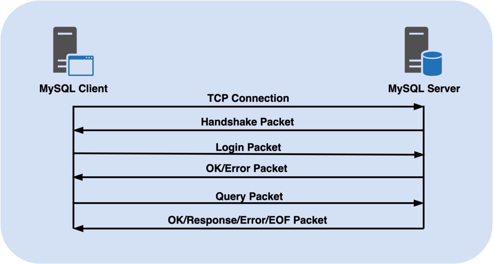
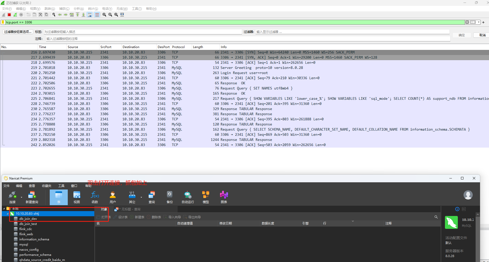
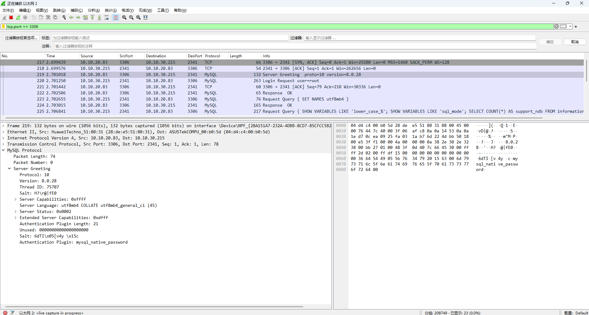
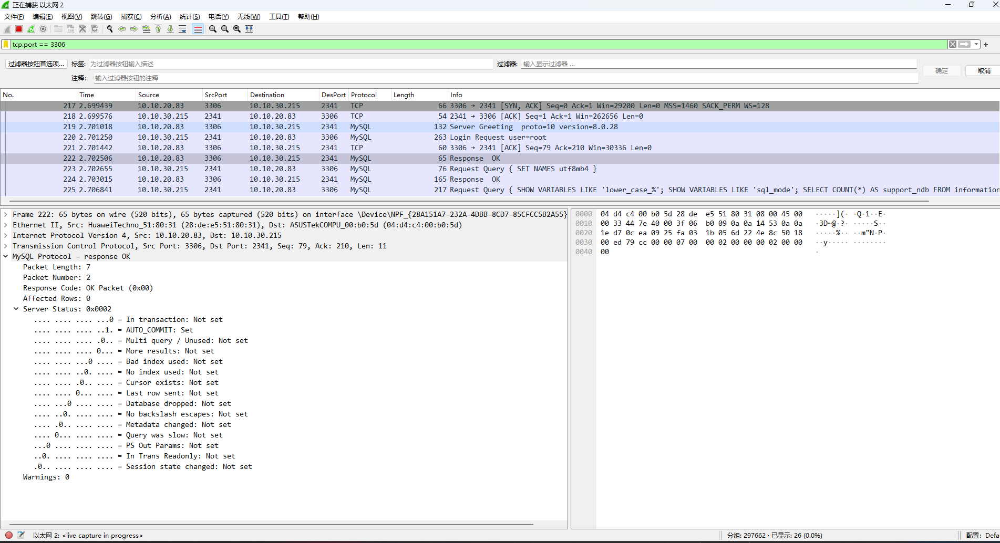

# MySQL 协议分析

### 背景

作为 DBA ，在日常运维工作中，常常会被开发同学问到类似下面的这些问题：

- 我的这条数据不知道被谁改了，能帮我查一下吗？

- 能帮我查查这张表都有谁在访问吗？

- 昨天某个时间监控有个尖刺，能帮忙看看执行了哪些 SQL 吗？

- 某一个 SQL 语句中有手机号、身份证号，或者密码明文等敏感信息，这个语句是谁在执行？

- 某一张表中存储了手机号、密码等明文信息，又是谁在读写这张表呢？

面对这些问题，我们会想方设法去找找慢日志，或者查询日志，甚至分析 binlog ，运气好的话可以找到一些线索，但大多数时候都不尽人意。详细的访问信息，带用户名、客户端 IP 的只有慢日志会记录，生产环境又不可能把所有 SQL 都记录下来，那会极大的拖慢系统性能，甚至有几率会带来故障，因此这成为了一个让 DBA 头疼的问题。

那么，怎么获取到数据全量的访问日志呢，我们来分析一下常见的一些方法：

- 从 Server 端记录

就是前面提到的，通过慢日志、查询日志来记录。优缺点也很明显，优点就是记录的信息准确，开启简单；缺点就是会占用系统性能，同时带来风险，这种实现方式通常有几种方案：

    - General log：这种方案可以记录所有访问日志，但日志内容匮乏，只包括了 Query 语句，而缺少了访问 IP ，用户名等信息，并且如果线上都打开这个日志文件，对 MySQL 性能的冲击很大，容易产生故障，所以很难实现我们的需求。
    
    - Slow log：将 long_query_time 参数设置为 0 ，即可记录所有 MySQL Server 端执行的 SQL 语句，用户名、客户端 IP 、执行时间等信息均有记录，但是带来的问题与开启 General log 相同，生产环境不可能一直开启。
    
    - Audit plugin：使用 MySQL 自带的审计功能，其实是可以实现部分需求的，但问题点在于 audit 本身是 MySQL 的一个插件，与版本关系比较大，功能不尽相同，而最大的一个问题是，如果开启这个插件功能，需要重启数据库，这是比较要命的，所以也不能被采用。

- 从客户端记录

客户端发起请求和收到响应时，能够记录自己发出的 SQL 请求，结果集以及响应时间，但我们知道，客户端众多，汇总起来是一个问题，也不能保证每台机器执行 SQL 的时序性。更不能体现 Server 端的真实执行时间，网络开销、客户端程序处理耗时等因素没法排除。

- MySQL 中间层记录

通过中间层日志追加的方式，记录所有对于底层数据库的请求；但这种方式受限于中间层的特性，并且 MySQL 和中间层的关系往往是多对多，也存在一个汇总的问题，同时也会增加额外开销。更加重要的是，在我们使用的 MySQL 架构中，没有中间层这个模块，所以这种方案就已经被排除在外。

网络旁路抓取

这是一种常见的 SQL 审计手段，对服务是非入侵式的，通过网络抓包来获取对于数据库的全量访问日志。这种方式既不会对服务造成任何影响，同时也可以控制对于服务器资源的占用，准确性也有一定保障

### 概述

本文不讨论语言层, 主要阐述 `MySQL Client/Server` 的通信协议，了解了整个通信协议之后, 无论是针对什么编程语言，哪怕是自己开发的新编程语言，也都可以自行实现一个 MySQL 驱动，基于 MySQL 驱动可以在上层做更多自定义的事情。例如实现 MySQL 数据到 Redis、ElasticSearch、MongoDB 等的数据同步、开发 MySQL Proxy 等。

MySQL 通信协议是一个**有状态协议**，主要用于 MySQL 客户端与服务器之间的通信。这个协议在 MySQL 客户端连接器（如 Connector/C、Connector/J 等）、MySQL Proxy 以及主从复制中都有实现。该协议的特性包括：支持 SSL、压缩和认证等功能。

此外，MySQL 通信协议还支持多种进程间通信方式，例如管道、命名管道、共享内存、TCP/IP 套接字和 UNIX 域套接字等。

MySQL 客户端和服务器之间的通信怎么实现？协议特征有哪些？

- MySQL 客户端和服务器之间的传输层通信是基于 TCP 协议实现的，应用层是由 MySQL 自己的应用协议 MySQL 协议。以下是 MySQL 协议的一些特征：

- 基于请求-响应模型：通信过程中，客户端发送请求到服务器，服务器进行处理后返回响应给客户端。

- 二进制协议：MySQL 协议使用二进制格式进行传输，每个数据报文都包含了特定的字段结构以及相应的数据类型。

- 数据报文格式：数据报文由固定长度的报头和可变长度的有效载荷（payload）组成。报头包含了协议版本、连接 ID、数据长度等信息。

- 多线程支持：MySQL 协议支持多个线程在同一个连接上并发执行多个查询。服务器会为每个线程分配一个线程 ID。

- 长连接：MySQL 协议支持长连接，即客户端和服务器之间的连接可以保持开放状态，减少了连接和断开连接的开销。

- SQL 语句支持：MySQL 协议可以发送 SQL 语句（如查询语句、事务语句等）到服务器执行，并接收服务器返回的结果集。

- 错误处理：MySQL 协议支持服务器返回错误信息，包括错误代码和错误描述，以便客户端处理异常情况。

- 安全连接：MySQL 协议支持通过 `SSL/TLS` 进行通信加密，保护会话数据的安全性。

- 广泛使用 flag 标记位：在握手阶段的登录请求响应报文中包含了服务端能力flag字段，以及业务通讯中的数据报文中也可以包含服务器状态flag标记位。

####  数据包格式

MySQL的客户端和服务端交互是以数据包(Packet) 为单位进行的, 每个包的大小长度有限制, 最长为 2^24 -1 个字节(即 16MB)。`max_allowed_packet` 表示 MySQL Server 或者客户端接收的 packet 的最大大小，packet 即数据包，MySQL Server 和客户端上都有这个限制。**注意，这里说的数据包大小是指 MySQL 应用层对数据的约定，在网络协议封装中，TCP 层和 IP 层各自都有各自的单个数据报文限制，即 MTU 和 MSS 等**。

若包长度过大, 则客户端需要自行将包分片, 使得每段的长度在 MySQL 包的最大长度之下, MySQL Packet 由 Header 和 Body 组成, Header 包含两个字段: 包长度(payload_length)、序列号(sequence_id), Body 则是包的主体部分, 它的长度由 Header 中的 payload_length 字段指示, 包长度字段固定使用 int<3> 类型, 序列号固定使用 int<1> 类型, 当客户端和服务端开始交互时, 由客户端初始化 0 序列号, 之后每次交互, 数据发出方都基于前一个 sequence_id 增一, sequence_id 不是恒定唯一的, 当交互次数足够多后, 它会重新回到 0。

| 名称                            | 数据类型 | 占用空间 | 解析   |      |
| ------------------------------- | -------- | -------- | ------ | ---- |
| Packet Length（payload_length） | int<3>   | 3byte    | 包长   |      |
| sequence_id                     | int<1>   |          | 包序号 |      |
| payload                         |          |          |        |      |

因为前三个字节最大只能表达16M的长度，这是三个字节表达无符号整型的极限，所以，每次客户端可以接受到的单个最大数据包为16M+4个字节。

对于`payload`部分大于等于16MB的，MySQL会将数据进行切分，每16MB为一部分，然后将切分的数据按照数据包的格式封装，进行发送，直到切分的数据部分长度小于16MB。

### 通讯过程

在实际应用中，基于TCP的连接是最广泛的，这里我们使用 Wireshark 工具在客户端来抓取并分析 MySQL 协议。

MySQL 客户端和服务端的交互过程主要分为两个阶段：**连接建立阶段（Connection Phase）和命令执行阶段（Command Phase）**。

**连接建立阶段主要的工作是：身份认证建立连接。** 在此阶段有一个握手认证过程：服务端会生成一些服务信息，包括协议号、server 版本、线程 id、加密随机数（Salt加盐）和服务端能力 flag 等信息。客户端则会生成认证信息，包含客户端能力 flag、用户名、加密密码和连接数据库名字等信息。然后，服务端返回认证结果，如果验证正确，则返回 OK 包，否则是异常包。

#### 连接建立阶段

MySQL 连接的方式有多种, 比如 TCP/IPv4、TCP/IPv6、UNIX domain sockets 等, 我们以 TCP 连接为例来讨论连接建立过程：

主要交互过程如下：

- TCP三次握手，这里就不做过多赘述，一句话：任何基于TCP的应用都要经历这个过程。
- MySQL协议：服务器 -> 客户端 ，**握手初始化消息（Initial HandShake Packet）**。官网文档叫 [**Protocol::Handshake**](https://dev.mysql.com/doc/dev/mysql-server/8.4.2/page_protocol_connection_phase_packets_protocol_handshake.html) ，在 Wireshark中抓到报文叫 Server Greeting。初次握手从服务器向客户端发送`Protocol::Handshake`数据包开始。在这之后，客户端可以选择使用`Protocol::SSLRequest`数据包请求建立SSL连接，然后客户端发送`Protocol::HandshakeResponse`数据包。**这里我们忽略SSL过程（假定客户端不请求SSL连接），因为数据库建立SSL连接开销挺大的，实际生产中也很少这样做。MySQL的通信是否加密，是由客户端和服务端共同协商是否开启的，客户端与服务端都处于默认配置下的话，有些类似于 StartTls。**
- MySQL协议：客户端 -> 服务器：**登陆请求认证消息（Handshake Response Packet）**。官网文档叫  [Protocol::HandshakeResponse](https://dev.mysql.com/doc/dev/mysql-server/latest/page_protocol_connection_phase_packets_protocol_handshake_response.html)，在 Wireshark中抓到报文叫 Login Request。客户端解析首包后，会发送`Protocol::HandshakeResponse`数据包，数据包中携带能力交换信息，要登录的用户等, 在这个阶段
- MySQL协议：服务器 -> 客户端：认证结果消息 

##### 功能协商

为了允许旧客户端连接到新服务器，`Protocol::Handshake`包含MySQL服务器版本即服务器的功能标志。

客户端在`Protocol::HandshakeResponse`中只声明与服务器相同的功能。

然后使用如下参数达成一致：

- 状态标识（status flags）
- SQL状态错误码（SQL states for error codes）
- 认证方法（authentication methods）
- SSL（SSL Support）
- 压缩（Compression）

MySQL通信是否开启TLS加密，是由客户端和服务端共同协商是否开启的，客户端与服务端都处于默认配置下的话，有些类似于电子邮件通信场景中STARTTLS协商。

服务端在发送`Protocol::Handshake`中卸载`Capabilities Flag`。顾名思义，这就是用来做兼容性，或者说特性开关的 flag，大小为 2 个字节，其中的第 12 位，代表着 `CLIENT_SSL`，如果设置为 1，那代表着如果客户端具备能力，服务端可以在后面的会话中切换到 TLS。

如果我们在服务器上

##### 确认身份验证方法

用户身份验证方法（其实就是加密方法）将与用户帐户关联，并存储在`mysql.user`表的`plugin`列中。

客户端在`Protocol::HandshakeResponse`数据包中发送将要登录的用户帐户。服务器查找`mysql.user`表并找到要当前登录用户使用的身份验证方法。

为节省通信成本，服务器和客户端在发送初始`Handshake`数据包时就对要使用的身份验证方法进行了**乐观推测**。

服务器使用其默认身份验证方法`default_auth_plugin`生成初始身份验证数据的有效负载，并将其与方法名放在`Protocol::Handshake`中一起发给客户端。

客户端在`Protocol::HandshakeResponse`中包含对服务器发送的身份验证数据的答复。在这个答复过程，客户端**没有义务一定要**使用与`Protocol::Handshake`数据包中服务器所使用的身份验证方法相同的身份验证方法。客户端使用的身份验证方法的名称存储在响应数据包中。如果客户端或服务器在初始握手中包换的推测身份验证方法不匹配，则服务端会使用`Protocol::AuthSwitchRequest`通知客户端应使用哪种身份验证方法。这个就是**协商验证验证方法的过程**

> 在 MySQL 8.0.27 之前，create user 的时候可以指定一种认证插件（就是加密方法），在未明确指定的情况下会取系统变量 default_authentication_plugin的值。default_authentication_plugin 的有效值有3个，分别是 mysql_native_password ，sha256_password ，caching_sha2_password ，这个3个认证插件是内置的、不需要注册步骤的插件。default_authentication_plugin 这个参数在8.0.27中被deprecated ，在未来的版本中可能会被弃用。
>
> 
>
> 在 MySQL 8.0.27 中，引入 `authentication_policy` 配置来管理用户的身份认证（可以实现多因素身份认证）。

在MySQL 4.0之前，MySQL协议仅支持`Old Password Authentication`。在MySQL 4.1中，添加了`Native Authentication`方法，而在MySQL 5.5中，可以通过**身份验证插件**实现任意身份验证方法。

如果客户端或服务器不支持插件式身份验证（即未设置`CLIENT_PLUGIN_AUTH`功能标志），则从客户端和服务器功能继承使用的身份验证方法，如下所示：

- 如果未设置`CLIENT_PROTOCOL_41`或`CLIENT_SECURE_CONNECTION`，则使用的方法是`Old Password Authentication`。
- 如果同时设置了`CLIENT_PROTOCOL_41`和`CLIENT_SECURE_CONNECTION`，但未设置`CLIENT_PLUGIN_AUTH`，则使用的方法是`Native Authentication`。

这个基本上是上古时代的MySQL和客户端，可以不用管。

##### 快速身份验证

假设客户端要通过用户帐户`U`登录，并且该用户帐户已定义为使用身份验证方法`server_method`。在以下情况下使用快速身份验证路径：

- 服务器使用`server_method`生成身份验证数据后放入`Protocol::Handshake`数据包中。
- 客户端在`Protocol::HandshakeResponse`中声明使用`client_authentication_method`，该方法与服务器使用的`server_method`兼容。

这样在握手期间就已经开始了第一轮身份验证。然后，根据身份验证方法`server_method`，进一步交换身份验证，直到服务器接受或拒绝身份验证为止。

##### 验证方法不匹配

假设客户端要以用户`U`身份登录，并且该用户帐户使用身份验证方法`M`。如果：

1. 服务器用于生成放在`Protocol::Handshake`数据包中的身份验证有效负载的默认方法与`M`不同
2. 客户端用于生成放在`Protocol::HandshakeResponse`数据包中的方法与`M`不兼容

则说明身份验证方法不匹配，必须使用正确的身份验证方法重新启动身份验证交换过程。

> 注意：
>
> 1. 即使客户端和服务器在初始握手中使用了兼容的身份验证方法，也可能发生不匹配，因为服务器使用的方法与用户帐户实际用的方法不同。
> 2. 在4.1-5.7版本的服务器和客户端中，默认身份验证方法是`Native Authentication`。
> 3. 在8.0版本的服务器和客户端中，默认的身份验证方法是`Caching_sha2_password information`。
> 4. 客户端和服务器可以通过`--default-auth`选项更改其默认身份验证方法。
> 5. 对客户端来说，查看在`Protocol::Handshake`数据包中声明的服务器的默认身份验证方法，并从中推断出身份验证方法，比在生成`Protocol::HandshakeResponse`数据包时直接使用客户端默认身份验证方法更好。但是，由于服务器和客户端之间存在一对多的身份验证方法插件，而且，客户端通常都不知道这种映射关系，因此这在`mysql`客户端库中未实现。

如果发生身份验证方法不匹配，服务器将向客户端发送`Protocol::AuthSwitchRequest`数据包，其中包含服务器要使用的身份验证方法的名称以及使用新方法重新生成的第一个身份验证有效负载。客户端应切换到服务器请求的身份验证方法，并按照该方法的指示继续进行交换。

如果客户端不知道所请求的方法，则应断开连接。

#### 命令执行阶段

命令执行阶段在官网文档中，叫 `Command Phase`。在这个阶段，就有点像 HTTP 的请求响应这种一问一答的通信模型。

首先，客户端发送一个序号(sequence-id)为0的首包。

##### 客户端命令请求报文

客户端可以发送各种不同类型的命令包，payload中的第一个byte描述`command-type`。这个type在include/my_command.h中以enum_server_command枚举方式定义

命令：用于标识当前请求消息的类型，例如切换数据库（0x02）、查询命令（0x03）等。命令值的取值范围及说明如下表（参考MySQL源代码/include/mysql_com.h头文件中的定义。

在官网中，把这些类型分为`Text Protocol`,`Utility Commands`,`Prepared Statements`,`Stored Programs`

其中，最主要的是 `COM_QUERY` 消息报文，这个是最常见的请求消息类型，当用户执行SQL语句时发送该消息。

##### 回包报文

常见MySQL返回的报文有`Data Packet`, `OK Packet`, `EOF Packe`t`, 和`ERROR Packet`。回包格式主要取决于查询是否需要返回结果集。

对于诸如 `COM_PING`, `IUD Query` 等不需要返回结果集的命令, 以及连接阶段的登录成功。`MySQL server`如果正确执行这个查询, 会返回 OK 报文给 client。

**OK Packet**

对于OK包，在  `sql/protocol_classic.cc -> net_send_ok()` 函数中定义的数据包结构。[The Payload of an OK Packet](https://dev.mysql.com/doc/dev/mysql-server/latest/page_protocol_basic_ok_packet.html)

在5.7.5版本之后，OK Packet也可以用于表示EOF信息，原先的 EOF_Packet被废弃了。

- 如果 header = 0x00 并且packer 长度大于7，说明这个包是 OK 数据包
- 如果 header = 0xFE 并且 packer 长度小于9，说明这个包是 EOF 包

如果设置了`CLIENT_PROTOCOL_41`标记位，即MySQL 版本大于4.1。 该数据包包含一个警告计数。

### 协议数据类型

协议数据类型是与语言无关的数据类型, 可以理解为 `wire type`, 它们是网络字节流中的数据类型。

在 MySQL 协议中数据类型只有两大类, 分别是整数(Integers) 和字符串(Strings), 这两种数据类型又会分为多个更小的数据类型, 对于整数类型, 可以进一步分为定长整数(Fixed-Length Integer Types) 和长度编码型整数(Length-Encoded Integer Type)。

对于定长整数, 顾名思义其长度是固定的, 定长整数有 int<1>、int<2>、int<3>、int<4>、int<6>、int<8> 共 6 种, 定长整数都是以小端字节序存放的, 即最低有效位在前。举例来说, 对于 int<4> 类型的数字 2, 其字节概况为 10 00 00 00;

而长度编码型整数, 它所占用的字节数不是固定的, 取决于值的大小, 记为 int<lenenc>, 这是一种变长编码方式, 长度编码型整数占用的字节数有 1、3、4、9 字节共 4 种情况, 数字越小, 占用的字节数越少, 当数字小于 0xfb 时, 编码后其占用一个字节, 当数字大于等于 0xfb 并且小于等于 0x7ffff 时, 其编码后将占用 3 个字节(固定的 0xfc + 2 个字节数值位), 当数字大于等于 0x10000 且小于等于 0x7fffff 时, 其编码后将占用 4 个字节(固定的 0xfd + 3 字节的数值位), 当数字大于等于 0x1000000 且小于等于 0x7ffffffff 时, 其编码后将占用 9 个字节(固定的 0xfe + 8 字节的数值位), 根据这样的编码规则, 反过来我们也能得到长度编码型整数的解码规则, 识别数据的第一个字节便可以知道其后所跟随的数值位的字节数, 进而可以获得数值本身, 也就是说长度编码型整数实际上是用开头的一字节来指示其后所跟的数据的字节长度, 而其后的数值字节仍然是以小端字节序存储, 这里实际上有点类似于 Redis 的 ziplist 结构中的结点, 在 Redis ziplist 结构中, 其结点的第一个元素 previous_entry_length 也是采用类似的结构来表示前一个结点的长度, 若前一结点的长度小于 254 个字节, 则 previous_entry_length 的本身就是前一结点的长度, 若前一结点的长度大于等于 254 个字节, 则 previous_entry_length 本身占用 5 个字节的长度, 其第一字节的值固定为 0xfe, 而后所跟的 4 个字节指示了其前一个结点的长度

### 数据包格式

| 数据类型                                                     | 长度   | 名称           | 含义                            |      |
| ------------------------------------------------------------ | ------ | -------------- | ------------------------------- | ---- |
| [int<3>](https://dev.mysql.com/doc/dev/mysql-server/latest/page_protocol_basic_dt_integers.html#a_protocol_type_int1) | 3 byte | payload_length | 表示包长度                      |      |
| [int<1>](https://dev.mysql.com/doc/dev/mysql-server/latest/page_protocol_basic_dt_integers.html#a_protocol_type_int1) | 1 byte | sequence_id    |                                 |      |
| [string](https://dev.mysql.com/doc/dev/mysql-server/latest/page_protocol_basic_dt_strings.html#sect_protocol_basic_dt_string_var) |        | Body           | 包主体部分，承载着MySQL业务数据 |      |

一个典型的数据包例子

| 1 00 00 00 01 | length: 1   sequence_id: x00   payload: 0x01 |
| ------------- | -------------------------------------------- |

### 数据报文阶段

MySQL 是一个有状态协议，

连接阶段：

- 客户端和服务端交换能力（capabilities ）
- 建立TLS通信（如有必要的话）
- 身份认证

### 抓包实战

在 Windows 客户端抓包，抓包图如下：

- TCP 三次握手
- 
- Client——>Server，Login Request，Client 发起的登录请求报文，

#### TCP 三次握手

#### 挑战数据包

MySQL 采用的是挑战-响应方式来进行身份认证。由服务端生成加密用的盐给客户端，提高安全性。在官网中叫 [Protocol::Handshake](https://dev.mysql.com/doc/dev/mysql-server/latest/page_protocol_connection_phase_packets_protocol_handshake.html)

Sever 告诉客户端自己的版本、分配的连接 ID、服务器的能力（Capabilities）、认证插件，字符集，Salt 等信息。

MySQL 采用的是挑战-响应方式来进行身份认证。由服务端生成加密用的盐给客户端，提高安全性。

| 名称                         | 类型   | 长度   | 含义                                                                                                         |
| ---------------------------- | ------ | ------ | ------------------------------------------------------------------------------------------------------------ |
| Protocol                     | int    | 1 byte | MySQL 应用协议的版本号，参考 MySQL 源代码/include/mysql_version.h 头文件定义                                 |
| Version                      | string | 不确定 | MySQL Server 的版本号，由 MYSQL_SERVER_VERSION 宏定义决定（参考MySQL源代码/include/mysql_version.h头文件定义） |
| Thread ID                    | int    | 4 byte | 建立连接所分配的线程 id                                                                                      |
| Salt                         |        |        | 挑战字符串，相当于用于加密密码的盐，分为两部分，长度分别为 8 字节和 12 字节                                  |
| Server Capabilities          |        |        | 服务器支持的功能，int 为 32 位，1 支持，0 不支持，最多支持 32 种功能。这里占 2 个字节，为 int 的前 16 位（参考MySQL源代码/include/mysql_com.h中的宏定义）     |
| Server Language              |        |        | 服务器编码，通常为 utf8mb4                                                                                   |
| Server Status                |        |        | 服务器状态，通常为 SERVER_STATUS_AUTOCOMMIT，表示自动提交事务                                                |
| Extended Server Capabilities |        |        | 服务器支持的拓展功能，int 为 32 位，1 支持，0 不支持，最多支持 32 种功能。这里占 2 个字节，为 int 的后 16 位 |
| Authentication Plugin Length |        |        | ?好像指的是挑战字符串的长度，没搞懂为什么是 21 而不是 20                                                     |
| Unused                       |        |        | 未使用的部分                                                                                                 |
| Authentication Plugin        | string |        | 密码采用的加密方法，通常为 mysql_native_password                                                             |

#### 认证数据包

#### 切换加密算法

如果挑战数据包返回的`Authentication Plugin`认证插件与你的用户密码加密方式不一致（比如你的用户采用的是`mysql_native_password`加密，而服务器返回的是`caching_sha2_password`），那么校验肯定失败，所以需要更换加密方式。服务器会发送一个切换认证插件请求数据包来指示客户端重新加密密码并发送。

#### 成功响应报文

Response OK ，成功响应，这个没什么好说的。返回的核心字段是 Server Status 这些各种 flag 标记位。

#### 密码插件算法

MySQL 5.6/5.7 的默认密码插件一直以来都是 `mysql_native_password`。其优点是它支持 `challenge-response` 机制，这是非常快的验证机制，无需在网络中发送实际密码，并且不需要加密的连接。

然而，`mysql_native_password` 依赖于 SHA1 算法，但 NIST（美国国家标准与技术研究院）已建议停止使用 SHA1 算法，因为 SHA1 和其他哈希算法（例如 MD5）已被证明非常容易破解。

此外，由于 `mysql_native_password` 在 mysql.user 表中 `authentication_string` 字段存储的是两次哈希 SHA1(SHA1(password)) 计算的值 ，也就是说如果两个用户帐户使用相同的密码，那么经过 `mysql_native_password` 转换后在 mysql.user 表得到的哈希值相同。

尽管有 hash 值也无法得到实际密码信息，但它仍然告诉这两个用户使用了相同的密码。为了避免这种情况，应该给密码加盐（salt），salt 基本上是被用作输入，用于转换用户密码的加密散列函数。由于 salt 是随机的，即使两个用户使用相同的密码，转换后的最终结果将发生较大的变化。

从 MySQL 5.6 开始支持 `sha256_password` 认证插件。它使用一个加盐密码（salted password）进行多轮 SHA256 哈希（数千轮哈希，暴力破解更难），以确保哈希值转换更安全。然而，它需要要么在安全连接或密码使用 RSA 秘钥对加密。所以，虽然密码的安全性更强，但安全连接和多轮 hash 转换需要在认证过程中的时间更长。
