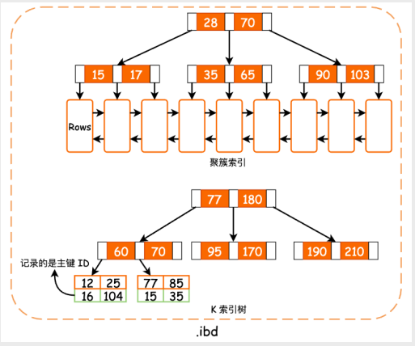
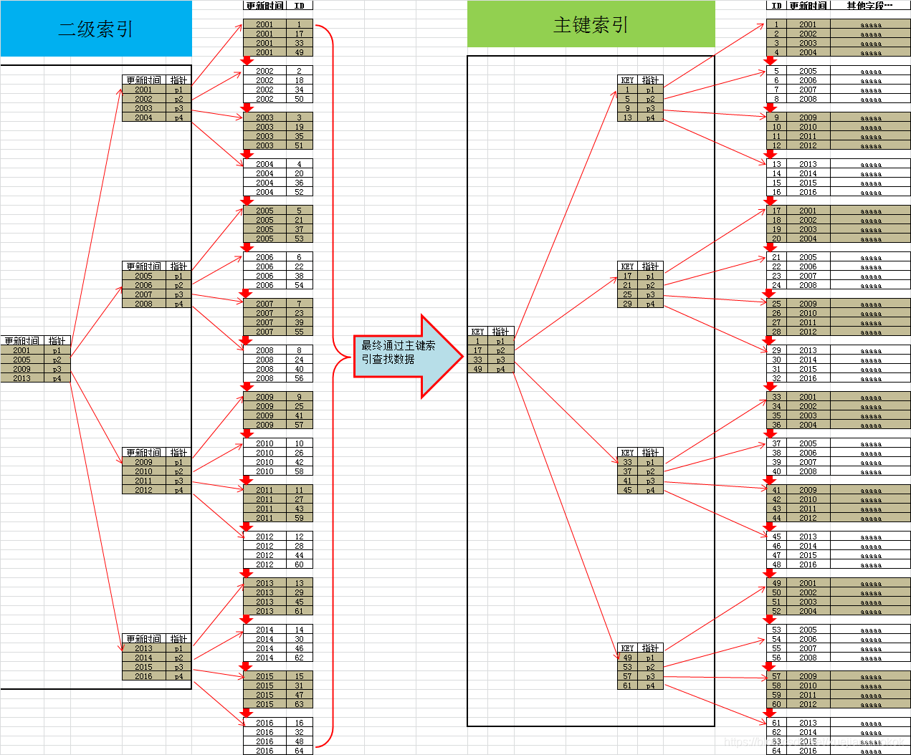

## 索引基本概念

数据库中的索引，就像是书籍中的目录一样。或者是我们去图书馆看书时，通常在图书馆网络上查找到想看的书的索书号，然后根据图书馆分类索引去查找对应的书架找到书籍。索引这个概念在我们日常生活中很常见。比如在很多书籍的最后，都配有关键字索引。它能帮助你快速地找到某个关键字所在的书页。试想一下，如果没有索引，想要查询某个关键字所在的章节和书页，可能唯一的办法就是一页一页翻书直到找到为止。索引大大提高了查询的速度！

在数据库中的索引，也是这个概念。数据库的索引也正是为了解决这类问题：索引通过引入冗余的数据存储(类比书籍最后的索引章节)，以此来提高查询语句的速度。

在学生表中，为了根据给定 ID 检索一条 _student_ 记录，数据库系统会先查找索引，找到记录所在的磁盘块，然后读取所需的 _student_ 记录。

索引是一种典型的 **空间换取时间** 的算法思想，在磁盘中花费一些额外空间来存储一些额外的索引数据，来提高查找效率。

这里的查找，并不是简单的查询，无论是增删改查，都需要查找相应的位置进行插入，或者找到相应的记录再进行删除和修改。

**所以索引提高的并不仅仅只是查询效率。**

根据索引的作用：无论是增删改查，都是要先查找到相应的记录，**而且在增删改时也要修改索引数据。索引也会带来一些额外的维护开销**。

**评价索引性能大概有如下几种因素**：

- **访问类型**：索引能够支持的访问类型，主要的访问类型包括：特定记录的查找（等值查找），范围查找 。
- **访问时间**：在查询中，使用索引技术查找到记录的时间。
- **插入时间**：插入新数据项的时间，包括找到正确的位置插入数据项和更新索引所需要的时间。
- **删除时间**：删除数据项的时间，包括找到要被删除的项和更新索引所需要的时间。
- **空间开销**：索引结构占用的额外的空间开销。

## 索引的基本数据结构

根据索引的数据结构分类，有两种基本的索引类型：

**散列索引（哈希索引）**

- 散列索引主要的数据结构就是哈希表。只有精确匹配索引这种等值查询才有效。

  - 对于每一行数据，存储引擎都会对索引列计算一个哈希码，哈希码是一个较小的值，并且不同键值的行计算出来的哈希码也不一样（少数情况也可能有哈希冲突）。
  - 哈希索引将所有的哈希码存储在索引中，同时在哈希表中保存指向每个数据行的指针。
  - **也就是说，由于哈希查找比起 B-Tree 索引，其本身对于单行查询的时间复杂度更低，有了哈希索引后明显可加快单行查询速度。**

  - **哈希索引不是按照索引值顺序存储的，所以也就无法用于排序查找。**
  - **散列索引仅支持 仅能满足 "=","IN"和"<=>"查询，不能使用范围查询，例如 " where price > 100"（注意 "<=>" 和 "<" ,">" 是不同的运算符。）**
  - 其检索效率非常高，索引的检索可以一次定位，不像 B-Tree 索引需要从根节点到枝节点，最后才能访问到页节点这样多次的 IO 访问。所以 Hash 索引的查询效率要远高于 B-Tree 索引。
  - MySQL 的 InnoDB 存储引擎中有个功能叫 **自适应哈希索引( adaptive hash index)**，当 InnoDB 注意到某些索引值使用的非常频繁时，它会在内存中基于 B-Tree 索引之上再创建一个哈希索引，这样就让 B-Tree 也具有哈希索引的一些优点，比如快速查找，这是一个自动的、内部的行为，用户无法控制或配置，不过如果有必要，可以自己关掉。

**顺序索引**

顺序索引的主要数据结构是 B+Tree 。将索引列按照 B+tree 这种数据结构来存储，本质上就是一种排好序的数据结构。加快数据查找效率。

索引项是由索引码值和指向具有该索引码的一条或多条记录的指针组成。

面试题二：为什么不用红黑树？而是 B 树

- 红黑树一个索引节点空间中只有一个元素，如果海量数据时，则树的高度会非常高，效率一样很低。

- B-树 ，每个索引节点的

面试题一：为什么是 B+tree ，而不是 B-tree ？ (其实就是在问这两个数据结构有什么不同？)

- B+tree 树非叶子节点中不存储数据元素，只存储冗余索引（一层可以放更多索引）。

- B+Tree 叶子节点是顺序排列的，并且相邻的节点具有顺序引用(有指针)的关系。（提高区间查找访问能力）

B+ 树与 B 树差异的点，主要是以下这几点：

- 叶子节点（最底部的节点）才会存放实际数据（索引+记录），非叶子节点只会存放索引；
- 所有索引都会在叶子节点出现，叶子节点之间构成一个有序链表；
- 非叶子节点的索引也会同时存在在子节点中，并且是在子节点中所有索引的最大（或最小）。
- 非叶子节点中有多少个子节点，就有多少个索引；

- **B+Tree 叶子节点包含所有索引字段**

InnoDB 存储引擎最小储存单元是页，一页大小就是 16k。
B+树叶子存的是数据，内部节点存的是键值+指针。索引组织表通过非叶子节点的二分查找法以及指针确定数据在哪个页中，进而再去数据页中找到需要的数据；

为什么没有二叉树作为它的索引数据结构呢？

二叉树是通过二分查找来进行定位数据的，所以效果还是不错的，时间复杂度是 O(logn)；

但是二叉树有个问题，就是在特殊情况下，它会退化成一个单向链表。这个时候，它的时间复杂度就会退化成 O(n)；

平衡二叉树

既然二叉树在特殊情况下会退化成链表，那么平衡二叉树为什么不可以呢？

因为能保持平衡，所以它的查询时间复杂度为 O(logN)，至于怎么保持平衡的，主要是做一些左旋，右旋等，具体保持平衡的细节不是本文主要内容，想了解的可自行搜索。

用这个数据结构来做 MySQL 的索引会有 什么问题呢？

- 磁盘 IO 过多：在 MySQL 当中，一次 IO 操作只读取一个节点，那么一个节点若是最多就两个子节点的话，那么就只有这两个子节点的查询范围，所以要精确到具体的数据时，就需要进行多次读取，如果树非常深的话，那么将会进行大量的磁盘 IO。性能自然下降了。
- 空间利用率低：对于平衡二叉树来说，每个节点值保存一个关键字，一个数据区，两个子节点的指针。这样导致了，一次辛辛苦苦的 IO 操作就只加载这么点数据，实在是有点杀鸡用牛刀了。
- 查询效果不稳定：如果在一个高度很深的平衡二叉树中，若是查询的数据正好是根节点，那么就会很快的查到，若是查询的数据正好是叶子节点，那么会进行多次磁盘 IO 后才能返回，响应时间有可能和根节点的不在一个数量级上。

虽然说二叉树解决的平衡的问题，但是也带来了新的问题，那就是由于它本身树的深度的，会造成一系列的效率问题。

那么为了解决平衡二叉树的这类问题，平衡多叉树（Balance Tree）就成为了更好的选择。

平衡多叉树（Balance Tree--B-Tree）

B-Tree 的意思是平衡多叉树，一般 B-Tree 中的一个节点有多少个子节点，我们就称为多少阶的 B-Tree。通常用 m 表示阶数，当 m 为 2 的时候，就是平衡二叉树。

一棵 B-Tree 的每个节点上最多能有 m-1 个关键字，最少要存放 Math.ceil(m/2)-1 个关键字，所有的叶子节点都在同一层。如下图就是一个 4 阶的 B-Tree。

https://www.cnblogs.com/jimoer/p/14353022.html

### InnoDB 存储引擎

### MySQL 中的哈希索引

MySQL 最常用存储引擎 InnoDB 和 MyISAM 都不支持 Hash 索引，它们默认的索引都是 B-Tree。

但是如果你在创建索引的时候定义其类型为 Hash，成功建表，而且你通过 SHOW CREATE TABLE 和 show index from table 来看，实际还是 B-Tree 。

查阅官网文档，可以发现 InnoDB 支持的所有特性，其中对 Hash index 特征的支持描述是：

> No (InnoDB utilizes hash indexes internally for its Adaptive Hash Index feature.)

> 不支持（InnoDB 在内部利用 hash 索引来实现其自适应 hash 索引特性）

根据文档发现，自适应索引是 InnoDB 引擎的内存结构中的一种特性。对自适应 hash 索引的描述:

> 自适应 hash 索引特性使 InnoDB 能够在具有适当的工作负载和足够的缓冲池内存的系统上执行更像内存中的数据库，而不牺牲事务特性或可靠性。

总的来说就是提高了查询性能。**这里的自适应指的是不需要人工来制定，而是系统根据情况来自动完成的。**

哈希 hash 查找非常快，一般情况下时间复杂度为 O(1)，一般仅需要一次查找就能定位。而 B+ 树的查找次数，取决于 B+ 树的高度，B+ 树的高度一般为 34 层，因此便需要查询 34 次。

`InnoDB`储引擎通过观察表上索引页的查询，如果发现建立哈希索引可以提升查询效率，则会自动建立哈希索引，称之为自适应哈希索引`Adaptive Hash Index`。

`AHI`是基于缓冲池的 B+树构造的索引，因此速度非常快，而且不需要对整张表建立索引。`InnoDB`存储引擎会自动根据访问的频率和模式来自动为某些热点页建立哈希索引。

考虑到不同系统的差异，有些系统开启自适应哈希索引可能会导致性能提升不明显，而且为监控索引页查询次数增加了多余的性能损耗，`MySQL5.7`更改了 AHI 实现机制，每个 AHI 都分配了特定分区，每个索引都绑定到特定分区，并且每个分区均受单独的锁存器保护。分区由 `innodb_adaptive_hash_index_parts` 变量控制。默认情况下，`innodb_adaptive_hash_index_parts` 变量值为 8，最大值为 512。

那什么情况下才会使用自适应 Hash 索引呢？如果某个数据经常会访问到，当满足一定条件的时候，就会将这个数据页的地址存放到 Hash 表中。这样下次查询的时候，就可以直接找到这个页面的所在位置。需要说明的是：

- 自适应哈希索引只保存热数据（经常被使用到的数据），并非全表数据。因此数据量并不会很大，可以让自适应 Hash 放到缓冲池中，也就是 InnoDB buffer pool，进一步提升查找效率。

- InnoDB 中的自适应 Hash 相当于是“索引的索引”，采用 Hash 索引存储的是 B+树索引中的页面的地址。这也就是为什么可以称**自适应 Hash 为索引的索引**。采用自适应 Hash 索引目的是可以根据 SQL 的查询条件加速定位到叶子节点，特别是当 B+树比较深的时候，通过自适应 Hash 索引可以提高数据的检索效率。

- 自适应 Hash 采用 Hash 函数映射到一个哈希表中，所以对于字典类型的数据查找非常方便 哈希表是数组+链表的形式。通过 Hash 函数可以计算索引键值所对应的 bucket（桶）的位置，如果产生 Hash 冲突，如果产生哈希冲突，就需要遍历链表来解决。

- 是否开启了自适应 Hash，可以通过 innodb_adaptive_hash_index 变量来查看，比如：mysql> show variables like '%adaptive_hash_index';

所以，总结下 InnoDB 本身不支持 Hash，但是提供自适应 Hash 索引，不需要用户来操作，而是存储引擎自动完成的。

自适应 Hash 也是 InnoDB 三大关键特性之一，另外两个分别是插入缓冲（Insert Buffer）和二次写(Double Write)。

**虽然常见存储引擎并不支持 Hash 索引，但 InnoDB 有另一种实现方法：自适应哈希索引。**

**InnoDB 存储引擎会监控对表上索引的查找，如果观察到建立哈希索引可以带来速度的提升，则建立哈希索引。**

### 稠密索引

索引是连续的，即在要索引列的每一行中，都有索引项。索引项包括

稠密索引的特点是占用空间大，搜索效率高。**绝大多数关系型数据库的索引都是稠密索引。**

### 稀疏索引

索引是非连续的。

在稀疏索引中，只为搜索码的某些值建立索引项。只有当数据是按照

考虑一本字典，每一页的页眉都顺序的列出了该页中按字母顺序出现的第一个单词，这个字典所有页的页眉构成了这个字典的稀疏索引。

显然，稠密索引是可以快速定位一条记录的。

但是稀疏索引的优点在于：

- 占用更少的空间。
- 插入和删除时的开销更小。

系统设计者必须在存取时间和空间开销之间权衡。尽管有关这一权衡的决定依赖于具体的应用，但是为每个块建立稀疏索引是比较好的折中。**设计索引的粒度很重要**

**处理数据库查询的开销，主要是把块从磁盘读取到内存中的时间。一旦块被读入内存，扫描整个块的时间几乎是可以忽略的。**

（磁盘被读取到内存是以块为单位，一个数据块中的可以存取多条记录）

## 多级索引

假设要在 100 000 000 行数据上建立了稠密索引，1 个 4KB 的数据块可以容纳 100 条索引项。这样索引文件就需要占用 1 000 000 个数据块。即 4GB。

这个索引文件以顺序的方式存储在磁盘中。

如果索引小到可以放到内存中。那么搜索一个索引项的时间非常小。（即使索引比内存小，也不可能全部读入内存，内存还需要处理其他任务）

在索引文件中，用二分查找法来进行搜索。

多级索引简单说，其实就是索引的索引。 再

## 索引的更新

无论采用什么形式的索引，每当有记录插入或者删除时，索引都需要更新。

如果有记录更新，任何该记录上的搜索码受影响的索引也必须更新。

例如，如果一个教师的系发生了变化，那么 instructor 上的 dept_name 列上的索引也必须相应的更新。

索引的更新可以认为是删除旧的索引，随后插入对应的新记录。因此，只需要考虑索引的插入和删除。

## 索引类型

按照索引的数据结构，MySQL 中的 **索引方法** 可以分为

- 哈希索引（HASH）(其实 MySQL 并不支持哈希索引)

- BTREE 索引（BREE）

按照索引类型，可以分为：

- 普通索引（NORMAL）
- 唯一索引（UNIQUE）
- 全文索引（FULLTEXT）（MySQL8.0）
- 地理索引（SPATIAL）

```sql
-- 索引语法：ALTER TABLE table1 ADD (UNIQUE| SPATIAL | FULLTEXT )INDEX idx_name(column(length)) USING  BTREE |HASH ;
-- 索引语法：ALTER TABLE table1 ADD INDEX idx_name(column) USING  BTREE |HASH ;

-- 添加普通的B-tree索引
ALTER TABLE t1   ADD INDEX idx_name(column(10)) USING BTREE;
-- 添加unique的B-tree索引
ALTER TABLE t1   ADD INDEX unique idx_name(column(10)) USING BTREE;


```

### 隐藏索引

MySQL 8.0.19 中新增了三种索引方式：隐藏索引、降序索引、函数索引

**隐藏索引概述**

MySQL 8.0.19 及以上支持隐藏索引（invisible index），也称为不可见索引。**隐藏索引不会默认被优化器使用。主键不能设置为隐藏（包括显式设置或隐式设置）**

实际上，通过这种方式创建的索引，索引文件还是存在的，只是默认不会被优化器使用。

**这个功能在测试评估索引有效性时非常有用。DBA 对希望删除的索引开启该功能，经过完整验证，确认之后，可以放心删除索引。**

所有的索引默认是可见的，可以在 CREATE TABLE, CREATE INDEX, ALTER TABLE 的时候，对新索引设置为不可见。使用方法如下：

```sql
CREATE TABLE t1 (
  i INT,
  j INT,
  k INT,
  INDEX i_idx (i) INVISIBLE  -- 隐藏索引
) ENGINE = InnoDB;
CREATE INDEX j_idx ON t1 (j) INVISIBLE;  -- 隐藏索引
ALTER TABLE t1 ADD INDEX k_idx (k) INVISIBLE; -- 隐藏索引

-- 隐藏索引与可见索引的转换
ALTER TABLE t1 ALTER INDEX i_idx INVISIBLE;
ALTER TABLE t1 ALTER INDEX i_idx VISIBLE;

-- 查看表中索引是否为隐藏索引 show index from t1;

SELECT INDEX_NAME, IS_VISIBLE FROM INFORMATION_SCHEMA.STATISTICS  WHERE TABLE_SCHEMA = 'db1' AND TABLE_NAME = 't1';

+------------+------------+
| INDEX_NAME | IS_VISIBLE |
+------------+------------+
| i_idx      | YES        |
| j_idx      | NO         |
| k_idx      | NO         |
+------------+------------+
```

当将索引设置为不可见时，可以通过下面几个方法确认优化器是否需要使用到该索引：

- 使用到该索引的索引提示语句会发生错误。(index hint)

- 查询的执行计划和之前的不同

- 查询出现在慢日志中

- Performance Schema 里面相关的查询工作量会增加

**隐藏索引的相关说明**

- 除了主键，其他索引都可以设置为隐藏索引。
- 对于唯一键：例外情况: 没有主键的情况下，第一个唯一键 不可隐藏，第二个唯一键可隐藏。

  - **MySQL 在没有主键的情况下 是把第一个唯一建做为主键。**

- 系统变量 optimizer_switch 的 use_invisible_indexes 值控制了优化器构建执行计划时是否使用隐藏索引。
  - 如果设置为 off （默认值），优化器将会忽略隐藏索引（与引入该属性之前的行为相同）。
  - 如果设置为 on，隐藏索引仍然不可见，但是优化器在构建执行计划时将会考虑这些索引。

**总结**

不可见索引特性可以用于测试删除某个索引对于查询性能的影响，同时又不需要真正删除索引，也就避免了错误删除之后的索引重建。

对于一个大表上的索引进行删除重建将会非常耗时，而将其设置为不可见或可见将会非常简单快捷。

### 全文索引

我们在用一个东西前，得知道为什么要用它，使用全文索引无非有以下原因:

1、like 查询太慢、json 字段查询太慢（车太慢了）

2、没时间引入 ElasticSearch、Solr 或者 Sphinx 这样的软件，或者根本就不会用

3、加索引、联合索引啥的都已经慢得不行了（限速 80，车顶盖都卸了也只能开到 30）

4、为了提升一下自己的逼格（人家问你有没有开过法拉利，你说开过肯定更有气质一点）

简单的说，全文索引就相当于大词典中的目录，通过查询目录可以快速定位到想看的内容。

全文索引通过建立`倒排索引`来快速匹配文档（仅在 mysql5.6 版本以上支持），全文索引将连续的`字母、数字和下划线`当做一个单词，分割单词一般用空格/逗号/句号。

MySQL 中的 InnoDB 存储引擎中对于表索引的管理是采用 B+树结构的，所以我们可以通过索引字段的前缀进行查找。

```SQL
-- 下述sql语句可以在blog中查找内容以xxx开头的文章，并且只要content添加了B+树索引，那么就可以利用索引快速的进行查询。
SELECT * FROM blog WHERE content like "xxx%";

```

问题：

但是在实际的用户查询操作中，上述查询并不符合用户的要求。因为在大多数的情况下，用户需要查询的是包含 xxx 的文章，而不是以 xxx 开头的文章。

```SQL
-- 实际上，这种查询并不是B+树索引所能很好的完成的工作。
SELECT * FROM blog WHERE content like "%xxx%";
```

全文检索的一般实现————倒排索引

什么是全文查询的“分词机制”？

分词机制，也常称为“分词”或“词条化”（Tokenization），是将一段连续的文本切分成若干独立的词汇或词条的过程。在很多文本处理和信息检索的任务中，分词是首要且关键的步骤。

分词机制的重要性主要体现在以下几个方面：

- 信息检索：搜索引擎在索引和查询时，需要对文本内容进行分词，以便快速定位和检索相关内容。
- 文本分析：在自然语言处理中，很多任务（如词性标注、命名实体识别等）在进行前，需要对文本进行分词处理。
- 数据压缩：在某些情况下，通过分词可以更有效地压缩文本数据。

分词的难度和具体方法取决于所处理的语言特性：

- 英文分词：英文等使用空格作为单词分隔符的语言，分词相对简单。通常可以使用空格和一些标点符号来分割文本。

- 中文分词：中文和其他不使用空格分隔的语言，分词就变得比较复杂。中文分词通常需要借助特定的算法和大量的词库资源，如基于统计的分词方法、基于规则的分词方法等。

在 MySQL 的 FULLTEXT 索引中，分词机制的工作是由特定的分词系统完成的。这个分词系统会根据不同的语言和字符集来处理和索引文本。例如，英文文本通常会根据空格、标点和其他特殊字符进行分词，而对于其他语言，如中文或日文，则可能需要特定的插件或工具来实现分词。

全文索引的理念和普通 B 树索引的理念刚好相反，B 树索引的构建是基于某个字段值的全部或者一部分；

全文索引是把某个字段值的全部数据按照一定的分隔符（停止词）与字符长度（也叫分词长度）一起组成各种排列，进而在索引中记录这些字符出现的位置，次数等静态信息。

全文索引（也叫倒排索引）有点类似于 HASH 索引的存储，只不过 KEY 为单词，VALUE 为关键词所属的文档 ID 与对应位置信息。

比如 "YTT" 一词出现在 4 个文档里的某个位置，也就是 4 行记录里某个位置，`FTS_DOC_ID` 指的是文档的 ID，每条记录对应一个 ID，类似于表的主键。

```SQL
CREATE SCHEMA test_fulltext;
CREATE TABLE test_fulltext.opening_lines (
    id INT UNSIGNED AUTO_INCREMENT NOT NULL PRIMARY KEY,
    opening_line TEXT(500),
    author VARCHAR(200),
    title VARCHAR(200),
    FULLTEXT idx (opening_line)
) ENGINE=InnoDB;

-- 对表建立全文索引后，MySQL 用一些辅助表来保存全文索引字段的相关数据指向。如果表 opening_lines 不属于共享表空间，那对应磁盘目录上也能看到这些表。
SELECT table_id, name, space FROM INFORMATION_SCHEMA.INNODB_TABLES  WHERE name LIKE 'test_fulltext/%';
11171	test_fulltext/opening_lines	                                10114
11172	test_fulltext/fts_0000000000002ba3_being_deleted	        10115
11173	test_fulltext/fts_0000000000002ba3_being_deleted_cache	    10116
11174	test_fulltext/fts_0000000000002ba3_config	                10117
11175	test_fulltext/fts_0000000000002ba3_deleted	                10118
11176	test_fulltext/fts_0000000000002ba3_deleted_cache	        10119
11177	test_fulltext/fts_0000000000002ba3_000000000000a964_index_1	10120
11178	test_fulltext/fts_0000000000002ba3_000000000000a964_index_2	10121
11179	test_fulltext/fts_0000000000002ba3_000000000000a964_index_3	10122
11180	test_fulltext/fts_0000000000002ba3_000000000000a964_index_4	10123
11181	test_fulltext/fts_0000000000002ba3_000000000000a964_index_5	10124
11182	test_fulltext/fts_0000000000002ba3_000000000000a964_index_6	10125
```

其中，以 \_index_1-6 为后缀的被称为辅助表`Auxiliary Table `，也会被持久化道磁盘中。里面顺序存放倒排索引的真实数据。

至于分了六张表的原因，可以理解为对字段添加全文索引并且对数据分词的并行化。参考参数`innodb_ft_sort_pll_degree`，可以控制并发数量。

例如，表名 `test/fts_0000000000002ba3_000000000000a964_index_1` ，其中 test 代表数据库名，fts\_ 开头和 \_index_n 结尾表示辅助表。

0000000000002ba3 代表对应的表 ID 的十六进制值，000000000000a964 代表加 `fulltext索引ID` 对应的十六进制值。

<details>
  <summary>SQL</summary>

```SQL
SELECT
	b.name as table_name,
    a.table_id,
    HEX(a.table_id),
	a.name as index_name
    a.index_id,
    HEX(a.index_id),
FROM
    information_schema.innodb_indexes a,
    information_schema.innodb_tables b
WHERE
    a.table_id = b.table_id
        AND b.name = 'test_fulltext/opening_lines'
        AND a.name = 'idx';

--Innodb 存储引擎允许用户查看指定倒排索引的Auxiliary Table中分词的信息，可以通过设置参数 innodb_ft_aux_table 来观察倒排索引的 Auxiliary Table。

SET GLOBAL innodb_ft_aux_table="test_fulltext/opening_lines";

--查看分词情况
SELECT * FROM INFORMATION_SCHEMA.INNODB_FT_INDEX_TABLE ORDER BY doc_id, position;


```

</details>

剩下的不包含全文索引字段 ID 的表为通用辅助表，记录索引表的配置信息、以及有关索引删除的信息。

带有`delete`的这四张表存在的意义在于可以避免在全文索引字段频繁的写入操作导致对应的六张磁盘索引表成为热点。由此带来的问题是删除的记录被保存多份，没有及时的删除，占用额外的磁盘空间。不过可以用 MySQL 语句 `optimize table` 来手动提前释放这些空间，这个语句默认只对 B+ 树聚簇索引进行整理，不会对全文索引做整理。这里 MySQL 提供了一个参数 `innodb_optimize_fulltext_only`，默认关闭，打开这个参数后，语句 optimize table 只会对全文索引整理磁盘空间。

全文索引有一个缓冲池：information_schema.innodb_ft_index_cache。用来缓存全文索引字段的写入操作（insert/update），标记分词以及其他相关信息，和 MySQL 其他的缓存一样，目的是把多次频繁刷盘变为按照定义的缓冲池大小写满后合并一次性刷盘（刷新到之前的六张辅助表）。

刷盘后表 information_schema.innodb_ft_index_cache 被清空，下次根据全文索引字段来过滤时，直接查询对应的磁盘索引表；如果此时对全文索引字段值有更新但是还没有触发刷盘，MySQL 会把缓冲池的数据和磁盘索引表的数据一起返回给客户端。

其中控制单表缓冲池大小的变量为：`innodb_ft_cache_size`，默认 8MB，最小 1.6MB，最大 80MB。

控制整个 MySQL 实例缓冲池大小的变量为：`innodb_ft_total_cache_size`，默认 640M，最小 32MB，最大 1.6GB。

DOC_ID 是关键词映射的索引表记录 ID，每条记录被当作一个文档， 映射为 MySQL 全文索引表的一个字段 `FTS_DOC_ID`。

如果全文索引表没有显式指定这个字段，MySQL 默认建立一个隐藏字段。为了避免后期加列的开销，这个字段不会随着全文索引的销毁而删除。也就是说这个字段会一直存在，除非这张表被删掉。

```SQL
mysql>
mysql> SHOW EXTENDED COLUMNS FROM test_fulltext.opening_lines;
+--------------+--------------+------+-----+---------+----------------+
| Field        | Type         | Null | Key | Default | Extra          |
+--------------+--------------+------+-----+---------+----------------+
| id           | int unsigned | NO   | PRI | NULL    | auto_increment |
| opening_line | text         | YES  | MUL | NULL    |                |
| author       | varchar(200) | YES  |     | NULL    |                |
| title        | varchar(200) | YES  |     | NULL    |                |
| FTS_DOC_ID   |              | NO   |     | NULL    |                |
| DB_TRX_ID    |              | NO   |     | NULL    |                |
| DB_ROLL_PTR  |              | NO   |     | NULL    |                |
+--------------+--------------+------+-----+---------+----------------+
7 rows in set (0.00 sec)

mysql>


-- 如果想显式自定义这个字段，并且手动维护值的唯一性，在建表的时候，或者是在全文索引没有建立之前，可以指定一个名字为 FTS_DOC_ID 字段，类型为无符号 INT64（注意，这个字段必须为大写）

```

```SQL

-- ----------------------------
-- Table structure for t_article
-- ----------------------------
CREATE TABLE `t_article`  (
  `id` int(11) NOT NULL AUTO_INCREMENT,
  `title` varchar(255) CHARACTER SET utf8 COLLATE utf8_general_ci NULL DEFAULT NULL,
  `content` text CHARACTER SET utf8 COLLATE utf8_general_ci NULL,
  PRIMARY KEY (`id`) USING BTREE,
  FULLTEXT INDEX `fulltext_title_content`(`title`, `content`) WITH PARSER `ngram`
) ENGINE = InnoDB AUTO_INCREMENT = 15 CHARACTER SET = utf8 COLLATE = utf8_general_ci ROW_FORMAT = Dynamic;

-- ----------------------------
-- Records of t_article
-- ----------------------------
INSERT INTO `t_article` VALUES (1, '八荣八耻 1', '以热爱祖国为荣、以危害祖国为耻');
INSERT INTO `t_article` VALUES (2, '八荣八耻 2', '以服务人民为荣、以背离人民为耻');
INSERT INTO `t_article` VALUES (3, '八荣八耻 3', '以崇尚科学为荣，以愚昧无知为耻');
INSERT INTO `t_article` VALUES (4, '八荣八耻 4', '以辛勤劳动为荣，以好逸恶劳为耻');
INSERT INTO `t_article` VALUES (5, '八荣八耻 5', '以团结互助为荣，以损人利己为耻');
INSERT INTO `t_article` VALUES (6, '八荣八耻 6', '以诚实守信为荣，以见利忘义为耻');
INSERT INTO `t_article` VALUES (7, '八荣八耻 7', '以遵纪守法为荣，以违法乱纪为耻');
INSERT INTO `t_article` VALUES (8, '八荣八耻 8', '以艰苦奋斗为荣，以骄奢淫逸为耻');
INSERT INTO `t_article` VALUES (9, '满江红', '靖康耻，尤未雪');
INSERT INTO `t_article` VALUES (10, '第一生产力', '科学技术是第一 生产力');
INSERT INTO `t_article` VALUES (11, '团结互助', '团结就是力量');
INSERT INTO `t_article` VALUES (12, 'Blue Red', 'Red Black');
INSERT INTO `t_article` VALUES (13, '我是奇迹 1', '你好，我是奇迹2');
INSERT INTO `t_article` VALUES (14, '恭喜发财', '你好');

-- 添加全文索引

-- 可以多字段联合索引
ALTER TABLE `t_article` ADD FULLTEXT INDEX fulltext_title_content(`title`,`content`) WITH PARSER ngram;

-- 可以单字段索引
ALTER TABLE `t_article` add FULLTEXT INDEX fulltext_content(`content`) WITH PARSER ngram;


--------------------------------------------------------------------------------------------------------
-- 自然语言检索IN NATURAL LANGUAGE MODE
-- 自然语言模式是 MySQL 默认的全文检索模式。自然语言模式不能使用操作符，不能指定关键词必须出现或者必须不能出现等复杂查询。

-- 查询 title 或者 content 中包含"祖国"的记录
SELECT *, MATCH (title, content) AGAINST ('祖国')  AS score
    FROM t_article WHERE MATCH (title, content) AGAINST ('祖国' IN NATURAL LANGUAGE MODE);


-- 查询 title 或者 content 中包含"团结劳动"的记录
-- 查询结果，默认会按照得分 score ，从高到低排序
SELECT *, MATCH (title, content) AGAINST ('团结劳动') AS score
    FROM t_article WHERE MATCH (title, content) AGAINST ('团结劳动' IN NATURAL LANGUAGE MODE);


-- 查询 title 或者 content 中包含"团"的记录
SELECT *, MATCH (title, content) AGAINST ('团') AS score
    FROM t_article WHERE MATCH (title, content) AGAINST ('团' IN NATURAL LANGUAGE MODE);
-- 查不到结果。原因是设置的全局变量 ngram_token_size 的值为 2
--------------------------------------------------------------------------------------------------------


--------------------------------------------------------------------------------------------------------
-- 布尔检索（IN BOOLEAN MODE）剔除一半匹配行以上都有的词

-- 每行都有this这个词的话，那用this去查时，会找不到任何结果，这在记录条数特别多时很有用，原因是数据库认为把所有行都找出来是没有意义的，这时，this几乎被当作是stopword(中断词)；


-- 查询 content 中包含"诚实守信"和"见利忘义"的语句
SELECT  * , MATCH (content) AGAINST ('+诚实守信 +见利忘义') as score
    FROM  t_article where MATCH (content) AGAINST ('+诚实守信 +见利忘义' IN BOOLEAN MODE);

```

**布尔检索**

IN BOOLEAN MODE 的特色:

- 不剔除 50%以上符合的 row。
- 不自动以相关性反向排序。
- 可以对没有 FULLTEXT index 的字段进行搜寻，但会非常慢。
- 限制最长与最短的字符串。
- 套用 Stopwords。

搜索语法规则：

- - 一定要有(不含有该关键词的数据条均被忽略)。
- - 不可以有(排除指定关键词，含有该关键词的均被忽略)。
- > 提高该条匹配数据的权重值。
- < 降低该条匹配数据的权重值。
- ~ 将其相关性由正转负，表示拥有该字会降低相关性(但不像-将之排除)，只是排在较后面权重值降低。
- - 万用字，不像其他语法放在前面，这个要接在字符串后面。
- " " 用双引号将一段句子包起来表示要完全相符，不可拆字。

在全文索引底层是有一个切词的概念的，比如 "祝中国越来越强大" 这样的词，全文索引按照一个规则切词，有可能会被切成 祝 、 中国、 越来越强大。

那么切词的依据是什么呢？全文索引又是怎么切词的呢？？

MySQL 中使用全局变量 `ngram_token_size` 来配置 ngram 中 n 的大小，它的取值范围是 1 到 10，默认值是 2。

通常`ngram_token_size`设置为要查询的单词的最小字数。如果需要搜索单字，就要设置为 1。在默认值是 2 的情况下，搜索单字是得不到任何结果的。

因为中文单词最少是两个汉字，推荐使用默认值 2。

### 降序索引

MySQL8.0 开始真正支持降序索引，只有`InnoDB`引擎支持降序索引，且必须是`BTREE`降序索引，`MySQL8.0`不再对 group by 操作进行隐式排序。

MySQL 支持降序索引：索引定义中的`DESC`不再被忽略，而是按降序存储键值。以前，可以以相反的顺序扫描索引，但是会导致性能损失。

**当只有索引只包含一个字段时，无论是使用降序索引还是升序索引，整个查询过程的性能是一样的。**

```sql
-- 同一个建表语句
create table slowtech.t1(c1 int,c2 int,index idx_c1_c2(c1,c2 desc));

-- MySQL5.7
mysql> show create table slowtech.t1\G
*************************** 1. row ***************************
      Table: t1
Create Table: CREATE TABLE `t1` (
  `c1` int(11) DEFAULT NULL,
  `c2` int(11) DEFAULT NULL,
  KEY `idx_c1_c2` (`c1`,`c2`)  -- 虽然c2列指定了desc，但在实际的建表语句中还是将其忽略了
) ENGINE=InnoDB DEFAULT CHARSET=latin1
1 row in set (0.00 sec)


-- 在t1表中，针对b,c,d三个字段创建一个联合索引。其实等价于下面的语句
create index idx_t1_bcd on t1(b,c,d);

create index idx_t1_bcd on t1(b asc,c asc,d asc);

-- asc表示的是升序，使用这种语法创建出来的索引叫做升序索引。也就是我们平时在创建索引的时候，创建的都是升序索引。


-- MySQL8.0
mysql> show create table slowtech.t1\G
*************************** 1. row ***************************
      Table: t1
Create Table: CREATE TABLE `t1` (
  `c1` int(11) DEFAULT NULL,
  `c2` int(11) DEFAULT NULL,
  KEY `idx_c1_c2` (`c1`,`c2` DESC) --保留了desc子句
) ENGINE=InnoDB DEFAULT CHARSET=utf8mb4 COLLATE=utf8mb4_0900_ai_ci
1 row in set (0.00 sec)


```

#### 降序索引的意义

当一个查询 SQL，需要按多个字段，以不同的顺序进行排序时，8.0 之前无法使用索引已排序的特性，因为 `order by` 的顺序与索引的顺序不一致，而使用降序索引，就能够指定联合索引中每一个字段的顺序，以适应 `SQL` 语句中的 `order by` 顺序，让 `SQL` 能够充分使用索引已排序的特性，提升 SQL 性能

对于普通的升序索引，从根节点到叶子节点是升序排列的，所有索引节点从左到右也是升序排列的，但是如果要得到升序索引排在后面的数据(例如主键 id 字段，默认升序，`select * from test where id < 1000 order by id desc`)，就需要对这个索引逆向查找，就使用了`backward index scan`，这就是基于双向链表的机制。

如果一个查询，需要对多个列进行排序，且顺序要求不一致。在这种场景下，要想避免数据库额外的排序-"filesort"，只能使用降序索引。

比如，先按 c1 升序，然后按照 c2 降序

还是上面这张表，来看看有降序索引和没降序索引区别。

```sql
-- mysql5.7
mysql> explain select * from slowtech.t1 order by c1,c2 desc;
+----+-------------+-------+------------+-------+---------------+-----------+---------+------+------+----------+-----------------------------+
| id | select_type | table | partitions | type  | possible_keys | key      | key_len | ref  | rows | filtered | Extra                      |
+----+-------------+-------+------------+-------+---------------+-----------+---------+------+------+----------+-----------------------------+
|  1 | SIMPLE      | t1    | NULL      | index | NULL          | idx_c1_c2 | 10      | NULL |    1 |  100.00 | Using index; Using filesort |
+----+-------------+-------+------------+-------+---------------+-----------+---------+------+------+----------+-----------------------------+
1 row in set, 1 warning (0.00 sec)
```

#### MySQL group by 隐式排序

在 MySQL5.7 中，`GROUP BY` 子句会隐式排序：

默认情况下 `GROUP BY` 会隐式排序（即 `GROUP BY id` 后面没有 `ASC/DESC` 关键字，但是返回的数据 `GROUP BY id` 这个 id 自己会排序 ）。

- 不推荐 `GROUP BY` 隐式排序 `group by id` 或 `GROUP BY` 显式排序 `group by id desc`，后者不符合`SQL`语法。

- 要生成给定的排序，请提供标准 SQL 中的`ORDER BY`子句。`GROUP BY id ORDER BY id`

```sql
 CREATE TABLE t (id INTEGER,  cnt INTEGER);

INSERT INTO t VALUES (4,1),(3,2),(1,4),(2,2),(1,1),(1,5),(2,6),(2,1),(1,3),(3,4),(4,5),(3,6);

-- 在MySQL5.7中，下面这三条SQL看起来执行的效果是一样的

-- 推荐，5.7和8.0效果一致
select id, SUM(cnt) from t group by id order by id;
-- 不推荐  --8.0中不会排序，结果不保证有序
select id, SUM(cnt) from t group by id ;
-- 不推荐  --8.0中直接报错
select id, SUM(cnt) from t group by id  asc;

+------+----------+
| id   | SUM(cnt) |
+------+----------+
|    1 |       13 |
|    2 |        9 |
|    3 |       12 |
|    4 |        6 |
+------+----------+
4 rows in set (0.00 sec)

-- 从 MySQL8.0 开始，不支持 GROUP BY隐式排序 和 GROUP BY显式排序
https://dev.mysql.com/blog-archive/removal-of-implicit-and-explicit-sorting-for-group-by/
```

<span style="color:blue"> 要对一组数据进行分组，MySQL 优化器会选择不同的方法。其中之一是分组之前对数据排序。这使得连续分组变得很容易。</span>

如果已经有一个索引可用于获取排序的数据，那么使用它的成本会非常低廉。如果没有索引，MySQL 优化器仍然可以决定在分组之前进行外部（filesort）排序。

### 表达式索引和函数索引

一个索引列并不一定是底层表的一个列，也可以是从表的一列或多列计算而来的一个函数或者标量表达式。这种特性对于根据计算结果快速获取表中内容是有用的。

索引表达式的维护代价较为昂贵，因为在每一个行被插入或更新时都得为它重新计算相应的表达式。索引表达式在进行索引搜索时却不需要重新计算，因为它们的结果已经被存储在索引中了。对于查询条件是 WHERE indexedcolumn = 'constant' 查询的速度将等同于其他简单索引查询。因此，表达式索引对于检索速度远比插入和更新速度重要的情况非常有用。

从 MySQL 8.0.13 起，开始支持函数索引功能，该功能可以很好的帮助开发人员或者 DBA 去优先生产环境的 SQL 语句。通常，我们是并建议在 SQL 语句的查询条件中对列进行任何的函数计算的，因为这种做很有可能导致原本可以使用索引的查询条件，变得无法使用索引。

```SQL
-- 身份证前6位查询
SELECT * FROM user_info WHERE substr(id_card_no,1,6) = '330106';

-- 该表的id_card_no上原本是存在索引的，但是上面的写法则会导致SQL无法正常使用id_card_no列上的索引。一般来说，我们会建议开发人员，避免这种写法，更多的是将表达式放到右侧

SELECT * FROM user_info WHERE id_card_no like '330106%';


```

MySQL 的函数索引是 8.0 版本引入的重要特性之一。它允许开发人员在查询中使用函数，并且依旧可以有效地加速查询性能。具体的，函数索引的作用是通过在函数表达式上创建索引，在处理字符串、日期、数值等类型的数据时特别有用。例如，以前面的取身份证号码前六位为例子介绍如何使用函数索引。

函数索引也有一些限制和注意事项。首先，函数索引的创建必须基于已经存在的函数，且函数必须是确定性的，即对于相同的输入始终返回相同的输出。此外，函数索引的选择应谨慎，因为不适当的函数选择可能会导致索引无效，或者在查询时产生性能问题。

在实际使用中，我们应该根据具体的业务需求和查询模式来决定是否使用函数索引。在某些情况下，创建额外的虚拟列可能更适合，或者通过优化查询语句来避免使用函数索引。

总而言之，MySQL 的函数索引功能为开发人员提供了更多灵活性和效率，可以加速复杂查询和特定数据操作。然而，在使用函数索引时需要注意选择合适的函数和索引类型，并根据具体情况进行性能测试和调优。掌握函数索引的原理和最佳实践，将有助于提高 MySQL 数据库的性能和响应速度。

### 部分索引

在 PostgreSQL 数据库中，部分索引（partial index）是指对表中满足特定条件的数据行进行索引。由于它不需要对全部数据进行索引，因此索引会更小，在特定场景下通过部分索引查找数据时性能会更好。中文喜欢叫条件索引。

PostgreSQL 在创建索引时可以通过一个 WHERE 子句指定需要索引的数据行，从而创建一个部分索引。

```SQL
CREATE TABLE orders (
  id INT PRIMARY KEY,
  customer_id INT,
  status TEXT
);

INSERT INTO orders (id, customer_id, status)
SELECT
  i,
  (random()*10000)::INT,
  CASE (random() * 100)::int
    WHEN 0 THEN 'pending'
    WHEN 1 THEN 'shipped'
    ELSE 'completed'
  END
    FROM generate_series(1, 1000000) i;

-- 该表中总共有 1000000 个订单，通常绝大部的订单都处于完成状态。一般情况下，我们只需要针对某个用户未完成的订单进行查询跟踪，因此可以创建一个基于用户编号和状态的部分索引：
```

## 索引组织表(index organized table ，IOT)

目前的流行的 MySQL 存储引擎中，InnoDB 是最优先的引擎选型，我们在部署和规划的过程中，应该首选为 InnoDB 作为存储引擎的首选。

在`InnoDB`存储引擎中，因为表都是按照主键的顺序进行存放的，我们称之为 **索引组织表(index organized table ，IOT)**

因为在`InnoDB`中，数据文件本身就是根据 **主键索引** 排序的 B+Tree 的数据结构进行存储，其中叶子节点包含了完整的数据记录。




[索引组织表](./数据组织格式.pdf)


正所谓索引组织表，即数据默认是按照聚簇索引顺序构建了一颗B+TREE树。

==堆表中的数据无序存放，数据的排序完全依赖于索引（Oracle、Microsoft SQL Server、PostgreSQL 早期默认支持的数据存储都是堆表结构）。从文件系统来看，每个堆表由若干文件组成(表大小超过 RELSEG_SIZE 个块就会被切分成多个文件)，每个文件由若干块(block)构成，每个块大小为 BLCKSZ，默认 8KB。
堆表的组织结构中，数据和索引分开存储。索引是排序后的数据结构，而堆表中的数据是无序的，索引的叶子节点存放了数据在堆表中的地址，当堆表的数据发生改变，且位置发生了变更，所有索引中的地址都要更新，这非常影响性能，特别是对于 OLTP 业务。==


==而索引组织表，数据根据主键排序存放在索引中，主键索引也叫聚集索引（Clustered Index）。在索引组织表中，数据即索引，索引即数据。MySQL InnoDB 存储引擎就是这样的数据组织方式；Oracle、Microsoft SQL Server 后期也推出了支持索引组织表的存储方式。但是，PostgreSQL 数据库因为只支持堆表存储，不适合 OLTP 的访问特性，虽然它后期对堆表有一定的优化，但本质是通过空间换时间，对海量并发的 OLTP 业务支持依然存在局限性。==

> clustered index
>
> The InnoDB term for a primary key index. InnoDB table storage is organized based on the values of the primary key columns,
>
> to speed up queries and sorts involving the primary key columns. For best performance,
>
> choose the primary key columns carefully based on the most performance-critical queries. Because modifying
>
> the columns of the clustered index is an expensive operation, choose primary columns that are rarely or never updated.
>
> In the Oracle Database product, this type of table is known as an index-organized table.
>
> See Also index, primary key, secondary index.

既然 MySQL InnoDB 表默认是主键索引的 B+Tree 存放的。那么默认不带任何条件和排序的全表扫描是默认按照什么顺序返回结果呢？

> 理解 SQL 最重要的一点就是要明白表不保证是有序的，因为表是为了代表一个集合（如果有重复项，则是多集），而集合是无序的。
>
> 如果在查询表时不指定 ORDER BY 子句，那么虽然查询可以返回一个结果表，但 MySQL Server 可以自由地按任意顺序对结果中的行进行排序。（注意，这个不一定可靠）
>
> 为了确保结果中的行按照一定的顺序进行排序，唯一的方法就是显示地指定一个 ORDER BY 子句。

[MySQL 论坛](https://forums.mysql.com/read.php?21,239471,239688)


B+TREE 索引的三大性质：有序性，非空性，连续性

- 有序性：在`order by`,`group by`的时候，由于索引查找结果集天然有序，即可以减少额外排序，也就是说索引不仅仅在表连接`join`和`where`条件时使用，在`order by`和`group by`中也可以用到。

- 连续性：在索引覆盖且索引全扫描的时候，连续性保证索引读取比较快

- 非空性：由于B+TREE索引条目不保存null 条目,如果在建立函数索引的时候利用这个性质可以大大提高查询效率，一般对于表示状态字段查询有奇效，因为它在索引中已经排除了大部分数据




https://blog.csdn.net/xuejianxinokok/article/details/118354964?spm=1001.2014.3001.5502

http://mysql.taobao.org/monthly/2022/04/01/

### 索引组织表和堆表的IO访问

对于HEAP表来说，全表扫描是在物理上顺序扫描所有的数据页面，所以也称之为顺序扫描(sequential scan)，对于全新导入的数据，甚至在物理上这些页面都是连续的。然而如果经过不断的更新、删除操作，就无法再保证页面的连续性。


对于索引组织表，叶子节点虽然是依次扫描所有节点，但是这些叶子节点并不保证在物理上是连续的，也不保证是有序的，因此对应的IO是随机IO。全表扫描出来的数据对主键天然有序，这对优化器来说是一个非常有用的特性，如果查询的结果要求对主键有序，那么这样扫描出来的结果就无需再做额外的排序操作，节省了排序的开销。

对于HEAP表，数据页在物理上是邻近的，可以顺序访问这些数据页，对应的IO是顺序IO。通常来说，随机IO的代价要比顺序IO的代价要高很多。


### 聚集索引(clustered index)

**innodb 表中的主键，就是聚簇索引（或者说聚集索引）。**

主键索引的叶子节点存的是整行数据。由于表里的数据行只能按照一颗 B+树排序，因此**一张表只能有一个聚簇索引。**

- **如果在建表时没有主键，MySQL 内部会尝试找一个可以做为唯一索引（唯一不重复且不可为空的列）的列做为主键，成为此表的聚簇索引。当表中有多个非空唯一索引，InnoDB 选择建表时定义的第一个非空唯一索引为主键。**

- **如果上述条件不满足，InnoDB 内部会隐式自动创建一个 6 字节大小的指针**

**一般建议在建表的时候显式指定主键（这样 MySQL 就自动根据这个主键索引去存储数据）。**

\_rowid 介绍

在 MySQL 中存在一个隐藏列 \_rowid 来标记唯一标识。但是需要注意的是 \_rowid 并不是一个真实存在的列，本质是一个非空唯一列的别名。因此，在某些情况下 \_rowid 是不存在的。它只存在于以下情况：

1、当表中存在一个数字类型的单列主键时， \_rowid 其实指的就是这个主键列

2、当表中不存在主键但存在一个数字类型的非空唯一列时， \_rowid 其实指的就是这个对应的非空唯一列

```shell

# 详见MySQL文档 https://dev.mysql.com/doc/refman/8.0/en/create-index.html

If a table has a PRIMARY KEY or UNIQUE NOT NULL index that consists of a single column that has an integer type, you can use _rowid to refer to the indexed column in SELECT statements, as follows:

_rowid refers to the PRIMARY KEY column if there is a PRIMARY KEY consisting of a single integer column. If there is a PRIMARY KEY but it does not consist of a single integer column, _rowid cannot be used.

Otherwise, _rowid refers to the column in the first UNIQUE NOT NULL index if that index consists of a single integer column. If the first UNIQUE NOT NULL index does not consist of a single integer column, _rowid cannot be used.
```

```shell

mysql> create table test(a int primary key,b varchar(5));
Query OK, 0 rows affected (0.03 sec)

mysql> insert into test values(1,'a'),(2,'b'),(3,'c'),(4,'c'),(5,'d');
Query OK, 5 rows affected (0.00 sec)
Records: 5  Duplicates: 0  Warnings: 0

mysql> select _rowid from test;
+--------+
| _rowid |
+--------+
|      1 |
|      2 |
|      3 |
|      4 |
|      5 |
+--------+
5 rows in set (0.00 sec)

```

**在 InnoDB 中，聚簇索引默认就是主键索引**。

**如果在建表后，并且表中已经有大量数据时，再为这个表创建主键索引或者修改主键索引的代价是很高的。这个操作其实就是重建表。**

```sql
-- 重建表
alter table T engine=InnoDB;

```

### 索引扩展

`InnoDB`的二级索引（Secondary Index）会自动补齐主键，将主键列追加到二级索引列后面。

InnoDB 的二级索引（Secondary Index）除了存储索引列 key 值，还存储着主键的值(而不是指向主键的指针)。

```SQL

CREATE TABLE t1 (
  i1 INT NOT NULL DEFAULT 0,
  i2 INT NOT NULL DEFAULT 0,
  d DATE DEFAULT NULL,
  PRIMARY KEY (i1, i2),
  INDEX k_d (d)
) ENGINE = InnoDB;
-- 这个t1表包含主键和二级索引k_d，二级索引k_d（d）的元组在InnoDB内部实际被扩展成（d,i1,i2），即包含主键值。
-- 因此在设计主键的时候，常见的一条设计原则是要求主键字段尽量简短，以避免二级索引过大(因为二级索引会自动补齐主键字段)。
```

默认情况下，索引扩展（use_index_extensions）选项是开启的。可以在当前会话通过修改优化器开关 optimizer_switch 开启、关闭此选项。

```SQL
INSERT INTO t1 VALUES
(1, 1, '1998-01-01'), (1, 2, '1999-01-01'),
(1, 3, '2000-01-01'), (1, 4, '2001-01-01'),
(1, 5, '2002-01-01'), (2, 1, '1998-01-01'),
(2, 2, '1999-01-01'), (2, 3, '2000-01-01'),
(2, 4, '2001-01-01'), (2, 5, '2002-01-01'),
(3, 1, '1998-01-01'), (3, 2, '1999-01-01'),
(3, 3, '2000-01-01'), (3, 4, '2001-01-01'),
(3, 5, '2002-01-01'), (4, 1, '1998-01-01'),
(4, 2, '1999-01-01'), (4, 3, '2000-01-01'),
(4, 4, '2001-01-01'), (4, 5, '2002-01-01'),
(5, 1, '1998-01-01'), (5, 2, '1999-01-01'),
(5, 3, '2000-01-01'), (5, 4, '2001-01-01'),
(5, 5, '2002-01-01');


show variables like '%optimizer_switch%';

SET optimizer_switch = 'use_index_extensions=off';

-- 这种情况下，优化器不会使用主键，因为主键由字段（i1,i2）组成，但是该查询中没有引用t2字段;优化器会选择二级索引 k_d(d) 。

-- 这个查询，忽略了
EXPLAIN  SELECT COUNT(*) FROM t1 WHERE i1 = 3 AND d = '2000-01-01';


SET optimizer_switch = 'use_index_extensions=on';


```

### 如何正确选择主键

#### 自增主键

自增主键是指自增列上定义的主键，在建表语句中一般是这么定义的：

```sql
create table t1 (
    -- 创建自增列
	`rid` int(11)  NOT NULL  AUTO_INCREMENT,
	-- 以自增列创建主键
    PRIMARY KEY (`id`),
 )
```

插入新记录的时候可以不指定 ID 的值，系统会获取当前 ID 最大值加 1 作为下一条记录的 ID 值。

也就是说，自增主键的插入数据模式，正符合了我们前面提到的递增插入的场景。

每次插入一条新记录，都是追加操作，都不涉及到挪动其他记录，也不会触发叶子节点的分裂。

**而用业务逻辑的字段做主键，则往往不容易保证有序插入，这样写数据成本相对较高。一般多数情况建议使用业务无关的自增列作为主键。**

对于业务中需要唯一的，可以使用唯一约束。

除了性能外，还可以从存储空间来看，假设表中确实有一个唯一字段。比如字符串类型的身份证号，那应该用身份证号做主键，还是用自增字段做主键呢？

**为什么不建议过长的字段做主键？**

由于每个非主键索引的叶子节点上都是主键的值。如果用身份证号做主键，

那么每个二级索引的叶子节点占用约 20 个字节，而如果用整型做主键，则只要 4 个字节，如果是长整型（bigint）则是 8 个字节。

**显然，主键长度越小，普通索引的叶子节点就越小，普通索引占用的空间也就越小。**

**所以从性能和存储来看，自增主键往往是更合适的选择。**

主键性能问题不是一个单一的问题，需要 MySQL 方向持续改造的，将技术价值和业务价值结合起来。很多业务很多人都知道主键最好设置成自增列，但是大多数情况下，这种自增列却没有实际的业务含义，尽管是主键列保证了 ID 的唯一性，但是业务开发无法直接根据主键自增列来进行查询，于是他们需要寻找新的业务属性，添加一系列的唯一性索引，非唯一性索引等等，这样一来我们坚持的规范和业务使用的方式就存在了偏差。

从另外一个维度来说，我们对于主键的理解是有偏差的，我们不能单一的认为主键就一定是从 1 开始的整数类型，我们需要结合业务场景来看待，比如我们的身份证其实就是一个不错的例子，把证号分成了几个区段，偏于检索和维护；或者是外出就餐时得到的流水单号，它都有一定的业务属性在里面，对于我们去理解业务的使用是一种不错的借鉴。

**为什么是自增的主键？**

因为主键插入后，在 B+tree 中其实应该要有有序的，如果是无序的，会导致一些页分裂的情况。

### **非聚集索引(secondary index)**

非主键索引，其实是另外一颗单独的 B+Tree，叶子结点中只存放主键索引的值。

通过非主键索引查找数据时，先去查找索引所在的 B+树上进行查找。然后再根据索引的值，再回去主键索引的 B+树上进行查找。

第二个过程被称为**回表查询，**即要查询的列不在非主键索引中。

```sql
-- 查看表中的索引详情
SHOW INDEX FROM table_name;
-- 创建唯一索引
ALTER TABLE table_name ADD UNIQUE (column);
```

#### Multi-Range Read（MRR）

---

在 `secondary index` 上进行范围查询或等值查询时，返回的一系列主键索引值可能是无序的，后续的回表查询就变成了随机读。如果回表前把主键值在内存中给它排一下序，那么在回表的时候就可以用顺序 IO 取代原本的随机 IO。

MRR 要把主键排序，这样之后对磁盘的操作就是由顺序读代替之前的随机读。

从资源的使用情况上来看就是让 CPU 和内存多做点事，来换磁盘的顺序读。然而排序是需要内存的，这块内存的大小就由参数`read_rnd_buffer_size`来控制。

MRR 在通过二级索引获取到主键 ID 后，将 ID 值放入`read_rnd_buffer`中，然后对其进行排序，利用排序后的 ID 数组遍历主键索引查找记录并返回结果集，优化了回表性能。

`read_rnd_buffer_size`这是一个内存中的 buffer 用于分配给每个客户端用的。默认值是 0.25MB，最大值为 2GB

所以不能设置 global 全局变量太大，所以只能客户端自己运行大查询时进行设置。

MRR 能够提升性能的核心在于，这条查询语句在索引 a 上做的是一个范围查询（也就是说，这是一个多值查询），可以得到足够多的主键 id。这样通过排序以后，再去主键索引查数据，才能体现出"顺序性"的优势。

> MRR 的核心思想就是通过把「随机磁盘读」，转化为「顺序磁盘读」，从而提高了索引查询的性能。本质上是一种用「空间换时间」的做法。

https://opensource.actionsky.com/20200616-mysql/

引申出来的一个经典问题。MySQL 中的 Innodb 总是聚集索引表，或者 SqlServer 中的聚集表。**非聚集索引为什么要拿聚集索引键（而非物理地址）作为其行指针？**

对于聚集表，表中数据的物理位置因为需要保证按聚集索引建有序，同时意味着其真正的物理的`rowid`可能会发生变化（比如聚集索引非线性写入的时候，会导致叶分裂，页分裂会导致原始记录的物理位置变化），此时非聚集索引的行指针`rowid`也要做修改，这样会导致聚集表中的数据发生物理位置变化的时候，非聚集索引也要做相应的变化，如果非聚集索引用对应的聚集索引键做指针的话，就不会发生该问题。

postgresql 表的数据都是以堆表`heap`的形式存储的，因此`Postgresql`中不存在所谓的聚集索引，同时意味着其记录在物理结构上可以是无序存储，不会产生所谓的页分裂`page split`。
那么`Postgresql`中的行指针，这里称作`rowid`，正常情况是不会因为新数据的写入导致类似于 MySQL 或者 sqlserver 中的页拆分（page split）。

然后再说`Postgresql`的`bitmap scan`，`bitmap scan`的作用就是通过建立位图的方式，将回表过程中对标访问随机性 IO 的转换为顺行性行为，从而减少查询过程中 IO 的消耗。

### **索引覆盖**

索引覆盖（index covering），故名思义，要查询的数据列都在索引树上查询完成了，不需要再回主键的这颗二叉树上进行**回表查询**。

> An index that provides all the necessary results for a query is called a covering index.

**由于覆盖索引可以减少树的搜索次数，显著提升查询性能，所以使用覆盖索引是一个常用的性能优化手段。**

**通常使用联合索引来提升查询性能。**比如有一个市民信息表，身份证号是市民的唯一标识：

```sql
CREATE TABLE `tuser` (
  `id` int(11) NOT NULL,
  `id_card` varchar(32) DEFAULT NULL,
  `name` varchar(32) DEFAULT NULL,
  `age` int(11) DEFAULT NULL,
  `ismale` tinyint(1) DEFAULT NULL,
  PRIMARY KEY (`id`),
  KEY `id_card` (`id_card`),
  KEY `name_age` (`name`,`age`)
) ENGINE=In
```

如果要根据市民身份证号查询市民信息的需求，在身份证号字段上建立索引就够了。

现在如果有一个高频请求，要根据市民的身份证号查询他的姓名，就可以建立

### 联合索引

https://www.cnblogs.com/xuwc/p/14007766.html

MySQL 可以创建联合索引（即在多列上创建一个索引，一个索引可以包含最多 16 列。），英文叫 [Multiple-Column Indexes](https://dev.mysql.com/doc/refman/8.0/en/multiple-column-indexes.html)

如果分别为每个列创建索引，则即使一个条件查找中利用了多个索引列字段去匹配，那么 SQL 引擎查找也只会选择用一个合适的索引条件去查找，然后通过索引合并的方式查找。或者只会选择用一个索引列去匹配查找(策略是判断哪个列过滤排除的数据更多)

联合索引的好处：

- 建一个联合索引 `(col1,col2,col3)`，实际相当于建了 `(col1)`，`(col1,col2)`，`(col1,col2,col3)` 三个索引。每多一个索引，都会增加写操作的开销和磁盘空间的开销。对于大量数据的表，使用联合索引会大大的减少开销！

- 一般 DBA 都会建议尽量多使用联合索引。

对于联合主键和索引组织表的理解

```sql
CREATE TABLE `geek` (
  `a` int(11) NOT NULL,
  `b` int(11) NOT NULL,
  `c` int(11) NOT NULL,
  `d` int(11) NOT NULL,
  PRIMARY KEY (`a`,`b`),
  KEY `c` (`c`),
  KEY `ca` (`c`,`a`),
  KEY `cb` (`c`,`b`)
) ENGINE=InnoDB;


-- 主键(a，b)的聚簇索引组织顺序相当于order by a,b ，也就是先按a排序，再按b排序，c无序。

-- 在(a,b)主键索引排好序之后，再按照索引c来组织数据

–a--|–b--|–c--|–d--
1 2 3 d
1 3 2 d
1 4 3 d
2 1 3 d
2 2 2 d
2 3 4 d
```

#### 最左前缀匹配原则

所谓的索引有效，是指**使用了索引的快速搜索功能，并且有效的减少了扫描行**，所以**全索引扫描**（辅助索引树）和**全表扫描**（主键索引树）都不能称为真正的**索引有效**

对于复合索引 Index（A,B），B 树的排序是按 A 列的数值为第一要素，B 列的数值为第二要素进行排序，这也就是为什么我们查询语句时，条件语句必须保证最左原则才可以利用到索引

谈到联合索引，一定要讲**最左前缀匹配**，有如下原则：

- **如果查询的时候查询条件可以通过索引精确匹配左边连续一列或几列，则此列就可以被用到**。

- 注意，一定要是指精准匹配。

```sql
CREATE TABLE test (
	id INT NOT NULL,
	last_name CHAR(30) NOT NULL,
	first_name CHAR(30) NOT NULL,
	age INT NULL ,
	PRIMARY KEY (id),
	INDEX name (last_name,first_name,age)
);

-- name 是一个包含了 last_name,first_name,age 三列的联合索引。


-- 对于这个表，使用 (last_name) 和 (last_name,first_name) (last_name,first_name,age) 这样的条件过滤才可以走索引
-- 这里需要注意的是，查询的时候如果两个条件都用上了但是顺序不同。
-- 如 first_name= xx and last_name ＝xx，那么现在的查询引擎会自动优化为匹配联合索引的顺序，这样是能够命中索引的。
-- 由于最左前缀原则，在创建联合索引时，索引字段的顺序需要考虑字段值去重之后的个数，较多的放前面。ORDER BY子句也遵循此规则。


SELECT * FROM test WHERE last_name='Jones';
SELECT * FROM test WHERE last_name='Jones' AND first_name='John';
SELECT * FROM test WHERE last_name='Jones' AND (first_name='John' OR first_name='Jon');
SELECT * FROM test WHERE last_name='Jones' AND first_name >='M' AND first_name < 'N';
select * FROM test where last_name like '张%' and age=10 ;

-- 下面的查询无法用到这个索引
SELECT * FROM test WHERE first_name='John';
SELECT * FROM test WHERE last_name='Jones' OR first_name='John';
```

### 前缀索引

我们在给一个字段加索引的时候，实际上仅可以针对字段的前 n 位加索引。使用 `col_name(N)` 这样的格式。

有点类似于 Oracle 中对字段使用 Left 函数来建立函数索引，只不过 MySQL 的这个前缀索引在查询时是内部自动完成匹配的，并不需要使用 Left 函数。

一般来说，当某个字段的数据量太大，而且查询又非常的频繁时，使用前缀索引能有效的减小索引文件的大小，让每个索引页可以保存更多的索引值，从而提高了索引查询的速度。

比如，客户店铺名称，有的名称很长，有的很短，如果完全按照全覆盖来建索引，索引的存储空间可能会非常的大，有的表如果索引创建的很多，甚至会出现索引存储的空间都比数据表的存储空间大很多，因此对于这种文本很长的字段，我们可以截取前几个字符来建索引，在一定程度上，既能满足数据的查询效率要求，又能节省索引存储空间。

**在 varchar , blob , text 等类型的字段上建立索引时，必须指定索引长度，没必要对全字段建立索引，根据实际文本区分度决定索引长度即可。**

**索引长度和区分度其实是相互矛盾的。**

**索引长度过短，那么区分度就很低，查找时扫描的行越多，把索引长度加长，区分度就高，但是索引占用空间大，因此要掌握一个平衡点。**

当某个字段内容的前几位区分度很高的时候，这个时候采用前缀索引，可以在查询性能和空间存储方面达到一个很高的性价比。

索引其实都是排好序的数据结构，若是区分度高排序越快，区分度越低，排序慢；

举个例子： （张，张三，张三哥），如果索引长度取 1 的话，那么每一行的索引都是 `张` 这个字，完全没有区分度，你让它怎么排序？

结果这样三行完全是随机排的，因为索引都一样；

如果长度取 2，那么排序的时候至少前两个是排对了的，如果取 3，区分度达到 100%，排序完全正确；

等等，那你说是不是索引越长越好？ 答案肯定是错的。

比如 (张,李,王) 和 （张三啦啦啦，张三呵呵呵，张三呼呼呼）；

前者在内存中排序占得空间少，排序也快，后者明显更慢更占内存，在大数据应用中这一点点都是很恐怖的；

#### 前缀索引优化原则

---

索引长度的判断公式：

test 是要加索引的字段，5 是索引长度，

```sql
-- 查询表中某个字段最长的记录
select  `字段`, length(`字段`)  from 表名  where  length(`字段`) = ( select max(length(`字段`)) from 表名  )
-- 查询表中某个字段最短的记录
select  `字段`, length(`字段`)  from 表名  where  length(`字段`) = ( select min(length(`字段`)) from 表名  )

-- left函数取test字段的前5位，对前5位去重，这个
select count(distinct left(test,5))/count(*) from table;

-- 随着索引字段长度的扩大，这个区分度的值是越来越趋近于1，等于1即表示


-- 给字段指定前10位加索引
CREATE TABLE test (blob_col BLOB, INDEX(blob_col(10)));


```

### 索引基数

了解前缀索引之后，了解一下索引基数

**索引基数**（cardinality）：索引中不重复的索引值的数量；

例如，例如，某个数据列包含值 1、3、7、4、7、3， 那么它的**索引基数**就是 4。

**索引基数相对于数据表行数较高（也就是说，列中包含很多不同的值，重复的值很少，值很分散）的时候，它的工作效果最好。**

- 如果某数据列含有很多不同的年龄，索引会很快地分辨数据行。

- 如果某个数据列用于记录性别（只有”M”和”F”两种值），那么索引的用处就不大。

- 如果值出现的几率几乎相等，那么无论搜索哪个值都可能得到一半的数据行。

  在这些情况下，最好根本不要使用索引，因为查询优化器发现某个值出现在表的数据行中的百分比很高的时候。

  它一般会忽略索引，进行全表扫描。惯用的百分比界线是”30%”。

使用 show index from table 语句，

#### **索引维护的代价**

索引维护，B+树为了维护索引有序性，在插入新值的时候需要做必要的维护。

如果你的主键的值是不连续的，那么在插入索引的时候，就要有移动 B+树上节点的操作。

如果插入值时父节点所在的数据页已经满了，根据 B+树的算法，这时候需要申请一个新的数据页，然后挪动部分数据过去。

**这个过程称为页分裂。在这种情况下，性能自然会受影响。**

除了性能外，页分裂操作还影响数据页的利用率。原本放在一个页的数据，现在分到两个页中，整体空间利用率降低大约 50%。

**当然有分裂就有合并。当相邻两个页由于删除了数据，利用率很低之后，会将数据页做合并。合并的过程，可以认为是分裂过程的逆过程。**

### 索引下推（ICP）

在联合索引的最左前缀匹配时，以 INDEX name (last_name,first_name,age) 这个索引为例。有如下查询

```sql
select * FROM test where last_name like '张%' and age=10 ;
```

在 5.6 之前，这个语句在搜索索引树的时候，使用第一个字段的条件去匹配。找到所有匹配的行，逐行去主键索引上找到数据行，对比后面的条件。

在 5.6 之后，MySQL 引入了 **索引下推** 优化，可以在索引遍历的过程中，对索引包含的字段先做判断，过滤掉不满足要求的行，减少回表次数。

**索引下推** 其实就是指将部分上层（服务层）负责的事情，交给了下层（引擎层）去处理。

**索引下推的目的是为了减少回表次数，也就是要减少 IO 操作。对于 InnoDB 的聚簇索引来说，数据和索引是在一起的，不存在回表这一说。**

在没有使用 ICP 的情况下，MySQL 的查询：

- 存储引擎读取索引记录；
- 根据索引中的主键值，定位并读取完整的行记录；
- 存储引擎把记录交给 Server 层去检测该记录是否满足 WHERE 条件。

使用 ICP 的情况下，查询过程：

- 存储引擎读取索引记录（不是完整的行记录）；
- 判断 WHERE 条件部分能否用索引中的列来做检查，条件不满足，则处理下一行索引记录；
- 条件满足，使用索引中的主键去定位并读取完整的行记录（就是所谓的回表）；
- 存储引擎把记录交给 Server 层，Server 层检测该记录是否满足 WHERE 条件的其余部分。

在二级索引是复合索引且前面的条件过滤性较低的情况下，打开 ICP 可以有效的降低 server 层和 engine 层之间交互的次数，从而有效的降低运行时间。

但是，对于多个普通单列索引构成的 where 过滤条件，无论是否启用 ICP，优化器都会将过滤性高的索引条件下推到 engine 层执行 index range scan，因此，收益不大。

**使用限制 & 适用条件**

- 当需要访问全表记录时，ICP 可用于 range（范围扫描）、ref（非唯一索引的”=”操作）、eq_ref（唯一索引的”=”操作） 和 ref_or_null（ref + 支持空值，比如：WHERE col = … OR col IS NULL） 访问方法。
- ICP 可以用于 InnoDB 和 MyISAM 引擎表（包括分区表）。
- 对于 InnoDB 表，ICP 仅支持二级索引。而对于 InnoDB 聚簇索引，由于完整的记录会被读到 InnoDB 缓冲区，在这种情况下，使用 ICP 不会减少 I/O 操作。
- 虚拟列上创建的二级索引不支持 ICP。
- 使用子查询的 where 条件不支持 ICP。
- 由于引擎层无法调用位于 server 层的存储过程，因此，调用存储过程的 SQL 不支持 ICP。
- 触发器不支持 ICP。

即使查询满足上述条件，MySQL 的优化器也不一定会选择使用 ICP。优化器会根据查询成本估算来决定是否使用 ICP。如果优化器认为全表扫描或者其他访问方法更快，它可能不会选择 ICP。

要充分利用 ICP 优化，除了满足上述条件外，还需要合理地设计数据库模式和索引，以及编写高效的 SQL 查询。同时，定期分析查询性能和执行计划，根据实际的数据分布和查询负载来调整和优化数据库设计也是非常重要的。

[参考](https://www.cnblogs.com/three-fighter/p/15246577.html)

### 索引合并

在某些情况下，单独使用任何一个索引都无法高效地获取到完整的结果集。而通过合并多个索引的扫描结果，我们可以更精确地定位到满足所有条件的记录，从而提高查询效率。

考虑一个场景，你有一个大型的电子商务数据库，其中包含商品信息。你可能需要根据商品的名称、价格、分类等多个条件来检索商品。如果只依赖单个字段的索引。那么查询效率可能会很低，因为你需要扫描大量的不相关记录。

通过索引合并，MySQL 可以利用多个字段上的索引来加速查询。它首先分别扫描每个索引，获取满足相应条件的记录集，然后再将这些记录集合并，得到最终的结果。 **索引合并的核心原理就是在多个索引树上同时进行扫描，并取这些扫描结果进行集合运算作为最终结果集。**

[官网](https://dev.mysql.com/doc/refman/8.0/en/index-merge-optimization.html)

MySQL5.0 之前，一个表一次只能使用一个索引，无法同时使用多个索引分别进行条件扫描。

但是从 5.1 开始，引入了 `index merge` 优化技术，对同一个表可以使用多个索引分别进行条件扫描。

当一个查询中包含多个条件，并且这些条件分别适用于不同的索引时，`MySQL`可以将这些索引合并起来使用，减少了回表的次数，以加速查询的执行。

当单表使用了多个索引，每个索引查找都可能返回一个结果集，MySQL 会将其求交集或者并集，或者是交集和并集的组合。==也就是说一次查询中可以同时使用多个索引==

工作原理流程主要如下：

- 条件分析：MySQL 优化器首先分析查询的 WHERE 子句，确定其中有多少个独立的条件。
- 索引选择：对于 WHERE 子句中的每个独立条件，优化器检查是否存在可用的索引。如果存在，它会评估使用这些索引的成本。
- 索引扫描：优化器决定使用哪些索引后，它会分别对这些索引进行扫描，获取满足每个条件的记录集。
- 结果合并：扫描完所有选定的索引后，MySQL 将这些记录集合并，以产生最终的结果集。合并的方式可以是交集（Intersection）、并集（Union）或排序并集（Sort-Union），具体取决于查询的条件和所需的结果。
- 返回结果：最终，优化器将合并后的结果集返回给客户端。

索引合并通常应用于以下场景：

- 多条件查询: 当查询的 WHERE 子句中包含多个独立的条件时，每个条件都可以利用不同的索引。

- 复合索引不完全匹配:即使你有一个复合索引（例如，INDEX(col1, col2)），但查询条件只涉及 col1 或 col2 时，MySQL 可能会选择使用单列索引，并通过索引合并来优化查询。

- 排序和限制:当查询需要排序或限制结果集大小时，索引合并可以帮助快速定位到满足条件的记录。

```sql
-- 可以使用索引合并的语句示例

SELECT * FROM tbl_name WHERE key1 = 10 OR key2 = 20;
-- 对于第一条语句：使用索引并集访问算法，得到key1=10的主键有序集合，得到key2=20的主键有序集合。再对这两个集合求并集；最后回表查找。

SELECT * FROM tbl_name
  WHERE (key1 = 10 OR key2 = 20) AND non_key = 30;
-- 对于第二条语句：先丢弃non_key=30,因为它使用不到索引，where子句就变成了where key10 or key2=20，使用索引先根据索引合并并集访问算法。

SELECT * FROM t1, t2
  WHERE (t1.key1 IN (1,2) OR t1.key2 LIKE 'value%')
  AND t2.key1 = t1.some_col;


SELECT * FROM t1, t2
  WHERE t1.key1 = 1
  AND (t2.key1 = t1.some_col OR t2.key2 = t1.some_col2);

-- 先通过索引查找算法查找后缩小结果集，在小表中再进行全表匹配查询。
--
```

> **注意：**
>
> 索引合并优化算法具有以下已知限制：
>
> - 如果您的查询具有深度 AND/OR 嵌套的复杂 WHERE 子句，并且 MySQL 没有选择最佳计划，请尝试使用以下转换后表达方式来满足条件：
>
>   ```SQL
>   (x AND y) OR z => (x OR z) AND (y OR z)
>   (x OR y) AND z => (x AND z) OR (y AND z)
>   ```
>
> - 索引合并不适用于全文索引。

索引合并访问方法有几个算法，这些算法显示在 EXPLAIN 输出的 `Extra` 字段中：

- `Using intersect(...)`
- `Using union(...)`
- `Using sort_union(...)`

#### index merge intersection access algorithm（索引合并-交集访问算法）

对于每一个使用到的索引进行查询，查询主键值集合，然后进行合并，求交集，也就是 AND 运算。下面是使用到该算法的两种必要条件：

- **在二级索引列上进行等值查询**；如果是组合索引，组合索引的每一位都必须覆盖到，不能只是部分

  ```sql
  -- 二级索引是等值查询；如果是联合索引，联合索引的每一位都必须覆盖到，不能只是部分
  key_part1 = const1 AND key_part2 = const2 ... AND key_partN = constN
  ```

- InnoDB 表上的主键范围查询条件

```SQL
-- 例子

-- 主键可以是范围查询，二级索引只能是等值查询
SELECT * FROM innodb_table  WHERE primary_key < 10 AND key_col1 = 20;

-- 没有主键的情况
SELECT * FROM tbl_name  WHERE key1_part1 = 1 AND key1_part2 = 2 AND key2 = 2;
```

#### index merge union access algorithm（索引合并并集访问算法）

在某些情况下，查询可能只需要满足多个条件中的任意一个（使用 OR 连接）。MySQL 会分别扫描这些索引，然后取结果的并集。

案例：使用上面的 users 表，查询语句如下：

```SQL
SELECT * FROM users WHERE age = 30 OR city = 'Los Angeles';
```

在这个查询中，只要满足`age = 30`或`city = 'Los Angeles'`中的任意一个条件，记录就会被选中。MySQL 可能会使用并集合并策略，分别扫描 age 索引和 city 索引，然后合并结果集，返回满足任一条件的用户记录。

### 索引跳跃扫描

以前，索引使用规则有一项是索引左前缀，假如说有一个索引 idx_abc(a,b,c)，能用到索引的情况只有查询条件为 a、ab、abc、ac 这四种，对于只有字段 b 的 where 条件是无法用到这个`idx_abcf`索引的。这里再强调一下，这里的顺序并不是在 where 中字段出现的顺序。

MySQL 从 8.0.13 版本开始支持一种新的 range scan 方式，称为`range-access-skip-scan`。该特性由 Facebook 贡献。索引跳跃扫描（Index Skip Scan）
在某些索引查询场景下能够显著提高查询效率。

索引跳跃扫描技术是在使用多列索引查询时，通过跳过一部分索引列而直接进入上下文扫描阶段，以减少扫描的数据行数，从而提高查询效率的一种优化手段。

具体来说，就是通过构建一个覆盖某些索引列的联合索引，然后将查询条件分为两个部分：一部分匹配联合索引的前缀列，一部分匹配联合索引的后缀列。这样就可以跳过索引前缀列扫描，直接进入后缀列扫描，称之为索引跳跃扫描。

```SQL
-- 创建了一个t1表，其中主键为(f1,f2)，这里是两个字段。执行完这个sql语句后表里有160条记录
CREATE TABLE t1 (f1 INT NOT NULL, f2 INT NOT NULL, PRIMARY KEY(f1, f2));
INSERT INTO t1 VALUES
  (1,1), (1,2), (1,3), (1,4), (1,5),
  (2,1), (2,2), (2,3), (2,4), (2,5);
INSERT INTO t1 SELECT f1, f2 + 5 FROM t1;
INSERT INTO t1 SELECT f1, f2 + 10 FROM t1;
INSERT INTO t1 SELECT f1, f2 + 20 FROM t1;
INSERT INTO t1 SELECT f1, f2 + 40 FROM t1;
ANALYZE TABLE t1;

EXPLAIN SELECT f1, f2 FROM t1 WHERE f2 > 40;


mysql> EXPLAIN SELECT f1, f2 FROM t1 WHERE f2 > 40;
+----+-------------+-------+------------+-------+---------------+---------+---------+------+------+----------+----------------------------------------+
| id | select_type | table | partitions | type  | possible_keys | key     | key_len | ref  | rows | filtered | Extra                                  |
+----+-------------+-------+------------+-------+---------------+---------+---------+------+------+----------+----------------------------------------+
|  1 | SIMPLE      | t1    | NULL       | range | PRIMARY       | PRIMARY | 8       | NULL |   53 |   100.00 | Using where; Using index for skip scan |
+----+-------------+-------+------------+-------+---------------+---------+---------+------+------+----------+----------------------------------------+
1 row in set, 1 warning (0.00 sec)
```

> A range scan is more efficient than a full index scan, but cannot be used in this case because there is no condition on f1, the first index column. However, as of MySQL 8.0.13, the optimizer can perform multiple range scans, one for each value of f1, using a method called Skip Scan that is similar to Loose Index Scan。

https://dev.mysql.com/doc/refman/8.0/en/range-optimization.html#range-access-skip-scan

在 MySQL 内部这个 skip scan 它又是如何执行的呢，我们可以理解以下几步

- 先统计一下索引前缀字段 f1 字段值有几个唯一值，这里一共有 1 和 2
- 对其余索引部分上的 f2> 40 条件的每个不同的前缀值执行子范围扫描

对于详细的执行流程如下：

- 获取 f1 的第一个唯一值（f1=1)
- 组合能用到索引的 sql 语句(f1=1 AND f2>40)
- 执行组合后的 sql 语句，进行范围扫描，并将结果放入记录集
- 重复上面的步骤，获取 f1 的第二个唯一值(f1=2)
- 组合能用到索引的 sql 语句(f1=2 AND f2>40)
- 执行组合后的 sql 语句，进行范围扫描，并将结果放入记录集
- 全部执行完毕，返回记录集给客户端

不错，原理很简单，就是将 f1 字段拆分成不同的值，将每个值带入到适合左前缀索引的`SQL`语句中，最后再合并记录集并返回即可，类似`UNION`操作。

主要还要看左前缀有字段值的分散情况，如果值过多的话，性能还是比较差的。系统会进行全表扫描，这里就需要单独为这个字段创建一个单独的索引。

## 索引提示(index hint)

MySQL 可以使用索引提示（Index Hints）， 用于告诉**优化器**在查询中如何选择索引。

索引提示只能用于 `SELECT` 和 `UPDATE` 语句中。`MySQL` 共有三种索引提示，分别是：`USE INDEX`、`IGNORE INDEX`和`FORCE INDEX`。

- `use index(index_list)` 告诉 MySQL 用索引列表中的索引去做本次查询

  ```sql
  -- 强制使用这两个索引去进行查找
  SELECT * FROM table1 USE INDEX (col1_index,col2_index)
    WHERE col1=1 AND col2=2 AND col3=3;
  ```

- `ignore index(index_list)` 告诉 MySQL 不要使用某些索引去做本次查询

  ```sql
  SELECT * FROM table1 IGNORE INDEX (col3_index)
  WHERE col1=1 AND col2=2 AND col3=3;
  ```

- `force index` `force index`和`use index`功能类似，都是告诉 MySQL 去使用某些索引。区别在于，如果使用`force index`，那么全表扫描就会被假定为需要很高代价，除非不能使用索引，否则不会考虑全表扫描；而使用 `use index` 的话，如果 MySQL 觉得全表扫描代价更低的话，仍然会使用全表扫描。

```SQL
   SELECT * FROM table1 FORCE INDEX (col3_index) WHERE col1=1 AND col2=2 AND col3=3;
```

### 索引提示的用途

可以在索引提示的后边使用`FOR`语句指定`INDEX HINT`的范围，索引提示共有三种适用范围，分别是`FOR JOIN`、`FOR ORDER BY`、`FOR GROUP BY`

注意，如果在`MySQL5.0`版本及以下，如果不指定`FOR`语句，那么`MySQL`只会用它来查找行。而在新版本的`MySQL`，如果不指定`FOR`语句，那么`MySQL`会把索引用于所有用途。

```SQL
SELECT * FROM t1 USE INDEX (i1)  IGNORE INDEX FOR ORDER BY (i2)  ORDER BY a;

SELECT * FROM t1 USE INDEX FOR JOIN (i1) FORCE INDEX FOR JOIN (i2);

```

## MySQL 优化器开关

`optimizer_switch`系统变量可以控制优化器行为。它的值是一组标志，每个标志都有一个 on 或 off 值，用于指示相应的优化器行为是启用还是禁用。

此变量具有全局值和会话值，可以在运行时更改。全局默认值可以在服务器启动时设置。

```sql
SELECT @@optimizer_switch;

index_merge=on,
index_merge_union=on,
index_merge_sort_union=on,
index_merge_intersection=on,
engine_condition_pushdown=on
index_condition_pushdown=on,
mrr=on,
mrr_cost_based=on,
block_nested_loop=on,
batched_key_access=off,
materialization=on,
semijoin=on,
loosescan=on,
firstmatch=on,
duplicateweedout=on,
subquery_materialization_cost_based=on,
use_index_extensions=on,
condition_fanout_filter=on,
derived_merge=on,
use_invisible_indexes=off,
skip_scan=on,
hash_join=on


-- 要修改optimizer_switch的值，指定一个由一个或多个命令组成的逗号分隔的值
-- 修改优化器
SET [GLOBAL|SESSION] optimizer_switch='command[,command]...';

-- command语法如下：
-- default          --重置为默认
-- opt_name=default	--选项默认
-- opt_name=off	    --关掉某项优化
-- opt_name=on	    --开启某项优化

```

该值中命令的顺序并不重要，但如果存在，默认命令将首先执行。将 opt_name 标志设置为 default 将其设置为 on 或 off 中的任意一个为其默认值。

不允许在值中多次指定任何给定的 opt_name，这会导致错误。该值中的任何错误都会导致赋值失败，并导致 optimizer_switch 的值保持不变。

控制优化器策略的一种方法是设置 optimizer_switch 系统变量。对该变量的更改将影响所有后续查询的执行;为了对不同的查询产生不同的影响，必须在每个查询之前更改 optimizer_switch。

控制优化器的另一种方法是使用优化器提示，这些提示可以在单独的语句中指定。因为优化器提示是针对每条语句应用的，所以它们对语句执行计划提供了比使用 optimizer_switch 更精细的控制。例如，可以对语句中的一个表启用优化，而对另一个表禁用优化。语句中的提示优先于 optimizer_switch 标志。

## 优化器提示（Optimizer Hints）

Optimizer Hints (下文简称 Hints ) 是一套干预优化器的实用机制，不同数据库厂商都有各自的实现方式。

Oracle 可能是将 Hints 机制发挥到极致的数据库大厂。而即使像 PostgreSQL 这样拒绝 hints 的学院派数据库，社区也自发搞了个 pg_hint_plan 插件 ，让大家能够尽快地解决执行计划走错的问题。

Hints 的干预方式是向优化器提供现成的优化决策，从而缩小执行计划的选择范围。通常在人为干预优化器时，只需要在关键决策点提供具体决策，就可以规避错误的执行计划；当然也可以提供所有决策，这样可以产生确定的执行计划。

控制优化器策略的一种方法是设置`optimizer_switch`系统变量。对该变量的更改将影响所有后续查询的执行;为了对不同的查询产生不同的影响，必须在每个查询之前更改`optimizer_switch`。

控制优化器的另一种方法是使用优化器提示，这些提示可以在单独的语句中指定。因为优化器提示是针对每条语句应用的，所以它们对语句执行计划提供了比使用`optimizer_switch`更精细的控制。例如，可以对语句中的一个表启用优化，而对另一个表禁用优化。语句中的提示优先于`optimizer_switch`标志。

优化器提示必须在`/+… /`注释。也就是说，优化器提示使用`/…/` c 风格的注释语法，在`/*`注释开始序列后面有一个`+`字符。

## 尽量避免全表扫描

https://cloud.tencent.com/developer/article/1404687

http://zhongmingmao.me/2019/03/08/mysql-full-table-scan/

在 expain 查看一个 SQL 的执行计划时，如果 type 字段是 ALL ，则会进行全表扫描。

SQL 优化的一条最基本的原则就是，当真正出现性能问题时或者影响到业务时，才考虑优化。

全表扫描的情况：

- 表足够小，数据量足够少，全表扫描的速度甚至比索引查找还要快。通常是 10 行之内的表。
- on 连接的字段，或者 where 条件的字段没有索引列，或者根本不带 where 条件。
-

## MySQL 优化准则

https://github.com/kekobin/blog/issues/87

https://github.com/Snailclimb/JavaGuide/blob/main/docs/database/mysql/mysql-high-performance-optimization-specification-recommendations.md

# 性能优化概述

数据库性能优化在数据库层面有很多因素，例如，表，查询语句，数据库配置等。

数据库操作最终是作用在硬件层面的 CPU 计算和磁盘的 IO 操作上。所以要尽可能让开销足够小。

**数据库层面的优化**

- 表结构设计是否合理？是否满足三范式？范式和反范式的设计？https://www.zhihu.com/question/19900437

  - oltp: 事务型，读多写少，关联查询比较少的，尽量遵守三范式，减少数据冗余。

  - olap：分析型，建宽表，增大冗余，减少关联查询。

- 字段的数据类型是否合适？

- 索引设计是否合理？

- 是否选用合适的存储引擎？

- 表是否有正确的 row 格式？

优化的几个简单原则：

1. 减少数据访问： 设置合理的字段类型，启用压缩，通过索引访问等减少磁盘 IO
2. 返回更少的数据： 只返回需要的字段和数据分页处理 减少磁盘 IO 及网络 IO
3. 减少交互次数： 批量 DML 操作，函数存储等减少数据连接次数
4. 减少服务器 CPU 开销： 尽量减少数据库排序操作以及全表查询，减少 cpu 内存占用
5. 利用更多资源： 使用表分区，可以增加并行操作，更大限度利用 cpu 资源

## 优化器和查询成本

一般来说一个 sql 查询可以有不同的执行方案，可以选择走某个索引进行查询，也可以选择全表扫描。

**查询优化器**则会比较并选择其中成本最低的方案去执行查询。

查询成本分大体为两种：

- **I/O 成本**：磁盘读写的开销。一个查询或一个写入，都要从磁盘中读写数据，要一定的 IO 开销。

- **CPU 成本**：关联查询，条件查找，都要 CPU 来进行计算判断，一定的计算开销。

MySQL 使用的 InnoDB 引擎会把数据和索引都存储到磁盘上，当查询的时候需要先把数据先加载到内存中在进行下一步操作，这个加载的时间就是 I/O 成本。

当数据被加载到内存中后，CPU 会计算查询条件匹配，对数据排序等等操作，这一步所消耗的时间就是 CPU 成本。

**但是查询优化器并不会真正的去执行 sql，只会去根据优化的结果去预估一个成本。**

**InnoDB 引擎规定读取一个页面花费的成本默认约是 0.25，读取以及检测一条记录是否符合搜索条件的成本默认约是 0.1。**

为什么都是约呢，因为 MySQL 内部的计算成本比较复杂这里提取了两个主要的计算参数。

```shell
## MySQL server 层面的各种开销
mysql> select * from mysql.server_cost;
+------------------------------+------------+---------------------+---------+---------------+
| cost_name                    | cost_value | last_update         | comment | default_value |
+------------------------------+------------+---------------------+---------+---------------+
| disk_temptable_create_cost   |       NULL | 2021-09-24 14:47:20 | NULL    |            20 |
| disk_temptable_row_cost      |       NULL | 2021-09-24 14:47:20 | NULL    |           0.5 |
| key_compare_cost             |       NULL | 2021-09-24 14:47:20 | NULL    |          0.05 |
| memory_temptable_create_cost |       NULL | 2021-09-24 14:47:20 | NULL    |             1 |
| memory_temptable_row_cost    |       NULL | 2021-09-24 14:47:20 | NULL    |           0.1 |
| row_evaluate_cost            |       NULL | 2021-09-24 14:47:20 | NULL    |           0.1 |
+------------------------------+------------+---------------------+---------+---------------+
6 rows in set (0.00 sec)

mysql>

## MySQL 存储引擎层面的各种开销
mysql> select * from mysql.engine_cost;
+-------------+-------------+------------------------+------------+---------------------+---------+---------------+
| engine_name | device_type | cost_name              | cost_value | last_update         | comment | default_value |
+-------------+-------------+------------------------+------------+---------------------+---------+---------------+
| default     |           0 | io_block_read_cost     |       NULL | 2021-09-24 14:47:20 | NULL    |             1 |
| default     |           0 | memory_block_read_cost |       NULL | 2021-09-24 14:47:20 | NULL    |          0.25 |
+-------------+-------------+------------------------+------------+---------------------+---------+---------------+
2 rows in set (0.00 sec)

mysql>
```

#### 基于成本的优化

在一条单表查询语句真正执行之前，Mysql 的查询优化器会找出执行该语句所有可能使用的方案，对比之后找出成本最低的方案。

这个成本最低的方案就是所谓的**执行计划**，之后才会调用存储引擎提供的接口真正的执行查询。

**多数情况下，一条查询可以有很多种执行方式，最后都返回相应的结果。优化器的作用就是找到这其中最好的执行计划。**

MySQL 采用了基于开销的优化器，以确定处理查询的最解方式，也就是说执行查询之前，都会先选择一条自认为最优的方案，然后执行这个方案来获取结果。

在很多情况下，MySQL 能够计算最佳的可能查询计划，但在某些情况下，MySQL 没有关于数据的足够信息，或者是提供太多的相关数据信息，估测就不那么友好了。

**对于一些执行起来十分耗费性能的语句，MySQL 还是依据一些规则，竭尽全力的把这个很糟糕的语句转换成某种可以比较高效执行的形式，这个过程也可以被称作查询重写**。

MySQL 使用基于成本的优化器，**它尝试预测一个查询使用某种执行计划时的成本，并选择其中成本最小的一个。**

在 MySQL 可以通过查询当前会话的 last_query_cost 的值来得到其计算当前查询的成本。

## 数据库层面的优化

- 表结构设计是否合理？是否满足三范式？范式和反范式的设计？https://www.zhihu.com/question/19900437
  - 字段的数据类型是否合适？
  - 经常更新的应用应该设计为多个表，很少列。数据分析的应该设计为大宽表。
- 索引设计是否合理？

- 是否选用合适的存储引擎？

- 表是否有正确的 row 格式？

## 顺序索引

为了快速随机访问文件中的记录，可以使用索引结构，每个索引结构与一个特定的搜索码关联。

被索引的文件

# 索引失效或不走索引的原因

- 对索引列进行了运算或使用函数计算

```sql
-- 索引失效原因：索引是针对原值建的二叉树，将列值进行了各种计算后，原来的二叉树就用不上了。
select * from t where id*3=3000


-- 从 MySQL 8.0 开始，索引特性增加了函数索引，即可以针对函数计算后的值建立一个索引，也就是说该索引的值是函数计算后的值，所以就可以通过扫描索引来查询数据。

--通过下面这条语句，对 length(name) 的计算结果建立一个名为 idx_name_length 的索引
alter table t_user add key idx_name_length ((length(name)));

```

- 索引列字段数据类型不一致

  在 MySQL 中，字符串和数字做比较的话，是将字符串转换成数字。

- 两个表的索引列的字段数据类型不一致

  - 索引列字段和常量比较时，数据类型不一致。

- 字符集不一致

  要比较的字段字符集不一致

-

# 点查优化

点查是应用访问OLTP数据库的一种常见方式，特点是返回结果前只扫描表中的少量数据，在淘宝上查看订单或者商品信息对应到数据库上的操作就是点查。

顾名思义，点查是只扫描少量数据的查询。注意这里说的是扫描少量数据而不是返回少量数据，比如`SELECT * FROM t1 ORDER BY c1 LIMIT 1`虽然只返回了一条数据，但如果c1上没有索引，需要先扫描t1上所有数据排序后才能返回结果，不符合点查的定义。


单机数据库中，最常见的点查是按照主键（Primary Key，PK）查询数据，通过扫描主键索引快速得到结果，平均只需要扫描log(n)（n为整张表的行数）条记录。如果通过其他条件查询，可以增加局部二级索引（Local Secondary Index，LSI），首先扫描局部二级索引得到主键，然后回表查出完整记录。特殊场景下，如果局部二级索引中包含了查询涉及的所有列，则回表的步骤也可以省略。


# MySQL 多表连接

驱动表的概念是指多表关联查询时，第一个被处理的表，使用此表的记录去关联其他表。

驱动表的确定很关键，会直接影响多表连接的关联顺序，也决定了后续关联时的查询性能。

- 驱动表/主表/前表
- 被驱动表/副表/后表

驱动表的选择遵循一个原则：**`在对最终结果集没影响的前提下，优先选择结果集最小的那张表作为驱动表`**。

**改变驱动表就意味着改变连接顺序，只有在不会改变最终输出结果的前提下才可以对驱动表做优化选择。**

https://blog.csdn.net/lkforce/article/details/102940091

## 连接查询

写过或者学过 SQL 的人应该都知道 left join，知道 left join 的实现的效果，就是保留左表的全部信息，然后把右表往左表上拼接，如果拼不上就是 null。

除了 left join 以外，还有 inner join、outer join、right join，这些不同的 join 能达到的什么样的效果，大家应该都了解了。

驱动表的选择原则

MySQL 会如何选择驱动表，按从左至右的顺序选择第一个？

多表连接的顺序？

假设我们有 3 张表：A、B、C，和如下 SQL

```sql
-- 伪 SQL，不能直接执行
A LEFT JOIN B ON B.aId = A.id  LEFT JOIN C ON C.aId = A.id
WHERE A.name = '666' AND B.state = 1 AND C.create_time > '2019-11-22 12:12:30'
```

是 A 和 B 联表处理完之后的结果再和 C 进行联表处理，还是 A、B、C 一起联表之后再进行过滤处理 ，还是说这两种都不对，有其他的处理方式 ？

join 主要有 Nested Loop、Hash Join、Merge Join 这三种算法方式，最普遍最好的理解的 Nested Loop join 。

顾名思义就是嵌套循环连接。

但是根据场景不同可能有不同的变种：

- Simple Nested-Loop join
- Index Nested-Loop join
- Block Nested-Loop join
- Betched Key Access join

Nested Loop join 翻译过来就是**嵌套循环连接**的意思，那什么又是嵌套循环呢？

嵌套大家应该都能理解，就是一层套一层；那循环呢，你可以理解成是 for 循环。

在正式开始之前，先介绍两个概念：

- 驱动表（也叫主表）：

小表驱动大表。

我们常说，**小表驱动大表，驱动表一定是小表吗？其实更精准一点是指的是根据条件获得的子集合一定要小，而不是说实体表本身一定要小，大表如果获得的子集合小，一样可以简称这个大表为驱动表。 ，最好选择与其他表的主键字段进行比较，或者与已经索引的字段进行比较，这样一来，就有意识地将业务需求的主表**

和被驱动表（也叫非驱动表，还可以叫匹配表，亦可叫内表），简单来说，驱动表就是主表，left join 中的左表就是驱动表，right join 中的右表是驱动表。

一个是驱动表，那另一个就只能是非驱动表了，在 join 的过程中，其实就是从驱动表里面依次（注意理解这里面的依次）取出每一个值，然后去非驱动表里面进行匹配，那具体是怎么匹配的呢？这就是我们接下来讲的这三种连接方式。

## Simple Nested-Loop Join

Simple Nested-Loop Join 是这三种方法里面最简单，最好理解，也是最符合大家认知的一种连接方式。

现在有两张表 table A 和 table B，我们让 **table A left join table B**，如果是用第一种连接方式去实现的话，会是怎么去匹配的呢？直接上图：


- 上面的 left join 会从**驱动表 table A** 中**逐行取出每一个值**。（在外层循环中）
- 然后去**非驱动表 table B** 中从**上往下依次匹配**。（在内存循环中）

- 然后把匹配到的值进行返回，最后把所有返回值进行合并，这样我们就查找到了 table A left join table B 的结果。

利用这种方法，如果 table A 有 100 行，table B 有 100 行，总共需要执行 10 x 10 = 100 次循环。

**嵌套循环连接 join（Nested-Loop Join Algorithms）：是每次匹配 1 行，匹配速度较慢，需要的内存较少。**

```java
//伪代码表示
List<Row> result = new ArrayList<>();
for(Row r1 in List<Row> t1){
	for(Row r2 in List<Row> t2){
		if(r1.id = r2.tid){
			result.add(r1.join(r2));
		}
	}
}

// 很多人说
```

```sql
-- 在实际 inner join 中，数据库引擎会自动选取数量小的表做为驱动表
-- 驱动表是 t2，被驱动表是 t1。先执行查找的就是驱动表(执行计划结果的id如果一样则按从上到下顺序执行sql);优化器一般会优先选择小表做驱动表。
-- 所以使用 inner join 时，排在前面的表并不一定就是驱动表。
-- 当使用join时，mysql会选择数据量比较小的表作为驱动表，大表作为被驱动表。

-- 当使用left join时，左表是驱动表，右表是被驱动表，当使用right join时，右表时驱动表，左表是被驱动表。

-- 使用了 NLJ算法。一般 join 语句中，如果执行计划 Extra 中未出现 Using join buffer 则表示使用的 join 算 法是NLJ
select * from t1 inner join t2 on t1.id=t2.tid

-- 从表 t2 中读取一行数据(如果t2表有查询过滤条件的，会从过滤结果里取出一行数据);
```

这种暴力匹配的方式在数据库中一般不使用。

举个例子：

select \* from t1 inner join t2 on t1.id=t2.tid

（1）t1 称为外层表，也可称为驱动表。
（2）t2 称为内层表，也可称为被驱动表。

```java
//伪代码表示：
List<Row> result = new ArrayList<>();
for(Row r1 in List<Row> t1){
	for(Row r2 in List<Row> t2){
		if(r1.id = r2.tid){
			result.add(r1.join(r2));
		}
	}
}
```

```shell
# 对于t1,t2,t3这样三个表，t1范围查找，t2索引查找，t3全扫描


Table   Join Type
t1      range
t2      ref
t3      ALL


for each row in t1 matching range {
  for each row in t2 matching reference key {
    for each row in t3 {
      if row satisfies join conditions, send to client
    }
  }
}


# 因为NLJ算法是通过外循环的行去匹配内循环的行，所以内循环的表会被扫描多次。
```

https://blog.csdn.net/weixin_44663675/article/details/112190762

## Block Nested-Loop Join Algorithm

https://dev.mysql.com/doc/refman/8.0/en/nested-loop-joins.html

https://dev.mysql.com/doc/refman/8.0/en/server-system-variables.html#sysvar_join_buffer_size

前面的算法， 逐行查找，每次磁盘 IO 都读很少数据，自然效率很低。

**块嵌套循环联接（BNL）算法**，将外循环的行缓存起来，读取缓存中的行，减少内循环的表被扫描的次数。

**例如，如果 10 行读入缓冲区并且缓冲区传递给下一个内循环，在内循环读到的每行可以和缓冲区的 10 行做比较。**

**这样使内循环表被扫描的次数减少了一个数量级。**

**在 MySQL 8.0.18 之前，如果连接字段没有索引，MySQL 默认会使用这个算法。**

在 MySQL 8.0.18 之后。

MySQL 使用联接缓冲区时，会遵循下面这些原则：

- join_buffer_size 系统变量的值决定了每个 join_buffer 的大小。
- 联接类型为 ALL、index、range 时（换句话说，联接的过程会扫描索引或全表扫描时），MySQL 会使用 join_buffer 。
- join_buffer 是分配给每一个能被缓冲的 join，所以一个查询可能会使用多个 join_buffer 。
- 使用到的列才会放到 join_buffer 中，并不是每一个整行数据。
- 缓冲区是分配给每一个能被缓冲的联接，所以一个查询可能会使用多个联接缓冲区。

**注意**

```sql
-- 注意 在 MySQL 中， CROSS JOIN  等价于  INNER JOIN ， 这两个可以互换使用。
-- 但是在标准SQL中，这两个并不一样。

SELECT * FROM t1 LEFT JOIN (t2, t3, t4)  ON (t2.a=t1.a AND t3.b=t1.b AND t4.c=t1.c)

SELECT * FROM t1 LEFT JOIN (t2 CROSS JOIN t3 CROSS JOIN t4)  ON (t2.a=t1.a AND t3.b=t1.b AND t4.c=t1.c)
```

## Index Nested-Loop Join

Index Nested-Loop Join 翻译成中文叫 **索引嵌套循环连接查询**

Index Nested-Loop Join 这种方法中，我们看到了 Index，大家应该都知道这个就是索引的意思。

**这个 Index 是要求非驱动表上要有索引，有了索引以后可以减少匹配次数，匹配次数减少了就可以提高查询的效率了。**

为什么会有了索引以后可以减少查询的次数呢？这个其实就涉及到数据结构里面的一些知识了，给大家举个例子就清楚了

1. 索引嵌套循环连接是基于索引进行连接的算法，索引是基于内层表的，通过**外层表匹配条件**直接与**内层表索引**进行匹配，避免和内层表的每条记录进行比较， 从而利用索引的查询减少了对内层表的匹配次数，优势极大的提升了 join 的性能：

> 原来的匹配次数 = 外层表行数 _ 内层表行数
> 优化后的匹配次数= 外层表的行数 _ 内层表索引的高度

1. 使用场景：只有内层表 join 的列有索引时，才能用到 Index Nested-LoopJoin 进行连接。
2. 由于用到索引，如果索引是辅助索引而且返回的数据还包括内层表的其他数据，则会回内层表查询数据，多了一些 IO 操作。
3.

MySQL8.0 正式引入了 Hash Join 的连接方式。

## 实例

```sql
-- 建表t2
CREATE TABLE `t2` (
  `id` int(11) NOT NULL,
  `a` int(11) DEFAULT NULL,
  `b` int(11) DEFAULT NULL,
  `c` int(11) DEFAULT NULL,
  `d` int(11) DEFAULT NULL,
  PRIMARY KEY (`id`),
  KEY `a` (`a`),
  KEY `b` (`b`),
  KEY `c` (`c`),
  KEY `d` (`d`)
) ENGINE=InnoDB;

-- t2测试数据
delimiter ;;
create procedure idata2()
begin
  declare i int;
  set i=1;
  while(i<=1000)do
    insert into t2 values(i, i+1, i+2, i+2, i+4);
    set i=i+1;
  end while;
end;;

delimiter ;

-- 调用存储过程
call idata2();


-- 建表t1
create table t1 like t2;
insert into t1 (select * from t2 where id<=100);


-- t1测试数据
delimiter ;;
create procedure idata1()
begin
  declare i int;
  set i=2000;
  while(i<=3000)do
    insert into t1 values(i, i, i, i, i);
    set i=i+1;
  end while;
end;;

delimiter ;

-- 调用存储过程
call idata1();


-- t1 的数据  1-100  2000-3000  一共是1101条数据
-- t2 的数据  1-1000  一共是1000条数据

-- 直接多表查询，笛卡尔积：1101*1000 条数据，一般很少有这样的查询
select *  from t1 , t2


-- 内连接查询，匹配到了1-100这100行数据
select count(*)  from t1  join t2 on  t1.id=t2.id

-- 查看执行计划


explain select count(*)  from t1  join t2 on  t1.id=t2.id
-- 此时驱动表是t2


explain select t1.* from t1  join t2 on  t1.id=t2.id

explain select t2.* from t1  join t2 on  t1.id=t2.id

-- 不等值连接查询
explain select count(*) from t1  join t2 on  t1.id != t2.id


-- t1 的数据  1-100  2000-3000  一共是1101条数据
-- t2 的数据  1-1000  一共是1000条数据


```

# MySQL 执行计划

在 MySQL 中，我们可以通过 **EXPLAIN** 命令获取`MySQL`如何执行`SELECT`语句的信息，包括在`SELECT`语句执行过程中表如何连接和连接的顺序。

EXPLAIN 可以使用在` SELECT, DELETE, INSERT, REPLACE, and UPDATE` 语句中，执行的结果会在每一行显示用到的每一个表的详细信息。

简单语句可能结果就只有一行，但是复杂的查询语句会有很多行数据。

`MySQL 8.0.16`引入一个实验特性：`explain format=tree` ，树状的输出执行过程，以及预估成本和预估返回行数。在 `MySQL 8.0.18` 又引入了 `EXPLAIN ANALYZE`，在 `format=tree` 基础上，使用时，会执行 SQL ，并输出迭代器（感觉这里用算子更容易理解）相关的实际信息，比如执行成本、返回行数、执行时间，循环次数。

- 预计执行时间
- 预计返回的行数
- 返回第一行的时间
- 迭代器的执行时间，单位毫秒
- 迭代器返回的行数
- 执行循环的次数

查询信息以 TREE 的形式输出，每个节点代表一个迭代器。`EXPLAIN ANALYZE` 可以用于 SELECT 语句，以及多表的 `UPDATE` 和 `DELETE` 语句，`MySQL 8.0.19` 以后也可以用于 `TABLE` 语句。`EXPLAIN ANALYZE` 不能使用 `FOR CONNECTION` 。`MySQL 8.0.20` 以后可以通过 `KILL QUERY` 或 `CTRL-C` 终止该语句的执行。

与传统的执行计划相比，展示了比较清晰的执行过程。而 `explain analyze` 则会在此基础上多输出实际的执行时间、返回行数和循环次数。

### `EXPLAIN` 的使用

在 SQL 语句前面加上 `EXPLAIN`，如：` EXPLAIN SELECT * FROM a;`

```SQL

EXPLAIN [explain_type] {explainable_stmt }
explain_type:
{ EXTENDED | PARTITIONS | FORMAT = format_name}

format_name:
{ TRADITIONAL | JSON}
explainable_stmt:
{ SELECT statement | DELETE statement | INSERT statement | REPLACE statement | UPDATE statement }

-- 以JSON格式显示explain输出
EXPLAIN  format="JSON"  SELECT * FROM a

```

### `Explain` 输出的字段内容

```
id, select_type, table, partitions, type, possible_keys, key, key_len, ref, rows,filtered,extra
```

| 列名          | 含义                                                    |
| :------------ | :------------------------------------------------------ |
| id            | 查询语句的标识                                          |
| select_type   | 查询的类型                                              |
| table         | 当前行所查的表                                          |
| partitions    | 匹配的分区                                              |
| type          | 访问类型                                                |
| possible_keys | 查询可能用到的索引                                      |
| key           | mysql 决定采用的索引来优化查询                          |
| key_len       | 索引 key 的长度                                         |
| ref           | 显示了之前的表在 key 列记录的索引中查找值所用的列或常量 |
| rows          | 查询扫描的行数，预估值，不一定准确                      |
| filtered      | 查询的表行占表的百分比                                  |
| extra         | 额外的查询辅助信息                                      |

### select_type 类型

**select_type**:表示查询类型，常见的取值有：

|   类型   |                  说明                  |
| :------: | :------------------------------------: |
|  SIMPLE  |      简单表，不使用表连接或子查询      |
| PRIMARY  |         主查询，即最外层的查询         |
|  UNION   | UNION 中的第二个或者更新后面的查询语句 |
| SUBQUERY |            子查询中的第一个            |
| DERIVED  |                 派生表                 |

**table**:输出结果集的表（表别名）

### type 类型

表示 MySQL 在表中找到所需行的方式，或者叫访问类型。常见访问类型如下，从上到下，性能由差到最好：

|        TYPE         |         访问类型         | 一般是没有 where 条件或者 where 条件没有使用索引的查询语句                                                     |
| :-----------------: | :----------------------: | -------------------------------------------------------------------------------------------------------------- |
|       **ALL**       |       **全表扫描**       | **一般是没有 where 条件或者 where 条件没有使用索引的查询语句**                                                 |
|      **index**      |      **索引全扫描**      | **MySQL 遍历整个索引来查询匹配行，并不会扫描表，一般是查询的字段有索引的语句**                                 |
|      **range**      |     **索引范围扫描**     | **索引范围扫描，常用于对索引字段进行 <、<=、>、>=、between 等查询操作**                                        |
| **index_subquery**  |      **索引子查询**      |                                                                                                                |
| **unique_subquery** |    **唯一索引子查询**    | value IN (SELECT primary_key FROM single_table WHERE some_expr)                                                |
|   **index_merge**   |       **索引合并**       |                                                                                                                |
|   **ref_or_null**   |                          |                                                                                                                |
|    **fulltext**     |     **全文索引扫描**     |                                                                                                                |
|       **ref**       |    **非唯一索引扫描**    | **使用非唯一索引或唯一索引的前缀扫描，返回匹配某个单独值的记录行**                                             |
|     **eq_ref**      |     **唯一索引扫描**     | **类似 ref，区别在于使用的索引是唯一索引，对于每个索引键值，表中只有一条记录匹配**                             |
|  **const,system**   | **单表最多有一个匹配行** | **单表中最多有一条匹配行，查询起来非常迅速，所以这个匹配行的其他列的值可以被优化器在当前查询中当作常量来处理** |
|      **NULL**       |   **不用扫描表或索引**   |                                                                                                                |

#### ALL 场景

**全表扫描，一般是没有 where 条件或者 where 条件没有使用索引的查询语句**

> 全表扫描：MySQL 要从磁盘读取整个表，逐行遍历并进行计算匹配比对的过程。

```sql
-- customer表中的active字段没有索引：逐行读取并跟查询条件比对
EXPLAIN SELECT * FROM customer WHERE active=0;
```

#### index 场景

**索引全扫描，MySQL 遍历整个索引来查询匹配行，并不会扫描表**

```sql
-- 一般是查询的字段都有索引的查询语句
EXPLAIN SELECT store_id FROM customer;
```

#### range 场景

**索引范围扫描，常用于 <、<=、>、>=、between 等操作，仅扫描部分索引行的数据**

```sql
-- 在这种情况下，注意比较的字段要加上索引。否则就是全表扫描
-- 这种也不是绝对的，也有可能走全表扫描，无论什么情况下，只查询需要的列
EXPLAIN SELECT * FROM customer WHERE customer_id>=10 AND customer_id<=20;
EXPLAIN select  apprdate from temp_policy_org_base where apprdate > '8' and apprdate < '10' ;

```

#### [`index_subquery`](https://dev.mysql.com/doc/refman/8.0/en/explain-output.html#jointype_index_subquery)

#### [`unique_subquery`](https://dev.mysql.com/doc/refman/8.0/en/explain-output.html#jointype_unique_subquery)

#### [`index_merge`](https://dev.mysql.com/doc/refman/8.0/en/explain-output.html#jointype_index_merge)

#### [`ref_or_null`](https://dev.mysql.com/doc/refman/8.0/en/explain-output.html#jointype_ref_or_null)

#### fulltext 场景

#### ref 场景

- 根据索引字段进行等值查询，**返回匹配某个单独值的记录行** （非唯一索引，或者唯一索引的前缀扫描。）

  ```sql
  SELECT * FROM ref_table WHERE key_column=expr;
  ```

- join 联表查询

**ref_table、other_table** 表关联查询，关联字段`customer.customer_id`（主键），`payment.customer_id`（非唯一索引）

```sql
    SELECT * FROM ref_table,other_table  WHERE ref_table.key_column=other_table.column;
```

关联查询时必定会有一张表进行全表扫描，此表一定是几张表中记录行数最少的表，然后再通过非唯一索引寻找其他关联表中的匹配行，以此达到表关联时扫描行数最少。

因为**customer**、**payment**两表中**customer**表的记录行数最少，所以**customer**表进行全表扫描，**payment**表通过非唯一索引寻找匹配行。

#### eq_ref 场景

表示对于前表的每一个结果，都只能匹配到后表的一行结果。并且查询的比较操作通常是 `=`，查询效率较高。

```shell
SELECT * FROM ref_table,other_table  WHERE ref_table.key_column=other_table.column;
SELECT * FROM ref_table,other_table  WHERE ref_table.key_column_part1=other_table.column AND ref_table.key_column_part2=1;
```

#### system/const 场景

**单表中最多有一条匹配行，查询起来非常迅速，所以这个匹配行的其他列的值可以被优化器在当前查询中当作常量来处理。**

场景：将唯一索引或主键，跟常量进行等值匹配查找。

```shell
SELECT * FROM tbl_name WHERE primary_key=1;
SELECT * FROM tbl_name  WHERE primary_key_part1=1 AND primary_key_part2=2;


```

system 查找，表中只有一行。system 是特殊的 const 查找情况。

### Extra 类型

Extra 描述了 MySQL 内部如何进行额外的处理。

关于如何理解 MySQL 执行计划中 Extra 列的 Using where、Using Index、Using index condition，Using index,Using where 这四者的区别。

首先，我们来看看官方文档关于三者的简单介绍（官方文档并没有介绍 Using index,Using where 这种情况）

#### **Using Index**

[覆盖索引](###索引覆盖)：表示直接访问索引就能够获取到所需要的数据（），不需要通过回表查询。

注意：执行计划中的`Extra`列的`Using index`跟 type 列的`index`不要混淆。Extra 列的`Using index`表示索引覆盖。而 type 列的“index”表示 Full Index Scan。

仅使用索引树中的信息就能获取查询语句的列的信息, 而不必进行其他额外查找（seek）去读取实际的行记录。当查询的列是单个索引的部分的列时, 可以使用此策略。（简单的翻译就是：使用索引来直接获取列的数据，而不需回表）。对于具有用户定义的聚集索引的 InnoDB 表, 即使从 Extra 列中没有使用索引, 也可以使用该索引。如果 type 是 index 并且 Key 是主键, 则会出现这种情况。

#### **Using Index Condition**

[索引下推](###索引下推ICP)：会先条件过滤索引，过滤完索引后找到所有符合索引条件的数据行，随后用`WHERE`子句中的其他条件去过滤这些数据行；

`Index Condition Pushdown`是一种在存储引擎层使用索引过滤数据的一种优化方式。ICP 开启时的执行计划含有`Using index condition`标示 ，表示优化器使用了 ICP 对数据访问进行优化。

当关闭`ICP`时，`Index`仅仅是`data access`的一种访问方式，存储引擎通过索引回表获取的数据会传递到`MySQL Server`层进行`WHERE`条件过滤

当打开`ICP`时，如果部分`WHERE`条件能使用索引中的字段，`MySQL Server`会把这部分下推到引擎层，可以利用`Index`过滤的`WHERE`条件在存储引擎层进行数据过滤,而非将所有通过`Index Access`的结果传递到`MySQL Server`层进行`WHERE`过滤。

#### **Using where**

表示`MySQL Server`在存储引擎收到记录后进行"后过滤"（Post-filter）。

如果查询未能使用索引，`Using where`的作用只是提醒我们`MySQL`将用`where`子句来过滤结果集。这个一般发生在`MySQL`服务器，而不是存储引擎层。

**一般发生在不能走索引扫描的情况下或者走索引扫描，但是有些查询条件不在索引当中的情况下。**

> 注意: `Using where`过滤元组和执行计划是否走全表扫描或走索引查找没有关系。

不管 SQL 语句的执行计划是全表扫描`type=ALL`或非唯一性索引扫描`type=ref`。

网上有种说法"Using where：表示优化器需要通过索引回表查询数据" ，上面实验可以证实这种说法完全不正确。

所有`SQL`语句皆准的`WHERE`查询条件的提取规则：Index Key (First Key & Last Key)，Index Filter，Table Filter

所有`SQL`语句中的`WHERE`查询条件，最终都会被提取到 `Index Key (First Key & Last Key)`，`Index Filter` 与 `Table Filter` 之中，那么 `where` 条件的应用，其实就是 `Index Key (First Key & Last Key)`，`Index Filter` 与 `Table Filter` 的应用

`Index First Key`，只是用来定位索引的起始点，因此只在索引第一次`Search Path`(沿着索引 B+树的根节点一直遍历，到索引正确的叶节点位置)时使用，只会判断一次

`Index Last Key`，用来定位索引的终止点，因此对于起始点之后读到的每一条索引记录，均需要判断是否满足`Index Last Key`，若不满足，则当前查询结束

`Index Filter`，用于过滤索引范围中不满足条件的索引项，因此对于索引范围中的每一条索引项，均需要与 `Index Filter` 进行匹对，若不满足 Index Filter 则直接丢弃，继续读取索引下一条记录

`Table Filter`，用于过滤不能被索引过滤的条件，此时的索引项已经满足了 `Index First Key` 与 `Index Last Key` 构成的范围，并且满足 `Index Filter` 的条件，但是索引项无法过滤 `Table Filter` 中的条件，所以回表读取完整的数据记录。判断完整记录是否满足`Table Filter`中的查询条件，若不满足，跳过当前记录，继续读取索引项的下一条索引项，若满足，则返回记录，此记录满足了 where 的所有条件，可以返回给客户端

#### Backward index scan

在 MySQL 中我们创建的索引，默认索引的叶子节点是从小到大排序的，而此时我们降序查询排序时，是从大到小。所以在扫描时，就是反向扫描，就会出现 `Backward index scan`。 在`MySQL8.0`版本中，支持降序索引，我们也可以创建降序索引。

# MySQL 排序优化

`order by`排序是一个常见的业务功能，将结果根据指定的字段排序，满足前端展示的需求。

- **通过有序索引顺序扫描直接返回有序数据**

因为索引的数据结构是 B+树，索引中的数据是天然有序的，所以通过 where 过滤后的结果集如果已经有序，就能避免额外的排序开销操作。

==使用`EXPLAIN`分析查询时，Extra 显示为`Using index`表示用到了索引的排序==

比如这样的例子：

```SQL
-- 扫描整个索引回表来查找索引中没有的列，可能比扫描表并对结果进行排序开销更高，可能不会用索引。
SELECT * FROM t1
  ORDER BY key_part1, key_part2;


-- 索引列(key_part1 , key_part2)

--如果是InnoDB表，那么主键值也隐含在是索引中，无需回表，这种查询可以使用索引直接排序
SELECT pk, key_part1, key_part2 FROM t1
  ORDER BY key_part1, key_part2;

-- key_part1是常量，所有通过索引访问到的记录都会按照key_part2来排序，并且如果where子句有足够的选择性使得索引范围扫描比全表扫描开销更小的话，那么覆盖了(key_part1, key_part2)的复合索引就可以避免排序操作。
SELECT * FROM t1
  WHERE key_part1 = constant
  ORDER BY key_part2;


  SELECT * FROM t1
  WHERE key_part1 > constant
  ORDER BY key_part1 ASC;

```

- **Filesort 排序，对返回的数据进行排序**

不是通过索引直接返回的已排好序结果的操作都是`Filesort`排序，也就是说进行了额外的排序操作。

为了获取用于 `filesort` 操作的内存，优化器会预先分配一个固定大小为`sort_buffer_size`个字节。每个 `session` 会话可以通过改变这个值来避免过度的内存消耗，或者在必要时分配更多内存。

==使用`EXPLAIN`分析查询时，Extra 显示为`Using filesort`表示没有用到索引，用到了额外的排序==

**其实 MySQL 会给每个线程分配一块内存用于排序，称为 sort_buffer，由`sort_buffer_size`这个参数控制，默认是 256KB**。

## ORDER BY 优化的核心原则

### 全字段排序/单路排序

**「全字段排序是指，只要与最终结果集有关的字段都会被放进`sort buffer`，而不管该字段本身是否参与排序。」**

```sql
create table 't' (
	'id' int(11) not null,
	'city' vachar(16) not null,
	'name' vachar(16) not null,
	'age' vachar(16) not null,
	'addr' varchar(128) default null,
	primary key('id'),
	key 'city'('city')
)engine = InnoDB;

-- 查询city是"杭州"的所有人名字，并且按照name排序返回前 1000 个人的name、age
select city,name,age from t where city = '杭州' order by name limit 1000;
```

为了避免全表扫描，需要在`city`字段上加上索引

假设满足`city = '杭州'`条件的行是从`ID_X`到`ID_(X+N)`的这些记录。

执行流程：

1. 初始化 sort_buffer，确定放入`name`、`city`、`age`三个字段;
2. 从索引 city 找到第一个满足 `city = '杭州'` 条件的主键`id`，其值也就是`ID_X`;
3. 到主键 id 索引取出整行，取 name、city、age 三个字段值，存入 sort_buffer;
4. 从索引 city 取下一个记录的主键 id;
5. 重复 step3、4 直到 city 的值不满足查询条件为止，对应的 ID(X+N);
6. 对`sort_buffer`中的数据按照字段`name`做快速排序（MySQL 内部使用是的**快排算法**）
7. 按照排序结果取前 1000 行返回给客户端

> tips，sort_buffer 是 MySQL 分配给每个线程用于排序的内存。
> `sort_buffer`是 MySQL 分配给每个线程用于排序的内存。由参数`sort_buffer_size`控制其大小，如果要排序的数据量小于`sort_buffer_size，`排序就在内存中完成，如果排序数据量过大，就得使用外部文件（一般磁盘临时文件）辅助排序。外部排序一般使用**归并排序算法**。

简单说，就是通过索引字段查找符合条件的记录之后，然后把结果集需要的全部字段都加载到内存。最后再排序。

显而易见，全字段排序方法缺点：单行大的话占用内存空间。

可以看到当查询条件本身有索引可用的话，全字段排序的排序过程都在 sort buffer（内存）进行，回表次数为符合条件的数据个数。

当然，如果我们建立的是`(city、name、age)`的联合索引，还可以实现"索引覆盖"，即在一棵索引树上取得全部所需数据，减少回表（随机读）次数。

不过针对每个查询或排序语句建立联合索引，会导致索引过多，大大降低写入更新数据的速度，以及大大提升数据所需要的存储空间。

生产上对索引的建立修改需要格外谨慎。

### rowid 排序/双路排序

rowId 就是 MySQL 对每行数据的唯一标识符。

当数据表有主键时，rowId 就是表主键；当数据表没有主键或者主键被删除时，MySQL 会自动生成一个长度为 6 字节的 rowId 为作为 rowId。

==「rowId 排序是指只将与排序相关的字段和 rowId 放入 sort buffer，其余结果集需要用到的数据在排序完成后，通过 rowId 回表取得。」==

全字段排序的流程看着已经十分合理，为什么还需要有个 rowId 排序？

这是我们只需要输出三个字段的情况，假如我们有上百个字段需要返回呢？sort buffer 默认只有 256 KB。能够装下多少行的原始数据行？

所以当待排序的数据行很大的时候，使用全字段排序必然会导致"外部排序"。而且是使用很多临时文件的"外部排序"，效率很低下。

相比全字段排序，rowId 排序的好处是在`sort buffer`大小固定的情况下，`sort buffer`能够容纳更多的数据行，能够避免使用或者少使用"外部排序文件"。

缺点是最终返回结果集的时候，需要再次进行**回表**。

```SQL
SELECT nick_name, age, phone
FROM t_user
WHERE city = "深圳"
ORDER BY nick_name;

```

rowId 排序全过程：

1. 从 city 索引树上找到第一条值为深圳的数据，取得 id 之后回表（回到主键索引）取得 nick_name 这个与排序相关的字段和主键 id 一起放入 sort buffer
2. 从 city 索引树取下一条值为深圳的数据，重复 1 过程，直到下一条数据不满足值为深圳条件
3. 这时候，所有 city = 深圳 的数据都在 sort buffer 了（sort buffer 里面的数据包含两个字段：id 和 nick_name）。对 nick_name 执行快速排序
4. 利用排序好的数据，使用主键 id 再次回表取其他字段，将结果返回

> 注意：在步骤 4 中不会等所有排序好的 id 回表完再返回，而是每个 id 回表一次，取得该行数据之后立即返回，所以不会消耗额外的内存。

[参考 1](https://cloud.tencent.com/developer/article/1788764)

[参考 2](https://juejin.cn/post/7215736946253430844)

### 优先队列排序

无论是使用全字段排序还是 `rowId` 排序，都不可避免了对所有符合 `WHRER` 条件的数据进行了排序。如果我们还搭配着 LIMIT 使用呢？

例如我们在排序语句后添加 LIMIT 3 ，哪怕查出来的数据有 10W 行，我们也只需要前 3 行有序。

为了得到前 3 行数据，而不得不将 10W 行数据载入内存，大大降低了 sort buffer 的利用率。

这时候你可能想到利用"最小堆"、"最大堆"来进行排序。

没错，这正是 MySQL 针对带有 LIMIT 的 ORDER BY 语句的优化：使用优先队列进行排序

[参考 3](https://blog.csdn.net/minghao0508/article/details/129463749)

### 如何选择?

现在我们知道有全字段排序和 `rowId` 排序，那么 `MySQL` 是如何在这两种排序方案中做选择呢？

由于 `rowId` 排序相对于全字段排序，不可避免的多了一次回表操作，回表操作意味着随机读，而随机 IO 是数据库中最昂贵的操作。

所以 `MySQL` 会在尽可能的情况下选择全字段排序。

那么什么情况下 `MySQL` 会选择 `rowId` 排序呢，是否有具体的值可以量度？

答案是有的，通过参数`max_length_for_sort_data`可以控制用于排序的行数据最大长度，默认值为 1024 字节。

当单行数据长度超过该值，MySQL 就会觉得如果还用全字段排序，会导致 sort buffer 容纳下的行数太少，从而转为使用 rowId 排序。

`max_length_for_sort_data`是为了让 MySQL 选择`< sort_key, rowid >`还是`< sort_key, additional_fields >`的模式。

==由于优化器的修改，导致该参数不再起作用，在 8.0.20 版本被废弃。max_length_for_sort_data 只对 8.0.20 之前的有效==

那如果需要排序的字段长度很大或者当不得不对 text、blob 列进行排序时，会怎么样呢？

通过`max_sort_length`参数用于设置排序时字符串的最大长度。如果排序的字符串长度超过了该参数设置的长度，则会被截断。该参数默认值为 1024。

大部分正常情况下 MySQL 就两种排序方式。如果 sort_buffer_size 够用，那么就在内存中使用快速排序完成排序。

### 临时表排序

通常对于一个执行较慢的排序语句，在使用 EXPLAIN 进行执行过程分析的时候除了能看到`Using filesort`以外，还能看到`Using temporary`，代表在排序过程中使用到了临时表。

**内存临时表排序**

MySQL 优先使用内存临时表。当 MySQL 使用内存临时表时，临时表存储引擎为`memory`

如果当前 MySQL 使用的是内存临时表的话，将会直接使用 rowId 排序，因为这时候所谓的"回表"只是在内存表中读数据，操作不涉及硬盘的随机 IO 读。

使用 rowId 可以在 sort buffer 容纳给多的行，避免或减少外部排序文件的使用。

**磁盘临时表排序**

如果系统中很多需要使用临时表的排序语句执行，而又不加以限制，全都使用临时表的话，内存很快就会被打满。

所以 MySQL 提供了`tmp_table_size`参数限制了内存临时表的大小，默认值是 16M。如果临时表大小超过了 tmp_table_size，那么内存临时表就会转成磁盘临时表。

当使用磁盘临时表的时候，表储存引擎将不再是 memory，而是由`internal_tmp_disk_storage_engine`参数控制，默认为 InnoDB 。

这时候 MySQL 会根据单行大小是否超过 max_length_for_sort_data 决定采用全字段排序还是 rowId 排序。

### orderby 中的一些小坑

MySQL 中，order by 和 limit 使用时有一些小坑，一定要注意。

问题：ORDER BY 排序后，用 LIMIT 取前几条，发现返回的结果集的顺序与预期的不一样。

```SQL
--先说现象：当order by排序字段存在重复时，不带limit可以正常排序。带了limit发现乱序了。

select * from ratings order by category;
select * from ratings order by category limit 5
```

关于这个现象，官网中有一段描述。

> 在使用 ORDER BY 对列进行排序时，如果对应（ORDER BY 的列）列存在多行相同数据，MySQL Server 会按照任意顺序返回这些行，并且可能会根据整体执行计划以不同的方式返回。

对于这种情况，为了保证每次都返回的顺序一致可以额外增加一个排序字段（比如：id），用两个字段来尽可能减少重复的概率。于是，改成 order by status, id;

# group by 优化

# MySQL count 优化

```sql
select count(*) from api_runtime_log;


```

在 **InnoDB 存储引擎**中，**count(\*)** 函数是先从内存中读取数据到**内存缓冲区**，然后进行扫描获得行记录数。

- 这里 InnoDB 会**优先走二级索引**；
- 如果同时存在多个二级索引，会选择**key_len 最小**的二级索引；
- 如果不存在二级索引，那么会走**主键索引**；
- 如果连主键都不存在，那么就走**全表扫描**！

# MySQL 数据转型

[官网手册](https://dev.mysql.com/doc/refman/5.7/en/type-conversion.html)

MySQL 中有各种数据类型，包括：数字，字符、字符串、时间 等几种大类型。

当不同类型的数据进行计算时，可能会发生隐式或显式转换。显式转换一般是各种函数：CONVERT() CAST() 等等。

> 当操作符与不同类型的操作数一起使用时，会发生类型转换以使操作数兼容。
>
> 举个例子，当操作数是字符跟数字时， MySQL 会根据使用的操作符，转换字符到数字或转换数字成字符。
>
> ```
> mysql> SELECT 1+'1';
>      -> 2
> mysql> SELECT CONCAT(2,' test');
>      -> '2 test'
> ```

## 比较操作的隐式转换

- 两个参数至少有一个是 NULL 时，比较的结果也是 NULL，例外是使用 <=> 对两个 NULL 做比较时会返回 1，这两种情况都不需要做类型转换。

  ```sql
  select 1=NULL   -- 结果也是null
  ```

- 两个参数都是字符串，会按照字符串来比较，不做类型转换

- 两个参数都是整数，按照整数来比较，不做类型转换

- 字符串和数字比较时，会尝试将字符串转换为数字。

# MySQL 排序和比较规则

## 字符集和校验规则

### 1.1、二进制

binary 。计算机底层存储数据只是一大堆二进制的 0 和 1。

### 1.2、字符

character 。现在有各种各样的字符，包括英文字母，阿拉伯数字，中文，emoji 等等各种特殊字符。

### 1.3 字符编码

### 1.4、字符集

character set 。想要把各种人类可以理解的字符存储到计算机中，就需要建立字符与二进制数字的映射关系。

字符集就是这样的一种映射关系，不同的字符集表示的字符数量不同，字符集越大，所能表示的字符越多，需要占用的二进制位更多，需要的磁盘空间就越大。

MySQL 中所支持的字符集存在 `information_schema.CHARACTER_SETS` 表中。

utf8 是 MySQL 中的一种字符集，只支持最长三个字节的 UTF-8 字符，也就是 Unicode 中的基本多文本平面。

**其中 utf8mb4 字符集兼容性最好，它可以存各种语言的字符，包括 emoji 表情等。一般都可以直接使用 utf8mb4 字符集。**

字符集的作用范围：

- schema
- table
- column

### 1.5、校验规则(排序规则)

collation 。检验规则，又称排序规则，是用于比较字符和排序的一套规则，即字符的排序规则。比如有的规则区分大小写，有的则无视。

比如我们在比较

如果指定校验规则为"不区分大小写"，那么 a 和 A，e 和 E 就是等价的。

世界上的文字很多，所以才会有“不区分音调”的要求，这时候 e、ē、é、ě、è 就是等价的。

那么假设我们要进行拼音查找，只要按 e 去找就可以全部列出来，很方便。甚至，它们也和 ê、ë 也是等价的，这样就更方便了。

每种字符集都可能有多种检验规则，并且都有一个默认的检验规则(information_schema. CHARACTER_SETS.DEFAULT_COLLATE_NAME)

**每个校验规则只能用于一个字符集，因此字符集与校验规则是一对多的关系。**

校验规则存储在 information_schema. COLLATIONS 表中。一般使用 utf8mb4_general_ci 排序规则。

排序规则命名惯例：字符集名\_对应的语言排序规则\_ai/as/ci/cs/ks/bin

​

- ai 口音不敏感（accent-sensitive ）
- 口音不敏感
- 大写敏感
- 小写敏感
-

​ 语言名一般都是用 general

​ 其中 ci 表示大小写不敏感性，cs 表示大小写敏感性，bin 表示二进制。

​ 按字母排序，或者按照二进制排序

utf8mb4_tr_0900_ai_ci

utf8mb4_hu_0900_ai_ci

utf8mb4_turkish_ci

utf8mb4_hungarian_ci

#### 英文排序规则

## 中文字段排序和比较

要进行中文排序，比如通讯录里面的排序列表。啊 XX 排到 曾 XX 等等。

如果存储汉字的字段编码使用的是 GBK 字符集，因为 GBK 内码编码时本身就采用了拼音排序的方法

（常用一级汉字 3755 个采用拼音排序，二级汉字就不是了，但考虑到人名等都是常用汉字，因此只是针对一级汉字能正确排序也够用了）.

直接在查询语句后面添加 `ORDER BY name ASC`，查询结果将按照姓氏的升序排序；

如果存储字段的不是采用 GBK 编码 。需要在排序的时候对字段进行转码，对应的 SQL 是 `ORDER BY convert(name using gbk) ASC `
