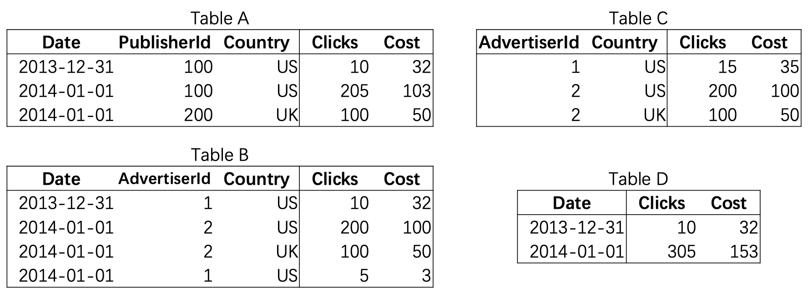

# 楔子

OLAP 名为联机分析处理，又可以称之为多维分析处理，是由关系型数据之父于 1993 年提出的概念。顾名思义，它指的是通过多种不同的维度审视数据，进行深层次分析。

维度可以看成是观察数据的一种视角，例如人类能看到的世界是三维的，它包含长、宽、高三个维度。直接一点理解，维度就好比是一张数据表的字段，而多维分析则是基于这些字段进行聚合查询。

数据仓库的数据模型通常是关系型的，因为 SQL 通常很适合分析查询。有许多图形数据分析工具可以生成 SQL 查询，可视化结果，并允许分析人员探索数据（通过下钻、切片和切块等操作）。

表面上，一个数据仓库和一个关系型 OLTP 数据库看起来很相似，因为它们都有一个 SQL 查询接口。然而，系统的内部看起来可能完全不同，因为它们针对非常不同的查询模式进行了优化。现在许多数据库供应商都只是重点支持事务处理负载和分析工作负载这两者中的一个，而不是都支持。


数据仓库本质是从数据库衍生出来的，所以数据仓库的建模也是不断衍生发展的。

从最早的借鉴数据库的范式建模，到逐渐提出维度建模，Data Vault模型，Anchor模型等等，越往后建模的要求越高，越需满足3NF，4NF等。

但是对于数据仓库来说，目前主流还是维度建模，会夹杂着范式建模。


## 数据库业务类型


## OLTP

OLTP 或联机事务处理是一种数据处理类型，包括执行多个并发的事务，例如网上银行、购物、订单输入或发送文本消息。这些事务传统上被称为经济或财务事务，会被记录并加以保护，帮助企业随时访问这些信息，以用于会计或报告目的。

传统关系数据库：传统的关系型数据库的主要应用是基本的、日常的事务处理（OLTP），例如电商等。

OLTP系统通常面向最终海量用户，这意味着系统可能会收到海量请求。为了处理负载，应用程序在每个查询中通常只访问少量的记录。

应用程序使用某种键来请求记录，存储引擎使用索引来查找所请求的键的数据。硬盘查找时间往往是这里的瓶颈。

数据库(Database)的业务特点是：

- 相对复杂的表格结构，存储结构相对紧致，少冗余数据。
- 读和写都有优化。
- 相对简单的read/write query，单次作用于相对的少量数据。


https://www.cnblogs.com/liujiaqi1101/p/17590632.html

## OLAP

OLAP，英文全称为On-Line Analysis Processing，中文名称为联机分析处理，也称为在线分析处理。

数据仓库：数据仓库系统的主要应用主要是OLAP（On-Line Analytical Processing），支持复杂的分析操作，侧重决策支持，并且提供直观易懂的查询结果。

- 相对简单的(Denormalized)表格结构，存储结构相对松散，多冗余数据。
- 一般只是读优化。
- 相对复杂的read query，单次作用于相对大量的数据（历史数据）。

数据仓库和类似的分析决策系统会少见一些，因为它们主要由企业数据分析人员对数据分析成结果，供企业决策者使用，而不是最终用户。

它们的并发量要比OLTP系统少得多，但通常每个查询开销高昂，需要在短时间内扫描数百万条记录。硬盘带宽（而不是查找时间）往往是瓶颈，列式存储是针对这种工作负载的日益流行的解决方案。


| 比较项       | 操作型（OLTP）       | 分析性（OLAP）               |
| ------------ | -------------------- | ---------------------------- |
| **关注**     | 细节                 | 综合或提炼                   |
| **模型**     | 实体 – 关系（E-R）   | 星型或雪花                   |
| **操作**     | 可更新               | 只读，只追加                 |
| **操作粒度** | 操作一个单元         | 操作一个集合                 |
| **场景**     | 面向事务             | 面向分析                     |
| **数据量**   | 小                   | 大                           |
| **需求**     | 日常操作             | 决策需求                     |
| **业务方向** | 客户信息、订单等查询 | 客户登录间隔时间，市场细分等 |


## 数仓

[参考](https://www.oracle.com/cn/database/what-is-a-data-warehouse/)

数据仓库，英文名称为`Data Warehouse`，可简写为DW或DWH。数据仓库，是为企业所有级别的决策制定过程，提供所有类型数据支持的战略集合。

它出于**分析性报告**和**决策支持目的**而创建。为需要业务智能的企业，提供指导业务流程改进、监视时间、成本、质量以及控制。

数据仓库之父比尔恩门对数仓的定义如下:

> 数据仓库（data warehouse）是一个面向主题的（subject oriented）、集成的（integrate）、相对稳定的（non-volatile）、反映历史变化（time variant）的数据集合，用于支持管理决策。

对于数据仓库的概念我们可以从两个层次予以理解：
- 首先，数据仓库用于**支持决策**，**面向分析型数据处理**，它不同于企业现有的操作型数据库；
- 其次，数据仓库是对多个异构的数据源有效集成，集成后按照主题进行了重组，并包含历史数据，而且存放在数据仓库中的数据一般不再修改。


**数据仓库的特点**

根据数据仓库概念的含义，数据仓库拥有以下四个特点：

**1、面向主题**
操作型数据库的数据组织**面向应用**事务处理任务，各个业务系统之间各自分离，而数据仓库中的数据是按照一定的主题域进行组织。
主题是一个抽象的概念，是较高层次上企业信息系统中的数据综合、归类并进行分析利用的抽象。是指用户使用数据仓库进行决策时所关心的重点方面，一个主题通常与多个操作型业务信息系统相关。在逻辑意义上，它是对应企业中某一宏观分析领域所涉及的分析对象。

**2、集成的**
面向事务处理的操作型数据库通常与某些特定的应用相关，数据库之间相互独立，并且往往是异构的。
而数据仓库中的数据是在对原有分散的数据库数据抽取、清理的基础上经过系统加工、汇总和整理得到的，必须消除源数据中的不一致性，以保证数据仓库内的信息是关于整个企业的一致的全局信息。

通过对分散、独立、异构的数据库数据进行抽取、清理、转换和汇总便得到了数据仓库的数据，这样保证了数据仓库内的数据关于整个企业的一致性。

数据仓库中的综合数据不能从原有的数据库系统直接得到。因此在数据进入数据仓库之前，必然要经过统一与综合，这一步是数据仓库建设中最关键、最复杂的一步，所要完成的工作有：

- 要统一源数据中所有矛盾之处，如字段的同名异义、异名同义、单位不统一、字长不一致，等等。
- 进行数据综合和计算。数据仓库中的数据综合工作可以在从原有数据库抽取数据时生成，但许多是在数据仓库内部生成的，即进入数据仓库以后进行综合生成的。


**3、相对稳定的**
操作型数据库中的数据通常实时更新，数据根据需要及时发生变化。
数据仓库的数据主要供企业决策分析之用，所涉及的数据操作主要是数据查询，一旦某个数据进入数据仓库以后，一般情况下将被长期保留。
也就是数据仓库中一般有大量的查询操作，但修改和删除操作很少，通常只需要定期的加载、刷新。

**4、反映历史变化**
操作型数据库主要关心当前某一个时间段内的数据，而数据仓库中的数据通常包含历史信息，系统记录了企业从过去某一时点(如开始应用数据仓库的时点)到目前的各个阶段的信息。
通过这些信息，可以对企业的发展历程和未来趋势做出定量分析和预测。


企业数据仓库的建设，是以现有企业业务系统和大量业务数据的积累为基础。

==数据仓库不是静态的概念，只有把信息及时交给需要这些信息的使用者，供他们做出改善其业务经营的决策，信息才能发挥作用，信息才有意义。而把信息加以整理归纳和重组，并及时提供给相应的管理决策人员，是数据仓库的根本任务。==

因此，从产业界的角度看，数据仓库建设是一个工程，是一个过程。数据库是依照某种数据模型组织起来并存放二级存储器中的数据集合。

这种数据集合具有如下特点：尽可能不重复，以最优方式为某个特定组织的多种应用服务，其数据结构独立于使用它的应用程序，对数据的增、删、改和检索由统一软件进行管理和控制。


从发展的历史看，数据库是数据管理的高级阶段，它是由文件管理系统发展起来的。

==数据库 Database (Oracle，MySQL，PostgreSQL)主要用于事务处理，数据仓库 Datawarehouse (Amazon Redshift，Hive)主要用于数据分析。==


基本每家电商公司都会经历，从只需要业务数据库到要数据仓库的阶段。

第一阶段，电商早期启动非常容易，入行门槛低。找个外包团队，做了一个可以下单的网页前端 + 几台服务器 + 一个MySQL，就能开门迎客了。这好比手工作坊时期。

第二阶段，流量来了，客户和订单都多起来了，普通查询已经有压力了，这个时候就需要升级架构变成多台服务器和多个业务数据库（量大+分库分表）。
这个阶段的业务数字和指标还可以勉强从业务数据库里查询。初步进入工业化。

第三个阶段，一般需要 3-5 年左右的时间，随着业务指数级的增长，数据量的会陡增，公司角色也开始多了起来，开始有了 CEO、CMO、CIO。大家需要面临的问题越来越复杂，越来越深入。高管们关心的问题，从最初非常粗放的："昨天的收入是多少"、"上个月的 PV、UV 是多少"。
逐渐演化到非常精细化和具体的用户的集群分析，特定用户在某种使用场景中。
例如"20~30岁女性用户在过去五年的第一季度化妆品类商品的购买行为与公司进行的促销活动方案之间的关系"。


这类非常具体，且能够对公司决策起到关键性作用的问题，基本很难从业务数据库从调取出来。原因在于：

- 业务数据库中的数据结构是为了完成交易而设计的，不是为了而查询和分析的便利设计的。
- 业务数据库大多是读写优化的，即又要读（查看商品信息），也要写（产生订单，完成支付）。因此对于大量数据的读（查询指标，一般是复杂的只读类型查询）是支持不足的。

而怎么解决这个问题，此时我们就需要建立一个数据仓库了，公司也算开始进入信息化阶段了。数据仓库的作用在于：

- 数据结构为了分析和查询的便利；
- 只读优化的数据库，即不需要它写入速度多么快，只要做大量数据的复杂查询的速度足够快就行了。

那么在这里前一种业务数据库（读写都优化）的是业务性数据库，后一种是分析性数据库，即数据仓库。

- 数据库比较流行的技术栈有：MySQL，Oracle， SQLServer 等
- 数据仓库比较流行的技术栈有：AWS Redshift，Greenplum，Hive等

这样把数据从业务性的数据库中提取、加工、导入分析性的数据库就是传统的 ETL 工作。


抽取-转换-加载（Extract-Transform-Load）系统是数据仓库的基础。

一个设计良好的ETL系统从源系统抽取数据，执行数据质量和一致性标准，然后规格化数据，从而使分散的源数据可以集中在一起使用，最终再以可以展现的格式提交数据，以便应用开发者可以创建应用系统，也使最终用户可以制定决策。


### 数据仓库发展历程

数据仓库的发展大致经历了这样的三个过程：

 1. 简单报表阶段：这个阶段，系统的主要目标是解决一些日常的工作中业务人员需要的报表，以及生成一些简单的能够帮助领导进行决策所需要的汇总数据。这个阶段的大部分表现形式为数据库和前端报表工具。

 2. 数据集市阶段：这个阶段，主要是根据某个业务部门的需要，进行一定的数据的采集，整理，按照业务人员的需要，进行多维报表的展现，能够提供对特定业务指导的数据，并且能够提供特定的领导决策数据。

 3. 数据仓库阶段：这个阶段，主要是按照一定的数据模型，对整个企业的数据进行采集，整理，并且能够按照各个业务部门的需要，提供跨部门的，完全一致的业务报表数据，能够通过数据仓库生成对对业务具有指导性的数据，同时，为领导决策提供全面的数据支持。

通过数据仓库建设的发展阶段，我们能够看出，数据仓库的建设和数据集市的建设的重要区别就在于数据模型的支持。

因此，数据模型的建设，对于我们数据仓库的建设，有着决定性的意义。


## 多维分析

OLAP 名为联机分析处理，又可以称之为 **多维分析** 处理，是由关系型数据之父于 1993 年提出的概念。顾名思义，它指的是通过多种不同的维度审视数据，进行深层次分析。


### 维度和指标


以往我们是从用户流程、组织层级等视角理解我们的业务，但是不妨从数据逻辑视角试试：

==数据是在哪个主体上，在什么场景下，以什么样的方式被生产和记录的？数据是怎么被加工和呈现的？为什么需要这么呈现？这个指标如果跌了，对业务有指向意义吗？==

当你问这些问题的时候，你会发现你不仅要知道产品的设计逻辑、各个模块的功能点，还要知道它们的耦合和组织方式。这些都会驱动你去问同事、查wiki、自己上手体验。相信我，这样全套流程走下来，你对业务和产品一定会有更深入的理解。


==维度一般指事物现象的某种特征。从某种角度出发的度量统计，角度即为维度。可以看成是观察数据的一种视角，例如人类能看到的世界是三维的，它包含长、宽、高三个维度。直接一点理解，维度就好比是一张数据表的字段，而多维分析则是基于这些字段进行聚合查询。“维度”是指数据的属性。以 Google Analytics 举例来说，“城市”维度表示的是用户发起WEB访问会话的城市，例如“巴黎”或“纽约”。“网页”维度表示的是用户浏览过的网页的网址。==

==指标一般指可以量化的数据(量化衡量标准）是进行统计后的结果。“指标”是指量化衡量标准。“会话数”指标是指总会话次数。“每次会话浏览页数”指标是指每次会话的平均网页浏览量。==


例如，下表显示的是一个维度（“城市”）和两个指标（“会话数”和“每次会话浏览页数”）。

| 维度     | 指标       | 指标                 |
| :------- | :--------- | :------------------- |
| **城市** | **会话数** | **每次会话浏览页数** |
| 旧金山   | 5,000      | 3.74                 |
| 柏林     | 4,000      | 4.55                 |


指标用于衡量事物发展程度，维度用于对指标多方面的进行对比，找趋势等等。


维度的四个作用：


- 筛选：我们一般通过维度来筛选所观察的数据范围。

如果是定性的分类维度，那么通过枚举可以筛选，典型的定性维度如年份(时间维度)、省份(空间维度)等；如果是定量的维度，那么可以像指标一样，按照数值大小取一个范围即可，如身高。


- 聚合：通俗地来说，即我们希望在多大粒度上分析数据。

比如你要统计广告消耗，那么是在创意粒度上看，还是将创意粒度消耗数据加总，并上卷到计划粒度分析消耗呢？如果你之前写过SQL，那么肯定知道在对指标进行sum（求和）、avg（求平均）之后，要在脚本最后加入`GROUP BY XX`，也就是你希望聚合到的维度。但是需要注意的是，你在进行聚合的时候，一定要确认计算的指标，是可以在该维度上可分和可计算的，否则你算出来的数据肯定是错误的，这个会在后面会详述。


- 对比：==数据只有在对比的时候才有意义==

我们发现数据上涨、下跌、波动，是因为我们知道正常的数据应该是多少，超过这个范围的数据都是异常的，才会需要进一步比较和分析。我们在对比数据的时候，通常会选择某一个维度，然后在该维度下进行对比。不在同一个维度上，对比2个同样指标，在业务中没有任何意义。

假设我们要对比每一个机型的留存，必须是在同一个维度（机型）的下钻和比较，这通常称为横向对比。

另一种对比，则是以时间为维度的纵向对比。我们看DAU、留存这些指标，究竟是涨了还是跌了，通常都是观察一段时间的指标变化；环比、同比这些，则是基于不同时间窗口维度，对指标的二次加工和计算。


对于维度和指标的理解，一定要在具体业务场景下深入分析。并不是某些字段一定是维度，某些字段一定是指标；维度和指标的界定，一定要根据具体业务场景，以及在该业务场景下的数据生产逻辑。

多维分析是数据仓库系统下游常见的基础应用，底层数据是包含多种粒度汇总结果的Cube，用于提供上卷，下钻等操作的数据支持。


- 多维数据模型：为了满足用户从多角度多层次进行数据查询和分析的需要而建立起来的基于事实和维的数据库模型，其基本的应用是为了实现OLAP（Online Analytical Processing）
- 立方体：它是由维度构建出来的多维空间，包含了所要分析的基础数据，所有的聚合数据操作都在它上面进行。
- 维度（Dimensions）：观察数据的一种角度，比如在上图中address、item、time都可以被看作一个维度，直观上来看维度是一个立方体的轴，比如三个维度可以构成一个立方体的空间
- 维度成员：构成维度的基本单位，比如对于time维，包含Q1、Q2、Q3、Q4四个维度成员。
- 层次：维度的层次结构，它存在两种：自然层次和用户自定义层次。比如对于时间维，可以分为年、月、日三个层次，也可以分为年、季度、月三个层次。一个维可以有多个层次，它是单位数据聚集的一种路径
- 级别：级别组成层次，比如年、月、日分别是时间维的三个级别
- 度量：一个数值函数，可以对数据立方体空间中的每个点求值；度量值自然就是度量的结果
- 事实表：存放度量值得表，同时存放了维表得外键，所有分析所用得数据最终都来自事实表
- 维表：对于维度的描述，每个维度对应一个或多个维表，一个维度对应一个表的是星型模式，对应多个表的是雪花模式


### 数据立方体

数据立方体（Data Cube）是数据仓库技术中的一个核心概念，通常用于多维数据的分析和查询。数据立方体通常建立在数据仓库之上，通过ETL（抽取、转换、加载）过程从多个数据源提取数据。它通过在多个维度上组织数据，使得用户能够灵活地从不同的角度进行数据分析和挖掘。需要注意的是数据立方体只是多维模型的一个形象的说法。**立方体其本身只有三维，但多维模型不仅限于三维模型，可以组合更多的维度，但一方面是出于更方便地解释和描述，同时也是给思维成像和想象的空间；另一方面是为了与传统关系型数据库的二维表区别开来，于是就有了数据立方体的叫法。** 


数据仓库的数据模型通常是关系型的，因为`SQL`通常很适合分析查询。有许多图形数据分析工具可以生成`SQL`查询，可视化结果，并允许分析人员探索数据（通过下钻、切片和切块等操作）。在数据分析时，有一个概念叫 **钻取** ，分为 **上钻** 和 **下钻** ，其实就是逐层聚合。

实际上，有些维度（字段）本身还具备层次性。如`时间维`可由`年、季、月、日`构成，`地区`也可以由`国家、省份、市、区县`构成等。


维度有了层以后，就可以方便从同一维度的不同粒度（层次）来分析数据了。比如针对这张商品销售明细表

| 省   | 市   | 商品   | 时间 | 价格 |
| ---- | ---- | ------ | ---- | ---- |
| 湖北 | 武汉 | 足球   |      |      |
| 湖北 | 武汉 | 篮球   |      |      |
| 湖北 | 宜昌 | 篮球   |      |      |
| 广东 | 广州 | 乒乓球 |      |      |
| 广东 | 珠海 | 羽毛球 |      |      |
| 广东 | 珠海 | 羽毛球 |      |      |
| 广东 | 珠海 | 足球   |      |      |
| 广东 | 广州 | 足球   |      |      |


- **下钻（drill down）：下钻可以理解成增加维的层次，从而可以由粗粒度到细粒度来观察数据，比如对产品销售情况分析时，可以沿着时间维从年到月到日更细粒度的观察数据。**

    - 在这个例子，按照地区下钻查询(省——>市)：其实就是按照市分组聚合查询，查询每个市的总销售价格。


- **上钻(drill up)：可以理解成低层次向高层次汇聚。删掉维的某些层，由细粒度到粗粒度观察数据的操作或沿着维的层次向上聚合汇总数据。**

    - 在这个例子，按照地区下钻查询（市——>省）：其实就是按照省分组聚合查询，查询每个省的总销售价格。

- **切片(slice)：观察立方体的一层，将一个或多个温度设为单个固定的值，然后观察剩余的维度，例如将商品维度固定为 "足球"。**

    - 查看数据的时候，通常是不会所有维度都用到的。譬如，时间、地区、商品、销售部门，这几个维度，我们做报表分析时，可能只选了时间、地区，那此时，商品和部门维度会自动为默认成员（通常为ALL，或你自设的DEFAULT），如果我们选取部门维度这个树枝上的某一个节点，即维度成员，如销售一部，商品选一品类，如食品，就看销售一部的食品类的各时间、地区数据了，只有2个维度了，可以想象为一个平面了，这就是切片。

- **切块：和切片类似，只是将单个固定值变成多个固定值。例如将商品维度固定为"足球"、"篮球" 和 "乒乓球"。**

- **旋转：旋转立方体的一面，如果要将数据映射到一张二维表，那么就要进行旋转，等同于行列转换。**


因为上下层的关系，我们在数据聚合时就会涉及到不同层次的聚合，比如 `group by a` ; `group by a,b` ; `group by a,b,c`，而`group by`的每次执行都只能基于某一个层级的聚合。

因此，有没有可能一个`group by` 就把所有可能的组合都执行出来呢？显然`hive`确实提供了这样的功能，那就是`cube`，所谓的数据立方体了。

从宏观上看，数据本身就是多维立体的，当我们基于某个或者某几个维度聚合时，就相当于从某个方向抽取一个点或者一个面进行观察。


`PostgreSQL`除了支持基本的`GROUP BY`分组操作之外，还支持3种高级的分组选项：`GROUPING SETS`、`ROLLUP`以及`CUBE`

```SQL
-- 在一个 GROUP BY 子句中一次实现多个集合的分组。其结果等价于将多个相应 GROUP BY 子句进行 UNION ALL 操作。
SELECT k1, k2, SUM( k3 ) FROM t GROUP BY GROUPING SETS ( (k1, k2), (k1), (k2), ( ) );

SELECT k1, k2, SUM( k3 ) FROM t GROUP BY k1, k2
UNION ALL
SELECT k1, null, SUM( k3 ) FROM t GROUP BY k1
UNION ALL
SELECT null, k2, SUM( k3 ) FROM t GROUP BY k2
UNION ALL
SELECT null, null, SUM( k3 ) FROM t


-- ROLLUP 是对 GROUPING SETS 的扩展。

SELECT a, b,c, SUM( d ) FROM tab1 GROUP BY ROLLUP(a,b,c)

GROUPING SETS (
(a,b,c),
( a, b ),
( a),
( )
)
```


### 世界银行数据公开

世界银行公开数据（World Bank Open Data）收录了世界银行数据库的七千多个指标，用户可以按国家、指标、专题和数据目录进行数据浏览，其中数百个数据可上溯50年。

该数据库可以按以下方式浏览数据：

- 按国家浏览数据：数据包括人口数量在3万人以上的经济体以及更小的经济体（均为世界银行的成员体）。从国家列表中选择一个国家，浏览该国的基本信息、所属地区、所属收入组别、国民生产总值和人口数量等数据。

- 按专题浏览数据：列出一系列经济发展专题。选择其中一个专题，浏览该专题的简要介绍、与之相关的指标、地区总量和主要数据的视图。

- 按指标浏览数据：从所列目录中选择一项指标，浏览该指标的详细说明和200多个国家的指标数据。可以在表格或地图中浏览数据或以多种格式下载，还可以借助搜索功能获得数据。

- 按数据目录浏览数据：数据目录按照专业数据、地区和全球专题等进行分类。每个条目包括数据描述、覆盖范围、更新周期、来源和数据注释。


#### 经济数据

> The World Development Indicators (WDI) is the primary World Bank collection of development indicators, compiled from officially-recognized international sources. It presents the most current and accurate global development data available, and includes national, regional and global estimates.


The  World Development Indicators (WDI)数据库是世界银行（World  Bank）发布的一套全球性开放数据集，它包含了各种国家和地区的经济、社会、环境等方面的数据指标。国内外众多科研人员利用WDI数据库来进行跨领域的研究和分析，为国家的发展、政策制定以及可持续发展做出贡献。今天为大家整理出WDI数据库超长时间段数据，供读者进行科研使用。

WDI数据库包含多领域指标，广泛运用于各个科研领域。已有研究采取WDI数据库进行研究表明，收入分配的库兹涅茨倒  U 曲线揭示了人类社会现代化进程中收入分配演变的一般趋势，只要在现代化进程中继续加快结构转变和制度完善，收入差距有望逐渐缩小（邵红伟  等，2016）。中国长期经济增长的均衡等式,发现经济改革和人力资本均对中国经济的长期增长起着显著的积极作用,而且特别地,经济改革的作用更为显著和强劲（田艳平，2014）。税制结构与收入不平等显著相关,在控制了其他因素之后，流转税占财政收入的比重越高,该国的收入越不平等，并就我国税制改革提出了相关政策建议（刘华  等，2012）。瓦格纳法则成立的主要原因是社会保护支出与经济发展之间的正向关系（戚昌厚  等，2020）。相关成果发表在《中国工业经济》、《宏观经济研究》、《中国软科学》、《经济理论与经济管理》等顶刊上。

鉴于此，为大家整理发布了1960-2022年WDI数据库，内含经济、社会、环境等数据指标，供大家使用。


本文数据来源为世界银行公开数据中的 GDP（现价美元）和人口总数。为了方便使用，我们将数据转换成了 SQL 脚本，摘取了全球 217 个国家和地区 2010-2018 年的 GDP 数据（按照现价美元进行换算）以及相应的人口数据。


```

"SL.UEM.TOTL",          # 失业人数 Number of people unemployed
"SL.UEM.TOTL.ZS",       # 失业率 Unemployed (%) (modeled ILO estimate)
"SL.UEM.TOTL.NE.ZS",    # 失业率 Unemployed (%) national estimate

"NY.GDP.PCAP.KD.ZG",    # 人均 GDP 增速
"NY.GDP.MKTP.CD",       # GDP总量, GDP（现价美元）
"NY.GDP.MKTP.KD.ZG",    # GDP 增速

"FP.CPI.TOTL",          # 消费价格指数（以 2010 年为对比基数 100）
"FP.CPI.TOTL.ZG",       # 通货膨胀率
"SI.POV.GINI",          # Gini 指数

"SP.DYN.LE00.IN",       # 预期寿命
"NY.GDP.PCAP.CD",       # 人均 GDP
"SP.POP.TOTL"           # 人口总数


```


[gdpdata.sql](./01.OLAP概述.assets/gdpdata.sql)


```shell
su - postgres
cd /data/postgres/14.4/bin/
psql  -h localhost -p 54321 -U postgres -w password -d postgres

# 导入数据
\i /data/PGAdvanceSQL/src/main/source/gdpdata.sql


postgres=# \dt
            List of relations
 Schema |          Name          | Type  |  Owner   
--------+------------------------+-------+----------
 public | country_gdp_year       | table | postgres
 public | country_gdp_year_final | table | postgres
 public | metadata_country       | table | postgres

# 作者的一些原始数据中，有些GDP为0可能不准。注意甄别

# country_gdp_year(国家名称，国家代码，指标名称，指标代码，年份，GPD数值)
postgres=# select * from country_gdp_year limit 3;
 country_name | country_code | indicator_name  | indicator_code | year | gdp 
--------------+--------------+-----------------+----------------+------+-----
 阿鲁巴       | ABW          | GDP（现价美元） | NY.GDP.MKTP.CD | 1960 |   0
 阿鲁巴       | ABW          | GDP（现价美元） | NY.GDP.MKTP.CD | 1961 |   0
 阿鲁巴       | ABW          | GDP（现价美元） | NY.GDP.MKTP.CD | 1962 |   0
postgres=# 

# country_gdp_year_final(国家代码，国家名称，收入分类，所属地区，年份，GDP值)
postgres=# select * from country_gdp_year_final limit 3;
 country_code | country_name | income_group |   region   | year |       gdp        
--------------+--------------+--------------+------------+------+------------------
 AFG          | 阿富汗       | Low income   | South Asia | 2018 |                0
 AFG          | 阿富汗       | Low income   | South Asia | 2017 | 19543976895.4248
 AFG          | 阿富汗       | Low income   | South Asia | 2016 | 19046357714.4928

# metadata_country(国家代码，地区，收入分类)
postgres=# select * from metadata_country  limit 3;
 country_code |        region         |    income_group     
--------------+-----------------------+---------------------
 AFG          | South Asia            | Low income
 AGO          | Sub-Saharan Africa    | Lower middle income
 ALB          | Europe & Central Asia | Upper middle income
(3 rows)

postgres=# 
```


```SQL

-- 世界各个大洲(区域)2017年的GDP平均值：对于2017年的GPD，按洲分组，求各洲平均值
-- 2017年世界GDP均值最高地区是：北美洲，GDP最低地区是：撒哈拉以南非洲
SELECT
    region,
    round(AVG(gdp),0) 
FROM
    country_gdp_year_final
WHERE
    YEAR = '2017'
GROUP BY
    region
ORDER BY
    2 DESC;

-- 如果我们想要上面的报表带有全世界各国GDP平均值，下面这种SQL其实嵌套了这么多层，很长并且可读性很差
(SELECT region, round(AVG(gdp),0) FROM country_gdp_year_final WHERE  YEAR = '2017' GROUP BY  region ORDER BY 2 DESC)

UNION ALL

SELECT NULL AS
    region,
    sumCount
FROM ( SELECT round(SUM(gdp)/COUNT(1),0) AS sumCount FROM country_gdp_year_final WHERE YEAR = '2017') p;


-- 这种SQL其实嵌套了这么多层，很长并且可读性很差，其实PG里面自带这种分组并且带有分组平均值的SQL
SELECT
    region,
    round( AVG ( gdp ), 0 ) AS sumCount
FROM
    country_gdp_year_final
WHERE
    YEAR = '2017'
GROUP BY
    ROLLUP ( region )
ORDER BY
    2 DESC;

-- group by rollup(column) 除了计算column字段分组下的聚合结果以外，还会计算整体的聚合结果。本例就是计算世界2017年GDP所有国平均值(这些国家有着一个共同的region叫做：世界)，无需运行俩个查询

-- GROUP BY 子句加上 ROLLUP 选项时，首先按照分组字段进行分组汇总。然后从右至左依次去掉一个分组字段再进行分组汇总，被去掉的字段显示为空；
-- 最后，将所有的数据进行一次汇总，所有的分组字段都显示为空。


-- rollup也可以通过不止一列的方式来使用，比如计算中日德法美六国的1960-2018年年均GDP


```


## 数仓建模

现在许多数据库供应商都只是重点支持事务处理负载和分析工作负载这两者中的一个，而不是都支持。数据仓库本质是从数据库衍生出来的，所以数据仓库的建模也是不断衍生发展的。

从最早的借鉴数据库的范式建模，到逐渐提出维度建模，Data Vault模型，Anchor模型等等，越往后建模的要求越高。

但是对于数据仓库来说，目前主流还是维度建模，会夹杂着范式建模。


数据建模

数据模型

进行全面的业务梳理时，我们可以通过业务模型，全面了解业务结构及运行情况，按照业务特定的规律分门别类和程序化，改进业务的流程。

通过模型的建设，我们可以很清晰的看到数据之间内在的关联关系，从而建立起全方位的数据视角，并消灭信息孤岛和数据差异化的问题，进而保证数据的一致性。

模型可以很好的帮助我们分离出底层技术的实现和上层业务的展现，当上层业务发生变化时，通过数据模型，底层的技术实现可以适应的了**业务的变动**，进而解决数据库的灵活性。

在模型中可以很好的看出开发人员和业务人员之间的**系统建设范围**的界定，及未来的规划。


数据建模过程

- 业务模型：业务分解和程序化，确定好业务的边界及业务流程，如订单、支付都是一个单独的业务模块

- 领域模型：业务概念的抽象、分组，整理分组之间的关联，比如用户购物的业务，抽成一个更大的模型，这个模型一般相对于行业。

- 辑建模：领域模型中的业务概念实体化，并考虑实体的具体属性及实体与实体之间的关系，比如订单（订单号、付款人…）和支付（金额、支付时间…）的关系。

- 物理模型：解决实际应用的落地开发、上线等问题，及性能等一些具体的技术问题。

在数据仓库领域，有两位大师，一位是“数据仓库”之父 Bill Inmon，一位是数据仓库权威专家 Ralph Kimball，两位大师每人都有一本经典著作。
Inmon 大师著作《数据仓库》及 Kimball 大师的《数仓工具箱》，两本书也代表了两种不同的数仓建设模式，这两种架构模式支撑了数据仓库以及商业智能近二十年的发展。


逻辑建模

###  范式建模

范式建模是数仓之父 Inmon 所倡导的，"数据仓库"这个词就是这位大师所定义的，主要解决关系型数据库的数据存储，利用的一种技术层面上的方法。目前，我们在关系型数据库中的建模方法，大部分采用的是三范式建模法。

这种建模方式在范式理论上符合 3NF，这里的 3NF 与 OLTP 中的 3NF 还是有点区别的：

关系数据库中的`3NF`是针对具体的业务流程的实体对象关系抽象，而数据仓库的`3NF`是站在企业角度面向主题的抽象。

根据 Inmon 的观点，数据仓库模型的建设方法和业务系统的企业数据模型类似。

在业务系统中，企业数据模型决定了数据的来源，而企业数据模型也分为两个层次，即主题域模型和逻辑模型。

同样，主题域模型可以看成是业务模型的概念模型，而逻辑模型则是域模型在关系型数据库上的实例化。


Inmon 模型从流程上看是自上而下的，自上而下指的是数据的流向，“上”即数据的上游，“下”即数据的下游，即从分散异构的数据源 -> 数据仓库 -> 数据集市。

以数据源头为导向，然后一步步探索获取尽量符合预期的数据，因为数据源往往是异构的，所以会更加强调数据的清洗工作，将数据抽取为实体-关系模型，并不强调事实表和维度表的概念。


### 维度建模

Kimball 模型从流程上看是自下而上的，即从数据集市-> 数据仓库 -> 分散异构的数据源。Kimball 是以最终任务为导向，将数据按照目标拆分出不同的表需求，数据会抽取为事实-维度模型。

数据源经 ETL 转化为事实表和维度表导入数据集市，以星型模型或雪花模型等方式构建维度数据仓库，架构体系中，数据集市与数据仓库是紧密结合的，数据集市是数据仓库中一个逻辑上的主题域。

维度建模是专门应用于分析型数据库、数据仓库、数据集市建模的方法。数据集市可以理解为是一种"小型数据仓库"。


#### 星型模型
根据应用程序的需要，在事务处理领域中使用了大量不同的数据模型。另一方面，在分析型业务中，数据模型的多样性则少得多。许多数据仓库都以相当公式化的方式使用，被称为星型模式
“星型模式” 这个名字来源于这样一个事实，即当我们对表之间的关系进行可视化时，事实表在中间，被维度表包围；与这些表的连接就像星星的光芒。


#### 雪花模型
这个模板的变体被称为雪花模式，其中维度被进一步分解为子维度。例如，品牌和产品类别可能有单独的表格，并且 dim_product 表格中的每一行都可以将品牌和类别作为外键引用，而不是将它们作为字符串存储在 dim_product 表格中。雪花模式比星形模式更规范化，但是星形模式通常是首选，因为分析师使用它更简单。


在典型的数据仓库中，表格通常非常宽：事实表通常有 100 列以上，有时甚至有数百列。维度表也可以是非常宽的，因为它们包括了所有可能与分析相关的元数据 —— 例如，dim_store 表可以包括在每个商店提供哪些服务的细节，它是否具有店内面包房，店面面积，商店第一次开张的日期，最近一次改造的时间，离最近的高速公路的距离等等。


维度和指标（度量）

维度和指标是数据分析领域常用的概念，亦是在设计数据仓库过程中需要考虑的。
维度就是数据的观察角度，即从哪个角度去分析问题，看待问题。

指标，即度量，就是从维度的基础上去衡算这个结果的值。

维度一般是一个离散的值，比如时间维度上每一个独立的日期或地域，因此统计时，可以把维度相同记录的聚合在一起，应用聚合函数做累加、均值、最大值、最小值等聚合计算。

指标就是被聚合的通计算，即聚合运算的结果，一般是一个连续的值。
比如我们可以从银行的存款额和企业的贷款额之间的计算，推算出目前的市场状况是如何，如果企业的贷款额高，银行的存款额也高，说明人们不愿意消费了，都把钱存起来，企业产品卖不出去，要发工资，那么自然要贷款了，这只是一个例子，具体还需要结合很多数据做分析。

**事实表和维度表**

事实表和维度表是在设计数据仓库过程中需要考虑的。

事实表是指存储有事实记录的表，如系统的日志、销售记录、用户访问日志等信息，事实表的记录是动态的增长的，所以体积是大于维度表。
用户访问日志（事实表）:（用户名 、URL 、 时 间 … ）

维度表也称为查找表，是与事实表相对应的表，这个表保存了维度的属性值，可以跟事实表做关联，相当于是将事实表中经常重复的数据抽取、规范出来用一张表管理，常见的有日期（日、周、月、季度等属性）、地区表等，所以维度表的变化通常不会太大。

维度表的存在缩小了事实表的大小，便于维度的管理和CURD维度的属性，不必对事实表的大量记录进行改动，并且可以给多个事实表重用。

省份表（维度表）： （北京市 、 广东省 、 上海市 …） 


维度列：用户信息

指标列：用户行为


## 数仓建模


## 数仓分层

数仓在建设过程中，对数据的组织管理上，不仅要根据业务进行纵向的主题域划分，还需要横向的数仓分层规范。

为了解决我们可能面临的问题，我们需要一套有效的数据组织、管理和处理方法，使我们的数据系统更加有序，这就是数据分层。数据分层的好处：

- 清晰的数据结构：每个数据层都有自己的角色和责任，更易于使用、维护和理解
- 复杂问题简化：将复杂任务分解为多个步骤，每一层只解决特定问题
- 统一的数据口径：通过数据分层提供统一的数据出口和统一的输出口径
- 减少重复：正式化数据分层并开发通用的中间层可以大大减少重复


## 即席查询

即席查询，又称为随机查询，是一种在数据库或数据仓库中快速构建和执行临时查询的方法。

它允许用户根据自己的需求，随时创建和运行查询，无需预先定义查询语句或编写复杂的脚本。即席查询通常用于探索性数据分析，帮助用户快速了解数据的特征和规律。

- 灵活性：用户可以根据自己的需求随时构建和执行查询，无需预先定义查询语句。 
- 实时性：即席查询可以实时地获取数据，帮助用户及时了解数据的最新状态。
- 交互性：用户可以通过交互式界面与查询结果进行交互，进一步挖掘数据中的信息。 


## 预聚合数据模型

Mesa 项目是 `Google` 大概在2014年发表的论文，实现全球复制以及高度可扩展的分析型数据仓库系统。


**业务背景**

在 `Google` 内部，`Mesa` 主要解决 `Google` 在线广告报表和分析业务，拥有准实时的数据更新能力和低延迟的数据查询性能。

广告业务的特点是其数据量特别大，每次广告的展示、点击都会产生一条数据，存储这些原始数据不但会消耗大量的存储资源，也会给实时计算聚合结果（比如 "某个广告主截止目前已经消费了多少预算"）带来很大困难。

在大数据分析场景中，核心业务是 **经常需要对海量数据进行复杂的聚合操作（如求和、计数、平均值等），这些操作可能涉及多维过滤、分组和排序**。

如果每次查询都需要对原始数据来重新 **实时计算，可能会导致查询延迟过高**。尤其是当数据规模达到 PB 级时。


Mesa 为了解决上面提到的两个问题，提出了一个预聚合的存储模型。Mesa 中的所有表都是预聚合表，以下图中的 Table A 为例：

  


其中竖线之前的 Date、PublisherId、Country 三列是 Key 列，表示聚合的维度，语义等同于 Group-By；竖线之后的 Clicks 和 Cost 列是 Value 列，表示被聚合的结果。例如第一行表示 `2013-12-31 这一天，ID 为 100 的 Publisher 在 US 一共发生了 10 次点击、价值 32 块钱`


上面的 Table A～D 其实表示的是同一批原始数据的在四个不同维度的聚合结果，供不同的业务查询使用。是不是有点像 MOLAP 或者说 Data Cube 的概念？

**本质上是一样的，都是用预先定义和计算聚合（简称 “预聚合”）来加速特定模式的查询。**


[参考](https://ericfu.me/from-mesa-to-doris/)

[参考](https://forum.mirrorship.cn/t/topic/13256)

## 物化视图

物化视图是一种预先计算并存储的数据库对象，它基于基础表的数据生成。它类似于普通视图，但普通视图只是逻辑定义（不存储数据），而 **物化视图会将查询结果实际存储在磁盘上，对于客户端(client)来说，物化视图就像是一个只读的表。这个表的数更新是根据基表的更新来维护的**


| 特性                 | 普通视图（View）                          | 物化视图（Materialized View）            |
|----------------------|-------------------------------------------|------------------------------------------|
| **数据存储**         | 不存储数据，仅保存查询定义                 | 存储查询结果的实际数据                   |
| **查询性能**         | 每次查询都需要重新计算                     | 直接从存储的数据中读取，性能更高          |
| **刷新机制**         | 动态计算，无需刷新                         | 需要定期或按需刷新以保持数据一致性       |
| **适用场景**         | 动态查询，灵活调整                        | 预计算结果，加速复杂查询                  |
| **存储开销**         | 无额外存储开销                             | 需要额外存储空间来保存查询结果           |
| **实时性**           | 实时反映基础表的变化                      | 可能存在延迟，取决于刷新频率              |
| **支持的功能**       | 不支持增量刷新、查询改写等                 | 支持增量刷新、查询改写等功能              |


物化视图维护(materialized view maintenance)

由于视图中的数据是从基表中查询出来的，所以一旦基表中的数据发生改变，视图就会过期，所以视图中的数据也要发生改变。保持视图物化一直在最新状态的过程称为**物化视图维护（或者叫数据刷新）**，物化视图维护的策略大概有几种：

- 每当数据变更时就进行视图物化（实时刷新）
- 周期性的进行视图物化（定期刷新）
- 当需要访问视图时才进行视图物化（延迟到需要查询时才来计算）


物化视图，跟预聚合数据模型其实很类似，其本质都是**将用户定义的查询提前计算好，按用户要求自动刷新视图中的数据**，其视图数据刷新的方式一般分为两种：**全量刷新**和**增量刷新**。

- **全量刷新**每次重新运行SQL，将算好的新数据全量覆盖旧数据。

- **增量刷新**通过特定算法，每次只计算自上次刷新以来发生变化的数据部分，然后定向更新物化视图中的部分数据。


显然，增量刷新这种方法显著减少了刷新开销，可以更高频地更新。特别适用于大规模数据集或频繁更新的场景。


全量刷新适用于T+1类的离线场景。常见的适用场景如下：

- 数据每天批量更新一次，或者小时级别更新一次，更适合全量刷新。这类SQL通常比较复杂，全量刷新对SQL语法没有任何约束。

- 在某些分钟级别延迟的场景中也可以使用全量刷新，往往这类SQL即使全量计算成本也不大，通常十几秒能完成，还可以达到一定的实时效果。

增量刷新适用于**实时场景**。常见的适用场景如下：

- 数据实时流入。

- 需要实时更新的报表或ETL。

- 对数据延迟要求高的秒级延迟需求。

根据物化视图的更新周期，StarRocks支持两种类型的物化视图：**同步物化视图** 和 **异步物化视图**


**增量更新的原理**：物化视图增量更新（IVM）的核心在于"增量"，仅处理自上次更新以来的数据变动，避免重新计算整个视图，显著降低计算和时间开销。通过捕获并计算增量数据，它能高效维护最新数据结果，在实时数据分析、报表生成和数据同步等场景中，成为提升查询性能、减少存储开销的不可或缺工具。


(1) 变更捕获
增量更新的核心在于捕获基础表中的变更数据。常见的方法包括：
- 事务日志解析 ：解析数据库的事务日志（如 Redo Log 或 Write-Ahead Log），提取新增、修改或删除的记录。
- 触发器 ：在基础表上定义触发器，将变更记录写入一个辅助表（Change Log Table）。
- 时间戳或版本号 ：通过时间戳或版本号标记记录的更新状态。

(2) 差异计算
根据捕获的变更数据，计算对物化视图的影响：
- 如果某条记录被插入到基础表中，则将其加入物化视图。
- 如果某条记录被修改，则更新物化视图中对应的聚合值。
- 如果某条记录被删除，则从物化视图中移除相应的结果。


(3) 更新物化视图
将计算出的差异应用到物化视图中，完成增量更新。


**物化视图查询改写和透明加速**

物化视图（Materialized View）的**查询改写**功能（Query Rewrite）

这是 Oracle 数据库的一项核心优化技术，允许数据库优化器在执行用户查询时，自动将查询重写为对物化视图的访问，从而避免对基础表进行实时计算。

优化器能够自动检测用户的查询，并尝试将其重写为对物化视图的访问。基本工作原理：**用户只需提交标准 SQL 查询，系统会自动选择最优的执行计划(优化器会分析用户的查询，并将其与现有的物化视图进行匹配。如果匹配成功，优化器会生成一个新的查询计划，将用户对原始基表的查询重写为对物化视图的访问)。这一过程对用户完全透明，以达到透明加速的效果**


```SQL

-- 原始表
CREATE TABLE sales (
    id INT,
    region VARCHAR(50),
    amount DECIMAL(10, 2)
);

-- 物化视图
CREATE MATERIALIZED VIEW mv_sales_summary
    BUILD IMMEDIATE
    REFRESH FAST ON COMMIT
E

NABLE QUERY REWRITE
AS
SELECT region, SUM(amount) AS total_sales
FROM sales
GROUP BY region;


-- 原始查询
SELECT region, SUM(amount) FROM sales GROUP BY region;

-- 优化器改写
SELECT region, total_sales FROM mv_sales_summary;
```


## 达梦物化视图

物化视图 (MATERIALIZED VIEW) 是目标表在特定时间点上的一个副本，**要占用额外的存储空间，即将查询出来的数据存储在数据库**中。当所依赖的一个或多个基表的数据发生更新，必须启用刷新机制才能保证数据是最新的。

物化视图可以用于数据复制（Data Replication），也可用于数据仓库缓存结果集以此来提升复杂查询的性能。


```SQL

SET SCHEMA DB_QHDATA_MACRO;

CREATE TABLE "DB_QHDATA_MACRO"."macro_index_data"
(
    "rid" INT IDENTITY(42481576, 1) NOT NULL,
    "index_code" VARCHAR(50) NOT NULL,
    "occur_period" INT,
    "occur_period_t" VARCHAR(20),
    "occur_period_year" INT,
    "occur_period_month" INT,
    "area_code" VARCHAR(32) NOT NULL,
    "dim_cal" VARCHAR(32),
    "dim_dur" VARCHAR(32),
    "dim_extra" VARCHAR(32),
    "index_value" DECIMAL(38,8),
    "unit_use" VARCHAR(50),
    "label" INT NOT NULL,
    "source_code" VARCHAR(100),
    "update_time" TIMESTAMP(0) DEFAULT CURRENT_TIMESTAMP(),
    "area_code_type" INT,
  NOT CLUSTER PRIMARY KEY("rid", "label")
) STORAGE(USING LONG ROW, ON "MAIN", CLUSTERBTR) ;

COMMENT ON COLUMN DB_QHDATA_MACRO.macro_index_data.index_code IS '指标名称';
COMMENT ON COLUMN DB_QHDATA_MACRO.macro_index_data.occur_period IS '数据期';
COMMENT ON COLUMN DB_QHDATA_MACRO.macro_index_data.occur_period_t IS 'tableau专用数据期';
COMMENT ON COLUMN DB_QHDATA_MACRO.macro_index_data.occur_period_year IS '年';
COMMENT ON COLUMN DB_QHDATA_MACRO.macro_index_data.occur_period_month IS '月';
COMMENT ON COLUMN DB_QHDATA_MACRO.macro_index_data.area_code IS '区划代码';
COMMENT ON COLUMN DB_QHDATA_MACRO.macro_index_data.dim_cal IS '计算类型';
COMMENT ON COLUMN DB_QHDATA_MACRO.macro_index_data.dim_dur IS '时间特征';
COMMENT ON COLUMN DB_QHDATA_MACRO.macro_index_data.dim_extra IS '其他维度';
COMMENT ON COLUMN DB_QHDATA_MACRO.macro_index_data.index_value IS '绝对值';
COMMENT ON COLUMN DB_QHDATA_MACRO.macro_index_data.unit_use IS '库中使用单位';
COMMENT ON COLUMN DB_QHDATA_MACRO.macro_index_data.label IS '数据属性（1代表官方公布宏观数据，2代表中观数据）';
COMMENT ON COLUMN DB_QHDATA_MACRO.macro_index_data.source_code IS '数据来源';
COMMENT ON COLUMN DB_QHDATA_MACRO.macro_index_data.update_time IS '更新时间';
COMMENT ON COLUMN DB_QHDATA_MACRO.macro_index_data.area_code_type IS '区划代码类型（1-行政区 2-关区 3-片区 4-园区）';

COMMENT ON TABLE DB_QHDATA_MACRO.macro_index_data IS '宏观指标数据表';


-- 如果对这个表经常进行这类查询
SELECT  
    OCCUR_PERIOD,SUM(index_value)
FROM DB_QHDATA_MACRO.macro_index_data 
WHERE  index_code=? AND dim_extra=?
GROUP BY OCCUR_PERIOD ORDER BY occur_period DESC


-- 创建物化视图 mv_macro_index_data_summary
CREATE MATERIALIZED VIEW mv_macro_index_data_summary
ENABLE QUERY REWRITE    -- 启用查询改写
REFRESH FAST ON COMMIT  -- 增量刷新
AS
SELECT  
    index_code,
    dim_extra,
    OCCUR_PERIOD,
    SUM(index_value) AS total_index_value
FROM DB_QHDATA_MACRO.macro_index_data
GROUP BY index_code, dim_extra, OCCUR_PERIOD
ORDER BY index_code, dim_extra, OCCUR_PERIOD DESC;

-- 在原始查询中，index_code 和 dim_extra 是动态参数（用 ? 表示）。为了支持任意组合的查询，物化视图需要包含所有可能的(index_code,dim_extra,OCCUR_PERIOD) 组合。在物化视图 mv_macro_index_data_summary，能够显著提升涉及 index_code 和 dim_extra 过滤条件的查询性能。预计算按照三个字段分组后的聚合数据


SELECT  
    OCCUR_PERIOD,SUM(index_value)
FROM DB_QHDATA_MACRO.macro_index_data 
WHERE    index_code='gmjj_gnmy_01' AND dim_extra='CITY_TARGET'
GROUP BY OCCUR_PERIOD ORDER BY occur_period DESC; 


-- 通常，单表查询基本用不上这种 MV，还不如直接针对一些关键字段添加索引来的高效，这个例子只是为了演示这种预计算的效果。

```


## 表函数

表函数，顾名思义，以表（tabled-value，多行数据集）为返回值的函数。与单行函数、聚合函数相比，它比较小众，以至于有很多多年从事数据开发的人员都闻所未闻。

