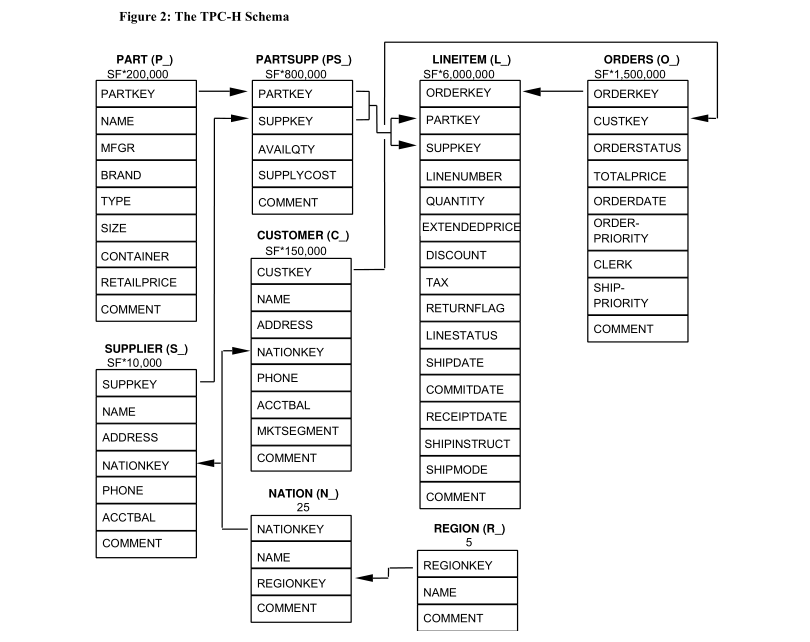
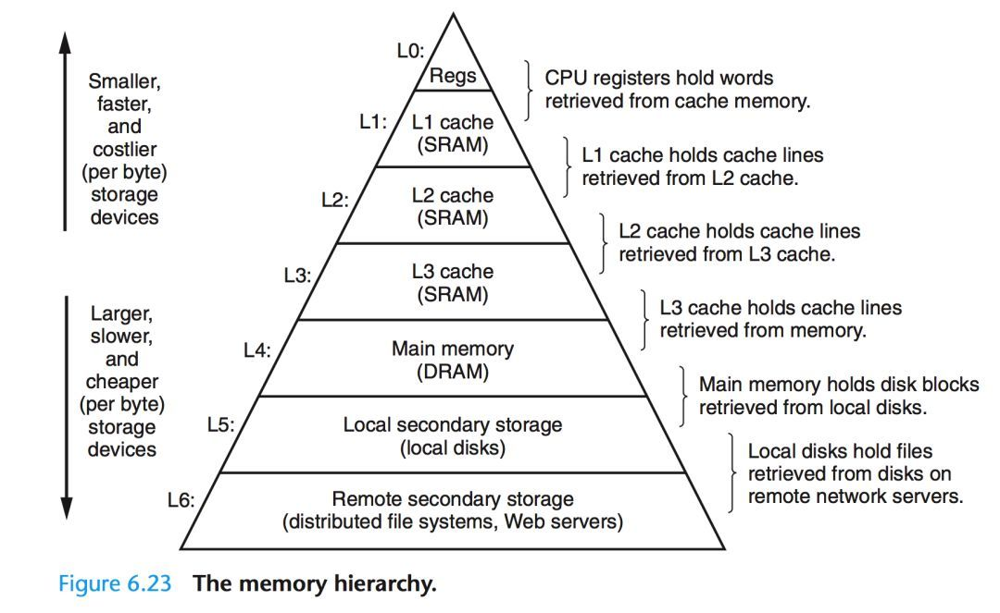

# 数据库调优概述

## 一、引言

在网上有很多文章介绍数据库优化知识，但是大部份文章只是对某个一个方面进行说明，而对于我们来说这种介绍并不能很好的掌握优化知识，因为很多介绍只是对一些特定的场景优化的，所以反而有时会产生误导或让人感觉不明白其中的奥妙而对数据库优化感觉很神秘。

很多人总是问如何学习数据库优化，有没有好的教材之类的问题。在书店也看到了许多数据库优化的专业书籍，但是感觉更多是面向DBA或者是PL/SQL开发方面的知识，个人感觉不太适合普通程序员。而要想做到数据库优化的高手，不是花几周，几个月就能达到的，这并不是因为数据库优化有多高深，而是因为要做好优化一方面需要有非常好的技术功底，对操作系统、存储硬件网络、数据库原理等方面有比较扎实的基础知识，另一方面是需要花大量时间对特定的数据库进行实践测试与总结。

作为一个程序员，我们也许不清楚线上正式的服务器硬件配置，我们不可能像DBA那样专业的对数据库进行各种实践测试与总结，但我们都应该非常了解我们SQL的业务逻辑，我们清楚SQL中访问表及字段的数据情况，我们其实只关心我们的SQL是否能尽快返回结果。那程序员如何利用已知的知识进行数据库优化？如何能快速定位SQL性能问题并找到正确的优化方向？


本文读者对像：

- 开发人员：如果你是做数据库开发，那本文的内容非常适合，因为本文是从程序员的角度来谈数据库性能优化。

- 架构师：如果你已经是数据库应用的架构师，那本文的知识你应该清楚90%，否则你可能是一个喜欢折腾的架构师。

- DBA（数据库管理员）：大型数据库优化的知识非常复杂，本文只是从程序员的角度来谈性能优化，DBA除了需要了解这些知识外，还需要深入数据库的内部体系架构来解决问题。


一个数据库系统，其硬件资源(CPU、Disk、SSD...)利用率是不是越高，说明系统调优的越好？

- 用户关注：响应时间(Latency) Query response time 

- 老板关注：资源有没有浪费？

- 调优关注：保证用户响应时间的基础上，最大限度提高资源利用率。


## 二、如何评级数据库负载情况？


**基准测试**

**基准测试-benchmarking** 是一种测量和评估软件性能指标的活动。
你可以在某个时候通过基准测试建立一个已知的性能水平（称为基准线），当系统的软硬件环境发生变化之后再进行一次基准测试以确定那些变化对性能的影响。
这是基准测试最常见的用途。其他用途包括测定某种负载水平下的性能极限、管理系统或环境的变化、发现可能导致性能问题的条件，等等。

`基准测试`的具体做法是：在系统上运行一系列测试程序并把性能计数器的结果保存起来。这些结构称为"性能指标"。
性能指标通常都保存或归档，并在系统环境的描述中进行注解。比如说，有经验的数据库专业人员会把基准测试的结果以及当时的系统配置和环境一起存入他们的档案。这可以让他们对系统过去和现在的性能表现进行对照比较，确认系统或环境的所有变化。

**基准测试工具和标准**

### TPC

**TPC简介**

事务处理性能委员会（ Transaction ProcessingPerformance Council ），是由数10家会员公司创建的非盈利组织，总部设在美国。该组织对全世界开放，但迄今为止，绝大多数会员都是美、日、西欧的大公司。

TPC的成员主要是计算机软硬件厂家，而非计算机用户，它的功能是制定商务应用基准程序（Benchmark）的标准规范、性能和价格度量，并管理测试结果的发布。

TPC-C用于测试数据库系统的事务处理能力，TPC-App用于测试7×24 环境下B2B的应用服务和Web服务的能力。

TPC 组织还发布过TPC-S（Server 专门测试基准程序）、TPC-E（大型企业信息服务测试基准程序）和TPC-Client/Server等测试标准，但这3个标准不被业界接受而被放弃。

TPC不给出基准程序的代码，而只给出基准程序的标准规范（Standard Specification）。任何厂家或其它测试者都可以根据规范，最优地构造出自己的系统（测试平台和测试程序）。（需要自己写测试工具，测试完之后提交给TPC协会）为保证测试结果的客观性，被测试者（通常是厂家）必须提交给TPC一套完整的报告（FullDisclosure Report），包括被测系统的详细配置、分类价格和包含五年维护费用在内的总价格。该报告必须由TPC授权的审核员核实（TPC本身并不做审计），现在全球只有不到十个审核员，全部在美国。（测试价格昂贵的原因）

**TPC目前推出的基准程序**

TPC推出过11套基准程序，分别是正在使用的TPC-App、TPC-H、TPC-C、TPC-W，过时的TPC-A、TPC-B、TPC-D和TPC-R，以及因为不被业界接受而放弃的TPC-S（Server专门测试基准程序）、TPC-E（大型企业信息服务测试基准程序）和TPC-Client/Server。这里重点介绍TPC-H。


#### TPC-H 

**TPC-H的目的**

TPC-H是一个决策支持基准（Decision Support Benchmark），由一套面向业务的临时查询（ad-hoc queries）和并发数据修改（concurrent data modifications）组成。选择的查询和填充数据库的数据具有广泛的行业相关性。该基准测试说明了决策支持系统可以检查大量数据，执行高度复杂的查询，并解答关键的业务问题。


TPC-H要目的是评价特定查询的决策支持能力，强调服务器在数据挖掘、分析处理方面的能力。查询是决策支持应用的最主要应用之一，数据仓库中的复杂查询可以分成两种类型：一种是预先知道的查询，如定期的业务报表；另一种则是事先未知的查询，称为动态查询（Ad- Hoc Query）。

通俗的讲，TPC-H就是当一家数据库开发商开发了一个新的数据库操作系统，采用TPC-H作为测试基准，来测试衡量数据库操作系统查询决策支持方面的能力。

**TPC-H的衡量指标**

它模拟决策支持系统中的数据库操作，测试数据库系统复杂查询的响应时间，以每小时执行的查询数(TPC-H QphH@Siz)作为度量指标。

**TPC-H标准规范**

TPC-H标准规范由10章正文和5个附录组成。详细内容见 https://www.tpc.org/TPC_Documents_Current_Versions/pdf/TPC-H_v3.0.1.pdf

**数据库运行的环境条件**

TPC-H测试模型为数据库服务器`连续7×24`小时工作，可能只有`1次/月`的维护；多用户并发执行复杂的动态查询，同时有并发执行表修改操作。

数据库模型共有8张表，除Nation和Region表外，其它表与测试的数据量有关，即比例因SF（Scale Factor）


TPC-H是业界常用的一套Benchmark，由TPC委员会制定发布，用于评测数据库的分析型查询能力。

**数据模型**

TPC-H查询包含8张数据表、22条复杂的SQL查询，大多数查询包含若干表Join、子查询和Group-by聚合等。

从MySQL官网搞了一份[ddl.sql](./ddl.sql)



**数据规模**

由于数据量的大小对查询速度有直接的影响，`TPC-H`标准对数据库系统中的数据量有严格、明确的规定。

用`SF`描述数据量，1SF对应1GB单位，SF由低到高依次是1、10、30、100、300、1000、3000、10000。需要强调，SF规定的数据量只是8个基本表的数据量，不包括索引和临时表。

从`TPC-H`测试全程来看，需要的数据存储空较大，一般包括有基本表、索引、临时表、数据文件和备份文件，基本表的大小为x；索引和临时空间的经验值为3-5位，取上限5x；DBGEN产生的数据文件的大小为x；备份文件大小为x；总计需要的存储空间为8x。就是说SF=1，需要准备8倍，即8GB存储空间，才能顺利地进行测试.

**查询语句**

 TPC-H测试围绕22个SELECT语句展开，每个`SELECT`严格定义，遵守SQL-92语法，并且不允许用户修改。标准中从4个方面定义每个`SELECT`语句，即商业问题、`SELECT`的语法、参数和查询确认。这些`SELECT`语句的复杂程度超过大多数实际的`OLTP`应用，一个`SELECT`执行时间少则几十秒，多则达15小时以上，22个查询语句执行一遍需数个小时。


Q1语句是查询lineItems的一个定价总结报告。在单个表lineitem上查询某个时间段内，对已经付款的、已经运送的等各类商品进行统计，包括业务量的计费、发货、折扣、税、平均价格等信息。

Q1语句的特点是：带有分组、排序、聚集操作并存的单表查询操作。这个查询会导致表上的数据有95%到97%行被读取到。

Q1的查询语句如下：

```SQL
SELECT 
    l_returnflag, -- 返回标志
    l_linestatus, 
    SUM(l_quantity) AS sum_qty, -- 总的数量
    SUM(l_extendedprice) AS sum_base_price, -- 聚集函数操作
    SUM(l_extendedprice * (1 - l_discount)) AS sum_disc_price, 
    SUM(l_extendedprice * (1 - l_discount) * (1 + l_tax)) AS sum_charge, 
    AVG(l_quantity) AS avg_qty, 
    AVG(l_extendedprice) AS avg_price, 
    AVG(l_discount) AS avg_disc, 
    COUNT(*) AS count_order -- 每个分组所包含的行数
FROM 
    lineitem
WHERE 
    l_shipdate <= date'1998-12-01' - interval '90' day -- 时间段是随机生成的
GROUP BY -- 分组操作
    l_returnflag, 
    l_linestatus
ORDER BY -- 排序操作
    l_returnflag, 
    l_linestatus;

```


#### TPC-C

TPC-C是业界常用的一套Benchmark，由TPC委员会制定发布，用于评测数据库的联机交易处理（偏向OLTP能力）。

[TPC-C](https://www.tpc.org/tpcc/)是TPC（事务处理性能委员会）推出的一系列性能测试标准中的一款，自1992年推出，便成为了数据库性能测试的标杆，各个数据库大厂都向TPC委员会提交了测试结果，以期在TPC-C测试的排行榜上拥有一席之地。就像决战紫禁之巅，论剑华山之巅，拥有一席之地的都是成名的大佬们。


主要涉及10张表，包含了NewOrder（新订单的生成）、Payment（订单付款）、OrderStatus（最近订单查询）、Delivery（配送）和StockLevel（库存缺货状态分析）等五类业务事务模型。

概括来讲，TPC-C是用来衡量在线事务处理的基准，TPC-C提供了一个[说明书](https://www.tpc.org/tpc_documents_current_versions/pdf/tpc-c_v5.11.0.pdf)，用来描述这个基准，在写这篇文章的时候，该说明书的版本是于2010年发布的5.11.0，可以通过访问TPC的网站来获取最新的说明书。

TPC-C模型是模拟一个商品批发公司的销售模型，这个模型涵盖了一个批发公司面向客户对一系列商品进行销售的过程，这包括管理订单，管理库存，管理账号收支等操作。这些操作涉及到仓库、商品、客户、订单等概念，围绕这些概念，构造了数据表格，以及相应的数据库操作。

TPC-C的批发操作在概念上包括5个操作，新订单操作、付款操作、订单状态操作、发货操作，库存操作，这些操作一起构成了完整的批发流程，其中新订单操作是用来衡量tpmC的核心，也就是数据库系统每分钟所能处理的交易数量。下面，我们将详细讲述TPCC的数据库设计与特点，以及各个操作的组成。

TPC-C使用tpmC值（Transactions per Minute）来衡量系统最大有效吞吐量（MQTh，Max Qualified Throughput），其中Transactions以NewOrder Transaction为准，即最终衡量单位为每分钟处理的新订单数。


#### 基准测试的性能指标

在衡量一个系统性能时，一定要有可量化的指标，无法量化就无法有效的优化系统性能。系统每秒可以承载多大请求量，每个请求的响应时间，并发数等都是衡量一个系统的关键性能指标。


**吞吐量-Throughput**

吞吐量指的是单位时间内的事务处理数。这一直是经典的数据库应用测试指标。（高并发系统必备）
在衡量系统性能一直作为一个经典和重要的指标，适用于多用户的交互式应用，比如Web服务器的多用户访问和数据库的多请求操作。

吞吐量常用的计量单位：

- 每秒事务数（TPS Transactions Per Second）

- 每秒查询数（QPS Query Per Second） ，每秒能够响应的查询次数。

比如，对于Web服务器，用户对某一个页面的一次请求，用户对某系统的一次登录，用户对商品的一次确认支付过程；
对于数据库，一次查询、修改、新增、删除。这些我们都可以看作一个事务或者请求。


**响应时间或延迟**

这个指标用于测试任务所需的整体时间。根据具体的应用，测试的时间单位可能是微秒，毫秒，秒，分钟。
根据不同的时间单位可以计算出平均响应时间，最小响应时间，最大响应时间和所占的百分比。
通常比较多使用的百分比响应时间，例如：95%的响应时间都是5毫秒，则表示任务在95%的时间段内都可以在5毫秒之内完成。
将响应时间绘制成折线图或散点图或直方图 ，可以直观地表现出数据结果集的分布情况。

查询响应时间(Query response time )是指MySQL执行查询所需的时间。同义词包括响应时间(response time)、查询时间(query time)、执行时间(execution time)，以及（不准确地说）查询延迟(query latency)。

计时开始于MySQL接收查询，结束于它将结果集发送给客户端。


### 查询报告

查询，包括许多阶段（查询执行中的步骤）和等待（锁等待、I/O等待等），但是完整而详细的分解既不可能也不必要。

与许多系统一样，基本的故障排除和分析可以揭示大部分问题。


查询指标提供了有关查询执行的宝贵洞见，包括响应时间、锁定时间、检查的行数等等。

但是与所有指标一样，查询指标是原始值，需要被收集、汇总，并以对工程师有意义（且易读）的方式呈现。

这正是本节的内容：查询指标工具如何将查询指标转化为查询报告。但是查询报告只是达到目的的手段之一。


#### 源

查询指标来自 `慢查询日志` 和 `performance_schema` , 后者可能是最好的查询指标数据来源。


MySQL慢查询日志是MySQL提供的一种日志记录，用来记录执行时长超过指定时长的查询语句，具体指运行时间超过 long_query_time 值的 SQL 语句，则会被记录到慢查询日志中。

```SQL
mysql> 
mysql>  SHOW VARIABLES LIKE '%query%';
+------------------------------+-------------------------------------+
| Variable_name                | Value                               |
+------------------------------+-------------------------------------+
| binlog_rows_query_log_events | OFF                                 |
| ft_query_expansion_limit     | 20                                  |
| have_query_cache             | NO                                  |
| long_query_time              | 10.000000                           |
| query_alloc_block_size       | 8192                                |
| query_prealloc_size          | 8192                                |
| slow_query_log               | OFF                                 |
| slow_query_log_file          | /data/mysql/data/localhost-slow.log |
+------------------------------+-------------------------------------+
8 rows in set (0.00 sec)

mysql> 

```

```shell
# slow logging
slow_query_log=1    ## 是否启用慢查询日志，[1 | 0] 或者 [ON | OFF]， MySQL 5.6以前此参数应该为log_slow_queries
log-output=FILE     ## 指定用文件存储或者用数据表存储，与通用查询日志共用这个参数，日志记录到系统的专用日志表中，要比记录到文件耗费更多的系统资源，因此对于需要启用慢查询日志，又需要能够获得更高的系统性能，那么建议优先记录到文件。


slow_query_log_file  ## 指定文件存储路径和文件名，一般在数据目录下，默认是/var/lib/mysql/hostname-slow.log。

long_query_time=10    ## 慢查的时长单位为秒，默认是10秒。可以精确到小数点后6位(微秒)。
log_queries_not_using_indexes  ## 没有使用到索引的语句，是否被记录到慢查询日志中。
log_timestamps      ## 主要是控制 error log、genera log，等等记录日志的显示时间参数。默认时间戳是utc时间。与北京时间相差8h，一般我们会设置成SYSTEMd为操作系统时间。

```

慢查询日志开销比较小，通过对慢查询的分析可以到系统的性能问题，找到相关的sql语句并进一步优化，因为或多或少都有一些性能开销，所以如果不是为了调优，一般建议不用开启。


对于 8.0.14 之前，慢查询日志仅提供了 Query_time , Lock_time , Rows_sent , Rows_examined 这四个指标。


#### 聚合

查询指标可以分组和聚合。但是有些查询指标工具可以按用户名、主机名、数据库等进行分组。这些备选分组非常罕见，并且产生了一种不同类型的查询分析。

由于查询响应时间是MySQL性能的"北极星"，将查询指标按查询进行分组是查看哪些查询具有最慢响应时间的最佳方式，这构成了查询报告和分析的基础。


如何唯一标识查询，以确定它们属于哪些分组呢？例如，系统指标（CPU、内存、存储等）按主机名进行分组，因为主机名是唯一且有意义的。

但是，查询没有像主机名那样唯一标识的属性。解决办法是使用SQL语句的标准化形式的摘要。并对摘要文本计算其SHA-256哈希值。

`DIGEST TEXT` 本质是一种SQL语句规范化后将常量替换成'?'的运算结果，`STATEMENT_DIGEST_TEXT`函数用于计算语句的 `DIGEST TEXT`(摘要文本)，通常我们也可以称呼其为，**SQL指纹：SQL 指纹指将一条 SQL 中的字面值替换成其他固定符号。可以用来做 SQL 脱敏或者 SQL 归类。**


摘要文本和摘要哈希都是独一无二的。摘要文本以及摘要哈希值的一致性来自于表或者过滤字段的不变性，如果表名或者过滤字段有变化，MySQL 将会归类这些查询语句为不同的摘要。


SQL语句被称为查询样本

```sql

SELECT * FROM orders WHERE customer_id=10 AND quantity>20
SELECT * FROM orders WHERE customer_id = 20 AND quantity > 100

SELECT * FROM orders WHERE customer_id = ? AND quantity > ?

-- statement_digest()：计算 SQL 语句的摘要哈希值

-- statement_digest_text()：返回 SQL 语句对应的摘要文本

f49d50dfab1c364e622d1e1ff54bb12df436be5d44c464a4e25a1ebb80fc2f13

```


MySQL的 `PERFORMANCE_SCHEMA` 用于在一个较低级别的运行过程中监控MySQL server的资源消耗、资源等待等情况。

​特点如下：

- 提供了一种在数据库运行时实时检查server的内部执行情况的方法。PERFORMANCE_SCHEMA 数据库中的表使用PERFORMANCE_SCHEMA存储引擎。

该数据库主要关注数据库运行过程中的性能相关的数据，与information_schema不同，information_schema主要关注server运行过程中的元数据信息

- PERFORMANCE_SCHEMA通过监视server的事件来实现监视server内部运行情况， “事件”就是server内部活动中所做的任何事情以及对应的时间消耗，利用这些信息来判断server中的相关资源消耗在了哪里？

一般来说，事件可以是函数调用、操作系统的等待、SQL语句执行的阶段（如sql语句执行过程中的parsing 或 sorting阶段）或者整个SQL语句与SQL语句集合。事件的采集可以方便的提供server中的相关存储引擎对磁盘文件、表I/O、表锁等资源的同步调用信息。


- PERFORMANCE_SCHEMA中的事件与写入二进制日志中的事件（描述数据修改的events）、事件计划调度程序（这是一种存储程序）的事件不同。PERFORMANCE_SCHEMA中的事件记录的是server执行某些活动对某些资源的消耗、耗时、这些活动执行的次数等情况。

- PERFORMANCE_SCHEMA中的事件只记录在本地server的PERFORMANCE_SCHEMA中，其下的这些表中数据发生变化时不会被写入binlog中，也不会通过复制机制被复制到其他server中。

- 当前活跃事件、历史事件和事件摘要相关的表中记录的信息。能提供某个事件的执行次数、使用时长。进而可用于分析某个特定线程、特定对象（如mutex或file）相关联的活动。

- PERFORMANCE_SCHEMA存储引擎使用server源代码中的“检测点”来实现事件数据的收集。对于PERFORMANCE_SCHEMA实现机制本身的代码没有相关的单独线程来检测，这与其他功能（如复制或事件计划程序）不同。

- 收集的事件数据存储在PERFORMANCE_SCHEMA数据库的表中。这些表可以使用SELECT语句查询，也可以使用SQL语句更新PERFORMANCE_SCHEMA数据库中的表记录（如动态修改PERFORMANCE_SCHEMA的setup_*开头的几个配置表，但要注意：配置表的更改会立即生效，这会影响数据收集）

- PERFORMANCE_SCHEMA的表中的数据不会持久化存储在磁盘中，而是保存在内存中，一旦服务器重启，这些数据会丢失（包括配置表在内的整个PERFORMANCE_SCHEMA下的所有数据）

- MySQL支持的所有平台中事件监控功能都可用，但不同平台中用于统计事件时间开销的计时器类型可能会有所差异。


**并发性**

并发性是一个非重要


###  常用基准测试实际工具


SysBench是 Peter Zaitsev 在2004年最开始发明的，很快，Alexey Kopytov 接管了它的开发工作。到`0.4.12`版本侯就暂停了。

Sysbench是一款基准测试工具，最开始被设计为用来对基于硬件服务器上的MySQ的基准性能测试工具。包括CPU，内存，磁盘IO等等。
它也支持在`MySQL`上的`OLTP`工作负载的测试，OLTP就是在线事务处理，典型的数据库应用场景。

IO测试对应InnoDB的IO性能，注重测试IO密集型
CPU测试对应高并发，多线程的场景，注重测试CPU密集型

它可以覆盖到多种场景：OLTP workloads，read-only or read-write, primary key lookups and primary key updates.


[BenchmarkSQL测试PostgreSQL](https://www.cnblogs.com/mingfan/p/14801579.html)


## 三、数据库访问优化法则简介

要正确的优化SQL，我们需要快速定位能性的瓶颈点，也就是说快速找到我们SQL主要的开销在哪里？而大多数情况性能最慢的设备会是瓶颈点，如下载时网络速度可能会是瓶颈点，本地复制文件时硬盘可能会是瓶颈点，为什么这些一般的工作我们能快速确认瓶颈点呢，因为我们对这些慢速设备的性能数据有一些基本的认识，如网络带宽是2Mbps，硬盘是每分钟7200转等等。因此，为了快速找到SQL的性能瓶颈点，我们也需要了解我们计算机系统的硬件基本性能指标。





当今的计算机系统当中，基本上全部都置入了各种各样的存储设备，这些存储设备呈明显的层次结构，它们的特点是容量越大，速度越慢。

因此如果按照容量和速度将它们以图示的方式呈现的话，则看起来就像是一个金字塔，上图就是csapp中的著名的 **计算机存储结构层次金字塔** 图。

从上图可以看出，计算机系统硬件性能从高到代依次为：

```
CPU——Cache(L1-L2-L3)——内存——SSD硬盘——网络——机械硬盘
```

根据数据库知识，我们可以列出每种硬件主要的工作内容：

- CPU及内存：缓存数据访问、比较、排序、事务检测、SQL解析、函数或逻辑运算;

- 网络：结果数据传输、SQL请求、数据同步、日志同步等;

- 硬盘：数据访问、数据写入、日志记录、大数据量排序、大表连接。


这个优化法则归纳为5个层次：

- 减少数据访问（减少磁盘访问）

- 返回更少数据（减少网络传输或磁盘访问）

- 减少交互次数（减少网络传输）

- 减少服务器CPU开销（减少CPU及内存开销）

- 利用更多资源（增加资源）

 

