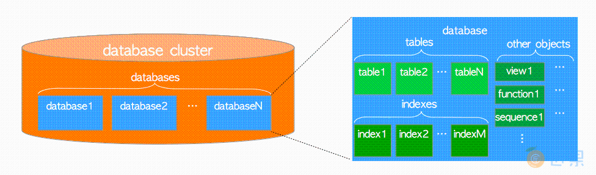

# postgresql体系架构


## 简介


 PostgreSQL数据库是由一系列位于文件系统上的物理文件组成，在数据库运行过程中，通过整套高效严谨的逻辑管理这些物理文件。

 通常将这些物理文件称为数据库，将这些物理文件、管理这些物理文件的进程、进程管理的内存称为这个数据库的实例。

 在PostgreSQL的内部功能实现上，可以分为系统控制器、查询分析器、事务系统、恢复系统、文件系统这几部分。

 其中系统控制器负责接收外部连接请求，查询分析器对连接请求查询进行分析并生成优化后的查询解析树，从文件系统获取结果集或通过事务系统对数据做处理，并由文件系统持久化数据。


[The Internals of PostgreSQL](https://www.interdb.jp/pg/)

## 逻辑结构

PostgreSQL is a program that belongs to the class of database management systems. When this program is running, we call it a PostgreSQL server, or instance.

Data managed by PostgreSQL is stored in databases. Asingle PostgreSQL instance can serve several databases at a time; together they are called a database cluster.

To be able to use the cluster,you must first initialize 2 (create) it. The directory that contains all the files related to the cluster is usually called PGDATA, after the name of the environment variable pointing to this directory.


数据库集簇（database cluster） 是一组数据库（database） 的集合，由一个PostgreSQL服务器管理。

第一次听到这个定义也许会令人疑惑，PostgreSQL中的术语“数据库集簇”，并非意味着“一组数据库服务器”。 一个PostgreSQL服务器只会在单机上运行并管理单个数据库集簇。


- 第一层是实例(Instance)。

- 第二层是数据库(Database)；一个实例下可以有多个数据库。**每个数据库之间是完全独立的**。

- 第三层是模式（Schema）；每个数据库下面可以有多个Schema；其中"public"是数据库创建时产生的。

每个Schema下面可以创建表，视图，索引，函数，序列，物化视图，外部表等等。

由于在PostgreSQL每个数据库是完全独立的，这可以解释另外一个问题（为什么访问同一个实例下其他数据库为什么要借用 dblink或者fdw接口？）。

这时可能会有学MySQL同学会问到；（为什么在MySQL中可以访问同实例下其他数据库？）。

其实MySQL跟PostgreSQL逻辑结构不一样；其中MySQL实例中的数据库相当于PostgreSQL上图的第三层的Schema。


在 postgresql 中，模式是数据库实例的逻辑分割。  database > schema > table  

数据库(database)是被模式(schema)来切分的，一个数据库(database)至少有一个模式(schema)，所有数据库内部的对象(object)是被创建在模式中的。

用户登录到系统，连接到一个数据库后，是通过该数据库的`search_path`来寻找`schema`的搜索顺序:

**`search_path`类似于Linux中的PATH环境变量。其默认值是`$user,public`，意思就是当以某个用户登录到数据库的时候，默认就是先查找和登录用户同名的schema，再查找public**

**更准确的说，`search_path`是用户查找schema的优先级。当用户访问表时不带schema.table这种完全限定名，则默认按照schema优先级去找。**


在关系型数据库理论中，数据库对象是用于存储或引用数据的数据结构。表是一个典型的例子，还有更多种对象，例如索引，序列，视图，函数等。

**在PostgreSQL中数据库本身也是数据库对象，并在逻辑上彼此分离。所有其他的数据库对象（例如表，索引等）归属于各自相应的数据库。**





在`PostgreSQL`内部，所有的数据库对象都通过相应的 **对象标识符（Object Identifiers, OID）** 进行管理，这些标识符是无符号的4字节整型。

数据库对象与相应OID之间的关系存储在相应的 **系统目录（System Catalogs）** 中，依具体的对象类型而异。例如数据库和堆表对象的OID分别存储在pg_database和pg_class中


pg_database、pg_class是存放在一个名为pg_catalog的Schema下。其中pg_catalog是系统级的schema，用于存储系统函数和系统元数据。

> pg安装后会默认附带三个database，分别是postgres、template0、template1

在PostgreSQL中，数据库的创建是通过克隆数据库模板来实现的，这与`SQL SERVER`是同样的机制。如果`CREATE DATABASE dbname`语句没有指明数据库模板，所以系统将默认克隆template1数据库，得到新的数据库dbname。

> By default, the new database will be created by cloning the standard system database template1

如果在 `template1` 中添加数据库对象，这些对象将被复制到随后创建的用户数据库中。这种方式允许对数据库中的标准对象集进行站点本地修改。例如，如果您在 `template1` 中安装了程序语言 `PL/Perl`，那么在创建用户数据库时，无需采取任何额外操作，它就会自动出现在用户数据库中。


第二个标准系统数据库名为 `template0` 。该数据库包含的数据与 `template1` 的初始内容相同，即仅包含 `PostgreSQL` 版本预定义的标准对象。在数据库集群初始化后，不应更改 `template0` 。**任何时候都不要对template0模板数据库进行任何修改，因为这是原始的干净模板**。如果其它模板数据库被搞坏了，基于这个数据库做一个副本就可以了。

如果希望定制自己的 **用户模板数据库** ，那么请基于`template1`进行修改，或者自己另外创建一个模板数据库再修改。对基于`template1`或你自建的模板数据库创建的数据库来说，你不能修改其字符集编码和排序规则。`template0`可以。 

通过`CREATE DATABASE`语句复制 `template0` 而不是 `template1` ，可以创建一个 "原始 "用户数据库（其中不存在用户定义的对象，系统对象也未被更改），该数据库不包含 `template1` 中的站点本地添加内容。这在恢复 `pg_dump` 转储时特别方便：应在原始数据库中恢复转储脚本，以确保重新创建转储数据库的正确内容，而不会与后来可能添加到 `template1` 中的对象发生冲突。

复制 `template0` 而不是 `template1` 的另一个常见原因是，在复制 `template0` 时可以指定新的编码和本地设置，而复制 `template1` 时必须使用与其相同的设置。这是因为 `template1` 可能包含特定于编码或特定于本地语言的数据，而已知 `template0` 不包含这些数据。

`template0`是不允许连接的。如果你想切换到`template0`会报错。因为不能连接，所以也就不可以对它进行修改。所以这样就有个好处，这个模板是最原始最干净的模板，如果`template1`被破坏了， 那么基于`template0`再做一个副本即可 。关于这一点，可以在`pg_database`的`datallowconn`字段中看出来，我们发现`template0`的`datallowconn`为false，表示不允许连接。


- template1 可以连接并创建对象，template0 不可以连接。正因为 template1 可以创建对像，相比 template0 ，被称为非干净数据库，而 template0被称为干净的数据库。

- template0 和 template1 都不可删除


`CREATE DATABASE` 不会复制附加到源数据库的数据库级 GRANT 权限。新数据库具有默认的数据库级权限。

在数据库创建的同时，就已经默认为数据库创建了一个模式--public，这也是该数据库的默认模式。

所有为此数据库创建的对象(表、函数、试图、索引、序列等)都是创建在这个模式中的。

```SQL


-- PostgreSQL 数据库默认情况下是不支持跨数据库访问的。如果我们想要执行跨数据库的查询，我们需要借助 dblink 来实现，dblink 是 PostgreSQL 的一个模块，支持从数据库会话中连接到其他数据库。

SELECT *  FROM pg_database;

```


### 系统表体系

系统表又叫database catalog。数据库实例的数据库目录由元数据组成，其中存储了数据库对象的定义。

==**SQL标准指定了访问目录的统一方法，称为INFORMATION_SCHEMA。INFORMATION_SCHEMA 是一种特殊的数据库，它在 SQL 标准中定义并存在于许多类型的数据库中，用于存储数据库的元数据，包括数据库、表、列、约束、权限等的信息。**==


在关系数据库中，信息模式(information_schema)是一组ANSI标准的只读视图，提供有关数据库中所有表、视图、列和过程的信息。它可以作为某些数据库，通过非标准命令提供信息的来源：

例如`MySQL`的`SHOW`命令；`Oracle`的`SQLPlus`的`DESCRIBE`命令；`PostgreSQL`的默认命令行程序。


具有 `INFORMATION_SCHEMA` 的数据库系统包括但不限于以下：

- **MySQL**：`MySQL`的 `INFORMATION_SCHEMA` 包含多个只读视图，用于获取关于数据库对象和服务器实例的元数据。这些视图包括 `TABLES`、`COLUMNS`、`STATISTICS`、`SCHEMATA`、`USER_PRIVILEGES` 等。

- **PostgreSQL**：`PostgreSQL`的 `INFORMATION_SCHEMA` 提供与 `MySQL` 类似的功能，但具体的视图可能会有所不同。

- **SQL Server**：`SQL Server` 的 `INFORMATION_SCHEMA` 视图包含有关数据库元数据的信息，如 `TABLES`、`COLUMNS`、`ROUTINES`、`VIEWS`、`TABLE_CONSTRAINTS` 等。

- MariaDB：MariaDB的 `INFORMATION_SCHEMA` 与 MySQL 的非常相似，提供大量的视图用于查询数据库元数据。

- **Oracle**：在 `Oracle` 中，类似于 `INFORMATION_SCHEMA` 的元数据信息存储在一系列名为 `ALL_`, `USER_` 和 `DBA_` 的视图中。


系统表是整个 `PostgreSQL` 数据库存储体系中最重要的一部分数据，它们用来组织管理 `PostgreSQL` 的数据空间，将用户自己定义的数据集合更好得以一个或者多个表组织起来。它们本质也是一个个表对象，相比于普通表是存储的元数据。这里的元数据可以理解为描述数据的数据。

比如，用户创建的表有 (c1 int, c2 text)两种字段类型，这些 int, text 字段数据类型会被单独存放在 `pg_type` 的系统表中，同时 c1, c2 列名字则会被存放在 `pg_attribute` 的系统表中，并和 `pg_type` 形成关联。这些 `pg_type`, `pg_attribute` 类型的表可以建立对用户表的关系描述，所以它们可以被称为元数据。


`pg_database`和`pg_class`存放在一个名为`pg_catalog`的`schema`下。其中`pg_catalog`是**系统级**的`schema`，用于存储系统函数和系统元数据。


### schema

Schemas are namespaces that store all objects of a database


预定义的 Schema

- public

- pg_catalog

- information_schema provides an alternative view for the system catalog as defined by the SQL standard.

- pg_toast

- pg_temp


### 表空间

本质上，PostgreSQL中的表空间是一个包含数据文件的目录。这些数据文件是表、序列、索引和物化视图等对象背后的存储空间。在PostgreSQL中，每个这样的对象都有自己的数据文件。如果对象很大，它将有几个被称为segments的文件，大小限制为1GB。

PostgreSQL使用操作系统自带的文件系统进行存储。这与`Oracle`不同，后者实际上实现了自己的"文件系统"。

- **在 PostgreSQL 中，一个表空间可供多个数据库使用；而一个数据库可以使用多个表空间，属"多对多"的关系。**

- **在 Oracle 中，一个表空间只可供一个数据库使用；而一个数据库可以拥有多个表空间，属"一对多"的关系。**


PostgreSQL 在安装完成后。初始化时需要指定一个数据目录（$PGDATA），该目录下会包含 PostgreSQL 要启动时的所有东西（配置文件、数据文件和消息队列等）。


PostgreSQL 启动后，所有数据库对象的数据文件都是在该文件夹下存储的。简短一点说，表空间即是告诉 PostgreSQL 服务器数据库对象物理文件存储位置的一种方式。在psql中使用\db+命令即可列出表空间的详情：


这两个表空间（pg_default与pg_global）是在`PostgreSQL`初始化后自动创建的。

- pg_default是template0与template1数据库的默认表空间（因此，也将是其它数据库的默认表空间），路径是 ${GDATA}/base
  pg_default是用来存储系统目录对象、用户表、用户表index、和临时表、临时表index、内部临时表的默认空间。对应存储目录`${PADATA}/base/`

- pg_global是共享系统目录表（pg_database、pg_authid、pg_tablespace、pg_shdepend等）及其索引的表空间。路径是 ${PGDATA}/global。


自定义表空间，创建一个新的表空间，需要提前创建一个新的空文件夹（注意不要在 `PostgreSQL`数据文件夹`$PGDATA`下创建），且该文件夹的`owner`须是`postgres`系统用户。

```bash
$ mkdir -p /data/postgres/testspace
$ chown -R postgres:postgres /data/postgres/testspace
```

```SQL
-- 创建表空间。超级用户（superuser）可使用CREATE TABLESPACE命令来创建一个表空间。
CREATE TABLESPACE myspace LOCATION '/data/postgres/testspace';

-- 当创建一个新表空间，$PGDATA/pg_tblspc目录下，自动生成一个表空间对应的oid名称的软链接文件，实际指向表空间设定的路径。
-- oid名称软链接的表空间实际目录下面会再生成一个子目录，这个子目录命名规则是PG_Major version_Catalog version number(比如PG_10_201707211，可以通过pg_controldata命令看到Catalog version number)的格式

-- 查找所有表空间
SELECT * FROM pg_catalog.pg_tablespace;
SELECT * FROM pg_tablespace;

 oid  |  spcname   | spcowner | spcacl | spcoptions 
------+------------+----------+--------+------------
 1663 | pg_default |       10 |        | 
 1664 | pg_global  |       10 |        | 


-- 表空间名及目录位置
SELECT spcname, pg_tablespace_location(oid) FROM pg_tablespace;


-- 查看某个表空间被哪些表或索引使用
SELECT
    c.relname
FROM
    pg_class      c,
    pg_tablespace t
WHERE
    c.reltablespace = t.oid
AND t.spcname='myspace';

```


什么时候创建表空间？

在绝大多数情况下，不应该在PostgreSQL中创建额外的表空间。特别是，在与数据目录相同的文件系统上创建一个表空间，或者在与另一个表空间相同的文件系统上创建一个表空间，都没有意义。

那么，表空间有哪些优点可以证明管理的复杂性是合理的呢?

- 如果您的数据分布在不同设备上的几个文件系统上，那么您可以分配I/O负载。然而，这也可以通过在较低的级别上进行剥离来完成。

- 如果磁盘上的空间用完，表空间将为您提供添加更多存储空间的选项。然而，现在通常可以使用某种类型的卷管理器在操作系统级上完成此工作。

- 如果要对数据库或表设置大小限制，可以将其放在文件系统的表空间中。

- 如果您同时拥有快速、昂贵和缓慢、廉价的存储空间，那么您可以将需要良好性能的对象放在快速存储空间上的单独表空间中。在这种情况下，您应该调整表空间上的seq_page_cost、random_page_cost和effecve_io_concurrency选项，以便将性能特征告诉优化器。

如果希望在默认表空间之外的其他地方创建临时文件(用于临时表和用于查询处理)，可以将temp_tablespaces参数设置为不同的表空间。

如果您运行在虚拟化环境中，使用虚拟化存储，那么除了第三点之外，其他的点都是没有意义的。由于现在几乎所有人都在使用虚拟化，表空间正在成为PostgreSQL越来越不重要的特性。

消除一个旧的的错误的观点

在数据库管理员中流传着一个根深蒂固的神话，即为了获得良好的性能，您应该将表和索引放在不同的磁盘上。

您将听到人们详细阐述为什么索引扫描期间访问模式的特定相互作用会使其在旋转磁盘上有效。但是旋转磁盘正在停止工作，通常只会使用多个并发 SQL 语句来使存储系统饱和，但无论如何，所有此类访问模式都会中断。

这种误解背后的事实是，将I/O负载分散到多个设备上肯定是有益的。如果在操作系统级别使用条带化，与小心放置表和索引相比，将获得更好的分布。


译自 https://www.cybertec-postgresql.com/en/when-to-use-tablespaces-in-postgresql/


## 物理结构

数据库集簇在本质上就是一个文件目录，名曰基础目录（base directory） ，包含着一系列子目录与文件。 

执行 initdb 命令会在指定目录下创建基础目录从而初始化一个新的数据库集簇。通常会将基础目录的路径配置到环境变量PGDATA中，但这并不是必须的。

下图展示了一个PostgreSQL数据库集簇的例子。

**base子目录中的每一个子目录都对应一个数据库**，数据库中每个表和索引都会在相应子目录下存储为（至少）一个文件；还有几个包含特定数据的子目录，以及配置文件。 虽然PostgreSQL支持表空间（Tablespace） ，但该术语的含义与其他RDBMS不同。 PostgreSQL中的表空间对应一个包含基础目录之外数据的目录。


| 子目录             | 描述                                                         |
| :----------------- | :----------------------------------------------------------- |
| PG_VERSION         | 版本号的文本文件                                             |
| `base`             | 每个数据库对应的子目录存储于此                               |
| `current_logfiles` | 由日志采集器写入的日志文件                                   |
| `global`           | 数据库集簇范畴的表（例如`pg_database`），以及`pg_control`文件。 |
| `pg_commit_ts`     | 事务提交的时间戳数据（9.5及更新版本）。                      |
| `pg_dynshmem`      | 动态共享内存子系统中使用的文件（9.4或更新版本）。            |
| `pg_logical`       | 逻辑解码的状态数据（9.4或更新版本）。                        |
| `pg_multixact`     | 多事务状态数据                                               |
| `pg_notify`        | `LISTEN`/`NOTIFY`状态数据                                    |
| `pg_repslot`       | 复制槽数据（9.4或更新版本）。                                |
| `pg_serial`        | 已提交的可串行化事务相关信息（9.1或更新版本）                |
| `pg_snapshots`     | 导出快照（9.2或更新版本）。 PostgreSQL函数`pg_export_snapshot`在此子目录中创建快照信息文件。 |
| `pg_stat`          | 统计子系统的永久文件                                         |
| `pg_stat_tmp`      | 统计子系统的临时文件                                         |
| `pg_subtrans`      | 子事务状态数据                                               |
| `pg_tblspc`        | 指向表空间的符号链接                                         |
| `pg_twophase`      | 两阶段事务（prepared transactions）的状态文件                |
| `pg_wal`           | WAL（ Write Ahead Logging）段文件（10或更新版本），从`pg_xlog`重命名而来。 |
| `pg_xact`          | 事务提交状态数据，（10或更新版本），从`pg_clog`重命名而来。CLOG将在 [5.4 提交日志（clog）](http://www.jiangguo.net/c/wyW/0P.html) 中描述。 |
| `pg_xlog`          | **WAL（Write Ahead Logging）** 段文件（9.6及更老版本），它在版本10中被重命名为`pg_wal`。 |


新建一个数据库会在表空间对应的目录下创建一个 oid（数据库oid）的目录；用于存放这个数据库对应的数据库文件。

>  例如当数据库`sampledb`的OID为16384时，它对应的子目录名称即为16384。

```SQL
postgres=# SELECT oid,datname,datdba,encoding   FROM pg_database;
 oid |  datname  | datdba | encoding 
-----+-----------+--------+----------
   5 | postgres  |     10 |        6
   1 | template1 |     10 |        6
   4 | template0 |     10 |        6
(3 rows)

```


**在pg中，oid用来在整个数据集簇中唯一标识一个数据库对象，对象可以是数据库、模式、表、索引、视图、元祖等等。oid用4个字节的无符号整数表示。**

OID在`PostgreSQL`中被用来描述一个个数据表的逻辑对象，比如 Relation, type, attr, namespace等等，每创建一个对象都会为其分配一个属于自己的标识(Oid)。


如果对PostgreSQL有一定了解，应该知道PostgreSQL最初的设计理念就是"对象关系数据库"。也就是说，系统表中储存的那些元数据，比如表，视图，类型，操作符，函数，索引，FDW，甚至存储过程语言等等这些统统都是对象。具体表现就在于这些东西都可以扩展，可以定制。不仅如此，PostgreSQL还支持函数重载，表继承等这些很OOP的特性。

利用PostgreSQL的这些特性，用户可以根据业务场景从应用层到数据库层做一体化的优化设计，获得极致的性能与用户体验。一些用惯了MySQL的互联网架构师推崇"把数据库当存储"，这一设计准则用在MySQL上也许合适，但如果硬要套在PostgreSQL上，就有点暴殄天物了！


PG 也会通过 OID 来在不同的数据表之间建立关联，也就是说有一些对象是全局唯一的(pg_class 表的oid)。

但是因为 OID 是 `unsigned int` 类型，所以当对象的数量超过42亿之后可能会有回卷，所以PG对OID的划分有一些自己的定义，比如预留`16383`个`OID`作为全局唯一的对象标识，其他的都是给用户表使用，允许发生回卷。


有一个系统表叫做：pg_class，这个表里记录了数据表、索引(仍然需要参阅pg_index)、序列、视图、复合类型和一些特殊关系类型的元数据。

`pg_class`系统表用来管理一个表的对象属性，就是存储在当前数据库的所有表在此时的固有属性信息都会被统一放在`pg_class`系统表中。

> 注意：不是所有字段对所有对象类型都有意义。


| **名字**       | **类型**  | **引用**          | **描述**                                                     |
| -------------- | --------- | ----------------- | ------------------------------------------------------------ |
| oid            | oid       |                   | 数据库对象的唯一标识符                                       |
| relname        | name      |                   | 数据库对象的名字                                             |
| relnamespace   | oid       | pg_namespace.oid  | 包含这个对象的名字空间(模式)的OID。                           |
| reltype        | oid       | pg_type.oid       | 对应这个表的行类型的数据类型OID。                               |
| relowner       | oid       | pg_authid.oid     | 对象的所有者OID。                                               |
| `relam`        | oid       | pg_am.oid         | 对于索引对象，表示该索引的类型(B-tree，hash)，OID。               |
| `relfilenode`  | oid       |                   | 对象存储在磁盘上的文件名，如果没有则为0，OID。                    |
| reltablespace  | oid       | pg_tablespace.oid | 对象所在的表空间。如果为零，则表示使用该数据库的缺省表空间。<br />(如果对象在磁盘上没有文件，这个字段就没有什么意义) |
| relpages       | int4      |                   | 该数据表或索引所占用的磁盘页面数量，查询规划器会借助该值选择最优路径。 |
| reltuples      | float4    |                   | 表中行的数量，该值只是被规划器使用的一个估计值。             |
| reltoastrelid  | oid       | pg_class.oid      | 与此表关联的TOAST表的OID，如果没有为0。TOAST表在一个从属表里"离线"存储大字段。 |
| reltoastidxid  | oid       | pg_class.oid      | 如果是TOAST表，该字段为它索引的OID，如果不是TOAST表则为0。   |
| relhasindex    | bool      |                   | 如果这是一个数据表而且至少有(或者最近有过)一个索引，则为真。它是由CREATE INDEX设置的，但DROP INDEX不会立即将它清除。如果VACUUM发现一个表没有索引，那么它清理 relhasindex。 |
| relisshared    | bool      |                   | 如果该表在整个集群中由所有数据库共享，则为真。               |
| relkind        | char      |                   | r = 普通表，i = 索引，S = 序列，v = 视图， c = 复合类型，s = 特殊，t = TOAST表 |
| relnatts       | int2      |                   | 数据表中用户字段的数量(除了系统字段以外，如oid)。在pg_attribute里肯定有相同数目的数据行。见pg_attribute.attnum. |
| relchecks      | int2      |                   | 表中检查约束的数量，参阅pg_constraint表。                    |
| reltriggers    | int2      |                   | 表中触发器的数量；参阅pg_trigger表。                         |
| `relhasoids`   | bool      |                   | 如果我们为对象中的每行都生成一个OID，则为真。                |
| relhaspkey     | bool      |                   | 如果该表存在主键，则为真。                                   |
| relhasrules    | bool      |                   | 如表有规则就为真；参阅`pg_rewrite`表。                       |
| relhassubclass | `bool`    |                   | 如果该表有子表，则为真。                                     |
| relacl         | aclitem[] |                   | 访问权限。                                                   |


作为OOP的体现之一，PostgreSQL中每个表都是一个新的数据类型，即有一个相应的数据类型对象。


```sql
-- 这个oid是隐藏字段，因此必须在select列表里明确指定oid列名，光使用select *是不输出oid的。
SELECT oid, relname FROM pg_class WHERE relname = '表名';

SELECT oid, relname FROM pg_class WHERE relname = 'pg_class';
 oid  | relname  
------+----------
 1259 | pg_class
(1 row)

postgres=# 

-- 这条语句是查询数据库数据库中的所有表
--regclass是一个特殊的数据类型。它实际是oid(Object identifiers)的别名。
SELECT oid :: regclass AS table_name, relname FROM pg_class WHERE relkind = 'r';


-- 对于pg中的对象来说，oid与表名存在对象关系，这个关系我们可以从pg_class中得到。


```

```SQL
-- 创建自定义数据类型
CREATE TYPE map AS (string VARCHAR, int_1 INT);

-- 建表
CREATE TYPE map_test (id INT, VALUE map);

```

可以看到创建的表在 `pg_class` 中存储的属性信息有两个，一个是类型`map`的属性信息， 一个是表`map_test`的属性信息。


```SQL
-- 复合类型 map 的属性信息
SELECT oid,relname,relnamespace,reltype,relam,relfilenode,relpersistence,relkind,relnatts FROM pg_class WHERE relname='map';
  oid  | relname | relnamespace | reltype | relam | relfilenode | relpersistence | relkind | relnatts 
-------+---------+--------------+---------+-------+-------------+----------------+---------+----------
 16388 | map     |         2200 |   16390 |     0 |           0 | p              | c       |        2
(1 row)

--  表map_test的属性信息
SELECT oid,relname,relnamespace,reltype,relam,relfilenode,relpersistence,relkind,relnatts FROM pg_class WHERE relname='map_test';
  oid  | relname  | relnamespace | reltype | relam | relfilenode | relpersistence | relkind | relnatts 
-------+----------+--------------+---------+-------+-------------+----------------+---------+----------
 16391 | map_test |         2200 |   16393 |     2 |       16391 | p              | r       |        2
(1 row)
```


pg_type

该系统表用于记录管理所有的类型定义，比如上面的 `create table map_test (id int, value map);` 建表过程中用到的类型 `int` 以及 复合类型 `map` 都会被存储到 `pg_type` 中，而列名字 `id` 以及 `value` 则会被存储到的 `pg_attribute` 系统表中。

PG 通过 `pg_class` 的对象属性描述的系统表，以及 `pg_type` 和 `pg_attribute` 两种对列属性描述的系统表，共同构造一个基本表的列信息。


每个表和索引都存储在独立的文件里。对于普通关系，这些文件以表或索引的*filenode*号命名，它可以在`pg_class`.`relfilenode`中找到


每个小于1GB的表或索引都在相应的数据库目录中存储为单个文件。


在表或者索引超过 1GB 之后，它就被划分成1G大小的段。第一个段的文件名和文件节点相同；随后的段被命名为 filenode.1、filenode.2等等。

这样避免在某些有单文件大小限制的平台上的问题（实际上，1GB只是默认的文件尺寸。可以在编译PostgreSQL时使用配置选项`--with-segsize`进行调整）。


在数据库内部，表和索引作为数据库对象是通过OID来管理的，而这些数据文件则由变量`relfilenode`管理。 表和索引的`relfilenode`值通常与其OID一致。


每一张表的数据（大部分）又是放在 $PGDATA/base/{dboid}/{relfilenode} 这个文件里面，relfilenode一般情况下和和tboid一致，但有些情况下也会变化。


每一张表的数据（大部分）又是放在 $PGDATA/base/{dboid}/{relfilenode} 这个文件里面，relfilenode一般情况下和和tboid一致，但有些情况下也会变化，如TRUNCATE、REINDEX、CLUSTER以及某些形式的ALTER TABLE。


### 堆表文件布局

数据存储没有任何顺序，需要借助索引页来提升查询数据性能。

堆表是 PostgreSQL 所默认使用的数据组织方式，这里的堆既不是指数据结构中的二叉堆，也不是虚拟内存中的堆内存，个人理解这里应该表示的是"堆叠"之意: 即数据的存放是无序的。


#### 页

在数据文件（堆表，索引，也包括空闲空间映射和可见性映射）内部，它被划分为固定长度的页（pages），或曰 区块（blocks），大小默认为8192字节（8KB）。 

每个文件中的页从0开始按顺序编号，这些数字称为区块号（block numbers）。 如果文件已填满，PostgreSQL通过在文件末尾追加一个新的空页来增长文件。


上图示例描述一个数据文件的内部结构，从图中可以看出，一个表文件内部由从0至N编号的页面构成，每个页为8KB。右边则是每个页面的内部构成。每个页面包括以下内容：

heap tuples -即heap表中的数据记录。这些记录是从页面的底端向上存放的。每个tuple内部的结构我们单独再描述。
line pointers -每个line pointer由4个字节表示，是一个指向具体某一条heap tuple的指针，也被称为item pointer。Line pointers组成一个简单的数组，负责索引到对应记录。每个line pointer在block内是从1开始进行编号，也被称为偏移号(offset number)。当一个新的记录被添加到页面时，就会增加一个新的line pointer与之对应。
header data -即页面的头信息，放在页面的开始部分。由24字节表示，其中包含一些页面描述的通用信息。主要的内容有：
（1）pd_lsn -保存页面上次修改生成的XLOG的LSN信息。8字节的无符号整数，与WAL机制有关。
（2）pd_checksum -保存页面的checksum值（9.3及之后版本）。
（3）pd_lower，pg_upper -pd_lower指向line pointers的末尾位置，pd_upper指向最新的heap tuple位置。
（4）pd_special -用于索引。如果此页面是表页面，指向页面的末尾。如果此页面是索引页面，指向特殊空间的开始（此空间根据索引的类型是BTree、GiST还是GIN保存特定的数据）。
在line pointers结尾到最新tuple开始之间的空间代表空闲空间或空洞。
为了确定表中某一个tuple的位置，PG内部使用tuple identifier（TID） 。TID由一组值构成：包括这个tuple页面的页编号block number，以及指向这个tuple的具体的偏移号offset number。即TID=block number + offset number。


### TOAST 技术


在 PG 中，页是数据在文件存储中的基本单位，其大小是固定的且只能在编译期指定，之后无法修改，默认的大小为8 KB 。

同时，**PG 不允许一行数据跨页存储**，那么对于超长的行数据和大宽表，PG 就会启动 TOAST ，具体就是采用压缩和切片的方式。


这个机制对用户都是透明的，只是在大部分的后端代码上有一些小的影响。这个技术的昵称是TOAST（或者“切片面包之后的最好的东西”）。TOAST 机制也被用来提升内存中大型数据值的处理。

如果启用了切片，实际数据存储在另一张系统表的多个行中，这张表就叫 TOAST 表，这种存储方式叫行外存储。


在 PG 中每个表字段有四种 TOAST 的策略：

- PLAIN ：避免压缩和行外存储。只有那些不需要 TOAST 策略就能存放的数据类型允许选择（例如 int 类型），而对于 text 这类要求存储长度超过页大小的类型，是不允许采用此策略的
- EXTENDED ：允许压缩和行外存储。一般会先压缩，如果还是太大，就会行外存储
- EXTERNA ：允许行外存储，但不许压缩。类似字符串这种会对数据的一部分进行操作的字段，采用此策略可能获得更高的性能，因为不需要读取出整行数据再解压。
- MAIN ：允许压缩，但不许行外存储。不过实际上，为了保证过大数据的存储，行外存储在其它方式（例如压缩）都无法满足需求的情况下，作为最后手段还是会被启动。因此理解为：尽量不使用行外存储更贴切。


可以自己定义用哪种策略

```sql
ALTER TABLE 表名 ALTER COLUMN 列名 SET STORAGE external;
```


## postgres进程模型

postgres数据库是一个多进程架构，采用典型的服务端–客户端风格的关系型数据库，进程间通过`共享内存`进行通信。

共享内存的机制，就是拿出一块虚拟地址空间来，映射到相同的物理内存中。这样这个进程写入的东西，另外一个进程马上就能看到了，都不需要拷贝来拷贝去，传来传去，大大提高了进程间通信的速度。所以共享内存可以说是最有效的进程间通信方式，也是最快的IPC形式。

假设有两个不同进程A、B，那么会有同一块物理内存被映射到进程A、B各自的进程地址空间。进程A可以即时看到进程B对共享内存中数据的更新，反之亦然。


在数据库术语中，PostgreSQL使用C/S架构。一次PostgreSQL会话由下列相关的进程（程序）组成：

- 服务端进程：一个服务器进程，它管理数据库文件、接受来自客户端与数据库的连接。并且代表客户端在数据库上执行操作。该数据库服务器程序叫做postgres。
postgres一般位于 /usr/lib/postgresql/13/bin/ 

- 客户端进程：典型的 C/S 架构，客户端和服务器可以在不同的主机上。这时它们通过 TCP/IP 网络联接通讯。


```
[postgres@stxz-elk-01 src]$
[postgres@stxz-elk-01 src]$ ps -ef | grep postgres | grep -v grep
postgres  9849     1  0 10:41 ?        00:00:00 /data/postgres/14.4/bin/postgres -D /home/postgres/data
postgres  9850  9849  0 10:02 ?        00:00:00 postgres: logger
postgres  9876  9849  0 10:42 ?        00:00:00 postgres: checkpointer
postgres  9878  9849  0 10:42 ?        00:00:00 postgres: background writer
postgres  9879  9849  0 10:42 ?        00:00:00 postgres: walwriter
postgres  9880  9849  0 10:42 ?        00:00:00 postgres: autovacuum launcher
postgres  9881  9849  0 10:42 ?        00:00:01 postgres: stats collector
postgres  9882  9849  0 10:42 ?        00:00:00 postgres: logical replication launcher
postgres 18247  9849  0 17:22 ?        00:00:00 postgres: postgres dbtt 10.10.30.205(4008) idle
postgres 18268  9849  0 17:22 ?        00:00:00 postgres: postgres dbtt 10.10.30.205(4009) idle
postgres 18995  9849  0 11:08 ?        00:00:00 postgres: postgres dbtt 10.10.30.205(12899) idle
postgres 30539  9849  0 11:42 ?        00:00:00 postgres: postgres postgres 10.10.30.205(12998) idle
[postgres@stxz-elk-01 src]$
[postgres@stxz-elk-01 src]$
```

在服务端用作管理一个数据库实例的多个进程的集合称为`PostgreSQL Server`，它主要包含以下3种类型的进程：

- `postgres server process`：Postgres服务器进程，即守护进程，是数据库集群管理的所有进程的父进程。

- `backend processes`：后端进程，每个后端进程处理连接进来的客户端发出的所有查询和语句。

- `backgroud processes`：后台进程，每个后台进程分别执行相应的功能（例如VACUUM和CHECKPOINT进程）以进行数据库管理。


###  主进程和postmaker进程

postmaker

如果是在centos7+下使用yum安装的postgresql，那么postgresql的服务启停会托管给systemctl，我们在/usr/lib/systemd/system/postgresql-11.service文件中就可以看到配置的ExecStart

实际上，postmaster 命令只是postgres命令的一个软链接，可以看到postmaster的目标命令是postgres。

如果是用 pd_ctl -D $PGDATA -l $PGLOGFILE start 启动的，则直接启动postgresql主进程。

真正的主进程也就是postgres进程(可执行文件为./bin/postgres)，它监听了5432端口，用于监听连接。但是真正处理连接的并不是这个进程。


### 连接进程backend processes

postgresql服务器可以处理来自多个客户端的多个并发请求。 因此，它为每个客户端的连接都会 fork 一个新进程(利用./bin/postgres可执行文件)。因为一条连接只允许操作一个数据库，因此必须在连接到PostgreSQL服务器时显式指定要连接的数据库。

PostgreSQL允许多个客户端同时连接；配置参数`max_connections`用于控制最大客户端连接数（默认为100）。

因为PostgreSQL没有原生的连接池功能，因此如果许多客户端频繁地重复与PostgreSQL服务器建立断开连接（譬如WEB应用），则会导致建立连接与创建后端进程的开销变大。这种情况对数据库服务器的性能有负面影响，通常可以使用`池化中间件（pgbouncer或pgpool-II）`来避免该问题。

可见`postgresql`在高并发场景下处理客户端连接时成本还是很高的。

**postgresql是进程模型，各个后台进程由postmaster主进程创建，每个客户端连接进来服务器端都会创建一个server process与客户端交互，处理客户端请求。**

对于创建的每个连接，操作系统都需要为打开网络套接字的进程分配内存，PostgreSQL需要自己进行内部计算来建立连接。

将其扩展到数千个用户会话，而仅仅为用户准备好数据库连接就可能浪费大量时间。将max_connections设置为高的其他成本包括磁盘争用、操作系统调度，甚至CPU级缓存线争用。

一旦连接建立之后，客户端和新服务器进程就不再经过最初的 postgres 进程的干涉进行通讯。

因此，主服务器进程总是在运行并等待着客户端连接， 而客户端和相关联的服务器postgres进程则是起起停停（当然，这些对用户是透明的。我们介绍这些主要是为了内容的完整性）。

进程模型有个问题就是容易造成oom，当爆发连接风暴时，work_mem这类参数的设置可能造成内存溢出。

如果发生遇到使用pg_terminate_backend(pid)杀不掉某条sql的情况下（笔者生产环境多次遇到），pg可以在操作系统层面使用kill命令杀掉该连接。

为什么调整最大连接数需要重启，不能修改为reload方式？

这个问题不详细展开，简单来说最大连接数参数和共享内存及信号量等相关的，设置最大连接数后，在启动时系统会相应分配这些资源。那原生的最大连接数参数看起来只能是重启方式修改生效了。


### 后台进程

- background writer:后台写进程，负责将缓冲池的脏页数据写回磁盘；
- checkpointer:检查点，每隔一定周期将脏页刷盘，包括共享缓冲池和SLRU脏数据；
- autovacuum：自动清理进程，用于回收被删除元组空间，避免数据文件无限膨胀；
- WAL writer: WAL写进程，负责将wal buffer 刷写至磁盘，缓解业务高峰时日志的并发写入，对数据库性能造成影响；
- statistics collector：信息收集进程，负责收集数据库系统运行的统计信息，主要用于查询优化时的代价估算；
- pgArch：日志归档进程，负责将WAL日志进行归档备份，加强数据库的高可靠性和高可用性，防止数据意外丢失；


logger进程可以收集包括postmaster进程在内的所有进程的stderr日志，这里需要注意是错误日志哦，并不是所有的日志它都会收集。

它支持通过postgresql.conf文件修改日志相关的参数，可以设置最大值并循环覆盖，日志的默认目录在$PGDATA/logs/，像我本机默认的日志记录如下，每天一个日志文件，按照星期存储。

```toml
# 创建一个名为 logging.conf 的补充配置文件，而不是就地修改主配置文件（postgresql.conf），该文件将包含在主集群配置文件中。
# 通过这种方式，我们将能够切换回原始日志记录配置，或者通过简单地复制新文件在其他系统上复制它。
# 为了激活日志相关配置，在postgresql.conf文件末尾插入一条 include_if_exists='logging.conf'


logging_collector = on                            # 是否将日志重定向至文件中，默认是off（该配置修改后，需要重启DB服务）
log_directory = 'log'                             # 日志所属目录，默认是${PGDATA}/log/目录。可以自定义设置相对目录和绝对目录
log_filename = 'postgresql-%Y-%m-%d_%H%M%S.log'   # 日志文件名称 
#log_file_mode = 0600                             # 日志文件权限
#log_rotation_age = 1d                            # 单个日志文件的生存期，默认1天，在日志文件大小没有达到log_rotation_size时，一天只生成一个日志文件
#log_rotation_size = 10MB                         # 单个日志文件的大小，如果时间没有超过log_rotation_age，一个日志文件最大只能到10M，否则将新生成一个日志文件。
#log_truncate_on_rotation = off    
```

### 其他辅助进程

- background writer:后台写进程，负责将缓冲池的脏页数据写回磁盘；
- checkpointer:检查点，每隔一定周期将脏页刷盘，包括共享缓冲池和SLRU脏数据；
- autovacuum：自动清理进程，用于回收被删除元组空间，避免数据文件无限膨胀；
- WAL writer: WAL写进程，负责将wal buffer 刷写至磁盘，缓解业务高峰时日志的并发写入，对数据库性能造成影响；
- statistics collector：信息收集进程，负责收集数据库系统运行的统计信息，主要用于查询优化时的代价估算；
- pgArch：日志归档进程，负责将WAL日志进行归档备份，加强数据库的高可靠性和高可用性，防止数据意外丢失；


### 内存架构

在postgres数据库中，内存分为`共享内存`和`私有内存`[backend process]。

#### 共享内存

共享内存包括共享缓冲池、WAL buffer、SLRU<clog和subtrans日志>

(1)shared buffer

PostgreSQL将表和索引中的页面从持久存储加载到共享缓冲池中，然后直接对它们进行操作。由参数shared_buffers控制，默认是128MB。

(2)wal buffer

为确保服务故障不会导致任何数据丢失，PostgreSQL实现了WAL机制。

WAL数据（也称为XLOG记录）是PostgreSQL中的事务日志；WAL缓冲区是WAL数据在写入持久存储之前的缓冲区。

(3)commit log

提交日志(CLOG)保存所有事务的状态，是并发控制机制的一部分。提交日志分配共享内存，并在整个事务处理过程中使用。

事务有以下四种状态：

in_progress、commited、aborted、sub-commited


#### 私有内存

每个后端进程都会分配一块本地内存区域用于查询处理。该区域会分为几个子区域 —— 子区域的大小有的固定，有的可变。

私有内存主要由temp_buffers、work_mem和maintenance_work_mem组成

(1)work_mem

执行器在执行ORDER BY和DISTINCT时使用该区域对元组做排序，以及存储归并连接和散列连接中的连接表。	


## 可执行文件


### 客户端程序

运行PostgreSQL的交互式终端程序，它被称为 psql， 它允许你交互地输入、编辑和执行SQL命令。


**PostgreSQL用户名是和操作系统用户账号分开的。** 

如果你连接到一个数据库时，你可以选择以何种PostgreSQL用户名进行联接; 如果你不选择，那么默认就是你的当前操作系统账号。
如果这样，那么总有一个与操作系统用户同名的PostgreSQL用户账号用于启动服务器， 并且通常这个用户都有创建数据库的权限。

如果你不想以该用户身份登录， 那么你也可以在任何地方声明一个-U选项以选择一个用于连接的PostgreSQL用户名。

```
root@qhdata:~# su postgres
postgres@qhdata:/root$
postgres@qhdata:/root$ psql
psql (13.2 (Ubuntu 13.2-1.pgdg20.04+1))
Type "help" for help.
postgres=#
```


